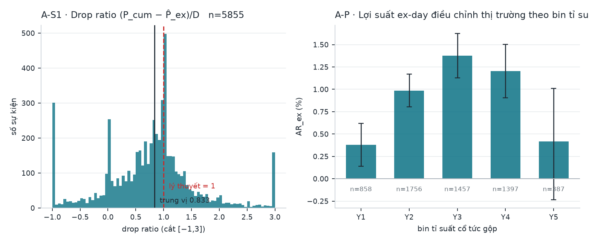
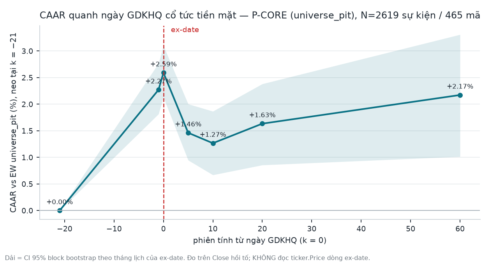
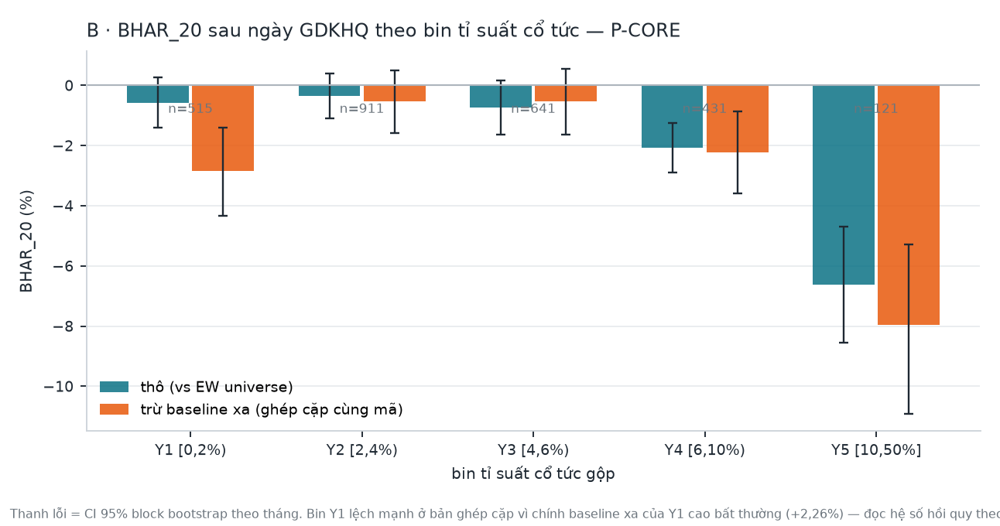

# Sprint 2 — Cash dividend: cơ học ex-date & drift sau ngày GDKHQ

> Job `Taylor_20260815_121850` · 2026-08-15 · nối tiếp Sprint 1 (`f8cb4596`, gate CONDITIONAL PASS).
> **Pre-registration commit trước outcome: `2a9b951a`.** Lệch khỏi kế hoạch: `SPRINT2_DEVIATIONS.md`.
>
> ⚠️ **BẢN ĐÃ SỬA LỖI ENTITLEMENT — job `Taylor_20260815_125247`.** Bản đầu tiên trừ thuế cổ tức
> 5% khỏi một outcome mà người nắm giữ **không được nhận cổ tức**, và suy ra chi phí của việc
> "mua ngay trước GDKHQ" bằng phép cộng số học trên `BHAR_20` — thứ chưa bao giờ đo giao dịch đó.
> Chi tiết + số cũ/số mới: `SPRINT2_DEVIATIONS.md` **D6**. Prereg giữ nguyên, KHÔNG sửa.
> Selfcheck: **50/50 PASS** (`selfcheck_sprint2.py`).
>
> ⚠️ **BỔ SUNG ĐỘ BỀN HOLD-THROUGH — job `Taylor_20260815_130912`** (đóng gap quant-skeptic vòng
> trước). Outcome post-hoc `HOLDTHRU_20` trước đây chỉ có số **full-sample**; nay có IS/OOS +
> per-year leave-one-out (§6.2). Kết quả **hạ narrative**: dấu bền nhưng **độ lớn không bền** —
> nửa IS không phân biệt được với 0. Chi tiết: `SPRINT2_DEVIATIONS.md` **D7**. Họ trial 29 → **33**,
> không verdict nào đổi. Nhãn **POST-HOC giữ nguyên**; prereg KHÔNG sửa.

---

## 0. Phán quyết

# ⚠️ RISK / DUE-DILIGENCE — **KHÔNG PHẢI ALPHA**

**Module A (cơ học ex-date): DESCRIPTIVE ONLY.** Đã tuyên bố trước khi chạy và giữ nguyên sau khi
chạy — giá tham chiếu ngày GDKHQ do **sở giao dịch ấn định**, nên mọi thứ đo quanh nó là
microstructure, không phải khám phá giá.

**Module B (drift sau ex-date): RISK / DUE-DILIGENCE.** Có một hiệu ứng **ÂM**, bền, có liều-đáp
ứng theo tỉ suất cổ tức. Nó KHÔNG thể là ALPHA vì hai lý do độc lập:

1. **Trượt tiêu chí prereg §9(a) ngay từ dấu**: tiêu chí ALPHA đòi mean `BHAR_20` **≥ +0,75%**;
   đo được **−1,065%**. Hiệu ứng âm không thể là "cơ hội mua".
2. **Không bán khống được ở VN** ⇒ một drift âm về mặt cấu trúc là **chi phí phải biết**, không
   phải nguồn lợi nhuận có thể thu hoạch.

Cái nó thật sự là: **một dữ kiện định lượng cho khâu lập plan về giai đoạn SAU ngày GDKHQ** — mua
một mã tỉ suất cao **tại giá đóng cửa ngày GDKHQ** (tức đã ex, KHÔNG được nhận cổ tức) có chi phí
kỳ vọng đo được trong 20 phiên sau đó. Đây là **cửa sổ vào lệnh mà `BHAR_20` thật sự đo**, không
phải cửa sổ giữ-xuyên-ex.

> **Ranh giới entitlement — phải đọc trước mọi trích dẫn.** `BHAR_20` neo ở **giá đóng cửa T0
> (ex-date)**. Người mua ở đó **không có quyền nhận cổ tức của chính sự kiện đó** ⇒ **không** chịu
> thuế cổ tức 5%, và cú rơi cơ học đã nằm TRƯỚC điểm vào, không phải chi phí của họ. Câu hỏi "mua
> trước GDKHQ rồi giữ qua ex tốn bao nhiêu?" là **outcome KHÁC**, phải đo riêng trên cơ sở
> **total return** (§6.2) — **không được** suy ra từ `BHAR_20` bằng cách cộng thuế và cú rơi.

**Con số một dòng:** cứ **1 điểm phần trăm tỉ suất cổ tức gộp** thì `BHAR_20` giảm **≈ 0,50 điểm
phần trăm** (hồi quy, t = **−5,60**, SE cluster hai chiều theo mã và theo tháng ex-date, có FE
ngành + FE năm và 6 biến kiểm soát khác).

> **KHÔNG có đề xuất wire nào trong báo cáo này.** Muốn wire thì phải qua sprint riêng với
> DSR/PBO + quant-skeptic + user duyệt.

---

## 1. Mẫu — funnel đầy đủ

| bước | N |
|---|---:|
| Sự kiện cash dividend actionable, `exright_date` ∈ [2014-01-01, 2026-06-30] | 12.416 |
| 0. có phiên giao dịch **đúng ngày** ex-date | **9.273** |
| 1. có phiên trước đó với `Price` thô > 0 (T−1) | 9.215 |
| 2. **có giao dịch** ngày ex-date (`Volume_0 > 0`) | 7.116 |
| 3. X2 chất lượng giá (bỏ DNN/BCB/PTX: 1 · giá cum thô < 1.000đ: 0) | 7.115 |
| 4. X3 tỉ suất gộp ≤ 50% (bỏ **1**, không bỏ im lặng) | 7.114 |
| 5. **P-CORE** — nằm trong `universe_pit` tại ex-date (point-in-time) | **2.985** |
| 6. P-CORE sau loại nhiễm X1a/X1b (W = 21 ngày) | **2.619** |
| — P-WIDE sau loại nhiễm (W = 21) | 6.549 |

**N khai theo sự kiện độc lập VÀ số mã độc lập** (Sprint 1 C7): P-CORE = **2.619 sự kiện /
465 mã / 150 tháng-ex**. P-WIDE = 6.540 sự kiện / 925 mã. Tỉ suất gộp trung bình P-CORE
**4,325%**, trung vị 3,695%.

**Không có hao hụt do huỷ niêm yết:** 0/2.573 sự kiện P-CORE (ex-date ≤ 2026-05-01) thiếu giá
T+20; 0/2.559 thiếu T+60. ⇒ kết quả **không** đến từ survivorship.

**Bước 2 loại 2.099 sự kiện (23%) — đã kiểm xem có phải thiên lệch riêng của ex-date không.**
Tỉ lệ `Volume = 0` trên các mã universe: **9,65% ĐÚNG ngày ex-date** vs **17,89% các phiên khác**.
Ngày GDKHQ **thanh khoản hơn** ngày thường; bộ lọc này loại mã mỏng nói chung, không tạo thiên
lệch riêng cho ex-date.

---

## 2. Đường thoát khỏi bẫy `ticker.Price` — và bằng chứng nó đúng

Gate Sprint 1 **cấm** đọc `ticker.Price` của dòng đúng ngày ex-date. Sprint 2 **không cần** nó.

Với quy ước hồi tố nhân (`C_k = P_k × ∏ factor` mọi sự kiện SAU `k`, `factor_ex = (P_cum−D)/P_cum`):

```
C_0 / C_{−1}   ==   P_0 / (P_{−1} − D)   ==   giá ex thô / giá tham chiếu lý thuyết
```

⇒ **lợi suất ex-day đo trên `Close` CHÍNH LÀ lợi suất so với giá tham chiếu lý thuyết**, không
chạm dòng `Price` hỏng. `Price` chỉ được đọc ở **k = −1, +1, +2, +3** — selfcheck **T1** grep
chính file SQL đã chạy để chứng minh, và **T2** xác nhận không tồn tại cột `p_0` ở bất kỳ đâu.

**Chứng minh quy ước (prereg 4.1, nghĩa vụ bắt buộc), n = 5.855:**

| | |
|---|---:|
| `r_{−1}/r_{+1}` khớp `P_{−1}/(P_{−1}−D)` trong **±0,2%** | **92,04%** |
| khớp trong ±1% | **97,46%** |
| sai số tuyệt đối trung vị của hệ số | **0,000198** |
| *(sàn fail-closed của prereg: ≥ 80% trong ±1%)* | **ĐẠT** |

Giá ex thô, khi cần (chỉ cho outcome phụ), **dựng lại** bằng `P̂_0 = C_0 × r_{+1}` — lấy hệ số từ
phiên T+1, không bao giờ từ dòng ex-date. Selfcheck **T17**: bản dựng lại nhất quán với chính
đồng nhất thức trên **98,16%** sự kiện. Bảng spot-check 12 ca phân tầng theo tỉ suất (có đủ
`P_{−1}, C_{−1}, C_0, r_{+1}, D`): `out2/module_A_spotcheck12.csv`.

**Bộ lọc X4** (chỉ Module A): đòi `r` xác định được và **ổn định** trên T+1..T+3 trong ±0,1% —
bằng chứng không có sự kiện điều chỉnh nào xen giữa. 6.549 → **5.855**.

---

## 3. Module A — cơ học ex-date · **DESCRIPTIVE ONLY**



| | P-WIDE (n = 5.855) | **P-CORE (n = 2.387)** |
|---|---:|---:|
| `AR_ex` mean | **+1,008%** [+0,845; +1,167] | **+0,348%** [+0,228; +0,469] |
| `AR_ex` median | +0,626% | +0,266% |
| tỉ lệ dương | 61,9% | 57,9% |
| **drop ratio** trung vị | **0,833** | **0,898** |
| drop ratio trong [0, 2] | 80,3% | — |

**Đọc thế nào:** giá rơi **ÍT HƠN** cổ tức — trung vị chỉ ~83% mức cổ tức trên toàn bộ, ~90% trên
tập đầu tư được. Đây là phát hiện ex-day kinh điển của tài liệu quốc tế, **tái lập được trên VN**.

**Nhưng phải kèm điều kiện, nếu không sẽ gây hiểu nhầm** (deviation D4): mức under-adjustment
**co lại gần 3 lần** khi giới hạn vào mã thật sự mua được (+1,01% → +0,35%). Con số P-WIDE bị chi
phối bởi mã thanh khoản mỏng và **không** mô tả thứ danh mục thật gặp phải.

**Khối lượng — kết quả ngược trực giác, giữ nguyên:**

| | mean | **median** | tỉ lệ trên trung bình 60 phiên |
|---|---:|---:|---:|
| `AVOL_0` (ngày ex) P-WIDE | +118,9% | **−20,5%** | 42,1% |
| `AVOL_1..5` P-WIDE | +65,1% | **−25,2%** | 36,8% |
| `AVOL_0` P-CORE | +8,7% | **−19,8%** | 38,2% |

Mean dương nhưng **median âm** ⇒ mean bị đuôi kéo. Sự kiện ex-date **điển hình** có khối lượng
**THẤP HƠN** trung bình 60 phiên. **Không có bằng chứng của cơn sốt dividend-capture tại chính
ngày GDKHQ.** (Trích mean mà bỏ median ở đây sẽ kể một câu chuyện ngược hẳn sự thật.)

---

## 4. Module B — drift sau ex-date



### 4.1 Kết quả primary (đã khai báo trước là DUY NHẤT)

**`BHAR_20`, P-CORE, W = 21, benchmark = EW `universe_pit` cùng cơ sở `Close` hồi tố:**

| | |
|---|---|
| **mean** | **−1,065%** · CI95 block-bootstrap **[−1,599%; −0,533%]** |
| median | −1,842% · tỉ lệ dương **41,2%** |
| p (bootstrap) | **< 0,0001** · **Holm trên cả 33 trial: 0,000** |
| ngưỡng Bonferroni họ 4 horizon | 0,0125 → **vượt qua** |
| N | 2.619 sự kiện / **465 mã** / 150 tháng |

Mean và median **cùng dấu** ⇒ không phải hiệu ứng đuôi (tiêu chí prereg §9(d), đúng chiều âm).

### 4.2 Họ horizon + benchmark + population thay thế

| | N | mean | CI95 | p thô | Holm |
|---|---:|---:|---|---:|---:|
| `BHAR_5` | 2.619 | −1,112% | [−1,310; −0,920] | 0,0000 | **0,000** |
| `BHAR_10` | 2.619 | −1,350% | [−1,675; −1,037] | 0,0000 | **0,000** |
| **`BHAR_20`** | 2.619 | **−1,065%** | [−1,599; −0,533] | 0,0000 | **0,000** |
| `BHAR_60` | 2.311 | −0,988% | [−1,995; −0,014] | 0,0472 | 0,330 ✗ |
| benchmark = VNINDEX | 2.619 | −1,155% | [−1,781; −0,512] | 0,0008 | 0,012 |
| P-WIDE | 6.540 | −1,286% | [−1,946; −0,622] | 0,0006 | 0,010 |

**`BHAR_60` KHÔNG sống sót hiệu chỉnh bội kiểm** — hiệu ứng nằm ở 5–20 phiên, không kéo ra 3 tháng.

### 4.3 Liều–đáp ứng theo tỉ suất — kết quả chắc nhất của sprint



| bin | N | `BHAR_20` thô | p | ghép cặp (trừ baseline xa) |
|---|---:|---:|---:|---:|
| Y1 [0, 2%) | 515 | −0,579% | 0,182 | −2,839% ⚠️ |
| Y2 [2, 4%) | 911 | −0,353% | 0,338 | −0,531% |
| Y3 [4, 6%) | 641 | −0,741% | 0,109 | −0,540% |
| Y4 [6, 10%) | 431 | **−2,072%** | 0,000 | −2,231% |
| Y5 [10, 50%] | 121 | **−6,625%** | 0,000 | −7,965% |
| **contrast Y5 − Y1** | | **−6,047pp** [−7,97; −4,03] | 0,000 | |

⚠️ **Y1 ghép cặp là NHIỄU BASELINE, không phải hiệu ứng.** Y1 **thô** không có ý nghĩa (p = 0,182);
con số ghép cặp −2,84% sinh ra vì baseline xa của riêng Y1 cao bất thường (+2,26%). Đọc **hệ số
hồi quy**, đừng đọc từng bin ghép cặp.

**Hồi quy — nguồn phát biểu heterogeneity đáng tin nhất** (n = 2.551, 450 mã, 150 tháng, SE
cluster hai chiều mã × tháng-ex, 60 FE ngành + 12 FE năm):

| biến | β | SE | t |
|---|---:|---:|---:|
| **`y_gross` (tỉ suất gộp)** | **−0,4971** | 0,0887 | **−5,60** |
| `pb_m1` | −0,0070 | 0,0023 | −3,12 |
| `mom_6m` (6 tháng, bỏ 1 tháng cuối) | +0,0205 | 0,0101 | +2,03 |
| `log_mcap` (PIT, `OShares` theo `Release_Date ≤ T−1`) | +0,0051 | 0,0026 | +1,98 |
| `rvol_60` | −0,6375 | 0,3526 | −1,81 |
| `log_adv` | −0,0011 | 0,0017 | −0,62 |
| `ey` = 1/PE | +0,0010 | 0,0397 | +0,03 |

**≈ một nửa cổ tức bị trả lại trong 20 phiên tiếp theo**, sau khi đã kiểm soát size, thanh khoản,
momentum, biến động, value, ngành và năm.

### 4.4 Đường CAAR — bức tranh gắn kết

| k (phiên) | −21 | −1 | **0 (ex)** | +5 | +10 | +20 | +60 |
|---|---:|---:|---:|---:|---:|---:|---:|
| CAAR vs EW universe | 0 | +2,27% | **+2,59%** | +1,46% | +1,27% | +1,63% | +2,17% |

**Chạy giá vào → đỉnh đúng ngày GDKHQ → trả lại trong ~10 phiên → đi ngang.** Cộng với
`AR_ex > 0` (giá rơi ít hơn cổ tức) và `drop ratio < 1`, đây là một hình dạng **nhất quán** của
một vòng round-trip quanh ngày GDKHQ, không phải ba mảnh rời rạc.

⚠️ **Nhưng đọc hình này như nhân quả là vượt quá số đo.** Đỉnh ở T0 đến sau một pre-trend
**+2,27%** (R6), và placebo ở `ex − 40` cũng dương **+1,18%** (R5) ⇒ pipeline có nền dương cho
chính nhóm mã này. Phần "trả lại" sau ex vì vậy **không tách được** khỏi hoàn nguyên của đợt chạy
giá trước đó; phép tách duy nhất có sẵn (R7 baseline xa) **không sống sót Holm**. Đây là mô tả
hiệp biến, không phải chứng minh rằng chia cổ tức GÂY ra drift âm.

---

## 5. Robustness — toàn bộ, kể cả cái làm xấu kết luận

| # | lát | kết quả | đọc |
|---|---|---|---|
| **R1** | IS 2014-2019 | −0,911% [−1,583; −0,207] | **cùng dấu** |
| | OOS 2020+ | **−1,191%** [−1,998; −0,415] | **OOS MẠNH HƠN IS** — không rớt OOS |
| | per-year LOO | năm gánh nhiều nhất = **2020 (26,7%)**; bỏ năm nào cũng **không đổi dấu** | < 50% ⇒ **không phải reshuffle-luck**; 10/13 năm âm |
| **R2** | ADV cao (nửa trên) | −0,519% [−1,159; +0,144] p = 0,124 | **KHÔNG có ý nghĩa** |
| | ADV thấp | −1,611% [−2,314; −0,927] | có ý nghĩa |
| | mcap lớn | −0,615% [−1,240; +0,041] p = 0,065 | biên |
| | mcap nhỏ | −1,484% [−2,148; −0,813] | có ý nghĩa |
| **R3** | winsorise 1/99 · trim 1/99 · thô | −1,056% · −1,136% · −1,065% | **không do ngoại lai** |
| **R4** | cửa sổ nhiễm W = 5 thay vì 21 | −1,025% [−1,551; −0,502] | **không nhạy quy tắc loại** |
| **R5** | **placebo** neo `ex − 40` | **+1,180%** [+0,684; +1,693] | ⚠️ **null của pipeline ≠ 0** |
| **R6** | **pre-trend** −21 → −1 | **+2,271%** [+1,811; +2,758] | có chạy giá trước ex-date |
| **R7** | baseline xa `ex − 250` → `ex − 230` | +0,637% [+0,132; +1,136], **Holm 0,134 ✗** | phần bù chất lượng ~½ mức R5 |
| — | **ghép cặp** `BHAR_20 − FARBASE_20` | **−1,609%** [−2,350; −0,864] · IS −1,563% · OOS −1,645% | hiệu ứng **lớn hơn** sau khi trừ nền |

### 5.1 R2 là hạn chế quan trọng nhất cho ĐỘI này

Hiệu ứng **tập trung ở mã kém thanh khoản / vốn hoá nhỏ**. Ở nửa ADV cao, **−0,52% và không phân
biệt được với 0** (p = 0,124). Từ **2026-08-10** book đã có **cổng cứng ADV3T ≥ 2 tỷ/phiên**
(`lag_liquidity_filter.py`, commit `c4ca90f`) ⇒ rổ thật của mình nằm ở **đầu YẾU** của hiệu ứng
này. Đây là lý do trực tiếp để **không** biến phát hiện này thành một luật giao dịch.

### 5.2 Hai chẩn đoán bác bỏ giả thuyết "đây chỉ là hiện vật dữ liệu"

Nghi vấn nghiêm túc nhất: nếu vendor đặt **bước điều chỉnh giá nhầm sang k = +1** thay vì k = 0
thì toàn bộ cổ tức sẽ rơi vào cửa sổ 0→20 và tạo ra đúng một `BHAR` âm tỉ lệ với tỉ suất.
**Bác bỏ bằng SỐ:**

1. **Máy dò một phiên:** `AAR_0_1` = **−0,446%** [−0,535; −0,357]. Nếu là hiện vật thì phải
   ≈ **−4,325%** (tỉ suất gộp trung bình P-CORE). Lệch gần 10 lần.
2. **Phân rã đoạn (lợi suất thô):** 0→1 **−0,389%** · 1→2 **−0,334%** · 2→3 −0,094% ·
   3→5 +0,048% · 5→10 +0,032% · 10→20 +0,652%. Đây là **suy giảm dần nhiều phiên**, không phải
   cú nhảy một phiên. Hiện vật đặt nhầm bước điều chỉnh **không thể** tạo ra hình dạng này.
3. Cộng thêm: quy ước điều chỉnh đã được chứng minh độc lập ở §2 (97,46% khớp ±1%).

---

## 6. Đo tradability — chỉ SCREENING, không tối ưu

**Hai cửa sổ vào lệnh KHÁC NHAU, hai entitlement KHÁC NHAU, hai outcome đo riêng.** Trộn chúng
chính là lỗi của bản đầu tiên (D6).

### 6.1 Mua SAU ex, tại giá đóng cửa T0 — đúng cửa sổ mà `BHAR_20` đo

Người mua ở đây **đã ex**: không nhận cổ tức ⇒ **không có thuế cổ tức trong công thức**.

```
BHAR_net = BHAR_20 − 0,002 (TC 2 chiều) − 0,003 (spread/slippage)
```

| | |
|---|---|
| mean | **−1,565%** [−2,099%; −1,033%] |
| trung vị | −2,342% · tỉ lệ dương **38,7%** |

*(Bản cũ ghi −1,781% vì trừ thêm 0,05 × tỉ suất — sai entitlement, đã bỏ. Chênh +0,216pp.)*

Không có cách nào biến con số này thành lợi nhuận long-only. **Không bán khống được ở VN** ⇒ cũng
không thu hoạch được chiều âm. Đây là **chi phí của việc VÀO SAU ex**, và đó là toàn bộ giá trị
sử dụng của nó.

### 6.2 Giữ XUYÊN ex: mua đóng cửa T−1 → bán T+20 — **outcome MỚI, POST-HOC**

Không suy ra được từ §6.1. Phải đo trên **total return đúng entitlement**: mua giá thô `P₋₁`,
**nhận** cổ tức **ròng thuế 5%**, bán giá thô `P₊₂₀`, rồi trừ benchmark EW cùng cửa sổ.

```
HOLDTHRU_20 = (C₊₂₀/C₋₁)·(1−y) + 0,95·y − 1 − EW(d₋₁, d₊₂₀)
```

| | mean | trung vị | CI95 | p thô | Holm (họ 33 trial) |
|---|---:|---:|---|---:|---:|
| gộp (trước phí) | **−0,907%** | −1,576% | [−1,464; −0,356] | 0,0012 | **0,017** |
| trừ phí 2 chiều + slippage | **−1,407%** | −2,076% | [−1,964; −0,856] | 0,0000 | **0,000** |

n = 2.619 sự kiện / 465 mã / 150 tháng. Tỉ lệ dương 41,9% (gộp).

**Độ bền IS/OOS — CHIỀU bền, MỨC thì KHÔNG** (bổ sung 2026-08-15; cùng estimator month-block, cùng
cửa sổ, cùng entitlement, cùng mốc cắt `IS_END = 2019-12-31` như `BHAR_20` ở §5):

| | n | mean | CI95 | p thô | Holm (họ 33) |
|---|---:|---:|---|---:|---:|
| gộp · IS 2014–2019 | 1.180 | **−0,414%** | **[−1,096; +0,293]** | 0,252 | 0,547 |
| gộp · OOS 2020+ | 1.439 | **−1,312%** | [−2,145; −0,506] | 0,0012 | **0,017** |
| sau phí · IS | 1.180 | −0,914% | [−1,596; −0,207] | 0,012 | 0,110 |
| sau phí · OOS | 1.439 | −1,812% | [−2,645; −1,006] | 0,0000 | **0,000** |

⚠️ **Đọc đúng ba điều:**
1. **Nửa IS gộp KHÔNG phân biệt được với 0** — CI chứa 0, p = 0,25, Holm 0,55. Toàn bộ ý nghĩa
   thống kê của hold-through gộp nằm ở **nửa OOS 2020+**, nơi mức âm gấp **3,2×** nửa IS.
2. **Ý nghĩa của "sau phí · IS" là do HẰNG SỐ, không do dữ liệu.** Phép trừ phí là một dịch chuyển
   xác định −0,50pp áp lên mọi sự kiện; nó làm hẹp khoảng cách tới 0 mà không thêm một mẩu bằng
   chứng nào. Không được trích dòng đó như xác nhận độc lập của dòng gộp.
3. **Per-year leave-one-out: chiều bền, mức tập trung.** Không năm nào bị loại làm đổi DẤU
   (`sign_flips_when_any_single_year_excluded = false`, 13/13 năm). Nhưng **4/13 năm dương**
   (2016 +0,33%, 2018 +1,32%, 2022 +0,54%, 2023 −0,05% ≈ 0) và bốn năm gánh **gần như TOÀN BỘ** hiệu ứng (tổng share = **99,9%**): **2020 (31,9%)**, 2021 (24,1%), 2025 (22,4%), 2017 (21,5%). Bỏ riêng 2020, trung bình chỉ
   còn **−0,672%** (từ −0,907%).

⇒ Phát biểu đúng mức cho hold-through: **dấu âm bền qua mọi lát cắt; ĐỘ LỚN thì không** — nó là số
của giai đoạn 2020+ và của bốn năm cụ thể, không phải hằng số đều qua 12 năm. Vẫn giữ nguyên nhãn
**POST-HOC**: độ bền này là robustness của một outcome hậu nghiệm, **không** nâng nó thành
confirmatory, và **không** biến nó thành alpha (không bán khống được — xem §6.1).

⚠️ **Đây là con số bác bỏ chính narrative cũ.** Bản đầu suy "chi phí = `BHAR_20` + thuế + cú rơi
cơ học" ⇒ ra một con số âm hơn nhiều. Đo thật thì hold-through **−0,91%**, tức **ít âm hơn cả
`BHAR_20` (−1,065%)**. Lý do có cơ sở và đã đo ở §3: giá rơi **ÍT hơn** cổ tức (drop ratio trung
vị 0,90 trên P-CORE, `AR_ex` > 0) — người giữ xuyên ex **được** phần dưới-điều-chỉnh đó bù lại
một phần, trong khi người mua sau ex thì không. Phép cộng số học cũ (−1,281% nếu chỉ cộng thuế,
còn âm hơn nữa nếu cộng cả cú rơi) **sai cả về hướng lẫn về mức**.

### 6.3 Hàm ý cho lập plan — dữ kiện, KHÔNG phải luật

- **Mua sau ngày GDKHQ** (ở giá đóng cửa ex-date): chi phí kỳ vọng đo được ≈ **0,50 × tỉ suất
  gộp** trong 20 phiên; Y5 (tỉ suất ≥ 10%) là **−6,6%**. Không tính thuế cổ tức — không được nhận.
- **Giữ xuyên ngày GDKHQ** (vào T−1): **−0,91% gộp / −1,41% sau phí** trong 21 phiên, đã tính
  đúng cổ tức ròng thuế và cú rơi cơ học. Không phải "cộng dồn" của mục trên. **Trích kèm khoảng
  IS/OOS**, đừng trích số gộp trần: nửa IS 2014–2019 là **−0,41% và không phân biệt được với 0**,
  toàn bộ mức âm nằm ở **OOS 2020+ (−1,31%)**. Dùng nó như *cảnh báo chi phí có thể có*, không như
  hằng số trừ vào kỳ vọng của một plan cụ thể.
- Cả hai đều **KHÔNG cắt được theo tỉ suất một cách đáng tin ở mã ADV cao** — tức phần lớn rổ
  thật sau cổng ADV3T ≥ 2 tỷ. Ở nửa ADV cao hiệu ứng **không phân biệt được với 0** (§5.1).

---

## 7. Hạn chế đã biết — nói thẳng

1. **`universe_pit` có `backfilled = TRUE` trên 99,99% dòng.** Point-in-time **theo thiết kế của
   rule**, không phải theo dấu vết lịch sử của chính bảng. Đây là hạn chế thật, không phải hình thức.
2. **R7 không sống sót Holm** (0,134) ⇒ phép hiệu chỉnh baseline **bất định**. Vì vậy primary giữ
   nguyên bản **THÔ** theo prereg (−1,065%), không lấy bản ghép cặp lớn hơn (−1,609%).
3. **Y1 ở bản ghép cặp là nhiễu baseline** (§4.3), không được trích như hiệu ứng.
4. **`ICB_Code` là phân ngành HIỆN TẠI** ⇒ look-ahead nhẹ. Chỉ dùng làm FE, không làm biến kết luận.
5. **Không cắt được theo SÀN** — bảng nguồn không có cột sàn (Sprint 1 A10/C6). Chiều này bỏ hẳn.
6. **`value_per_share` vẫn CHƯA đối soát với tiền thật về tài khoản** (Sprint 1 C5). `coding_guidelines`
   §21 **không đổi**: sổ broker vẫn là nguồn chính thức cho tỉ suất per-position trong báo cáo NĐT.
7. **Mọi con số là GỘP**, trừ đúng phép trừ ở §6.
8. **X4 loại 694 sự kiện** (6.549 → 5.855) khỏi Module A vì hệ số điều chỉnh không xác định/không
   ổn định. **Chưa truy nguyên từng ca** — Sprint 1 C2 (182 sự kiện không có bước điều chỉnh) vẫn
   **CÒN MỞ**, chỉ bị chặn khỏi mẫu chứ chưa được giải thích.
9. **Tỉ lệ amendment vẫn chưa đo được** (Sprint 1 C1). Study này neo `exright_date` nên **không phụ
   thuộc** vào nó — nhưng announcement study vẫn **CẤM** cho tới khi có vintage thứ hai (≈ 4 tuần nữa).
10. **33 trial thực thi / 20 khai báo** (27 + 2 outcome hold-through post-hoc của D6 + 4 test
    IS/OOS của chính hai outcome đó, D7). Chênh + lý do: `SPRINT2_DEVIATIONS.md`. Kết luận primary
    có Holm-p = 0,000 nên không phụ thuộc vào cách đếm; hold-through gộp có Holm-p = **0,017**
    (từ 0,013 khi họ còn 29 trial) nên **có** phụ thuộc — đọc nó như một outcome post-hoc biên,
    không phải kết quả đã pre-register.
11. **Nhân quả bị giới hạn, không chỉ là câu chữ.** `R5` placebo trả về **+1,18% có ý nghĩa** ⇒
    null của pipeline **không bằng 0**; `R6` pre-trend **+2,27%** ⇒ mã sắp trả cổ tức đã chạy giá
    trước đó. Cả hai đồng nghĩa: một phần `BHAR_20` âm có thể chỉ là **hoàn nguyên của đợt chạy
    giá trước ex**, không phải hiệu ứng nhân quả của bản thân việc chia cổ tức. Bản ghép cặp trừ
    baseline xa (R7) chính là để tách chuyện đó, nhưng **R7 không sống sót Holm** ⇒ chưa tách
    được dứt điểm. Phát biểu đúng mức: **hiệp biến bền, chiều âm, có liều-đáp ứng** — chưa phải
    quan hệ nhân quả đã chứng minh.
12. **Cửa sổ vào lệnh phải khai rõ khi trích.** `BHAR_20` = vào **sau ex**; `HOLDTHRU_20` = vào
    **T−1**. Hai entitlement khác nhau (không / có nhận cổ tức). Số này **không cộng trừ được cho
    nhau** — xem D6 và selfcheck T36–T36h.
13. **Hold-through: ĐỘ LỚN không bền qua thời gian** (§6.2, thêm 2026-08-15 — trước đó bản báo cáo
    chỉ có số **full-sample**, thiếu IS/OOS và leave-one-out, đó là một khoảng trống thật của bản
    trước chứ không phải chi tiết bổ sung). Đo xong: dấu bền (0/13 năm làm đổi dấu) nhưng nửa IS
    2014–2019 **không phân biệt được với 0** (−0,41%, p = 0,25) và 4 năm gánh tới **99,9%** hiệu ứng
    (2020 31,9% / 2021 24,1% / 2025 22,4% / 2017 21,5%). Đây đúng chữ ký **reshuffle-luck** mà `kb/KNOWLEDGE.md` §8 cảnh báo ⇒
    **cấm** trích −0,91% như hằng số chi phí; phải trích kèm khoảng IS/OOS. `BHAR_20` primary
    KHÔNG bị hạn chế này (IS −0,91% p = 0,011 và OOS −1,19% p = 0,0022, cùng dấu và cùng bậc).

---

## 8. Câu hỏi mở chuyển đi

| # | câu hỏi | cho ai |
|---|---|---|
| S2-1 | Cổ tức có được cộng lại vào `Close` **gộp hay ròng thuế**? Ảnh hưởng trực tiếp mức `AR_ex`. | Winston → bq_admin |
| S2-2 | 694 ca X4 + 182 ca "không có bước điều chỉnh" (Sprint 1 C2) — vì sao? | Sprint 3 hoặc Winston |
| S2-3 | Chạy lại `build_event_ledger.py` **≈ 2026-09-12** để có vintage thứ 2 → đo amendment (Sprint 1 C1) | Taylor/Winston |
| S2-4 | Có nên đưa "ngày GDKHQ + tỉ suất" vào bảng due-diligence của ứng viên mua không? Đây là **quyết định sản phẩm**, không phải kết quả nghiên cứu. | user / Mike |

---

## 9. Artifact

| file | nội dung |
|---|---|
| `SPRINT2_PREREG.md` | pre-registration, commit `2a9b951a` **trước** mọi outcome |
| `SPRINT2_DEVIATIONS.md` | 5 deviation + bảng trial + điều kiện prereg đã giải quyết |
| `sprint2_build.py` | dựng panel từ BQ (read-only); SQL sinh ra ở `out2/sql/*.sql` |
| `sprint2_analyze.py` | thực thi prereg; block bootstrap + OLS cluster hai chiều + Holm |
| `sprint2_plots.py` | 3 hình |
| `selfcheck_sprint2.py` | **50 invariant, 50 PASS** (7 test entitlement D6 + T36 viết lại; 5 test độ bền D7: T36i–T36m) |
| `out2/results.json` | mọi con số trích trong file này |
| `out2/module_A_spotcheck12.csv` | spot-check tay 12 ca phân tầng theo tỉ suất |
| *(gitignore)* `out2/event_panel.csv`, `event_features.csv`, `module_A_events.csv` | 15MB per-event, **KHÔNG commit** (theo tiền lệ Sprint 1) — dựng lại đúng 25s bằng `sprint2_build.py`, SQL đã commit ở `out2/sql/` |
| `out2/ew_universe.csv`, `out2/vnindex.csv`, `out2/caar_path.json` | benchmark + đường CAAR |
| `out2/fig1_caar_path.png`, `fig2_module_A.png`, `fig3_bhar_by_yield.png` | hình |

Dựng lại: `python3 sprint2_build.py` → `$VENV/python sprint2_analyze.py` →
`$VENV/python sprint2_plots.py` → `$VENV/python selfcheck_sprint2.py`
(`$VENV = /home/trido/thanhdt/wc_venv/bin`; cần scipy/pandas 3).
