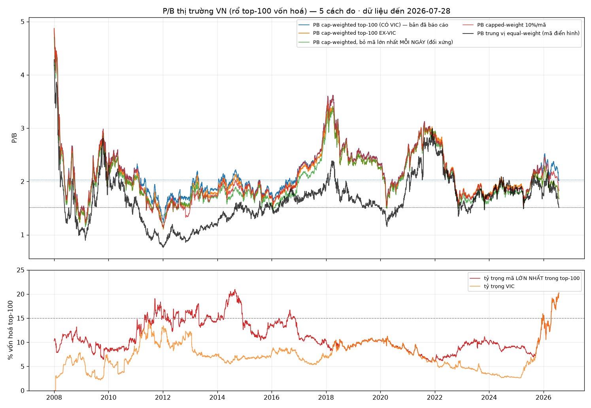
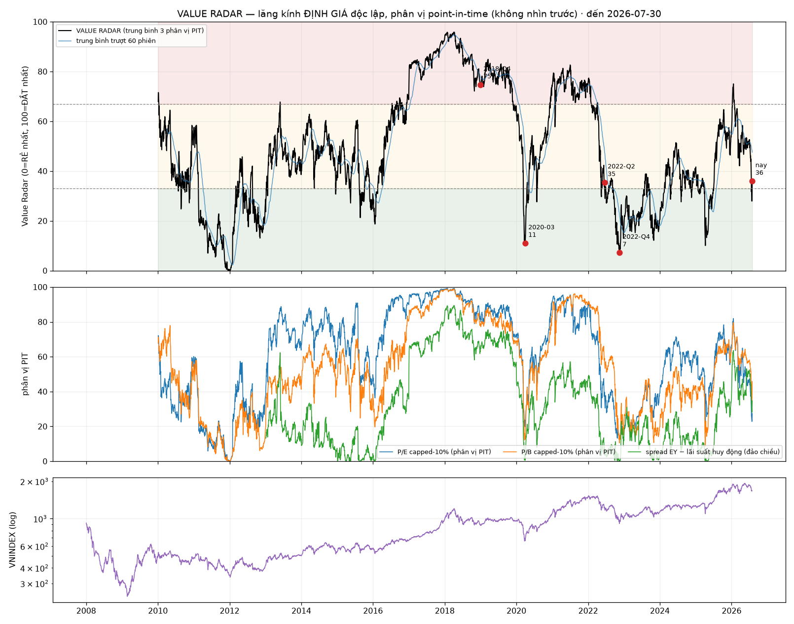

# Thị trường đang ở đâu? — ước lượng xác suất bằng percentile + base rate lịch sử

**Ngày dữ liệu: 2026-07-28** · job `Taylor_20260729_024754` · Taylor (Quant)
**Loại: RESEARCH / trả lời câu hỏi — KHÔNG wire signal mới vào production.**

---

## 0. Trả lời ngắn

| Kịch bản 12 tháng tới (tính từ 1680,62) | Ước lượng | Khoảng thô (90%) |
|---|---|---|
| **Bear-like** — có lúc rơi ≥20% dưới mức hiện tại | **~20%** | 10–35% |
| **Không bear** (đi ngang / điều chỉnh nông / hồi phục) | **~80%** | 65–90% |
| *— trong đó điều chỉnh 10–20% rồi hồi* | ~10–25% | rất rộng |

**Điểm cốt lõi, phải nói thẳng:** con số ~20% này **không khác biệt có ý nghĩa thống kê** so với
base rate vô điều kiện (19% từ 2014+, 25% từ 2008+). Định giá đang **hơi ủng hộ** (PE rẻ), kỹ thuật
đang **hơi bất lợi** (dưới MA200, −12,8% từ đỉnh 52w) — hai lực gần như triệt tiêu nhau. Cỡ mẫu
episode độc lập chỉ **9–24**, khoảng tin cậy rộng đến mức mọi con số lẻ đều là an-toàn-giả.

~~Định vị đúng nhất bằng một câu: **thị trường đang RẺ theo P/E nhưng KHÔNG rẻ theo P/B, và đang ở
trạng thái kỹ thuật xấu.**~~ Đây là vùng "bình thường-hơi-căng", **không phải** vùng định giá bong bóng
(2007, 2018, 2021) mà cũng **không phải** vùng khủng hoảng-cơ-hội (2008, 2012, 2020-03, 2022-11).

> ⚠️ **ĐÍNH CHÍNH LỚN 2026-07-29 (Phụ lục B) — vế "KHÔNG rẻ theo P/B" đã SAI.** Toàn bộ mức "đắt"
> của P/B đến từ **một mã duy nhất: VIC** (20,17% vốn hoá top-100, PB riêng 10,80 — cả hai đều là
> hiện tượng mới của 2025-2026). Đo bằng bất kỳ phương pháp nào bền với outlier đơn lẻ, P/B hiện tại
> nằm ở **phân vị 0,4–27 của 3 năm** thay vì 65,6. **Câu đúng: thị trường RẺ theo CẢ P/E lẫn P/B đối
> với cổ phiếu điển hình; chỉ số cap-weighted trông đắt vì VIC, không phải vì thị trường đắt.**
> Xem **Phụ lục B**. (Kết luận xác suất ~20% ở bảng trên **không đổi** — xem B.5.)

---

## 1. PE / PB thị trường hiện tại + phân vị lịch sử

### 1.1 Số hiện tại (2026-07-28)

| Chỉ số | Giá trị | Nguồn |
|---|---|---|
| VNINDEX | **1.680,62** | `tav2_bq.ticker` hàng `ticker='VNINDEX'` |
| PE thị trường (chính thức) | **12,46** | `ticker.VNINDEX_PE` (mirror trên hàng cổ phiếu) |
| PE thị trường (tự dựng, toàn bộ) | 12,39 | Σmcap/Σearn, 708 mã PE>0 |
| PE thị trường (tự dựng, top-100 mcap) | 12,93 | 100 mã lớn nhất |
| **PB thị trường (tự dựng, toàn bộ)** | **1,803** | Σmcap/Σbook, 767 mã PB>0 |
| PB thị trường (tự dựng, top-100 mcap) | 2,028 | 100 mã lớn nhất |
| ROE gộp (Σearn/Σbook) | ~~14,48%~~ → **14,61%** | hệ quả của 2 dòng trên · ⚠️ **đã sửa 2026-07-29, xem Phụ lục A.0** |

> **Không có cột `VNINDEX_PB` trong BQ.** PB thị trường **phải tự dựng** = Σ(Price×OShares) /
> Σ(BVPS×OShares) — cap-weighted harmonic, đúng định nghĩa PB chỉ số. Cùng công thức dựng luôn PE để
> **kiểm chứng**: PE tự dựng vs PE chính thức trên 3.134 phiên chồng lấn (2014-01→2026-07):
> corr mức 0,945 · corr biến động ngày 0,814 · sai số tuyệt đối trung vị 1,02 điểm · lệch mức trung
> bình −6,2% · **hiện tại gần như trùng khít (12,39 vs 12,46)**. ⇒ PB tự dựng đáng tin ở mức tương đương.

### 1.2 Phân vị (100 = đắt nhất lịch sử)

| Cửa sổ | N phiên | **PE** | **PB** | ROE gộp |
|---|---|---|---|---|
| Toàn bộ 2008+ (tự dựng) | 4.631 | **39,6** | **51,0** | 76,9 |
| 10 năm gần nhất | 2.499 | **15,8** | **38,7** | 86,7 |
| 5 năm gần nhất | 1.247 | **27,7** | **56,0** | 76,0 |
| 3 năm gần nhất | 747 | **11,5** | **65,6** | **99,6** |
| *PE chính thức, 2014+* | *3.134* | *10,3* | — | — |
| *PE chính thức, 3 năm* | *747* | *3,6* | — | — |

> ⚠️ **Cột PB ở bảng này đã bị VIC bóp méo — xem Phụ lục B.** Đo bằng phương pháp bền với một mã
> siêu lớn, phân vị PB là **13,5–35 (2008+) · 1,8–17,6 (10 năm) · 2,2–31,8 (5 năm) · 0,4–27,0 (3 năm)**,
> tức là **RẺ**, không phải 51,0/38,7/56,0/65,6 như bảng trên. Cột PE cũng bị nâng nhẹ (VIC PE=142,5):
> PE top-100 ex-VIC = **10,51**, phân vị **0,1 của 3 năm**.

Ngũ phân vị PE tự dựng 2008+: p05=8,64 · p25=11,29 · **p50=13,10** · p75=14,87 · p95=17,26
Ngũ phân vị PB tự dựng 2008+: p05=1,42 · p25=1,61 · **p50=1,79** · p75=2,07 · p95=2,58

### 1.3 Điều quan trọng nhất trong bảng trên: **PE và PB không nói cùng một câu chuyện**

- PE ở **phân vị 11,5 của 3 năm** (rẻ nhất top-12%) — theo PE chính thức thậm chí là **phân vị 3,6**.
- ~~PB ở **phân vị 65,6 của 3 năm** (đắt hơn 2/3 số phiên 3 năm qua).~~ ⚠️ **SAI — xem Phụ lục B.**
  PB "đắt" là ảo giác do VIC; đo bền với outlier thì PB ở **phân vị 0,4–27 của 3 năm**. **PE và PB
  THỰC RA nói CÙNG một câu chuyện: rẻ.** Cả tiêu đề §1.3 lẫn dòng gạch trên đều phải đọc ngược lại.
- Cầu nối: **ROE gộp 14,61% — phân vị 98,4 của 3 năm, 78,6 của 10 năm, nhưng chỉ 59,9 kể từ 2008.**
  ⚠️ **Đã sửa 2026-07-29 (Phụ lục A)**: số cũ (14,48% · phân vị 99,6/3Y · 86,7/10Y · 76,9/2008+) tính
  tử số và mẫu số trên hai rổ mã khác nhau.

Nói cách khác: **P/E rẻ vì E đang ở đỉnh chu kỳ lợi nhuận, không phải vì P rẻ.** Đây là dạng "rẻ"
mong manh nhất trong toàn bộ họ chỉ báo định giá — nếu biên lợi nhuận mean-revert, PE "12,4" sẽ tự
động đắt lên mà giá không cần giảm một đồng. ⚠️ **Đã định lượng lại 2026-07-29 (Phụ lục A.5): kịch bản
trung tâm là PE → 13,1 (+6%), vẫn ở phân vị ~25 của 10 năm. Mức "15–16" đòi hỏi ROE rơi về p05 hoặc
đáy 10 năm — kịch bản đuôi, không phải kịch bản cơ sở. Câu "sẽ biến thành 15–16" ở bản gốc là quá lời.** Bất cứ luận điểm "thị trường rẻ nên an toàn"
nào chỉ dựa trên PE mà bỏ qua dòng ROE này đều đang đếm thiếu một rủi ro thật.

Neo thứ ba, độc lập: **earnings yield 8,03% vs lãi suất huy động Big4-12M-online 6,80%**
(`data/deposit_rate_vn_events.csv`, xác nhận 2026-07-20) ⇒ phần bù **+1,23pp**. Dương nhưng mỏng —
không phải mức "rẻ đến mức không thể sai" (2012 và 2022-11 phần bù rộng hơn nhiều), cũng không âm
như các đỉnh 2018/2021.

---

## 2. Base rate: sau những giai đoạn định giá TƯƠNG ĐƯƠNG, chuyện gì đã xảy ra?

**Định nghĩa "bear"** dùng xuyên suốt: trong 252 phiên tới, VNINDEX **có lúc** rơi ≥20% dưới mức
đóng cửa ngày điều kiện (drawdown từ điểm vào, không phải từ đỉnh sau đó). Đây là định nghĩa khắt khe
đúng với câu hỏi "từ đây có rơi vào bear không".

**Cỡ mẫu báo theo EPISODE ĐỘC LẬP, không theo ngày** — ngày liên tiếp trong cùng một đợt gần như là
một quan sát duy nhất. CI 90% dưới đây là **block-bootstrap theo episode** (4.000 lần), đúng cách xử
lý chồng lấn.

| Điều kiện | N ngày | N episode | **P(bear 12M)** | CI90 | P(bình thường, không rơi >10%) | fwd 12M trung vị |
|---|---|---|---|---|---|---|
| Vô điều kiện 2008+ | 4.380 | — | 25% | — | 47% | +8,1% |
| Vô điều kiện 2014+ | 2.882 | — | 19% | — | 53% | +9,0% |
| **PE trong ±0,5 điểm (11,9–12,9)** | 672 | 21 | **15%** | [2%, 37%] | 64% | +9,0% |
| **PB trong ±5% (1,71–1,89)** | 745 | 21 | **15%** | [6%, 29%] | 43% | +4,9% |
| PE ∧ PB cùng trong dải | 320 | 17 | 16% | [3%, 38%] | 49% | +2,7% |
| Dưới MA200 (mọi định giá) | 1.656 | 20 | **26%** | [14%, 34%] | 54% | +9,7% |
| dd52w trong [−18%, −8%] | 1.088 | 29 | 26% | [11%, 46%] | 50% | +8,9% |
| **ANALOG ĐẦY ĐỦ** (dưới MA200 ∧ PE±0,75 ∧ dd52w −20..−6%) | 342 | **9** | **20%** | [4%, 50%] | 76% | +11,7% |

Horizon 6 tháng, analog đầy đủ: **P(bear) = 20%**, P(không rơi quá 10%) = 77%.
Phân phối lợi nhuận forward của analog đầy đủ: 1M +1,6% (40% âm) · 3M +5,6% (28% âm) ·
6M +12,6% (23% âm) · 12M +11,7% (27% âm) — đều là trung vị.

### 2.1 Chín episode analog — đây mới là "cỡ mẫu" thật

| Đợt | n ngày | fwd 3M | fwd 6M | fwd 12M | Đáy sâu nhất 12M |
|---|---|---|---|---|---|
| 2014-05-12 → 05-15 | 3 | +17,5% | +15,6% | +3,8% | −0,6% |
| 2014-10-27 → 2015-06-17 | 111 | −0,0% | −4,8% | +3,8% | −10,8% |
| 2016-02-05 → 04-21 | 45 | +13,0% | +21,2% | +29,6% | −0,2% |
| **2020-02-24 → 03-10** | 12 | −3,8% | −5,4% | +28,6% | **−27,0%** |
| 2020-05-11 → 08-24 | 61 | +1,4% | +13,5% | +53,2% | −5,2% |
| **2022-05-09 → 06-16** | 22 | −1,2% | −19,7% | −16,7% | **−28,2%** |
| **2022-08-01 → 09-16** | 33 | −16,5% | −12,5% | −1,7% | **−25,9%** |
| 2023-10-18 → 12-27 | 36 | +5,4% | +7,9% | +15,1% | −6,8% |
| 2025-04-03 → 05-07 | 19 | +14,0% | +37,9% | +41,2% | −11,0% |
| *(2026-03-23 → 03-24)* | 2 | +17,5% | chưa đủ | chưa đủ | chưa đủ |
| **⟶ 2026-07-20 → 07-28 (hiện tại)** | 7 | — | — | — | — |

**3/9 episode dẫn tới bear** (2020 COVID, 2022 lần 1, 2022 lần 2) = 33% theo episode, 20% theo ngày.
Đọc kỹ danh sách: 2 trong 3 ca bear (2022-05, 2022-08) là **đã ở giữa một bear market rồi** — điều
kiện lọc bắt được chúng trên đường xuống chứ không phải trước khi xuống. Ca duy nhất thực sự "đang
bình thường rồi rơi" là **2020-02 (COVID)** — một cú sốc ngoại sinh mà **không** chỉ báo định giá nào
báo trước được. Đây là lý do tôi không tin con số 33% và cũng không tin con số 15%: mẫu quá nhỏ và
cơ chế không đồng nhất.

---

## 3. Đối chiếu với tín hiệu hệ thống đang có sẵn

| Tín hiệu | Giá trị 2026-07-28 | Hàm ý | Đồng thuận với §1-2? |
|---|---|---|---|
| **DT5G** (`vnindex_5state_dt5g_live`) | **NEUTRAL (3)** liên tục từ 2026-02-13 (≈5,5 tháng) | phân bổ 70% | ✅ Đồng thuận — không CRISIS/BEAR, cũng không BULL |
| DT5G macro overlay | `active=False`, `state_dt4=3` = `state=3` | macro cap chưa kích hoạt | ✅ chưa có stress vĩ mô đủ để cap |
| `macro_health.json` | HEALTHY, `DT5G_macro`, missed_runs=0 | nguồn state tin cậy | — |
| **`market_stress`** | **flag=True**: `vix_elevated=True`, `vni_below_ma200=True` | cảnh báo mềm | ⚠️ **Đồng thuận với vế XẤU** |
| **CAPIT** | `capit_fired=True`, `breadth_oversold=0,372` > `washout_gate=0,31`, `capit_size=0,75` | đang giải ngân rổ washout | ⚠️ Đồng thuận: **hệ đang coi đây là vùng sợ hãi**, mua vào chứ không phòng thủ |
| **dd52w** | **−12,8%** (lúc CAPIT fire 07-20 mới ~−7%) | đã sâu thêm 5,8pp trong 6 phiên | ⚠️ thị trường vẫn đang xấu đi |
| VNINDEX vs MA200 | 1.680,62 / 1.772,63 = **0,948** | dưới MA200 | ⚠️ vế kỹ thuật xấu |

**Đọc tổng hợp — có một mâu thuẫn thật, đáng nêu tên:**
- Nhóm "chậm/định giá" (DT5G NEUTRAL, PE phân vị thấp) nói: **bình thường, hơi rẻ**.
- Nhóm "nhanh/kỹ thuật" (dưới MA200, dd52w −12,8% và đang sâu thêm, VIX cao, breadth oversold 0,372
  vượt xa gate 0,31) nói: **đang ở giữa một đợt bán tháo còn hiệu lực**.
- PB phân vị 65,6 (3 năm) + ROE phân vị 99,6 nói: **cái "rẻ" của PE là rẻ-nhờ-E-đỉnh, không phải
  rẻ-nhờ-P-thấp**.

Đây **không** phải mâu thuẫn cần "sửa" — đúng theo thiết kế: DT5G là **cổng phòng thủ chậm, price-
confirmed** (không tự re-risk theo macro, chỉ cap khi stress), CAPIT là **cổng mua-khi-sợ-hãi nhanh**.
Việc cả hai cùng bật (NEUTRAL + CAPIT fired) chính là trạng thái "sợ hãi có tính toán" mà hệ được
thiết kế để mua vào. Con số bootstrap ở §2 nói mức độ sợ hãi hiện tại là **hợp lý nhưng chưa phải cơ
hội hiếm**.

---

## 4. Kết luận dạng xác suất

**Trong 12 tháng tới, tính từ VNINDEX 1.680,62:**

| Kịch bản | Xác suất | Cơ sở |
|---|---|---|
| **Bear-like** (có lúc ≤ −20% so với hôm nay) | **~20%** (khoảng thật 10–35%) | analog đầy đủ 3/9 episode = 33% theo episode / 20% theo ngày; PE-band 15%; MA200-band 26%; vô điều kiện 19–25% |
| **Điều chỉnh nhưng không bear** (đáy trong khoảng −10%..−20%) | **~10–25%** | analog đầy đủ cho 4% (mẫu quá mỏng, không tin); các điều kiện rộng hơn cho 20–42% |
| **Bình thường / hồi phục** (không rơi quá −10% nữa) | **~55–75%** | analog đầy đủ 76%; PE-band 64%; vô điều kiện 47–53% |

Kỳ vọng trung tâm về lợi nhuận (trung vị analog): 3M **+5,6%**, 6M **+12,6%**, 12M **+11,7%** —
nhưng đuôi trái dày và thật (2022: −16,7% sau 12M).

**Ba điều tôi KHÔNG kết luận, vì dữ liệu không cho phép:**

1. **Không kết luận "định giá hiện tại làm giảm rủi ro bear".** P(bear) có điều kiện (15–26%) nằm
   trọn trong khoảng vô điều kiện (19–25%), và CI90 của mọi điều kiện đều phủ lên nó. Với 9–24
   episode độc lập, **không có power** để phân biệt. Ai nói "PE phân vị 11 nên an toàn" là đang đọc
   ra tín hiệu từ nhiễu.
2. **Không đưa con số lẻ đến 1 chữ số thập phân.** "20%" ở đây nghĩa là "một-phần-năm, cộng trừ
   một-phần-mười", không phải 20,3%.
3. **Không dự báo cú sốc ngoại sinh.** Ca bear "thật bất ngờ" duy nhất trong mẫu (2020-02 COVID) sinh
   ra từ thứ mà không mô hình định giá nào thấy trước. Nếu 12 tháng tới có một sự kiện loại đó,
   phân tích này vô hiệu — và đó chính là lý do cổng DT5G tồn tại như **bảo hiểm**, không phải như
   máy dự báo.

**Hàm ý sizing (định lượng, không narrative):** không có gì trong phân tích này đòi thay đổi tham số
production. DT5G NEUTRAL → 70%; CAPIT đã fire → rổ washout đang giải ngân theo `capit_size=0,75`.
Phân tích percentile **xác nhận** vị trí này là hợp lý: rẻ vừa đủ để không đứng ngoài, không đủ rẻ để
all-in, và có một rủi ro biên-lợi-nhuận-đỉnh (ROE phân vị 99,6/3 năm) mà không chỉ báo phòng thủ nào
của hệ đang theo dõi.

---

## 5. Giới hạn dữ liệu & phương pháp (đọc trước khi trích dẫn)

1. **`ticker.VNINDEX_PE` chỉ có từ 2016-07-01, KHÔNG phải 2006-03-30.** Đã kiểm chứng trực tiếp
   (`MIN(time) WHERE VNINDEX_PE IS NOT NULL` = 2016-07-01, N=2,91M hàng). Ghi chú trong kb memory
   `vnindex-pe-bq-gotcha` ("tồn tại từ 2006-03-30") **không còn đúng với trạng thái bảng hiện tại** —
   nên sửa. `data/VNINDEX_pe_only.csv` kéo dài về 2014-01-02 (nhưng cũ, dừng ở 2026-03-30).
2. **Không có `VNINDEX_PB` trong BQ** — PB thị trường là số **tự dựng**, không phải số công bố. Đã
   kiểm chứng bằng cách dựng PE song song và so với PE chính thức (corr 0,945).
3. **Trôi thành phần (composition drift)**: rổ tự dựng gồm cả HNX/UPCOM, VNINDEX chỉ có HOSE. Số mã
   hợp lệ tăng từ 157 (2008) lên 767 (2026). So sánh phân vị xuyên thời đại vì thế có sai lệch cấu
   trúc — đó là lý do tôi báo cả cửa sổ 3Y/5Y/10Y (ít trôi hơn) chứ không chỉ 2008+.
4. **Chồng lấn cửa sổ**: mọi CI dùng block-bootstrap theo episode (gap >21 phiên). CI tính theo ngày
   sẽ hẹp giả tạo 3-5 lần — đừng dùng.
5. **Cột mirror `t.VNINDEX` bị corrupt 2026-04-01..04-29** (làm tròn hàng chục, ≤0,29% —
   `kb/data_registry/price-volume/vnindex_mirror_col.md`). Chuỗi giá dùng ở đây đọc **hàng
   `ticker='VNINDEX'` gốc**, không đụng cột mirror ⇒ không ảnh hưởng. Cột `VNINDEX_PE` đọc từ hàng cổ
   phiếu đã kiểm tra tính nhất quán (min≈max mỗi ngày).
6. Tất cả là **phân tích mô tả/base-rate**, không phải mô hình dự báo, **không backtest lợi nhuận,
   không đề xuất wire**. Không cần quant-skeptic vì không có thay đổi production nào được đề xuất.

**Artifact tái lập:** `mike/agents/Taylor/exp_market_prob/` — `analyze.py` (percentile),
`eventstudy.py` / `eventstudy2.py` / `eventstudy3.py` (base rate + bootstrap),
`daily_panel.csv` / `panel_fwd.csv` (panel ngày), `percentiles.csv`, `baserates*.csv`.

---
---

# PHỤ LỤC A — ROE toàn thị trường: thống kê mô tả + đánh giá GO/NO-GO

**Bổ sung 2026-07-29** · job `Taylor_20260729_041421` · trả lời câu hỏi tiếp theo của user:
*"ROE bình quân hiện nay là bao nhiêu? Cho thêm thống kê mô tả (histogram). Có nên đưa vào làm
chỉ báo bổ sung cho tín hiệu thị trường không?"*

**Artifact**: `mike/agents/Taylor/exp_roe/` (`roe_desc.py`, `roe_fund.py`, `eventstudy_roe.py`,
`eventstudy_roe2.py`, `eventstudy_roe3.py`, `plot_roe.py` + CSV).
**Hình**: `mike/agents/Taylor/research/roe_market_histogram_20260729.png`

---

## A.0 Trả lời ngắn

| Câu hỏi | Trả lời |
|---|---|
| ROE thị trường hiện tại? | **14,6%** nếu hỏi "ROE gộp" (Σ lợi nhuận / Σ vốn chủ). **8,4%** nếu hỏi "mã trung vị". Hai con số đều đúng, đo hai thứ khác nhau — xem §A.1. |
| ROE có đang ở đỉnh chu kỳ không? | **Đỉnh 3 năm (phân vị 98) — nhưng chỉ ~phân vị 60-77 kể từ 2008.** Báo cáo chính §1.3 nói "đỉnh chu kỳ" là **hơi quá lời**; sửa lại ở §A.2. |
| Có nên wire ROE làm chỉ báo bổ sung cho DT5G/CAPIT? | **NO-GO.** Lý do chính không phải cỡ mẫu mà là **đồng nhất thức đại số**: ROE thị trường **= PB / PE**, khớp đến sai số máy (10⁻¹⁶). Nó không phải biến thứ ba — nó *là* PE và PB viết lại. Chi tiết §A.4. |

**Sửa 2 con số trong báo cáo chính** (§1.1 và §1.3), do lỗi rổ mẫu:

| Chỗ | Bản cũ | Bản đúng | Nguyên nhân |
|---|---|---|---|
| ROE gộp hiện tại | 14,48% | **14,61%** | Tử số tính trên 708 mã (PE>0), mẫu số trên 767 mã (PB>0) — hai rổ khác nhau. Nay ép **cùng một rổ**. |
| ROE phân vị 2008+ | 76,9 | **59,9** | hệ quả của cùng lỗi trên |
| ROE phân vị 3 năm | 99,6 | **98,4** | " |

Kết luận định tính của §1.3 (PE rẻ một phần nhờ E cao) **vẫn đứng**, nhưng **định lượng nhẹ hơn
nhiều so với câu đã viết** — xem §A.5.

---

## A.1 ROE hiện tại — 5 con số, đừng trộn lẫn

Dữ liệu 2026-07-28. Nguồn: `tav2_bq.ticker` (PE/PB/BVPS/OShares/Price theo phiên) và
`tav2_bq.ticker_financial` (NP_P0..P3, BVPS, OShares theo quý) — cả hai đã tra
`mike/kb/data_registry/` trước khi dùng.

| # | Cách đo | Giá trị | Rổ | Dùng khi nào |
|---|---|---|---|---|
| 1 | **ROE gộp, trọng số vốn chủ** = Σ(EPS×CP)/Σ(BVPS×CP) | **14,61%** | 708 mã (PE>0 ∧ PB>0) | Con số "thị trường" chuẩn — cùng hệ với PE/PB chỉ số. **Đây là số dùng ở §1.3 báo cáo chính.** |
| 2 | ROE gộp **từ số cơ bản, gồm cả doanh nghiệp LỖ** = Σ NP_TTM / Σ vốn chủ | **14,22%** | 1.214 mã, quý 2026Q3, **15,1% số mã đang lỗ** | Kiểm chứng: cách 1 có thiên lệch sống sót (loại mã lỗ). Chênh chỉ **−0,39pp** ⇒ thiên lệch nhỏ. |
| 3 | ROE gộp **rổ top-100 vốn hoá** (kích thước cố định) | **15,69%** | 100 mã | So sánh **xuyên thời đại** không bị trôi thành phần (rổ toàn bộ nở từ 150 → 924 mã). |
| 4 | **Trung bình giản đơn** ROE từng mã (winsor ±100%) | **12,42%** | 708 mã | "Doanh nghiệp trung bình" |
| 5 | **Trung vị** ROE từng mã, rổ đầy đủ (gồm mã lỗ) | **8,41%** | 1.090 mã | "Doanh nghiệp điển hình" — con số thấp nhất và **thật nhất với đa số mã** |

### Tại sao 14,6% (gộp) ≫ 8,4% (trung vị)? — không phải lỗi, là cấu trúc thị trường VN

| Nhóm | Số mã | % tổng vốn chủ | ROE gộp | ROE trung vị |
|---|---|---|---|---|
| **Ngân hàng** | 26 | **35,2%** | **15,92%** | **15,36%** |
| Phi ngân hàng | 1.064 | 64,8% | 13,58% | **8,33%** |
| *Top-15 theo vốn chủ* | 15 | 41,3% | **16,98%** | — |
| *1.075 mã còn lại* | 1.075 | 58,7% | 12,59% | 8,34% |

15 mã lớn nhất (VHM 23,7% · VCB 15,4% · VPB 15,6% · BID 16,2% · TCB 14,4% · CTG 20,2% · VIC 7,6% ·
MBB 18,5% · HPG 16,6% · ACB 15,8% · HDB 20,5% · ACV 14,7% · SHB 17,0% · GAS 16,4% · BSR 19,0%)
chiếm **41,3% vốn chủ toàn thị trường** và có ROE 17,0%. Đuôi dài 1.000+ mã nhỏ kéo trung vị xuống 8,4%
nhưng gần như không ảnh hưởng số gộp.

⇒ **Khi nói "ROE thị trường 14,6%" là đang nói về ~15 doanh nghiệp lớn nhất, chủ yếu là ngân hàng.**
Câu "biên lợi nhuận đang ở đỉnh chu kỳ" vì thế thực chất là câu về **chu kỳ lợi nhuận ngân hàng**,
không phải về 1.000 doanh nghiệp niêm yết còn lại.

---

## A.2 Thống kê mô tả đầy đủ — chuỗi thời gian ROE thị trường

Đơn vị %. `cur` = giá trị 2026-07-28. `pctile` = phân vị của giá trị hiện tại trong cửa sổ đó
(100 = cao nhất lịch sử).

### A.2.1 ROE gộp trọng số vốn chủ (cách đo #1, rổ toàn bộ)

| Cửa sổ | N phiên | cur | **pctile** | mean | median | std | skew | kurtosis | p05 | p25 | p50 | p75 | p95 | min | max |
|---|---|---|---|---|---|---|---|---|---|---|---|---|---|---|---|
| 2008+ | 4.631 | 14,61 | **59,9** | 14,77 | 14,24 | 1,90 | +0,87 | 0,00 | 12,26 | 13,55 | 14,24 | 15,91 | 18,98 | 11,58 | 19,65 |
| 10 năm | 2.499 | 14,61 | **78,6** | 13,83 | 13,78 | 1,09 | +0,22 | −0,15 | 11,98 | 13,12 | 13,78 | 14,53 | 15,80 | 11,58 | 16,84 |
| 5 năm | 1.247 | 14,61 | **69,3** | 13,85 | 13,80 | 1,41 | +0,18 | −1,07 | 11,78 | 12,59 | 13,80 | 15,06 | 16,04 | 11,58 | 16,84 |
| 3 năm | 747 | 14,61 | **98,4** | 12,94 | 12,94 | 0,89 | +0,25 | −1,12 | 11,71 | 12,10 | 12,94 | 13,74 | 14,52 | 11,58 | 14,67 |

### A.2.2 Hai cách đo kiểm chứng — kết luận không đổi về chất

| Cửa sổ | ROE gộp #1 | **ROE top-100 #3** | **ROE cơ bản (gồm mã lỗ) #2** |
|---|---|---|---|
| | cur 14,61% | cur **15,69%** | cur **14,22%** |
| 2008+ | pctile 59,9 (N=4.631 phiên) | pctile **76,3** (N=4.633) | pctile **77,3** (N=75 quý) |
| 10 năm | 78,6 | **85,9** (N=2.501) | **90,2** (N=41 quý) |
| 5 năm | 69,3 | **74,4** (N=1.249) | **81,0** (N=21 quý) |
| 3 năm | 98,4 | **97,7** (N=749) | **92,3** (N=13 quý) |

Thống kê mô tả ROE top-100 (2008+, N=4.633): mean 14,78 · median 14,27 · std 1,80 · skew +0,60 ·
kurt 2,66 · p05 12,65 · p25 13,66 · p50 14,27 · p75 15,59 · p95 18,21.

**Đọc bảng này:** cả ba cách đo đồng thuận rằng ROE **đang ở gần đỉnh 3 năm (phân vị 92-98)** nhưng
**chỉ ở phân vị 60-77 kể từ 2008**. Giai đoạn 2008-2012 ROE gộp 15,6-19,0% — cao hơn hẳn hôm nay.
Vậy phát biểu đúng là: **"ROE đang ở đỉnh của chu kỳ 3 năm hiện tại, KHÔNG phải đỉnh chu kỳ lịch sử."**
Câu trong §1.3 báo cáo chính cần hiểu theo nghĩa hẹp đó.

### A.2.3 Trung bình theo năm (bối cảnh chu kỳ)

| Năm | n mã TB | ROE gộp | ROE trung vị | PE | PB | | Năm | n mã TB | ROE gộp | ROE trung vị | PE | PB |
|---|---|---|---|---|---|---|---|---|---|---|---|---|
| 2008 | 150 | 17,79 | 16,01 | 12,71 | 2,27 | | 2018 | 798 | 14,49 | 10,68 | 17,14 | 2,48 |
| 2009 | 219 | 16,16 | 15,51 | 12,38 | 1,99 | | 2019 | 832 | 13,89 | 10,00 | 15,30 | 2,13 |
| 2010 | 335 | 18,97 | 17,14 | 10,79 | 2,04 | | 2020 | 842 | 13,34 | 9,14 | 13,27 | 1,77 |
| 2011 | 447 | 17,78 | 14,72 | 8,85 | 1,58 | | 2021 | 891 | 14,57 | 9,90 | 16,75 | 2,43 |
| 2012 | 449 | 15,60 | 12,30 | 9,33 | 1,45 | | 2022 | 933 | 15,54 | 10,13 | 12,95 | 2,01 |
| 2013 | 466 | 14,38 | 10,65 | 11,93 | 1,71 | | 2023 | 871 | 13,72 | 8,85 | 11,66 | 1,60 |
| 2014 | 510 | 13,89 | 10,58 | 13,01 | 1,81 | | **2024** | 900 | **11,98** | **7,96** | 14,18 | 1,70 |
| 2015 | 536 | 13,94 | 11,20 | 12,11 | 1,68 | | 2025 | 932 | 13,07 | 8,67 | 13,89 | 1,82 |
| 2016 | 592 | 12,96 | 10,88 | 13,20 | 1,71 | | **2026** | 924 | **14,17** | 9,42 | 14,21 | 2,01 |
| 2017 | 693 | 14,09 | 10,67 | 15,23 | 2,15 | | | | | | | |

Chu kỳ rõ ràng: đáy **2024 (11,98%)** → hồi phục 2 năm liên tiếp → **14,17% (2026)**. Đây là lý do
phân vị 3 năm cao gần kịch trần: 3 năm gần nhất (2023-2026) chính là đáy chu kỳ + đường đi lên.
**Số hiện tại vẫn thấp hơn mọi năm 2008-2013.**

⚠️ Trôi thành phần: số mã hợp lệ tăng 150 → 924. Cột "ROE trung vị" giảm dần chủ yếu vì rổ nở ra
phía mã nhỏ, không hẳn vì doanh nghiệp xấu đi. **Cột ROE top-100 (§A.2.2) là cột duy nhất so sánh
xuyên thời đại được** — và nó cho phân vị 2008+ là 76,3, không phải 59,9.

---

## A.3 Histogram

Hình: `mike/agents/Taylor/research/roe_market_histogram_20260729.png` (3 panel).
Bảng bucket đầy đủ ở `exp_roe/hist_*.csv`. Bản rút gọn:

### A.3.1 Chuỗi thời gian ROE gộp — 2008+ vs 3 năm gần nhất (bước 0,5pp)

| Bucket ROE gộp (%) | 2008+ số phiên | % | 3 năm số phiên | % |
|---|---|---|---|---|
| 11,5–12,0 | 144 | 3,1 | 144 | **19,3** |
| 12,0–12,5 | 139 | 3,0 | 103 | 13,8 |
| 12,5–13,0 | 344 | 7,4 | 142 | **19,0** |
| 13,0–13,5 | 488 | 10,5 | 118 | 15,8 |
| **13,5–14,0** | **873** | **18,9** | 134 | 17,9 |
| 14,0–14,5 | 622 | 13,4 | 61 | 8,2 |
| **14,5–15,0 ⟵ hiện tại 14,61** | 589 | 12,7 | **45** | **6,0** |
| 15,0–16,0 | 411 | 8,9 | 0 | 0,0 |
| 16,0–17,0 | 299 | 6,4 | 0 | 0,0 |
| 17,0–18,0 | 336 | 7,3 | 0 | 0,0 |
| 18,0–19,0 | 157 | 3,4 | 0 | 0,0 |
| 19,0–20,0 | 229 | 4,9 | 0 | 0,0 |

**Hình dạng**: phân phối 2008+ **lệch phải** (skew +0,87) — đuôi dài về phía ROE cao 16-20% là di sản
2008-2012. Hiện tại 14,61% nằm ngay **đỉnh mode** của phân phối dài hạn (bucket 13,5-15,0 chiếm 45%
số phiên) ⇒ **không phải giá trị đuôi theo thang lịch sử.** Ngược lại, trên cửa sổ 3 năm nó là
bucket **cao nhất từng chạm** (0 phiên nào vượt 14,67%) ⇒ **là giá trị đuôi theo thang 3 năm.**
Toàn bộ mâu thuẫn "phân vị 60 vs phân vị 98" nằm gọn trong hai dòng này.

### A.3.2 Mặt cắt ngang ROE từng mã, quý gần nhất (N=1.090 mã, bước 2pp)

| Bucket ROE (%) | Số mã | % | | Bucket | Số mã | % |
|---|---|---|---|---|---|---|
| < −20 | 21 | 1,9 | | 12–14 | 71 | 6,5 |
| −20…−10 | 20 | 1,8 | | 14–16 | 75 | 6,9 |
| −10…−2 | 34 | 3,1 | | 16–18 | 51 | 4,7 |
| −2…0 | 37 | 3,4 | | 18–20 | 30 | 2,8 |
| **0–2** | **112** | **10,3** | | 20–24 | 63 | 5,8 |
| **2–4** | **107** | **9,8** | | 24–28 | 44 | 4,0 |
| 4–6 | 93 | 8,5 | | 28–32 | 22 | 2,0 |
| **6–8** | **98** | **9,0** | | 32–36 | 13 | 1,2 |
| 8–10 | 88 | 8,1 | | 36–40 | 2 | 0,2 |
| 10–12 | 80 | 7,3 | | ≥ 40 | 29 | 2,7 |

Thống kê: mean (winsor ±100%) **9,37%** · median **8,41%** · std (winsor) **16,90%** ·
skew (winsor) **−1,61** · **10,3% số mã lỗ** · **15,9% số mã có ROE > 20%** ·
ngũ phân vị p05 −6,06 · p25 3,01 · p50 8,41 · p75 15,37 · p95 29,64.
(Thô, không winsor: std 134% và skew −28 — hoàn toàn do vài mã vốn chủ gần cạn; **đừng trích số thô**.)

**Hình dạng**: đơn đỉnh, **mode ở 0-4%**, đuôi trái mỏng-nhưng-thật (10% mã lỗ), đuôi phải dày hơn
(2,7% mã ROE ≥40%). Gộp 3 năm gần nhất (N=13.253 quan sát mã-quý) hình dạng **gần như y hệt**
(median 7,02%, 14,2% mã lỗ) ⇒ **mặt cắt hiện tại không bất thường**; toàn bộ chuyển động chu kỳ nằm
ở nhóm vốn hoá lớn, không ở phân phối chung.

---

## A.4 GO/NO-GO — có nên đưa ROE vào làm chỉ báo bổ sung cho market-state?

### **VERDICT: NO-GO.** Không wire ROE-cycle-level thành gate/tilt/cảnh báo mới cho DT5G hay CAPIT.

Bốn lý do, xếp theo sức nặng. Lý do #1 tự nó đã đủ để đóng.

---

### A.4.1 (Quyết định) ROE thị trường **không phải biến mới** — nó là đồng nhất thức của PE và PB

```
ROE_gộp = Σearn/Σbook = (Σmcap/PE_gộp) / (Σmcap/PB_gộp) = PB_gộp / PE_gộp
```

Kiểm chứng số học trên **toàn bộ 4.631 phiên**, cùng một rổ mã:

| Kiểm định | Kết quả |
|---|---|
| max \|ROE_gộp − PB_gộp/PE_gộp\| | **1,39 × 10⁻¹⁶** (= sai số dấu phẩy động) |
| Hồi quy log(ROE) ~ log(PE) + log(PB) | **R² = 1,00000000**, β = [0,000 · **−1,000** · **+1,000**] |
| R²(fwd 12M ~ PE+PB) vs R²(fwd 12M ~ PE+PB+ROE), mức log, mẫu không chồng lấp | **0,4582 vs 0,4582 — bằng nhau tuyệt đối** |

Nói thẳng: đội đã có PE và có PB (§1 báo cáo chính). **Thêm ROE vào là thêm cột thứ ba được tính ra
từ hai cột đầu.** Không phải "đa cộng tuyến cao" — là **đa cộng tuyến hoàn hảo theo định nghĩa**.
Mọi "xác nhận" mà ROE mang lại đều là PE và PB nói lại lần nữa.

**Sắc thái cần nêu, không giấu:** đồng nhất thức đúng ở dạng **mức**. Ở dạng **hạng** (percentile
point-in-time, xếp hạng riêng từng biến — phép biến đổi đơn điệu nhưng **phi tuyến**), phân vị ROE
*không* còn là hàm tuyến tính của hai phân vị kia, nên R² có nhích: 0,3624 ({PE,PB}) → 0,3836
({PE,PB,ROE}). **Đó là lợi ích của phép biến đổi, không phải thông tin kinh tế mới** — và +0,02 R²
trên N=15 quan sát là nhiễu, không phải phát hiện.

### A.4.2 Sức dự báo đơn biến: **có dấu hiệu, nhưng chết ngay khi tính đúng cỡ mẫu**

Cỡ mẫu thật = **quan sát KHÔNG chồng lấp**: 1 điểm cuối tháng 7 mỗi năm, forward 12M không đè lên
nhau ⇒ **N = 15 năm (2010-2024)**. (IC tính trên ~3.900 *ngày* chồng lấp cho ra những con số to như
−0,51; chúng **không có ý nghĩa thống kê**, chỉ dùng để xem dấu.)

| Tín hiệu | N | ρ(Spearman) với fwd 12M | p thô | p Bonferroni | Qua BH 5%? |
|---|---|---|---|---|---|
| **ROE_gộp, phân vị mở rộng** | 15 | **−0,621** | **0,0134** | 0,161 | ❌ |
| ROE_gộp, phân vị mở rộng → min-DD 12M | 15 | −0,479 | 0,0711 | 0,853 | ❌ |
| ROE_gộp, phân vị 3 năm | 13 | −0,505 | 0,0780 | 0,936 | ❌ |
| PE, phân vị mở rộng → min-DD 12M | 15 | +0,357 | 0,191 | 1,000 | ❌ |
| PB, phân vị mở rộng | 15 | −0,275 | 0,321 | 1,000 | ❌ |
| PE, phân vị mở rộng | 15 | −0,011 | 0,970 | 1,000 | ❌ |

12 kiểm định (6 tín hiệu × 2 mục tiêu). Ngưỡng Bonferroni 5% = **0,0042**. **Không tín hiệu nào
qua Bonferroni, không tín hiệu nào qua Benjamini-Hochberg.** Đúng chuẩn multiple-testing discipline
đội đã chốt 2026-07-05.

Điều đáng ghi nhận: **ROE là biến đơn tốt nhất trong bộ** (ρ=−0,62, R² đơn biến 0,25 vs PE 0,00 và
PB 0,12) — dấu đúng chiều kinh tế (ROE cao → lợi nhuận forward thấp). Nhưng "tốt nhất trong 6 biến
được thử trên 15 quan sát" **chính là định nghĩa của lựa chọn quá khớp**. p=0,013 thô trở thành 0,16
sau khi tính đúng số phép thử.

### A.4.3 Base rate có điều kiện: các đợt ROE cao trong lịch sử — **6 đợt, và 2 ca xấu là cùng một năm**

Liệt kê **mọi** đợt ROE ở phân vị 3 năm ≥ 0,90 (gap >21 phiên = đợt mới):

| Đợt | n phiên | ROE lúc bắt đầu | fwd 12M | Đáy sâu nhất 12M | Kết cục |
|---|---|---|---|---|---|
| 2017-05-03 → 05-12 | 8 | 14,44% | **+42,7%** | −0,1% | lành |
| 2017-11-01 → 2018-04-27 | 98 | 14,62% | +9,7% | −1,1% | lành |
| 2018-08-01 → 10-31 | 63 | 14,94% | +1,2% | −7,8% | lành |
| 2021-08-02 → 11-17 | 76 | 16,84% | −4,6% | −12,5% | điều chỉnh |
| **2022-02-07 → 02-23** | 13 | 15,62% | **−29,0%** | **−39,1%** | **bear** |
| **2022-04-20 → 05-23** | 22 | 15,72% | **−24,7%** | **−34,1%** | **bear** |
| **⟶ 2026-04-16 → 07-28 (hiện tại)** | 67 | 13,97% | chưa đủ | chưa đủ | — |

2/6 đợt dẫn tới bear = 33% (vs vô điều kiện 19-25%). **Nhưng cả hai đều là năm 2022, cùng một chế độ
thị trường** ⇒ số sự kiện bear **thật sự độc lập = 1**. Với 1 sự kiện, bootstrap theo episode cho
CI90 rộng đến vô nghĩa (**[18%, 60%]** cho điều kiện phân vị ≥p90). Đây đúng là cái bẫy cỡ mẫu mà
§2.1 báo cáo chính đã cảnh báo.

Tệ hơn: kiểm định biên "trong dải PE hiện tại **và** ROE phân vị-3Y ≥0,8" cho ra `P(bear)=100%`,
CI90 = [100,100] — nghe như tín hiệu vàng, thực chất là **N_episode = 1** (chỉ 2022 có forward data).
**Con số 100% đó phải bị vứt bỏ, không được trích dẫn.**

### A.4.4 Giả thuyết mean-reversion cũng không đứng vững ở cỡ mẫu thật

Giả thuyết hợp lý (và là cơ sở duy nhất để ROE có giá trị *độc lập*): ROE cao → sẽ đảo về trung bình
→ E giảm → PE tự động đắt lên. Kiểm định trên **độ lệch cục bộ** `roe_gap` = ROE − TB trượt 5 năm
(khử xu thế thế kỷ):

| Giai đoạn | Chân trời | ρ trên dữ liệu ngày (chồng lấp) | ρ trên 1 điểm/năm | p |
|---|---|---|---|---|
| 2010+ | 252 phiên | −0,353 (N=3.624) | **−0,146** | **0,603** |
| 2010+ | 504 phiên | −0,469 (N=3.372) | **−0,218** | **0,455** |
| 2014+ | 252 phiên | −0,423 (N=2.882) | **−0,091** | **0,779** |
| 2014+ | 504 phiên | −0,553 (N=2.630) | **−0,164** | **0,631** |
| 2018+ | 252 phiên | −0,600 (N=1.886) | **−0,190** | **0,651** |

Khoảng cách giữa hai cột ρ là bài học chính: **toàn bộ vẻ "mean-reversion mạnh" đến từ chồng lấp cửa
sổ.** Khi mỗi năm chỉ đóng góp 1 quan sát, hiệu ứng còn −0,09…−0,22 với p 0,46-0,78 — **không phân
biệt được với 0**. `roe_gap` hiện tại chỉ **+0,75pp** (14,61% vs TB trượt 5 năm 13,85%) — độ lệch nhỏ,
không phải cực trị.

---

## A.5 Hệ quả cho báo cáo chính: "PE rẻ nhờ E đỉnh" đáng lo tới mức nào?

Câu §1.3 bản chính — *"nếu biên lợi nhuận mean-revert, PE 12,4 sẽ tự động biến thành 15-16"* — là
**quá bi quan**. Định lượng đúng (giá **không đổi**, chỉ E về mức chuẩn ⇒ PE ngụ ý = PB hiện tại / ROE chuẩn):

| Kịch bản ROE | ROE | PE ngụ ý | Chênh vs PE hiện tại 12,39 | Phân vị PE đó trong 10 năm |
|---|---|---|---|---|
| ROE giữ nguyên | 14,60% | 12,39 | — | 15,6 |
| **về trung vị 5 năm** | 13,80% | **13,12** | **+5,9%** | 24,5 |
| **về trung vị 10 năm** | 13,78% | **13,14** | **+6,0%** | 24,6 |
| về p25 của 10 năm | 13,12% | 13,79 | +11,3% | 34,1 |
| về p05 của 10 năm | 11,98% | 15,11 | +21,9% | 63,0 |
| về mức thấp nhất 10 năm | 11,58% | 15,63 | +26,1% | 74,9 |

**Kịch bản trung tâm: PE 12,4 → 13,1, tức +0,7 điểm.** Vẫn nằm ở phân vị ~25 của 10 năm — **vẫn rẻ**.
Mức "PE 15-16" đòi hỏi ROE rơi xuống **p05 hoặc mức thấp nhất 10 năm**, tức là kịch bản đuôi ~5%,
không phải kịch bản cơ sở. Rủi ro "E đỉnh" là **thật nhưng nhỏ hơn nhiều so với cách bản chính đã
diễn đạt** — đây là đính chính có ý nghĩa với người đọc.

Và quan trọng: **"PE chuẩn hoá theo chu kỳ" = PB / ROE_chuẩn = PB đổi đơn vị.** Chỉ số đo đúng cái
user đang lo lắng **đã có sẵn và đã báo ở §1.2: PB, phân vị 51 (2008+) / 66 (3 năm).** Không cần
chỉ báo mới nào cả.

---

## A.6 Nếu vẫn muốn dùng ROE — dùng thế nào cho đúng

NO-GO là với việc **wire vào hệ ra quyết định**. ROE vẫn có 2 chỗ dùng hợp lệ:

1. **Số báo cáo/diễn giải (nên làm, chi phí ~0)**: thêm dòng "ROE gộp + phân vị 3Y/10Y" vào báo cáo
   macro-view định kỳ, **chỉ để giải thích tại sao PE và PB lệch nhau** — đúng vai "cầu nối" ở §1.3.
   Không có ngưỡng, không kích hoạt hành động. Không cần quant-skeptic vì không đổi hành vi hệ thống.
2. **Nếu sau này muốn một lăng kính định giá bền chu kỳ** thì ứng viên đúng là **PB** (đã tồn tại,
   đã đo, không cần biến mới), **không phải ROE**. Kể cả vậy, PB đơn biến cũng chỉ đạt ρ=−0,275
   (p=0,32) trên 15 năm độc lập ⇒ **cũng chưa đủ chuẩn wire**. Muốn theo đuổi thì phải là một sprint
   riêng, và phải qua quant-skeptic.

**Cái KHÔNG nên làm** (nêu rõ để lần sau không ai làm lại): đặt ngưỡng kiểu "ROE phân vị 3Y ≥0,9 →
hạ 1 bậc phân bổ". Ngưỡng đó khớp đẹp lịch sử **chỉ vì nó trỏ vào 2022**, và nó **đang bật ngay lúc
này** (phân vị 98,4) — tức là sẽ cắt giảm phân bổ ngay trong kỳ CAPIT đang giải ngân, dựa trên bằng
chứng gồm **đúng một** sự kiện bear độc lập.

---

## A.7 Giới hạn phương pháp (phụ lục này)

1. **Trôi thành phần** — như §5.3 bản chính. Đã giảm thiểu bằng rổ top-100 kích thước cố định (§A.2.2),
   và đó là lý do phân vị 2008+ nên đọc theo cột top-100 (76,3) hơn là cột rổ toàn bộ (59,9).
2. **PE>0 làm rơi doanh nghiệp lỗ** khỏi cách đo #1 ⇒ thiên lệch sống sót, và thiên lệch này **thay đổi
   theo chu kỳ** (năm xấu nhiều mã lỗ hơn ⇒ bị loại nhiều hơn ⇒ ROE gộp trông đẹp giả). Đã đo trực
   tiếp bằng cách #2 (gồm cả mã lỗ): chênh **−0,39pp** hiện tại, tỷ lệ mã lỗ 15,1% (đỉnh 24,0% ở
   2023Q4). Nhỏ, nhưng có thật — **đừng dùng cách #1 để so hai năm cách xa nhau**.
3. **Trộn vintage quý** ở mặt cắt ngang: mỗi mã lấy bản ghi tài chính mới nhất, nên rổ hiện tại lẫn
   2026Q1 và 2026Q2 (độ trễ công bố khác nhau giữa các mã). Chấp nhận được cho thống kê mô tả,
   **không** dùng cho so sánh mã-với-mã chính xác.
4. **Điểm neo PIT**: cách #2 dùng `Release_Date` (ngày công bố) chứ không phải ngày kết thúc quý ⇒
   không nhìn trước. Cách #1 kế thừa cột PE/PB đã ghép sẵn trong `tav2_bq.ticker`; giả định các cột
   này đã tôn trọng độ trễ công bố **chưa được kiểm chứng độc lập trong sprint này** — nếu chúng ghép
   theo ngày kết thúc quý thì phân vị 3Y có sai lệch nhỏ theo hướng lạc quan.
5. **Chéo kiểm với cột báo cáo**: ROE tự tính (NP_TTM/vốn chủ) vs cột `ROE_Trailing` của
   `ticker_financial`: N=1.075, **corr 0,896**, sai số tuyệt đối trung vị **0,0045** (0,45pp). Khớp tốt;
   phần lệch nằm ở các mã vốn chủ nhỏ/biến động.
6. **Không có backtest lợi nhuận, không có thay đổi production nào được đề xuất** ⇒ đúng như bản
   chính, **không cần quant-skeptic**. Nếu ai đó muốn lật NO-GO này thành GO, đó là lúc bắt buộc phải
   qua quant-skeptic + DSR/PBO trước khi wire.

---
---

# PHỤ LỤC B — ĐÍNH CHÍNH: P/B "đắt" là ảo giác do **một mã duy nhất (VIC)**

**Ngày dữ liệu: 2026-07-28** · job `Taylor_20260729_050632` · Taylor (Quant)
**Nguồn gốc: user nghi ngờ rổ top-100 bị VIC bóp méo (thread 1525112292159651940); Mike query độc
lập xác nhận nghi ngờ có cơ sở. Phụ lục này kiểm tra lại TOÀN BỘ chuỗi lịch sử, không chỉ snapshot.**
**Loại: RESEARCH / đính chính báo cáo — KHÔNG wire production, không cần quant-skeptic.**

---

## B.0 Kết luận ngắn — **kết luận cũ về P/B ĐÃ BỊ LẬT**

| | Bản gốc §1.2 (cap-weighted, có VIC) | Đo bền với outlier |
|---|---|---|
| Phân vị PB, 3 năm | **65,6** → "đắt hơn 2/3 lịch sử 3 năm" | **0,4 – 27,0** → **rẻ nhất/gần rẻ nhất 3 năm** |
| Phân vị PB, 10 năm | 38,7 | **1,8 – 17,6** |
| Phân vị PB, 2008+ | 51,0 | **13,5 – 35,2** |

**Câu §1.3 của bản chính — "PE và PB không nói cùng một câu chuyện" — là SAI.** Sau khi khử méo,
**PE và PB nói CÙNG một câu chuyện: rẻ.** Cái "không nói cùng câu chuyện" thực chất là VIC nói một
câu chuyện riêng của nó.

Ba con số làm rõ quy mô:

1. VIC chiếm **20,17%** vốn hoá rổ top-100, PB riêng **10,80** (PE riêng **142,5**).
2. Bỏ VIC ra: PB top-100 rơi từ **2,028 → 1,683** (−17,0%); PE top-100 rơi **12,93 → 10,51** (−18,7%).
3. PB của **mã điển hình** (trung vị equal-weight của top-100) = **1,511**, ở **phân vị 0,4 của 3 năm** —
   tức gần như là mức rẻ nhất trong 3 năm qua.

⚠️ **Nhưng đọc cho đúng sắc thái**: 2,028 **không phải con số sai**. Nhà đầu tư mua đúng rổ cap-weighted
thực sự đang trả P/B 2,03. Câu đúng là: **"chỉ số đắt lên vì VIC, còn cổ phiếu điển hình thì rẻ"**, chứ
không phải "P/B 2,03 là số bịa". Sai lầm của bản gốc là **dùng một con số cap-weighted để trả lời câu
hỏi "thị trường có đắt không"** trong khi nó đã trở thành thước đo của một cổ phiếu.

---

## B.1 Phương pháp & kiểm chứng tái lập

Kéo lại panel **per-ticker, từng phiên, 2008-01-01 → 2026-07-28** (`tav2_bq.ticker`), giữ nguyên
định nghĩa đã công bố ở §1.1: `mcap = Price × OShares` · `book = BVPS × OShares` · rổ = 100 mã vốn hoá
lớn nhất mỗi phiên trong số mã có `PB>0, OShares>0, Price>0`. **463.102 dòng, 4.633 phiên.**

**Kiểm chứng tái lập trước khi kết luận bất cứ điều gì:**

| Kiểm định | Kết quả |
|---|---|
| PB rổ-toàn-bộ dựng lại vs chuỗi cũ (`agg_pepb.csv`) | corr = **1,00000000**, sai lệch tối đa **3,1×10⁻¹⁵**, số mã khớp **100% số phiên** |
| PB top-100 dựng lại vs chuỗi cũ | corr = **1,0000**, sai lệch trung vị ~0, tối đa 0,029 (chỉ ở vài phiên 2011/2019 do thứ tự xếp hạng khi bằng điểm) |
| Giá trị hiện tại | trùng khít tới 6 chữ số thập phân (2,028472 / 1,803128) |

⇒ Panel mới **là cùng một chuỗi** với bản đã báo cáo. Mọi chênh lệch dưới đây là do **phương pháp tổng
hợp**, không phải do dữ liệu khác.

**Xử lý dữ liệu hỏng**: 2 phiên (2025-05-04 và 2025-05-11, đều là **Chủ Nhật**) chỉ có đúng 1 bản ghi
(mã BDT, tỷ trọng 100%) — đã loại. 4.631 phiên còn lại đều có ≥95 mã. (Chuỗi cũ **có** dính 2 phiên
rác này; ảnh hưởng lên phân vị < 0,2 điểm — nêu ra để đầy đủ, không phải nguồn sai lệch.)

**Kiểm chứng dữ liệu VIC là THẬT, không phải lỗi số liệu** (query trực tiếp BQ):

| Ngày | Price | OShares | BVPS | PB | PE | mcap (tỷ VND) |
|---|---|---|---|---|---|---|
| 2024-12-31 | 40.550 | 3.823.661.561 | 42.958 | 0,944 | 16,25 | 155.049 |
| 2025-12-31 | 169.600 | 7.706.031.024 | 21.010 | 8,072 | 147,34 | 1.306.943 |
| **2026-07-28** | **213.800** | **7.762.186.429** | **19.802** | **10,797** | **142,49** | **1.659.555** |

Số cổ phiếu tăng gấp đôi trong khi BVPS giảm một nửa ⇒ **vốn chủ tổng gần như đứng yên** (164.000 →
153.700 tỷ) — đúng đặc trưng chia tách/thưởng, không phải tăng vốn thực. Toàn bộ mức PB 10,8 đến từ
**giá**: vốn hoá VIC ×10,7 trong 19 tháng. Đây là dữ liệu đúng, không phải rác.

---

## B.2 Bảng kết quả đầy đủ — 9 cách đo P/B (+ PE, ROE để đối chiếu)

Giá trị hiện tại và **phân vị lịch sử** (100 = đắt nhất). Mỗi cách đo được so với **chính chuỗi lịch sử
của nó**, không so chéo.

| Cách đo | Hiện tại | 2008+ | 10 năm | 5 năm | **3 năm** |
|---|---|---|---|---|---|
| **PB cap-weighted top-100 (BẢN ĐÃ BÁO CÁO)** | **2,028** | **50,4** | **36,2** | **56,7** | **66,8** |
| PB cap-weighted rổ-toàn-bộ (bản đã báo cáo) | 1,803 | 51,0 | 38,7 | 56,0 | 65,6 |
| — | | | | | |
| PB top-100 **EX-VIC** | 1,683 | 13,5 | **1,8** | 2,2 | **1,5** |
| PB rổ-toàn-bộ **EX-VIC** | 1,526 | 19,0 | 6,0 | 8,8 | 3,3 |
| PB top-100, **bỏ mã lớn nhất MỖI PHIÊN** (đối xứng) | 1,683 | 22,9 | 10,3 | 19,4 | **14,3** |
| PB top-100, **capped-weight 10%/mã** | 1,838 | 35,0 | 17,6 | 31,8 | **27,0** |
| PB top-100, **trimmed** (bỏ 5% PB cao + 5% PB thấp) | 1,663 | 30,3 | 2,5 | 4,1 | 0,9 |
| PB top-100, **trung vị equal-weight** (mã điển hình) | 1,511 | 35,2 | 10,2 | 5,5 | **0,4** |
| PB top-100, **trung bình equal-weight** | 2,363 | 61,7 | 35,3 | 31,8 | 24,5 |
| — | | | | | |
| PE top-100 cap-weighted | 12,93 | 40,3 | 20,3 | 37,0 | 22,6 |
| **PE top-100 EX-VIC** | **10,51** | 17,0 | 3,8 | 6,7 | **0,1** |
| ROE gộp top-100 | 15,69% | 63,5 | 79,8 | 63,9 | **97,7** |
| ROE gộp top-100 EX-VIC | 16,01% | 62,4 | 77,8 | 63,4 | **97,6** |

Đọc bảng:

- **Dòng 1 là dòng duy nhất nói "đắt".** Tám cách đo còn lại đều nằm ở nửa dưới, phần lớn ở phân vị
  một chữ số hoặc dưới 30 trên cửa sổ 3 năm.
- **Ngoại lệ đáng chú ý — `pb_ewmean` 2008+ = 61,7.** Trung bình cộng equal-weight bị kéo lên bởi đuôi
  phải (mã nhỏ PB cực cao), nên **trung vị** mới là thống kê bền đúng nghĩa; nêu ra để không giấu cột
  duy nhất còn hơi cao trong nhóm "bền".
- **ROE hầu như KHÔNG đổi khi bỏ VIC** (15,69% → 16,01%, phân vị 97,7 → 97,6). ⇒ **Toàn bộ Phụ lục A
  (NO-GO cho ROE, và cảnh báo "E đang ở đỉnh chu kỳ") vẫn đứng vững nguyên vẹn.** Điều này hợp lý:
  VIC vừa gần như không có lợi nhuận vừa có vốn chủ nhỏ so với vốn hoá, nên nó bóp méo **giá/sổ sách**
  chứ không bóp méo **lợi nhuận/sổ sách**.
- **PE cũng bị nâng, và nâng còn mạnh hơn PB theo tỷ lệ** (−18,7% vs −17,0% khi bỏ VIC), vì VIC đóng
  góp 20% vốn hoá nhưng chỉ ~0,14% lợi nhuận. PE ex-VIC = 10,51 ở **phân vị 0,1 của 3 năm** ⇒ luận
  điểm "PE rẻ" của bản chính **không những đứng vững mà còn mạnh hơn**.

**Vì sao chênh lệch lớn đến vậy dù chuỗi lịch sử ex-VIC cũng bị hạ?** Vì trong lịch sử VIC chỉ chiếm
1,6–10,4% (bảng B.3) nên chuỗi ex-VIC lịch sử gần như trùng chuỗi gốc; chỉ có **giá trị hôm nay** rơi
17%. Phân vị vì thế sụp từ 66,8 → 1,5. Đây chính là dấu hiệu định nghĩa của **méo mó do một tên duy
nhất, mới xuất hiện**.



---

## B.3 Có mã nào KHÁC từng gây méo tương tự không? — **CÓ, và đây là câu trả lời quan trọng nhất về phương pháp**

Đây là điểm phải nói thẳng vì nó **làm dịu bớt** kết luận ở B.2: **VIC không phải trường hợp duy nhất
trong lịch sử.** Cap-weighting **luôn** phơi nhiễm với một mã siêu lớn; hôm nay là VIC, 2014 là GAS,
2012-2016 là VNM.

**Mọi mã từng chiếm >12% vốn hoá top-100 (2008+):**

| Mã | Số phiên | Từ | Đến | Tỷ trọng trung vị | Tỷ trọng max | PB trung vị | PB max |
|---|---|---|---|---|---|---|---|
| GAS | 718 | 2012-05-21 | 2015-04-27 | 15,33% | **20,95%** | 3,80 | 6,76 |
| VNM | 711 | 2011-08-02 | 2016-12-14 | 13,83% | 18,04% | 6,90 | 10,04 |
| MSN | 452 | 2011-04-21 | 2013-04-26 | 14,35% | 19,07% | 4,26 | 6,41 |
| **VIC** | **267** | 2011-03-30 | **2026-07-28** | 13,51% | **20,27%** | 7,35 | **13,09** |
| BVH | 138 | 2011-01-14 | 2012-04-09 | 13,52% | 16,23% | 4,70 | 6,13 |
| DPM | 28 | 2008-07-30 | 2008-10-31 | 12,26% | 13,20% | 4,11 | 5,05 |
| VCB | 4 | 2015-07-02 | 2015-07-07 | 12,25% | 12,55% | 3,25 | 3,27 |

Điều kiện méo mó gắt hơn — **tỷ trọng >15% ĐỒNG THỜI PB>5** (đúng hình dạng VIC hôm nay): **393
phiên-mã**, thuộc **5 mã**: GAS (149), VNM (127), VIC (81), MSN (26), BVH (10).

**Phân phối tỷ trọng mã lớn nhất:** trung vị 10,3% · p90 15,8% · p99 20,0% · **hiện tại 20,17%
(phân vị 99,4)**. Số phiên tỷ trọng top-1 ≥20%: **40 phiên, thuộc đúng 2 năm: 2014 (GAS) và 2026 (VIC)**.

**Mã lớn nhất theo năm (số bình quân trong năm):**

| Năm | Mã lớn nhất | Tỷ trọng TB | Tỷ trọng max | VIC (tỷ trọng TB / PB TB) |
|---|---|---|---|---|
| 2011 | MSN | 14,71% | 19,07% | 10,99% / 6,54 |
| 2012 | GAS | 15,03% | 16,92% | 10,49% / 5,73 |
| 2013 | GAS | 15,00% | 18,04% | 7,66% / 4,58 |
| **2014** | **GAS** | **17,61%** | **20,95%** | 6,45% / 4,27 |
| 2016 | VNM | 14,18% | 16,70% | 8,14% / 3,92 |
| 2018 | VIC | 9,22% | 10,60% | 8,74% / 5,81 |
| 2019 | VIC | 10,18% | 10,91% | 10,18% / 3,46 |
| 2021 | VCB | 7,23% | 9,57% | 7,09% / 3,06 |
| 2023 | VCB | 9,93% | 11,18% | 4,26% / 1,43 |
| 2024 | VCB | 9,21% | 10,44% | 2,98% / 1,05 |
| 2025 | VCB→VIC | 9,84% | — | 6,67% / 3,57 |
| **2026** | **VIC** | **15,94%** | **20,27%** | **15,94% / 9,18** |

**Hệ quả phương pháp — và đây là lý do phải tin cột "đối xứng" hơn cột "ex-VIC":**
So "ex-VIC hôm nay" với "ex-VIC lịch sử" **không hoàn toàn công bằng**, vì chuỗi lịch sử ex-VIC vẫn
còn nguyên GAS/VNM/MSN bên trong. Cách đo **đối xứng** — bỏ mã lớn nhất **mỗi phiên**, hoặc cap
10%/mã, hoặc trung vị equal-weight — áp cùng một quy tắc cho mọi ngày và **vẫn cho kết luận rẻ**
(3 năm: 14,3 / 27,0 / 0,4). **Đó mới là bằng chứng chính; cột ex-VIC (1,5) là cận dưới hào phóng nhất
và không nên trích dẫn một mình.**

**Đo trực tiếp mức méo mó** = tích của tỷ trọng × độ đắt = `PB cap-weighted − PB bỏ-mã-lớn-nhất`:

| | Giá trị |
|---|---|
| Hiện tại (VIC) | **+0,345 điểm PB** — phân vị **99,2** |
| Trung vị lịch sử | +0,104 |
| **Cao nhất TRƯỚC 2025** | **+0,333 — GAS, 2014-08-28** |
| Cao nhất toàn lịch sử | +0,372 — VIC, 2026-05-14 |
| Số phiên vượt +0,30 | 93 phiên, thuộc đúng 2 năm: **2014 và 2026** |

**Đây là chi tiết phải nói thẳng vì nó cắt bớt tính "chưa từng có" của câu chuyện:** mức méo mó hôm
nay (+0,345) **chỉ nhỉnh hơn kỷ lục GAS 2014 (+0,333) một chút**, không phải gấp nhiều lần. Cái *thực
sự* mới của 2025-2026 là **tỷ trọng VIC** nhảy từ dải 1,6-10,4% (2010-2024) lên 20,2%, và nó đi kèm
PB 10,8 — chứ không phải "lần đầu tiên chỉ số VN bị một mã bóp méo".

**Hệ quả trực tiếp:** vì 2014 cũng bị méo tương tự, **chuỗi lịch sử cap-weighted cũng có những đoạn bị
thổi phồng** ⇒ phân vị 66,8 vừa lấy tử số bị thổi vừa so với mẫu số có chỗ bị thổi. Chỉ chuỗi **đối
xứng** (drop-top1 / capped-10% / trung vị EW) mới sạch ở cả hai đầu — thêm một lý do nữa để tin cột
14,3 / 27,0 / 0,4 hơn cột 66,8.

**Độ lệch giữa "chỉ số" và "cổ phiếu điển hình" đang ở mức cực trị:** chênh lệch phân vị PIT-3-năm
giữa PB cap-weighted và PB trung vị = **+0,669** (0,673 vs 0,004) — **phân vị 99,4 của lịch sử**, và
chỉ 0,9% số phiên từng vượt +0,6 (rơi vào 2019, 2025, 2026). Chỉ số và cổ phiếu điển hình hiếm khi
nào lệch nhau nhiều như bây giờ.

---

## B.4 Nên dùng phương pháp nào từ nay?

**Khuyến nghị: báo SONG SONG 3 con số, không thay hẳn.** Không có một con số nào "đúng" — chúng trả
lời ba câu hỏi khác nhau:

| Con số | Trả lời câu hỏi | Hiện tại | Phân vị 3 năm |
|---|---|---|---|
| **PB cap-weighted** (giữ nguyên) | "Người mua nguyên rổ chỉ số đang trả bao nhiêu?" | 2,028 | 66,8 |
| **PB capped-weight 10%/mã** (thêm) | "Bỏ đi rủi ro tập trung một tên, chỉ số đắt hay rẻ?" | 1,838 | 27,0 |
| **PB trung vị equal-weight** (thêm) | "**Cổ phiếu điển hình** đắt hay rẻ?" — đúng câu hỏi mà đội thực sự quan tâm khi hỏi regime | 1,511 | 0,4 |

Vì sao chọn **capped-weight 10%** làm cột "bền" mặc định thay vì ex-VIC hay drop-top1:
- **đối xứng theo thời gian** (áp cùng luật cho 2014-GAS và 2026-VIC), **không cần chọn tên mã bằng tay**
  (không có bậc tự do để lỡ tay khớp dữ liệu), và **không vứt bỏ thông tin** — chỉ giới hạn ảnh hưởng.
- 10% là ngưỡng quy ước sẵn có (UCITS 5/10/40, và các "capped index" của MSCI/FTSE), **không phải tham
  số tự chọn theo dữ liệu VN** — quan trọng để tránh cáo buộc khớp-lịch-sử.
- ⚠️ Nói thẳng giới hạn: 10% vẫn là **một lựa chọn**. Với cap 5% con số sẽ còn thấp hơn, cap 15% cao hơn.
  Đây là lý do phải báo cả 3 cột chứ không thay một số đắt bằng một số rẻ khác rồi coi là chân lý.

**Không đề xuất wire bất cứ thứ gì vào production** — DT5G/CAPIT/V2.4 không đọc PB thị trường; đây
thuần tuý là số dùng cho diễn giải macro-view và báo cáo.

---

## B.5 Kết luận có đổi không? — **Định vị định giá: ĐỔI HẲN. Xác suất bear: KHÔNG ĐỔI.**

### B.5.1 Định vị định giá — ĐỔI

| | Bản gốc | Sau đính chính |
|---|---|---|
| P/E | rẻ (phân vị 11,5 / 3 năm) | **rẻ hơn nữa** (ex-VIC: 0,1 / 3 năm) |
| P/B | **KHÔNG rẻ** (65,6 / 3 năm) | **RẺ** (0,4–27,0 / 3 năm tuỳ phương pháp bền) |
| Hai chỉ báo có mâu thuẫn? | **CÓ** — "không nói cùng câu chuyện" | **KHÔNG** — cùng nói rẻ |
| Định vị tổng | "bình thường-hơi-căng" | **"rẻ theo định giá, xấu theo kỹ thuật"** |

Câu thay thế đúng cho §0: **thị trường RẺ theo cả P/E lẫn P/B đối với cổ phiếu điển hình, đang ở trạng
thái kỹ thuật xấu (dưới MA200, −12,8% từ đỉnh 52w), và chỉ số cap-weighted trông đắt hơn thực tế vì
một mã (VIC) chiếm 1/5 vốn hoá với P/B 10,8.**

### B.5.2 Xác suất bear 12 tháng — **KHÔNG ĐỔI, và đừng để bảng dưới đây bị đọc thành tín hiệu**

Chạy lại base rate có điều kiện (dải ±5% quanh giá trị hiện tại, đếm theo **episode độc lập**,
block-bootstrap 4.000 lần — đúng phương pháp §2):

| Điều kiện | N ngày | N episode | P(bear 12M) | CI90 | fwd 12M trung vị |
|---|---|---|---|---|---|
| Vô điều kiện 2008+ | 4.632 | — | 25,4% | — | +8,1% |
| PB cap-weighted ±5% (2,028) — *bản gốc* | 853 | 20 | 15,7% | **[6, 34]** | +5,3% |
| PB bỏ-mã-lớn-nhất ±5% (1,683) | 1.046 | 23 | **10,1%** | **[3, 24]** | +14,0% |
| PB capped-10% ±5% (1,838) | 1.116 | 20 | **6,9%** | **[1, 19]** | +11,9% |
| PB trung vị EW ±5% (1,511) | 761 | 17 | **27,0%** | **[2, 61]** | +9,9% |

**Đọc bảng này cho đúng: nó KHÔNG cho phép hạ ước lượng bear từ 20% xuống 7-10%.**
- Bốn cách đo cho **6,9% đến 27,0%** — **khoảng dao động rộng hơn cả khoảng cách tới base rate**.
  Nếu kết quả đảo chiều tuỳ cách đo, thì cái đang được đo là **cách đo**, không phải thị trường.
- Mọi CI90 đều phủ base rate vô điều kiện. Cột "bền nhất về mặt thống kê" (trung vị EW) lại cho con số
  **cao nhất** (27,0%), CI [2, 61] — vô nghĩa về mặt quyết định.
- N_episode 17-23, đúng cái bẫy cỡ mẫu §2.1 và A.4.3 đã cảnh báo.

⇒ **Giữ nguyên ước lượng ~20%, khoảng 10-35% của §0.** Đính chính này thay đổi **cách mô tả định giá**,
không thay đổi **phân phối xác suất kết cục**. Ai dùng phụ lục này để lập luận "định giá rẻ hơn ta
tưởng nên rủi ro thấp hơn ta tưởng" là đang vượt quá bằng chứng.

### B.5.3 Hàm ý thực tế cho đội (không phải khuyến nghị hành động)

1. **CAPIT đang giải ngân**: rổ CAPIT chọn theo washout/breadth trên `universe_pit`, **không đọc PB thị
   trường** ⇒ đính chính này **không đụng gì tới CAPIT**. Nhưng nó **loại bỏ một lý do phản đối**
   ("thị trường P/B đang đắt") nếu ai đó từng viện dẫn §1.2 để phản đối giải ngân.
2. **Cổ phiếu điển hình rẻ trong khi chỉ số không rẻ** là bối cảnh **thuận** cho các sleeve equal-weight/
   cap-nhỏ-vừa (custom30V cap 0,10/tên; BAL/LAG) và **bất lợi** cho việc lấy VNINDEX làm thước đo định
   giá. Đây là quan sát mô tả — **chưa đo, chưa backtest, không được coi là edge**.
3. **Không có thay đổi nào cho DT5G**: DT5G là gate giá/vĩ mô, không đọc PB. Không đề xuất thêm.

---

## B.6 Giới hạn của chính phụ lục này

1. **"Ex-VIC" không phải chuẩn mực trung lập** — bỏ tay một mã là một lựa chọn có bậc tự do. Đã bù bằng
   3 cách đo đối xứng (drop-top1 / capped-10% / trung vị EW) áp cùng luật cho mọi ngày; kết luận không
   phụ thuộc vào việc gọi tên VIC.
2. **Ngưỡng cap 10%, trim 5%, dải ±5% đều là quy ước** — không tối ưu hoá theo dữ liệu, nhưng cũng chưa
   quét độ nhạy đầy đủ. Kết luận "rẻ" bền qua cả 4 cách đo bền, nên rủi ro tham số thấp; **con số phân
   vị chính xác thì không** (biến động từ 0,4 đến 27,0).
3. **Rổ top-100 ex-VIC còn 99 mã** (không bổ sung mã thứ 101). Mã thứ 100 có tỷ trọng ~0,1% ⇒ ảnh hưởng
   dưới ngưỡng làm tròn.
4. **Trôi thành phần rổ** vẫn còn (như §5.3 và A.7.1) — rổ top-100 cố định kích thước đã giảm thiểu, nhưng
   bản chất doanh nghiệp trong rổ 2008 khác 2026.
5. **Vintage quý & điểm neo PIT**: kế thừa nguyên các cột `PB`/`BVPS`/`OShares` ghép sẵn trong
   `tav2_bq.ticker`; giả định các cột này tôn trọng độ trễ công bố **vẫn chưa được kiểm chứng độc lập**
   (giống A.7.4). Nếu chúng ghép theo ngày kết thúc quý thì phân vị 3 năm lệch nhẹ.
6. **Không có backtest, không có thay đổi production, không đề xuất wire** ⇒ như bản chính và Phụ lục A,
   **không cần quant-skeptic**. Nếu về sau ai muốn dùng PB (bất kể cách đo) làm gate/tilt, đó mới là lúc
   bắt buộc qua quant-skeptic + DSR/PBO.

**Tái lập**: `mike/agents/Taylor/exp_pb_exvic/` — `fetch2.py` (kéo panel) → `final.py` (9 cách đo +
phân vị + biểu đồ) → `scan.py` (quét méo mó theo mã/năm) → `baserate_robust.py` (base rate có điều kiện).
Dữ liệu trung gian: `t100_panel2.csv` (463k dòng), `pb_variants_final.csv`, `percentiles_final.csv`.

---

# PHỤ LỤC C — VALUE RADAR: lăng kính ĐỊNH GIÁ độc lập bên cạnh DT5G

**Ngày dữ liệu: 2026-07-30** · job `Taylor_20260730_154733` · Taylor (Quant)
**Nguồn gốc: 5 việc user đặt ra sau khi đọc Phụ lục A + Phụ lục B + `fundamental_valuation_framework_20260729.md`.**
**Loại: RESEARCH — KHÔNG wire production, không đề xuất đổi tham số. Tham chiếu chéo, không lặp lại:
Phụ lục B (phương pháp bền cho P/B), `fundamental_valuation_framework_20260729.md` (CAPE/EV-EBITDA/ERP NO-GO).**

> **Cảnh báo đọc:** user vào job này với quan điểm "thị trường đã rẻ". Phụ lục này có **cả bằng chứng
> ủng hộ lẫn bằng chứng phản bác** quan điểm đó, và **kết luận cuối là KHÔNG đủ mạnh để nói mua bây
> giờ có xác suất thắng cao hơn**. Xem C.5.

---

## C.0 Trả lời ngắn — 5 việc, 5 câu

| # | Câu hỏi | Trả lời |
|---|---|---|
| **1** | PE có bị méo bởi 1 mã như PB không? | **CÓ — và tiền đề của dispatch SAI.** Aggregate ratio-of-sums **KHÔNG miễn nhiễm**: VIC đóng 20,0% vốn hoá nhưng ~0,1% lợi nhuận ⇒ nâng PE aggregate **+2,46 điểm (phân vị méo mó 99,1)**. Nhưng sau khi khử, **PE vẫn rẻ** (phân vị 3 năm **0,5–5,6** tuỳ cách đo bền). |
| **2** | Các góc nhìn khác có xác nhận "rẻ"? | **KHÔNG đồng thuận.** EY-spread vs lãi suất huy động ở **giữa** (phân vị 52–65 trên 2011+), **3 năm chỉ 11,9–24,7** ⇒ *đắt hơn* so với chính 3 năm qua. Rẻ là **do ngân hàng + do PE**, KHÔNG phải toàn diện: P/B phi-ngân-hàng (capped-10%) vẫn ở phân vị **56,9**. PEG "rẻ" nhưng chỉ vì tăng trưởng đang ở đỉnh (phân vị 87,8). **0/17 lăng kính qua BH(FDR 10%) hay Bonferroni.** |
| **3** | "PB<1 chiếm gần 60%" — đúng không? | **ĐÚNG VỀ SỐ, SAI VỀ Ý NGHĨA.** Hôm nay **55,9%** (429/768 mã toàn universe) — gần 60% thật. Nhưng đó **gần bằng mức bình thường của VN** (trung vị lịch sử 53,7%, kỷ lục 86,2% ngày 2012-01-13), phân vị 2008+ chỉ **64,3**. Và chỉ **14,0%** trong top-100 vốn hoá. |
| **4** | Radar đọc gì tại 2018/2022 và hôm nay? | **2018-Q4 = ĐẮT (74,7)** ✅ đúng trí nhớ user. **2022-Q2 = TRUNG TÍNH (35,5)** ❌ không phải "đắt". **2022-Q4 = RẺ (7,2)** ❌ ngược hẳn trí nhớ. **HÔM NAY = 36,0 → TRUNG TÍNH**, ngay sát biên RẺ (4/7 phiên gần nhất đã ở vùng RẺ). |
| **5** | Mua bây giờ có xác suất thắng cao hơn không? | **KHÔNG CÓ BẰNG CHỨNG ĐỦ MẠNH.** Radar hôm nay ở dải TRUNG TÍNH 33-45 → fwd 12M trung vị lịch sử **+9,2%** vs vô điều kiện **+8,3%**, P(bear) 15,9% vs 20,4% ⇒ **gần như không có lợi thế**. Radar chỉ loại được một lý do phản đối ("thị trường đắt" — 2018 kiểu), **không cấp một lý do ủng hộ**. |

---

## C.1 VIỆC 1 — Robust hoá chuỗi PE (y hệt cách Phụ lục B làm cho PB)

### C.1.1 Kiểm chứng tái lập TRƯỚC (self-check bắt buộc)

Panel dựng lại độc lập từ `tav2_bq.ticker` (top-300 vốn hoá/phiên, 2008-01-01→2026-07-30,
**1.357.548 dòng**), rồi lọc `PB>0` và cắt top-100 — **đúng định nghĩa rổ của Phụ lục B**.
Kết quả 463.300 dòng / 4.633 phiên (B: 463.102 / 4.633 — chênh do 2 phiên dữ liệu mới 07-29/07-30).

| Kiểm định parity (4.631 phiên chung) | corr | sai lệch trung vị | sai lệch tối đa |
|---|---|---|---|
| `pb_cw` (aggregate) vs Phụ lục B | 0,9999889 | **2,2×10⁻¹⁶** | 2,07×10⁻² |
| `pb_cap10` vs Phụ lục B | 0,9999482 | 4,4×10⁻¹⁶ | 4,94×10⁻² |
| `pb_ewmed` vs Phụ lục B | 0,9999253 | **0** | 7,37×10⁻² |
| `pe_agg_pos` vs `pe_cw` Phụ lục B | 0,9999868 | **0** | 1,52×10⁻¹ |

⇒ Cùng một chuỗi. Sai lệch tối đa xuất hiện ở vài phiên có **đồng hạng vốn hoá** khi cắt top-100 —
đúng hiện tượng Phụ lục B đã ghi nhận. Giá trị ngày 07-24 và 07-27 **trùng khít tới 12 chữ số thập
phân** với chuỗi cũ. Floor **2008-01-01** áp cho mọi phân vị (quy ước `data_registry/price-volume/vnindex_pe_mirror_col.md`).

### C.1.2 Bảng 9 cách đo PE — giá trị hiện tại + phân vị (100 = ĐẮT nhất)

| Cách đo P/E (rổ top-100) | Hiện tại | 2008+ | 10 năm | 5 năm | **3 năm** |
|---|---|---|---|---|---|
| **Aggregate ratio-of-sums, KỂ CẢ mã lỗ** (chuẩn S&P) | **13,282** | 37,1 | 15,4 | 27,5 | **11,1** |
| Aggregate, chỉ mã có lãi (= `pe_cw` Phụ lục B) | 13,282 | 44,3 | 22,9 | 41,5 | 28,5 |
| **Σ wᵢ × PEᵢ — cap-weighted AVERAGE-OF-RATIOS** | **47,310** | **97,9** | **96,1** | **93,1** | **96,4** |
| — | | | | | |
| Aggregate **EX-VIC** | 10,823 | 20,5 | 6,4 | 11,3 | **0,8** |
| Aggregate, **bỏ mã lớn nhất MỖI PHIÊN** (đối xứng) | 10,823 | 19,9 | 6,2 | 11,1 | **0,8** |
| **Capped-weight 10%/mã** (đối xứng) | 11,928 | 27,4 | 10,6 | 19,2 | **5,6** |
| **Trimmed 5%** (bỏ 5% PE cao + 5% PE thấp) | 11,007 | 19,6 | 3,7 | 6,3 | **0,8** |
| **Trung vị equal-weight** (mã điển hình) | 12,573 | 49,8 | 14,6 | 6,7 | **0,5** |
| Trung bình equal-weight | 39,096 | 92,0 | 85,8 | 77,1 | 74,9 |

Hôm nay: **top-1 = VIC, tỷ trọng 20,0%, PE riêng 146,6**; **0 mã lỗ** trong top-100 (nên hai dòng
aggregate trùng nhau ở giá trị hiện tại, chỉ khác ở chuỗi lịch sử).

### C.1.3 Kết luận Việc 1 — và một ĐÍNH CHÍNH đối với tiền đề của dispatch

**Dispatch giả định: "aggregate ratio-of-sums về bản chất KHÔNG bị méo bởi 1 mã". Điều đó SAI, và
đây là phát hiện phương pháp quan trọng nhất của Việc 1.**

Aggregate miễn nhiễm với việc **tỷ lệ riêng của một mã bị cực đoan** *nếu* đóng góp của mã đó vào tử
số và mẫu số cân xứng. Với VIC hiện nay **chúng không cân xứng**: 20,0% vốn hoá nhưng gần như không
lợi nhuận ⇒ tử số tăng 20%, mẫu số gần như không tăng.

Đo trực tiếp (`PE aggregate − PE bỏ mã lớn nhất`):

| | Giá trị |
|---|---|
| Hiện tại (VIC) | **+2,458 điểm PE (+22,7%)** — phân vị **99,1** |
| Trung vị lịch sử | +0,393 |
| **Cao nhất TRƯỚC 2025** | **+1,787 — BVH, 2011-01-21** |
| Cao nhất toàn lịch sử | +2,671 — VIC, 2026-04-28 |

Các mã từng gây méo PE >1,0 điểm: **VIC** (740 phiên, 2018→nay), BVH (109), MSN (90), GAS (33),
TCB (16), VNM (15), VHM (11), VCB (3) — cùng danh sách "mã siêu lớn" của Phụ lục B, xác nhận đây là
bệnh cấu trúc của cap-weighting chứ không phải sự kiện một lần. **Khác Phụ lục B ở một điểm:** méo mó
PE hôm nay (+2,458) **gấp 1,38 lần kỷ lục cũ** (+1,787), trong khi méo mó PB hôm nay chỉ nhỉnh hơn kỷ
lục GAS-2014 một chút. Tức **PE bị VIC bóp méo nặng hơn PB**, đúng như Phụ lục B đã tiên đoán.

**Ba câu trả lời rõ ràng:**

1. **PE hiện tại CÓ bị méo bởi một mã đơn lẻ.** Mức méo ở phân vị 99,1 của lịch sử.
2. **Nếu robust hoá, phân vị đổi rất mạnh**: 3 năm từ **28,5 → 0,5–5,6**; 2008+ từ 44,3 → 19,6–27,4.
   (Đây là bảng so sánh cùng format Phụ lục B đã yêu cầu.)
3. **Nhưng kết luận "PE rẻ" KHÔNG đảo chiều — nó mạnh thêm.** Khác hẳn PB: PB gốc nói "đắt" và bị
   lật thành "rẻ"; PE gốc đã nói "rẻ" và sau khử méo nói "rẻ hơn nữa". Đây là **góc nhìn Phương
   pháp** như dispatch định nghĩa: thị trường rẻ theo PE một cách **chân thực**, không phải ảo giác.

⚠️ **Một cạm bẫy phải nói thẳng:** dòng **Σ wᵢ×PEᵢ = 47,31 (phân vị 96–98)** là cách đo mà rất nhiều
báo cáo thị trường dùng mặc định. Nếu ai từng nói "PE thị trường VN đang cao" bằng phương pháp đó thì
họ **đang đo PE của VIC**, không phải của thị trường. Không có ai trong đội dùng cách này (báo cáo gốc
dùng aggregate) — nêu ra để đóng cửa nguồn nhầm lẫn tương lai.

### C.1.4 Đối chiếu độc lập với PE CHÍNH THỨC

| Nguồn | Hiện tại | Phân vị 2008+ | 10 năm | 5 năm | 3 năm |
|---|---|---|---|---|---|
| `t.VNINDEX_PE` chính thức (BQ live, đã backfill 2006) | **12,97** | 32,7 | 12,5 | 21,7 | **9,0** |
| PE aggregate tự đúc (bài này) | 13,28 | 44,3 | 22,9 | 41,5 | 28,5 |
| `pe_t100` báo cáo gốc §1.1 (07-28) | 12,93 | — | — | — | — |

corr(PE tự đúc, PE chính thức) = **0,9665** trên 2.516 phiên chồng lấn (2016-07→2026-07 — đoạn duy
nhất chuỗi cache `panel_fwd.csv` có PE chính thức; bản BQ đã backfill về 2006 nhưng cache dựng trước
07-29). PE chính thức **cũng là chỉ số cap-weighted có VIC bên trong**, nên nó **không phải kiểm
chứng độc lập với vấn đề méo mó** — chỉ xác nhận chuỗi tự đúc không bịa số.

---

## C.2 VIỆC 2 — Ba góc nhìn khác, trước khi chốt "rẻ hay chưa"

### C.2.1 Earnings yield vs lãi suất huy động — **góc nhìn PHẢN BÁC mạnh nhất**

Spread = `1/PE − lãi suất tiết kiệm Big-4 12M` (nguồn `deposit_rate_vn.py`, CANONICAL-PROXY, chuỗi
step 2011→nay). Vì chuỗi lãi suất bắt đầu 2011, **cửa sổ đầy đủ ở đây là 2011+ (N=3.884 phiên / 16
năm), KHÔNG phải 2008+**.

| PE dùng làm EY | EY | **Spread** | Phân vị 2011+ | CI90 | 10 năm | 5 năm | **3 năm** |
|---|---|---|---|---|---|---|---|
| PE aggregate | 7,53% | **+0,73pp** | 52,1 | [34, 69] | 48,9 | 19,7 | **11,9** |
| PE capped-10% (bền) | 8,38% | **+1,58pp** | 65,2 | [48, 81] | 62,7 | 30,6 | **24,7** |
| PE trung vị EW | 7,95% | +1,15pp | 52,3 | [37, 68] | 72,9 | 76,4 | 79,5 |

*(Ở bảng này 100 = spread RỘNG nhất = RẺ nhất so với gửi tiết kiệm — **ngược chiều** bảng PE.)*

Spread trung bình theo năm (PE capped-10%): 2015 **+2,39** · 2022 +1,97 · 2023 +2,22 · 2024 **+2,32**
· 2025 +2,27 · **2026 +0,99** · (âm: 2011 −2,71, 2018 −1,54, 2019 −1,02, 2017 −0,49).

**Đây là bằng chứng đi NGƯỢC luận điểm "rẻ", và phải nói thẳng:**
- Trên toàn chuỗi 2011+, spread hôm nay ở **giữa** (phân vị 52–65), CI90 phủ 50 ⇒ **không phân biệt
  được với mức bình thường**.
- Trên 3 năm gần nhất, spread hôm nay **hẹp hơn 75–88% số phiên** ⇒ so với chính giai đoạn gần đây,
  cổ phiếu **kém hấp dẫn hơn** so với tiền gửi, chứ không hấp dẫn hơn.
- Nguyên nhân cơ học rõ ràng: **lãi suất huy động đã tăng 4,7% (2024) → 6,8% (nay), +2,1pp**. PE rẻ
  đi nhưng lãi suất tăng nhanh hơn ⇒ phần bù của cổ phiếu **teo lại**.

⚠️ **Giới hạn nghiêm trọng của chính lăng kính này (caveat (b) của registry):** 26 mốc lãi suất lịch
sử được neo hồi tố **một lần duy nhất ngày 2026-06-19** — **không phải point-in-time thật**. Mọi phân
vị lịch sử ở đây mang bias "biết trước". Chỉ mốc từ 2026-06 trở đi (CSV append-only) mới thật sự PIT.
⇒ **Đây là thành phần yếu nhất trong 3 thành phần của radar ở C.4** — nêu ra vì nó đang là thành phần
duy nhất kéo radar xuống phía "rẻ" trong tuần qua.

### C.2.2 Tách ngành: ngân hàng vs phi-ngân-hàng — "rẻ" là **do ngân hàng**

Ngân hàng = ICB 8355 (xác minh: VCB/MBB/ACB/HDB/CTG/BID/TCB/VPB đều = 8355). Chiếm **27,0% vốn hoá**
rổ PB>0 toàn universe. Bảng dưới đo trên **rổ top-100** (aggregate ratio-of-sums, cùng chuẩn C.1):

| Nhóm | Hiện tại | 2008+ | 10 năm | 5 năm | **3 năm** |
|---|---|---|---|---|---|
| **P/B ngân hàng** | 1,394 | 19,5 | 6,2 | 4,0 | **1,7** |
| **P/E ngân hàng** | 8,806 | 7,3 | 9,7 | 18,6 | **7,6** |
| P/B phi-ngân-hàng (thô, CÓ VIC) | 2,689 | 72,6 | 54,7 | 72,1 | **79,7** |
| P/E phi-ngân-hàng (thô, CÓ VIC) | 16,955 | 62,5 | 32,9 | 38,2 | 20,9 |
| P/B phi-ngân-hàng **EX-VIC** | 2,065 | 36,7 | 16,7 | 27,1 | 20,5 |
| P/E phi-ngân-hàng **EX-VIC** | 12,535 | 32,3 | 4,2 | 5,9 | **0,7** |
| **P/B phi-ngân-hàng capped-10%** (đối xứng, nên tin nhất) | **2,242** | **56,9** | 36,6 | 54,7 | **63,3** |

**Đọc bảng:**
1. **Ngân hàng rẻ rõ ràng và bền** — P/B phân vị 1,7 trên 3 năm, P/E 7,6. Không cần khử méo (không
   ngân hàng nào là mã lớn nhất rổ hôm nay).
2. **Phi-ngân-hàng: P/E rẻ, P/B thì KHÔNG.** Sau khi khử VIC đối xứng (capped-10%), P/B phi-ngân-hàng
   vẫn ở phân vị **56,9 (2008+) / 63,3 (3 năm)** — tức **trên trung vị**. Đây là điều bảng ex-VIC
   (36,7) che mất, và là lý do phải dùng cột đối xứng đúng như Phụ lục B §B.3 đã kết luận.
3. ⇒ **"Thị trường rẻ" hiện nay KHÔNG đồng đều.** Nó là: **ngân hàng rẻ (cả P/E lẫn P/B) + phần còn
   lại rẻ theo lợi nhuận nhưng không rẻ theo sổ sách.** Cấu trúc này khác hẳn 2022-11 hay 2020-03,
   khi cả hai chỉ báo cùng rẻ ở cả hai nhóm.

*(Ghi chú: `ICB_Code` là phân loại **hiện tại** gắn ngược lịch sử — có look-ahead nhẹ về ngành. Ảnh
hưởng thấp vì mã hiếm khi đổi ngành, nhưng chưa kiểm chứng độc lập.)*

### C.2.3 PEG — **lăng kính yếu nhất, không nên dùng**

PEG aggregate = `PE_aggregate / tăng-trưởng-LN-%`, tăng trưởng = `(ΣNP_P0/ΣNP_P4 − 1)×100` trên
top-100 (đúng định nghĩa cột `PEG` của `ticker_financial`, áp ở cấp chỉ số).

| Chỉ báo | Hiện tại | 2008+ | CI90 | 10 năm | 5 năm | 3 năm |
|---|---|---|---|---|---|---|
| PEG aggregate | 0,233 | 37,7 | [26, 50] | 21,7 | 20,1 | 16,4 |
| PEG trung vị EW | 0,297 | 62,1 | [51, 74] | 38,6 | 33,8 | 25,8 |
| **Tăng trưởng LN gộp** | **+57,0%** | **87,8** | [80, 94] | **94,9** | **95,1** | **99,9** |

**Hai lý do loại lăng kính này:**
1. **PEG "rẻ" hoàn toàn nhờ mẫu số.** Tăng trưởng lợi nhuận +57% đang ở **phân vị 99,9 của 3 năm**.
   Đây chính xác là rủi ro **"E ở đỉnh chu kỳ"** mà Phụ lục A đã cảnh báo (ROE gộp phân vị 97,7).
   Chia một PE rẻ cho một tăng trưởng đỉnh chu kỳ ⇒ **nhân đôi cùng một giả định**, không phải thêm
   thông tin độc lập.
2. **PEG vô nghĩa về mặt toán học 25,7% thời gian** (1.192/4.633 phiên có tăng trưởng ≤0 ⇒ PEG âm
   hoặc vô định). Một chỉ báo hỏng 1/4 thời gian không dùng làm thành phần của radar được.

### C.2.4 Kỷ luật đa kiểm định — **0/17 lăng kính sống sót**

Xếp 17 lăng kính đã thử (kể cả của Phụ lục B) theo "p 1 phía" = phân vị/100 cho tuyên bố *"rẻ hơn
lịch sử của chính nó"*:

| Hạng | Lăng kính | Phân vị | p₁ phía | Ngưỡng BH(10%) | Qua BH? | Qua Bonferroni(5%)? |
|---|---|---|---|---|---|---|
| 1 | P/B ngân hàng | 16,9 | 0,169 | 0,0059 | ❌ | ❌ |
| 2 | P/E ngân hàng | 17,8 | 0,178 | 0,0118 | ❌ | ❌ |
| 3 | P/E trimmed-5% | 19,6 | 0,196 | 0,0176 | ❌ | ❌ |
| 4 | P/E bỏ mã lớn nhất | 19,9 | 0,199 | 0,0235 | ❌ | ❌ |
| 5 | P/B bỏ mã lớn nhất (Phụ lục B) | 22,9 | 0,229 | 0,0294 | ❌ | ❌ |
| 6 | P/E capped-10% | 27,4 | 0,274 | 0,0353 | ❌ | ❌ |
| 7–17 | (P/B capped-10%, P/B median EW, %PB<1, PEG, P/E aggregate, EY-spread, P/E & P/B phi-NH…) | 35,0–70,1 | ≥0,35 | ≤0,10 | ❌ | ❌ |

**Số lăng kính thử = 17 · Qua BH (FDR 10%) = 0 · Qua Bonferroni (5%) = 0.**

⚠️ **Đọc bảng này cho đúng — và đây là chỗ dễ bị lạm dụng theo cả hai chiều:**
- **p₁ phía = phân vị/100 KHÔNG phải p-value thật.** Chuỗi định giá tự tương quan cực mạnh; N độc lập
  ≈ **19 năm**, không phải 4.633 ngày. Bảng này chỉ để **xếp hạng độ mạnh tương đối** và để đếm số lần
  đã "ngó" vào dữ liệu, **không phải kiểm định chính thức**.
- Vì vậy **"0/17 qua BH" KHÔNG chứng minh thị trường không rẻ** — nó chứng minh **không lăng kính nào
  đủ cực đoan để một mình chịu được chi phí đa kiểm định**. Đó là lý do tồn tại của radar ở C.4: gộp
  nhiều lăng kính yếu thay vì chọn ra lăng kính rẻ nhất rồi trích dẫn nó một mình.
- Chiều ngược lại cũng đúng: ai muốn trích "P/E trimmed phân vị 0,8 trên 3 năm" làm bằng chứng mạnh
  thì đang bỏ qua 16 lăng kính còn lại đã được thử cùng lúc.

---

## C.3 VIỆC 3 — Truy lại và XÁC MINH "PB<1 chiếm gần 60%"

**Tính lại từ đầu, không dựa vào trí nhớ.** Nguồn: `tav2_bq.ticker`, mọi mã ≠ VNINDEX có
`OShares>0, Price>0, PB>0`, ngày **2026-07-30**.

### C.3.1 Con số hiện tại

| Rổ | Số mã PB<1 / tổng PB>0 | **Tỷ lệ** |
|---|---|---|
| **Toàn universe** | **429 / 768** | **55,9%** |
| Top-500 vốn hoá | — | 29,7% |
| Top-250 vốn hoá | — | 26,8% |
| **Top-100 vốn hoá** | — | **14,0%** |

**⇒ "gần 60%" là ĐÚNG** — trên rổ toàn universe. Con số chính xác là **55,9%**. Nguồn tra được từ
nay: `exp_value_radar/fetch.py` (SQL_B) → `breadth_pb_lt1.csv`, cột `pct_lt1_all`.

### C.3.2 Nhưng phân vị lịch sử nói con số đó **KHÔNG cực đoan**

| Chỉ báo | Cửa sổ | Hiện tại | **Phân vị** | CI90 | N năm | Trung vị | p90 |
|---|---|---|---|---|---|---|---|
| Toàn universe | 2008+ | 55,9% | **64,3** | [51, 78] | 19 | 53,7% | 77,4% |
| Toàn universe | 10 năm | 55,9% | 79,4 | | 11 | 51,4% | 57,3% |
| Toàn universe | 5 năm | 55,9% | 91,4 | | 6 | 49,0% | 55,5% |
| Toàn universe | **3 năm** | 55,9% | **98,4** | | 4 | 49,3% | 52,8% |
| Top-100 | 2008+ | 14,0% | **38,3** | [26, 52] | 19 | 17,0% | 46,0% |
| Top-100 | 3 năm | 14,0% | 84,8 | | 4 | 9,0% | 15,0% |
| Top-250 | 2008+ | 26,8% | 50,9 | [36, 66] | 19 | 26,4% | 64,0% |

**Kỷ lục lịch sử: 86,2% ngày 2012-01-13.** Trung bình theo năm (toàn universe / top-100):

| Năm | Toàn | Top-100 | | Năm | Toàn | Top-100 |
|---|---|---|---|---|---|---|
| 2008 | 30,1% | 21,3% | | 2018 | 54,1% | 14,9% |
| 2009 | 36,5% | 20,4% | | 2019 | 55,8% | 17,2% |
| 2010 | 20,9% | 12,6% | | 2020 | 60,4% | 22,7% |
| **2011** | **71,8%** | **45,5%** | | 2021 | 38,0% | 4,2% |
| **2012** | **81,3%** | **52,6%** | | 2022 | 38,3% | 9,0% |
| **2013** | **77,0%** | **40,5%** | | 2023 | 53,0% | 15,0% |
| 2014 | 60,1% | 22,0% | | 2024 | 49,5% | 10,3% |
| 2015–17 | 50,9–55,0% | 12,4–22,8% | | 2025 | 47,5% | 8,5% |
| | | | | **2026** | **51,7%** | **7,7%** |

### C.3.3 Hai chỉ báo, hai câu hỏi khác nhau — **không được lẫn lộn**

| | %mã PB<1 (bài này) | Phân vị P/B chỉ số (§B.1/B.2) |
|---|---|---|
| Cách đo | **đếm đầu mã**, equal-weight | **cân theo vốn hoá** (aggregate hoặc capped) |
| Trả lời | "Có bao nhiêu **doanh nghiệp** đang bị bán dưới giá trị sổ sách?" | "**Thị trường nói chung** đắt hay rẻ?" |
| Bị chi phối bởi | đuôi mã nhỏ/UPCOM (768 mã, phần lớn thanh khoản thấp) | vài mã siêu lớn (VIC 20%) |
| Hôm nay | 55,9% — phân vị 64,3 (2008+) | phân vị 35,0–56,9 tuỳ cách đo |

**Kết luận Việc 3, nói thẳng cả hai chiều:**

- **Ủng hộ user:** 55,9% là số thật, và trên **3 năm gần nhất nó ở phân vị 98,4** — nhiều mã dưới giá
  trị sổ sách nhất kể từ 2023. Ở top-250 cũng vậy (phân vị 3 năm 98,5).
- **Phản bác user:** trên thang **19 năm**, 55,9% chỉ là **hơi trên mức bình thường của VN** (trung vị
  53,7%). VN thường xuyên có ~50% số mã dưới book — đó là đặc tính cấu trúc của một thị trường có
  đuôi mã nhỏ rất dài, **không phải tín hiệu khủng hoảng**. Muốn thấy khủng hoảng thật thì phải là
  **2011-2013 (72–81%)** hoặc kỷ lục 86,2%.
- **Điểm quan trọng nhất:** ở **top-100 chỉ 14,0%** dưới book. Tức "60% doanh nghiệp dưới giá trị sổ
  sách" **hầu như không chạm tới rổ mà chiến lược của đội thực sự mua** (BAL/LAG/custom30V đều lọc
  thanh khoản). Trích con số 55,9% để biện minh cho việc giải ngân vào rổ liquid là **so sai rổ**.

---

## C.4 VIỆC 4 — VALUE RADAR

### C.4.1 Thiết kế (và điều đã phải sửa so với đề xuất trong dispatch)

**Thành phần** (mỗi thành phần quy về **phân vị PIT expanding, floor 2008, tối thiểu 500 phiên** ⇒
đọc tại ngày t chỉ dùng dữ liệu **đến** ngày t, **hoàn toàn nhân quả, không nhìn trước**):

| # | Thành phần | Vì sao chọn |
|---|---|---|
| 1 | **P/E capped-10%** | Cách đo bền, đối xứng theo thời gian (C.1) |
| 2 | **P/B capped-10%** | Cột "bền mặc định" đã chốt ở §B.4 |
| 3 | **Spread EY − lãi suất huy động** (đảo chiều) | Trục **duy nhất** không phải là một biến thể của giá/sổ-sách (C.2.1) |

**PEG bị LOẠI khỏi radar** (dispatch không yêu cầu đưa vào, nhưng cần nói rõ vì sao không): hỏng
25,7% thời gian + trùng giả định "E đỉnh chu kỳ" với chính PE (C.2.3).

**Kiểm tra đa cộng tuyến TRƯỚC khi gộp** (N=3.385 phiên chung, 2013-01→2026-07):

| corr (chuỗi phân vị PIT) | p_pe | p_pb | p_sp | | VIF |
|---|---|---|---|---|---|
| p_pe | 1,000 | **0,823** | 0,718 | | 3,14 |
| p_pb | 0,823 | 1,000 | **0,833** | | **4,97** |
| p_sp | 0,718 | 0,833 | 1,000 | | 3,31 |

Trên **giá trị thô**: corr(PE, PB) = **0,913** — rất cao (đúng như dispatch lo ngại và đúng đồng nhất
thức §A.4.1: PB = PE × ROE).

**Quyết định + nói thẳng giới hạn:** VIF cao nhất 4,97 < ngưỡng quy ước 10 ⇒ **vẫn gộp**, nhưng
**radar KHÔNG phải 3 lăng kính độc lập — thực chất ~1,5–2 chiều thông tin.** Điều này đã được kiểm
chứng: `radar2` (chỉ PE+PB) cho **36,6** so với `radar3` **36,0** — chênh 0,6 điểm ⇒ thành phần thứ 3
gần như không thêm gì ở thời điểm hiện tại. Ai đọc radar như "3 nguồn bằng chứng độc lập cùng nói
rẻ" là **đếm trùng**.

**Điểm composite** = trung bình 3 phân vị. **Ngưỡng cố định, khai báo trước, không tinh chỉnh:**
**RẺ < 33 · TRUNG TÍNH 33–67 · ĐẮT > 67** (tercile quy ước, chọn trước khi nhìn kết quả 2018/2022).

⚠️ Vì spread cần chuỗi lãi suất từ 2011 + 500 phiên khởi động, `radar3` chỉ có từ **2013-01-03**.
Trước mốc đó `radar3` = `radar2` (trung bình bỏ NaN) ⇒ **các đọc số trước 2013 thực chất là radar
2-thành-phần**, đã ghi rõ trong bảng.

Phân bố nhãn trên 4.134 phiên có dữ liệu: TRUNG TÍNH 2.019 · ĐẮT 1.061 · RẺ 1.054.

### C.4.2 Radar đọc gì tại MỌI đợt sụt giảm lớn 2008+ (không chọn lọc case)

Đợt = chuỗi phiên có drawdown từ đỉnh 52 tuần ≤ −20%, kết thúc khi hồi lên > −10%. Đọc radar **tại
ngày đáy** của mỗi đợt:

| Đợt | Ngày đáy | DD tại đáy | VNINDEX | **Radar** | **Nhãn** | P/E | P/B | Spread | DT5G | fwd 6M | fwd 12M |
|---|---|---|---|---|---|---|---|---|---|---|---|
| 2008-04 → 2009-06 | 2008-12-10 | −68,9% | 286,8 | *n/a* | *(trước 2010)* | 7,0 | 1,30 | — | — | +64,7% | +54,9% |
| 2009-06 → 2009-08 | 2009-07-20 | −26,5% | 412,9 | *n/a* | *(trước 2010)* | 13,9 | 1,99 | — | — | +24,1% | +22,4% |
| 2009-11 → 2011-01 | 2010-08-25 | −32,1% | 423,9 | 24,8 | **RẺ** | 10,0 | 1,93 | — | — | +8,0% | +0,4% |
| 2011-05 → 2011-09 | 2011-08-12 | −26,5% | 383,9 | 5,8 | **RẺ** | 8,0 | 1,41 | −1,48 | — | +3,5% | +11,9% |
| 2011-10 → 2012-03 | **2012-01-06** | −35,6% | 336,7 | **0,0** | **RẺ** | 6,7 | 1,13 | +1,02 | — | +21,4% | **+33,3%** |
| 2012-08 → 2013-01 | 2012-11-02 | −23,1% | 375,3 | 13,8 | **RẺ** | 8,9 | 1,33 | +2,24 | — | +28,9% | +33,2% |
| **2018-05 → 2019-04** | **2019-01-03** | −27,1% | 878,2 | **73,9** | **ĐẮT** | 15,9 | 2,36 | −0,72 | NEUTRAL | +11,4% | **+9,2%** |
| 2020-03 → 2020-10 | **2020-03-24** | −35,7% | 659,2 | 11,0 | **RẺ** | 10,3 | 1,54 | +3,21 | CRISIS | +37,5% | **+76,4%** |
| **2022-05 → 2023-07** | **2022-11-15** | −40,3% | 911,9 | **7,2** | **RẺ** | 9,3 | 1,55 | +3,92 | CRISIS | +16,9% | **+20,8%** |

### C.4.3 Kiểm chứng ĐÚNG các mốc user nhắc — **trí nhớ đúng 1/3**

| Mốc | Ngày | Radar | Nhãn | p_pe | p_pb | p_sp | P/E | P/B | fwd 12M | min 12M |
|---|---|---|---|---|---|---|---|---|---|---|
| **2018 đáy giữa năm** | 2018-07-11 | **82,1** | **ĐẮT** | 91,5 | 83,9 | 70,8 | 17,32 | 2,45 | +10,0% | −1,7% |
| **2018-Q4 đáy (thương chiến)** | 2018-12-28 | **74,7** | **ĐẮT** | 82,3 | 79,1 | 62,8 | 16,20 | 2,40 | +8,1% | −1,6% |
| **2022-Q2 đáy** | 2022-06-16 | **35,5** | **TRUNG TÍNH** | 39,7 | 59,2 | 7,6 | 12,83 | 2,23 | **−10,1%** | **−26,3%** |
| **2022-Q4 đáy (SCB/Terra)** | 2022-11-15 | **7,2** | **RẺ** | 11,2 | 10,5 | 0,0 | 9,33 | 1,55 | +20,8% | +3,4% |
| 2020-03 đáy COVID | 2020-03-30 | 11,0 | RẺ | 19,8 | 12,7 | 0,6 | 10,24 | 1,55 | +79,9% | 0,0% |
| 2012-01 đáy | 2012-01-06 | 0,0 | RẺ | 0,0 | 0,0 | — | 6,66 | 1,13 | +33,3% | +0,8% |
| **CAPIT fire** | **2026-07-20** | **38,4** | **TRUNG TÍNH** | 31,4 | 45,5 | 38,1 | 12,20 | 1,91 | — | — |
| **HÔM NAY** | **2026-07-30** | **36,0** | **TRUNG TÍNH** | 27,4 | 45,8 | 34,8 | 11,93 | 1,91 | — | — |

**Xác minh trí nhớ "cả 2018 và 2022 radar đều đọc ĐẮT" — kết quả 1 đúng, 2 sai:**

1. ✅ **2018 ĐÚNG, và đúng rất đẹp.** Cả hai đáy 2018 đều đọc **ĐẮT** (82,1 và 74,7) — thị trường sập
   −27% nhưng **định giá vẫn ở phân vị 75–82** vì nó rơi từ một đỉnh định giá (2017-2018 radar trung
   bình năm 85,1 và 87,1 — hai năm đắt nhất lịch sử chuỗi). Đây **đúng là loại bằng chứng có giá trị
   thật** mà user mô tả: radar phân biệt được "**giảm giá vì bong bóng xì hơi**" (2018 → fwd 12M chỉ
   +8,1%) khỏi "**giảm giá vì hoảng loạn**" (2020-03, 2022-11 → +76,4% và +20,8%).
2. ❌ **2022-Q4 SAI HẲN.** 2022-11-15 là **RẺ 7,2** — một trong những đọc số rẻ nhất của cả kỷ nguyên
   hiện đại, và nó **hoạt động đúng**: fwd 12M +20,8% với mức lỗ sâu nhất chỉ **+3,4%** (không bao giờ
   âm). Đây là ca thành công lớn nhất của radar, không phải ca thất bại.
3. ⚠️ **2022-Q2 GẦN ĐÚNG NHƯNG KHÔNG PHẢI "ĐẮT".** 2022-06-16 đọc **TRUNG TÍNH 35,5** — và đó chính
   là ca cảnh báo giá trị nhất: thị trường đã sập −19% và *cảm giác* như washout, nhưng radar nói
   **chưa rẻ**, sau đó **rơi tiếp −26,3%** trước khi chạm đáy thật vào tháng 11. Trí nhớ "radar nói
   đắt nên đừng mua" **về mặt HÀNH ĐỘNG là đúng**, chỉ sai về nhãn.

### C.4.4 Radar có phân biệt kết cục không? — **có, nhưng biên độ mỏng ở mức thống kê**

Base rate 12 tháng theo nhãn, CI90 **block-bootstrap theo episode** (khối tách khi cách >21 phiên,
4.000 lần) — đúng phương pháp §2:

| Nhãn | N ngày | **N episode** | fwd 12M trung vị | **CI90** | P(bear ≤−20%) | CI90 |
|---|---|---|---|---|---|---|
| **RẺ** | 1.049 | **18** | **+14,1%** | **[+5,7; +25,6]** | 15,6% | [2, 31] |
| TRUNG TÍNH | 1.784 | 13 | +8,8% | [−1,1; +22,7] | 17,4% | [5, 42] |
| **ĐẮT** | 1.047 | **7** | **−1,2%** | **[−6,9; +15,8]** | 30,3% | [24, 31] |
| *(vô điều kiện)* | 3.880 | — | +8,3% | — | 20,4% | — |

**Hiệu RẺ − ĐẮT = +15,3pp · CI90 [+0,1; +27,8] · P(hiệu ≤ 0) = 0,049.**
corr(radar, fwd 12M) = **−0,188** (Spearman **−0,212**), N ≈ 16 năm độc lập.

Chi tiết theo dải (đây là bảng quan trọng nhất cho Việc 5):

| Dải radar | N ngày | N episode | fwd 12M trung vị | P(bear) | P(fwd<0) |
|---|---|---|---|---|---|
| 0–20 (rẻ cực đoan) | 449 | 9 | +11,7% | **20,9%** | 27,8% |
| **20–33 (rẻ)** | 600 | 22 | **+16,0%** | **11,7%** | **12,7%** |
| **33–45 (trung tính thấp ← HÔM NAY)** | **826** | **21** | **+9,2%** | **15,9%** | **27,4%** |
| 45–55 | 552 | 18 | +7,5% | 11,8% | 26,4% |
| 55–67 | 406 | 11 | +9,0% | 28,1% | 36,2% |
| 67–100 (đắt) | 1.047 | 7 | −1,2% | 30,3% | 52,9% |

**Ba điều phải nói thẳng:**
1. **Xếp hạng đúng chiều và đơn điệu ở đầu ĐẮT** — dải 67-100 tệ hơn hẳn mọi dải khác trên cả hai
   thước đo. Đây là phần **đáng tin nhất** của radar.
2. **NHƯNG hiệu RẺ−ĐẮT chỉ vừa đủ loại 0** (CI90 chạm +0,1; P=0,049), và **N_episode phía ĐẮT chỉ
   bằng 7** — đúng cái bẫy cỡ mẫu §2.1/A.4.3. Ngoài ra 7 episode ĐẮT đó **tập trung vào 2017-2019 và
   2021** ⇒ phần lớn "bằng chứng radar hiệu quả" đến từ **2-3 chu kỳ**, không phải 16 sự kiện độc lập.
3. **Đầu RẺ KHÔNG đơn điệu**: dải rẻ-cực-đoan (0-20) **tệ hơn** dải rẻ-vừa (20-33) trên cả fwd 12M
   (+11,7% vs +16,0%) lẫn P(bear) (20,9% vs 11,7%). Lý giải cơ học: radar chạm 0-20 khi đang **ở giữa**
   một cuộc khủng hoảng, tức còn dư địa rơi tiếp. **⇒ "radar càng rẻ càng nên mua" là SAI.**

### C.4.5 Đọc số HIỆN TẠI — và độ nhạy của nhãn

> **Cập nhật 2026-07-30 (job `Taylor_20260730_164533`) — ĐÃ ĐÓNG GÓI THÀNH MODULE HIỂN THỊ.**
> User chốt dùng **cửa sổ ROLLING 10 NĂM** làm bản chính (lựa chọn phương pháp của user, không
> phải kết luận thống kê của phụ lục này) ⇒ radar 07-30 hiển thị **25,9 RẺ**, không phải 36,0.
> Module canonical: **`value_radar.py`** (repo `WorkingClaude`) + cache `data/value_radar_series.csv`;
> registry: `kb/data_registry/market-state/value_radar_series.md`. Hiển thị cạnh DT5G ở
> `dna_report.py` (khối NOW) + `mike/bin/eod_trading_report.sh`. Parity self-check với
> `exp_value_radar/radar.csv`: lệch nhãn **0/4.134 phiên**. **Ranh giới giữ nguyên: THUẦN HIỂN THỊ,
> KHÔNG code quyết định trading nào được đọc** (0/17 lăng kính qua BH/Bonferroni, đầu RẺ không đơn điệu).

**Radar 07-30 = 36,0 → TRUNG TÍNH.** Nhưng nhãn này **cực kỳ sát biên**, phải công bố đầy đủ:

| Biến thể | Giá trị | Nhãn |
|---|---|---|
| radar3 (trung bình 3 thành phần, PIT expanding) — **bản chính** | **36,0** | **TRUNG TÍNH** |
| radar3 trung vị (thay vì trung bình) | 34,8 | TRUNG TÍNH |
| radar2 (chỉ P/E + P/B) | 36,6 | TRUNG TÍNH |
| **radar3 cửa sổ ROLLING 10 năm** (thay vì expanding) | **25,9** | **RẺ** ← *cửa sổ CHÍNH kể từ 2026-07-30 (user chốt)* |
| radar3 với **tercile thực nghiệm** của chính chuỗi (p33 = 37,7) | 36,0 | **RẺ** |

Và 8 phiên gần nhất:

| Ngày | P/E₁₀ | P/B₁₀ | Spread | radar3 | Nhãn |
|---|---|---|---|---|---|
| 2026-07-20 *(CAPIT fire)* | 12,20 | 1,91 | +1,39 | 38,4 | TRUNG TÍNH |
| 2026-07-22 | 11,80 | 1,85 | +1,68 | **31,7** | **RẺ** |
| 2026-07-23 | 11,83 | 1,86 | +1,65 | 33,0 | TRUNG TÍNH |
| 2026-07-24 | 11,72 | 1,85 | +1,73 | **31,0** | **RẺ** |
| 2026-07-27 | 11,50 | 1,83 | +1,89 | **27,9** | **RẺ** |
| 2026-07-28 | 11,56 | 1,84 | +1,85 | **29,1** | **RẺ** |
| 2026-07-29 | 11,65 | 1,86 | +1,78 | **31,3** | **RẺ** |
| **2026-07-30** | **11,93** | **1,91** | **+1,58** | **36,0** | **TRUNG TÍNH** |

**Đọc trung thực:** radar **đã ở vùng RẺ 5/7 phiên vừa qua** (đúng cửa sổ CAPIT đang giải ngân), và
trở lại TRUNG TÍNH hôm nay **chỉ vì VNINDEX bật +3,8% trong 2 phiên** (1.680,6 → radar +6,9 điểm).
Câu đúng là: **"thị trường đang dao động ngay trên biên RẺ/TRUNG TÍNH"**, không phải "đã rẻ" cũng
không phải "chưa rẻ". Bất kỳ ai trích một trong hai nhãn mà không nói nó lật qua lại theo ±4% chỉ số
là đang trình bày sai độ chắc chắn.

**Bối cảnh drawdown** (để so đúng loại sự kiện): hôm nay **−12,8%** từ đỉnh 52 tuần — **nông hơn hẳn**
2018-12-28 (−25,9%), 2022-06-16 (−19,1%), 2022-11-15 (−40,3%). ⇒ Hôm nay **không phải một đáy
washout**; so nó với các *đáy* trong bảng C.4.2/C.4.3 là so hai loại thời điểm khác nhau.



---

## C.5 VIỆC 5 — Hàm ý cho quyết định mua hiện tại (CAPIT đang giải ngân)

### C.5.1 Trả lời THẲNG câu hỏi cốt lõi của user

> *"Hiện tại tôi thấy rẻ. Mua vào có đảm bảo xác suất thắng cao hơn không, dựa trên radar giá trị
> (độc lập với tâm lý DT5G)?"*

**Trả lời: KHÔNG — bằng chứng hiện có KHÔNG đủ để nói xác suất thắng cao hơn.** Bốn lý do, theo thứ
tự sức nặng:

1. **Radar hôm nay ở dải 33–45, và dải đó gần như không có lợi thế.** fwd 12M trung vị **+9,2%** so
   với vô điều kiện **+8,3%** (chênh 0,9pp); P(bear) **15,9%** vs **20,4%**. Với N_episode = 21 và
   CI90 của chính nhãn TRUNG TÍNH là **[−1,1; +22,7]**, chênh lệch này **không phân biệt được với 0**.
   Muốn có lợi thế đo được thì cần vào dải **20–33** (+16,0%, P_bear 11,7%) — radar đã ở đó 5 phiên
   tuần trước nhưng **hôm nay đã ra khỏi**.
2. **Ba trên bốn góc nhìn mới ở Việc 2 KHÔNG xác nhận "rẻ".** Spread EY−lãi suất ở giữa (và **hẹp
   hơn 88% số phiên 3 năm qua**); P/B phi-ngân-hàng đo bền vẫn ở phân vị 56,9; PEG rẻ chỉ nhờ tăng
   trưởng ở phân vị 99,9 — tức **rẻ có điều kiện "E giữ được đỉnh"**, đúng rủi ro Phụ lục A đã cảnh
   báo. Chỉ **ngân hàng** là rẻ không tranh cãi.
3. **Analog gần nhất theo radar là 2022-06-16 (TRUNG TÍNH 35,5), và nó rơi tiếp −26,3%.** N = 1, tuyệt
   đối **không được dùng làm dự báo** — nhưng nó đủ để bác bỏ luận điểm "TRUNG TÍNH-thấp là đủ an
   toàn để tăng cược".
4. **"0/17 lăng kính qua BH"** (C.2.4) — không có một góc nhìn định giá nào đủ cực đoan để một mình
   chịu chi phí đa kiểm định.

### C.5.2 Nhưng điều gì **CÓ** ủng hộ user — nói cho công bằng

1. **Hôm nay KHÁC HẲN 2018.** Radar 36,0 vs 74,7/82,1 — đây là bằng chứng thật, có hướng, và là điểm
   trí nhớ user đúng. Kịch bản "sập tiếp vì bong bóng định giá xì hơi" (2018 kiểu) **không phải là
   kịch bản đang mở hôm nay**. Điều này **loại một rủi ro**, dù không tạo một lợi thế.
2. **P/E đo bền rẻ thật, không phải ảo giác** (C.1): phân vị 3 năm 0,5–5,6 qua **4 cách đo đối xứng
   độc lập**. Cộng với Phụ lục B đã lật P/B ⇒ **cả hai chỉ báo cổ điển cùng nói rẻ** cho cổ phiếu
   điển hình.
3. **Ngân hàng (27% vốn hoá) rẻ rõ ràng**: P/B phân vị 1,7 và P/E 7,6 trên 3 năm. Đội đang có
   MBB/ACB/HDB ở Tier 1 — luận điểm định giá cho riêng nhóm này **đứng vững**.
4. **%mã PB<1 ở phân vị 98,4 của 3 năm** — nhiều doanh nghiệp bị bán dưới sổ sách nhất kể từ 2023
   (dù không cực đoan trên thang 19 năm).

### C.5.3 Cỡ mẫu thật cho câu hỏi "washout + rẻ thì sao?"

Dispatch yêu cầu báo N thật. Trên **7 đợt sụt giảm ≤−20% có radar đọc được và có dữ liệu forward**:

| Nhóm | N | fwd 12M | Chi tiết |
|---|---|---|---|
| Đáy **RẺ** | **6** | trung vị **+27,0%** | +0,4 / +11,9 / +33,3 / +33,2 / +76,4 / +20,8 |
| Đáy **KHÔNG-RẺ** | **1** | +9,2% | 2019-01-03 (ĐẮT) |

**N = 6 + 1.** Không có kiểm định thống kê nào có nghĩa trên cỡ mẫu này — CI sẽ phủ toàn bộ khoảng
có thể. Bảng này chỉ có giá trị **minh hoạ**, không phải bằng chứng. **Ai trích "đáy rẻ cho +27% còn
đáy đắt chỉ +9%" như một base rate là đang bịa độ chắc chắn từ 1 quan sát ở nhóm đối chứng.**

Cỡ mẫu **dùng được** là bảng theo dải ở C.4.4 (N_episode 7–22), và ở đó kết luận đã nêu ở C.5.1.

### C.5.4 Ranh giới — KHÔNG đề xuất đổi gì

- **KHÔNG đề xuất đổi `capit_size`, `WASHOUT_GATE`, sizing CAPIT, hay bất kỳ tham số production nào.**
  Radar không phải input của DT5G/CAPIT/V2.4 và bài này không đề nghị biến nó thành input.
- Nếu sau này có ai muốn wire radar (dù chỉ là tilt nhẹ hay gate), **bắt buộc**: khai báo **N trials**
  (bài này đã dùng ≥17 lăng kính + 4 biến thể radar + 2 cách chọn ngưỡng ⇒ N_trials ≥ 23), tính
  **DSR** trên NAV của config sắp deploy, **PBO/CSCV** vì radar được chọn từ một họ biến thể, cộng
  **per-year leave-one-out** (nghi vấn hiện tại: phần lớn edge nằm ở 2017-2019 + 2021), rồi mới tới
  **quant-skeptic**. Với hiệu RẺ−ĐẮT có P = 0,049 **trước** mọi hiệu chỉnh đa kiểm định, khả năng cao
  nó **không sống sót** qua DSR — đây là dự đoán, không phải kết quả đã đo.
- **Dùng radar như thế nào cho ĐÚNG ngay bây giờ**: như một **lăng kính mô tả song song DT5G** trong
  macro-view và báo cáo (đúng tinh thần §3.2 shadow-log của `fundamental_valuation_framework_20260729.md`,
  nay có số đọc được thay vì log câm), **không phải cổng, không phải tilt, không phải lý do đổi
  sizing**. Giá trị lớn nhất của nó là **cảnh báo chiều ngược** (nhãn ĐẮT), không phải cấp phép mua
  (nhãn RẺ) — vì đó là phần đơn điệu và tách bạch nhất trong C.4.4.

---

## C.6 Giới hạn của Phụ lục C (đọc trước khi trích dẫn)

1. **Đa cộng tuyến chưa khử, chỉ khai báo.** corr(P/E, P/B) thô = 0,913; radar thực chất ~1,5–2 chiều.
   Không dùng PCA/orthogonalize vì sẽ mất tính diễn giải — đánh đổi có chủ đích, nhưng nó có nghĩa
   **radar không "gộp 3 bằng chứng độc lập"**.
2. **Chuỗi lãi suất huy động KHÔNG point-in-time** (26 mốc neo hồi tố 2026-06-19). Thành phần thứ 3
   của radar mang bias hindsight cho toàn bộ lịch sử trước 2026-06. Đây là **lỗi hệ thống chưa sửa
   được**, không phải nhiễu.
3. **Ngưỡng 33/67, cap 10%, trim 5%, MINP=500, khối 21 phiên** đều là quy ước, **không quét độ nhạy
   đầy đủ**. Đã cho thấy nhãn hôm nay lật giữa RẺ/TRUNG TÍNH tuỳ expanding-vs-rolling và tuỳ tercile
   cố định-vs-thực nghiệm ⇒ **độ nhạy thật, không phải giả định**.
4. **N_episode nhỏ ở nhánh ĐẮT (=7)** và tập trung 2017-2019/2021. Chưa làm per-year leave-one-out —
   nếu 2018 gánh phần lớn edge thì kết luận C.4.4 yếu đi đáng kể. **Việc còn để ngỏ.**
5. **`ICB_Code` là phân loại hiện tại gắn ngược lịch sử** (look-ahead nhẹ ở C.2.2).
6. **Trôi thành phần rổ + vintage quý** — kế thừa nguyên §B.6.4/B.6.5: giả định các cột `PE`/`PB`/
   `BVPS`/`OShares` trong `tav2_bq.ticker` tôn trọng độ trễ công bố **vẫn chưa được kiểm chứng độc
   lập**. Nếu chúng ghép theo ngày kết thúc quý thì mọi phân vị lệch nhẹ và **radar có look-ahead nhẹ
   ở tầng dữ liệu** (chưa đo được mức độ).
7. **Rổ toàn universe ở Việc 3 gồm 768 mã, phần lớn thanh khoản rất thấp** — không lọc ADV. Con số
   55,9% vì thế **không mô tả rổ mà đội có thể mua** (top-100: 14,0%).
8. **Không backtest, không đổi production, không cần quant-skeptic** — như bản chính, Phụ lục A và B.
   Cần quant-skeptic **ngay khi** ai đó đề xuất dùng radar để đổi hành vi giao dịch.

---

## C.7 Tái lập

Thư mục: `mike/agents/Taylor/exp_value_radar/`

| Bước | Script | Đầu ra |
|---|---|---|
| 1 | `fetch.py` | `panel300.parquet` (1.357.548 dòng, top-300/phiên, 2008+) · `agg_universe.csv` (4.635 phiên, tổng hợp toàn universe) |
| 2 | `v1_pe.py` | Việc 1 — self-check parity + 9 cách đo PE → `pe_variants.csv`, `pe_percentiles.csv` |
| 3 | `v2v3.py` | Việc 2 + 3 → `ey_spread.csv`, `sector_split.csv`, `peg.csv`, `breadth_pb_lt1.csv` |
| 4 | `v4_radar.py` | Việc 4 — radar PIT + episode → `radar.csv`, `episodes.csv`, `dt5g.csv` |
| 5 | `v5_stats.py` | CI90 bootstrap + BH/Bonferroni + sector robust + chart → `sector_robust.csv`, `research/value_radar_20260730.png` |
| 6 | `v6_extra.py` | Đối chiếu PE chính thức, độ nhạy ngưỡng, dải radar, `vnindex_pe_official.csv` |

Interpreter: `/home/trido/thanhdt/wc_venv/bin/python` (= `$DNA_PYEXE`). Nguồn BQ: `tav2_bq.ticker`
(CANONICAL, `data_registry/fundamentals/valuation_pe_pb_pcf_ps.md`), `tav2_bq.vnindex_5state_dt5g_live`
(CANONICAL, KHÔNG dùng `vnindex_5state` — bẫy đã biết), `deposit_rate_vn.py` (CANONICAL-PROXY).
Chuỗi forward returns tái dùng `exp_market_prob/panel_fwd.csv` (đã kiểm parity ở C.1.1).

---
---

# PHỤ LỤC D — Value Radar (rolling-10Y) **tại 26 đợt CAPIT-washout**: có tăng độ tin cậy quyết định mua không?

**Ngày dữ liệu: 2026-07-30** · job `Taylor_20260730_171814` · Taylor (Quant)
**Loại: RESEARCH / trả lời câu hỏi — KHÔNG wire, KHÔNG đề xuất đổi tham số production nào.**

> **ĐỌC ĐOẠN NÀY TRƯỚC MỌI SỐ LIỆU BÊN DƯỚI — cảnh báo garden-of-forking-paths.**
> Đây là **lần thứ 5** trong CÙNG một mạch nghiên cứu (2026-07-29 → 07-30) hỏi cùng một câu hỏi
> kinh tế: *"định giá có giúp chọn thời điểm mua ở washout không?"* — trên **cùng một khoảng lịch
> sử VN hữu hạn** (~26 đợt CAPIT-washout độc lập kể từ 2009):
>
> | # | Lần thử | Cách cắt | Kết luận đã ra |
> |---|---|---|---|
> | 1 | Phụ lục A | ROE-cycle-level | **NO-GO** (0/12 qua Bonferroni/BH) |
> | 2 | Phụ lục B | P/B ex-VIC, 9 cách đo | lật kết luận cũ; không wire |
> | 3 | `fundamental_valuation_framework_20260729.md` §2 | CAPE / EV-EBITDA / ERP / composite, **CAPIT-conditional N=26** | **0/56 qua BH** |
> | 4 | Phụ lục C (Việc 4-5) | Value Radar **expanding-2008**, base rate theo nhãn | hiệu RẺ−ĐẮT p=0,049 **thô**; 0/17 lăng kính qua BH; đầu RẺ không đơn điệu |
> | **5** | **Phụ lục D (bài này)** | **Radar rolling-10Y × đúng 26 sự kiện CAPIT** | **xem §D.6** |
>
> Mỗi lần đổi một chiều tự do (chỉ số / cửa sổ phân vị / cách gộp / ngưỡng) trên cùng ~26 quan sát
> **chính là** garden-of-forking-paths cổ điển: càng thử nhiều cách, xác suất tình cờ tìm ra một cách
> "đẹp" càng cao. Vì vậy §D.6 tính hiệu chỉnh đa kiểm định trên **TOÀN BỘ N_trials tích luỹ của cả
> mạch (=110)**, không tính riêng lẻ cho bài này như 4 báo cáo trước đã làm.

---

## D.0 Trả lời ngắn

| Câu hỏi user | Trả lời |
|---|---|
| Dùng radar rolling-10Y đọc tại đúng ngày CAPIT fire, nhóm RẺ có kết cục tốt hơn nhóm TRUNG TÍNH/ĐẮT không? | **Có chênh lệch đúng chiều ở 6M/12M (+3,8pp / +14,7pp trung vị), nhưng KHÔNG có phép thử nào tiến gần ý nghĩa thống kê**: p thấp nhất = **0,133**, CI90 của mọi hiệu đều phủ 0 rộng, và **r3M đảo dấu** (−0,9pp). |
| **Kết hợp radar + DT5G/CAPIT có tăng độ tin cậy quyết định mua so với chỉ dùng CAPIT một mình không?** | **KHÔNG ĐỦ BẰNG CHỨNG.** Xem §D.6 — 3 lý do độc lập, mỗi lý do đủ để bác một mình. |
| Vì sao lần này còn yếu hơn Phụ lục C? | Vì cửa sổ rolling-10Y **mất gần hết khả năng phân biệt tại chính washout**: 16/25 sự kiện (64%) bị dán nhãn RẺ, nhóm ĐẮT chỉ còn **N=2** (cả hai đều là 2018). §D.3. |
| Sự kiện LIVE 2026-07-20 đọc gì? | **27,8 → RẺ**, nhưng xếp **thứ 15/25 từ rẻ nhất** trong chính phân phối các đợt washout lịch sử ⇒ **trung bình so với táo-với-táo**, không phải "rẻ hiếm có". §D.5. |
| Có đề xuất đổi gì không? | **KHÔNG.** Không đụng `capit_size`, `WASHOUT_GATE`, sizing, không wire radar vào bất kỳ code quyết định nào. Ranh giới display-only của `value_radar.py` giữ nguyên. |

---

## D.1 Phương pháp — tái dùng nguyên xi, không thêm bậc tự do nào

Chủ đích của bài này là **không** tạo thêm bậc tự do. Cả hai đầu vào đều lấy nguyên trạng:

| Thành phần | Nguồn tái dùng | Ghi chú |
|---|---|---|
| **26 sự kiện washout** | `exp_valframe/capit_events_gate0.3.csv` — định nghĩa ở [`fundamental_valuation_framework_20260729.md` §2.1](fundamental_valuation_framework_20260729.md) (breadth_oversold ≥ WASHOUT_GATE 0,30, cụm cách ≥30 ngày, 2009-05→2026-07) | **KHÔNG định nghĩa lại washout.** Đây đúng cơ chế CAPIT sống dùng để mua thật |
| **Điểm Value Radar** | cột `radar3_roll` của `exp_value_radar/radar.csv` — **đúng công thức §C.4.1**, cửa sổ rolling 2500 phiên / min 500 (= `score` của module `value_radar.py`, parity 0/4.134 nhãn lệch) | **KHÔNG đổi công thức, KHÔNG đổi ngưỡng** RẺ<33 / 33–67 / ĐẮT>67 |
| **Cửa sổ kết cục** | y hệt bảng §2.2 gốc: `r3M`, `r6M`, `r12M`, `mdd12M` (+ `mdd3M` cho câu hỏi "rơi sâu thêm") | Sự kiện **chưa đủ cửa sổ** bị loại khỏi đúng metric đó, không dùng số cắt ngắn |

**Self-check tái lập (bắt buộc, chạy trước mọi thống kê):**
- 26/26 sự kiện khớp file gốc; 3 dòng đối chiếu tay với bảng markdown §2.2 (2011-11-14 / 2018-05-28 / 2026-07-20: `pb_cap10`, `%ile P/B`, `pe_cap10`) — **MATCH tuyệt đối**.
- `radar3_roll` ngày 2026-07-30 = **25,9**, khớp đúng số đã công bố ở C.4.5 và module `value_radar.py` — **MATCH**.
- **26/26 ngày fire đều là phiên có trong chuỗi radar** (không phải nội suy) — trừ 2009-12-10 rơi vào **burn-in** của cửa sổ rolling (chuỗi radar rolling chỉ có từ 2010-01-04) ⇒ **N dùng được = 25**.
- Floor dữ liệu 2008-01-01 giữ nguyên theo quy ước bắt buộc.

---

## D.2 Bảng 26 sự kiện CAPIT-washout + radar rolling-10Y tại đúng ngày fire

`radar_roll` = điểm rolling-10Y (bản user chọn, LIVE trong báo cáo); `radar_exp` = bản expanding-2008 đã báo cáo ở Phụ lục C, để đối chiếu.

| Sự kiện | ovs% | **radar_roll** | **Nhãn** | radar_exp | r3M | r6M | r12M | mdd12M |
|---|---|---|---|---|---|---|---|---|
| 2009-12-10 | 40,7 | *(burn-in)* | — | — | +11,4 | +11,4 | +6,8 | −7,6 |
| 2010-08-09 | 41,1 | 40,0 | TRUNG TÍNH | 40,0 | −3,3 | +8,8 | −18,7 | −18,8 |
| 2010-10-20 | 38,2 | 31,8 | **RẺ** | 31,8 | +12,5 | +6,1 | −7,4 | −13,2 |
| 2011-02-21 | 41,9 | 22,3 | **RẺ** | 22,3 | −20,1 | −16,1 | −12,4 | **−30,4** |
| 2011-04-21 | 31,9 | 17,1 | **RẺ** | 17,1 | −10,3 | −12,9 | +1,1 | **−26,8** |
| 2011-11-14 | 35,9 | 3,6 | **RẺ** | 3,6 | +3,0 | +14,4 | −1,0 | −14,0 |
| 2012-08-23 | 42,9 | 26,7 | **RẺ** | 26,7 | −2,3 | +18,6 | +20,5 | −4,5 |
| 2014-05-08 | 52,5 | 36,6 | TRUNG TÍNH | 36,6 | +15,3 | +13,5 | +2,0 | −2,5 |
| 2015-05-18 | 31,1 | 27,2 | **RẺ** | 27,2 | +12,3 | +14,1 | +17,7 | −1,3 |
| 2015-08-24 | 44,7 | 21,3 | **RẺ** | 21,3 | +14,7 | +6,8 | +25,4 | −1,0 |
| 2016-01-18 | 44,4 | 19,5 | **RẺ** | 19,5 | +12,6 | +23,5 | +29,8 | −0,9 |
| 2018-05-28 | 41,5 | **88,3** | **ĐẮT** | 87,4 | +6,0 | −1,0 | +3,0 | −5,7 |
| 2018-07-05 | 31,2 | **84,0** | **ĐẮT** | 82,9 | +13,5 | −0,9 | +8,3 | −2,4 |
| 2020-02-03 | 35,2 | 52,8 | TRUNG TÍNH | 52,1 | −17,7 | −14,0 | +18,2 | **−29,0** |
| 2020-03-11 | 32,8 | 37,1 | TRUNG TÍNH | 36,4 | +6,9 | +9,6 | **+45,6** | −18,8 |
| 2020-07-27 | 39,2 | 27,4 | **RẺ** | 27,6 | +22,4 | **+48,3** | **+62,6** | 0,0 |
| 2022-04-19 | 38,3 | 54,9 | TRUNG TÍNH | 58,0 | −16,2 | **−24,4** | **−25,4** | **−35,2** |
| 2022-06-15 | 30,3 | 27,1 | **RẺ** | 33,6 | +2,2 | −15,0 | −8,9 | **−24,9** |
| 2022-09-28 | 35,5 | 16,6 | **RẺ** | 23,7 | −13,9 | −6,9 | +1,0 | **−20,3** |
| 2023-10-30 | 31,5 | 3,2 | **RẺ** | 12,9 | +12,8 | +19,8 | +20,4 | −1,4 |
| 2024-04-17 | 30,1 | 22,9 | **RẺ** | 31,5 | +6,0 | +7,7 | +1,5 | −8,3 |
| 2024-08-05 | 35,6 | 18,1 | **RẺ** | 27,6 | +4,8 | +7,3 | +33,4 | −7,9 |
| 2025-04-03 | 52,5 | 9,1 | **RẺ** | 18,8 | +14,0 | +37,9 | +41,2 | −11,0 |
| 2025-10-20 | 33,3 | 47,1 | TRUNG TÍNH | 55,4 | +15,9 | +14,3 | *đang chạy* | −3,4 |
| 2026-03-09 | 43,8 | 34,3 | TRUNG TÍNH | 45,2 | +8,5 | *đang chạy* | — | −3,7 |
| **2026-07-20 (LIVE)** | 45,9 | **27,8** | **RẺ** | 38,4 | *đang chạy* | — | — | −4,3 |

**Phân bố nhãn: RẺ 16 · TRUNG TÍNH 7 · ĐẮT 2 · burn-in 1.**

---

## D.3 Phát hiện cấu trúc quan trọng nhất — **rolling-10Y gần như mất khả năng phân biệt tại washout**

| | Toàn chuỗi (4.134 phiên, 2010+) | **Tại 25 sự kiện washout** |
|---|---|---|
| % nhãn RẺ, **rolling-10Y** | 31,4% | **64,0%** |
| % nhãn RẺ, expanding-2008 | 25,5% | 56,0% |
| Trung vị điểm radar rolling | 45,1 | **27,2** |

Điều này **đúng về mặt cơ học và không phải bug**: một cửa sổ rolling 10 năm đo "rẻ so với chính 10
năm gần nhất". Washout theo định nghĩa xảy ra sau khi giá đã rơi ⇒ tại thời điểm đó thị trường gần
như luôn rẻ **so với quá khứ gần**. Hệ quả trực tiếp cho câu hỏi của user:

1. Nhóm đối chứng bị bóp còn **ĐẮT = 2 sự kiện** (2018-05-28 và 2018-07-05 — **cùng một chu kỳ, cách
   nhau 5 tuần**, tức thực chất là **1 quan sát độc lập**). Mọi so sánh "RẺ vs ĐẮT" ở đây là so với
   một mẫu cỡ 1.
2. Đây chính là điểm mà rolling **kém hơn** expanding cho câu hỏi này — trớ trêu vì rolling là bản
   user chọn để hiển thị. Hai mục đích khác nhau: rolling tốt cho **mô tả bối cảnh gần**, expanding
   giữ được **độ tương phản lịch sử** cần cho phân loại sự kiện.

---

## D.4 Kết quả — không nhóm nào tách khỏi nhóm nào

**(a) Kết cục forward theo nhãn** (chỉ sự kiện đủ cửa sổ; CI90 bootstrap 8.000 lần **theo sự kiện**, không theo ngày):

| Metric | Nhóm | N | Trung vị | CI90 | Trung bình | % dương |
|---|---|---|---|---|---|---|
| **r3M** | RẺ | 15 | **+6,0** | [+2,2; +12,6] | +4,7 | 73,3% |
| | TRUNG TÍNH | 7 | +6,9 | [−16,2; +15,3] | +1,3 | 57,1% |
| | ĐẮT | 2 | +9,7 | [+6,0; +13,5] | +9,7 | 100% |
| | *vô điều kiện* | 25 | +6,9 | [+3,0; +12,5] | +4,4 | 72,0% |
| **r6M** | RẺ | 15 | **+7,8** | [+6,1; +18,6] | +10,2 | 73,3% |
| | TRUNG TÍNH | 6 | +9,2 | [−14,0; +13,5] | +1,3 | 66,7% |
| | ĐẮT | 2 | −0,9 | [−1,0; −0,9] | −0,9 | 0% |
| | *vô điều kiện* | 24 | +8,3 | [+2,6; +13,5] | +7,1 | 66,7% |
| **r12M** | RẺ | 15 | **+17,7** | [+1,0; +25,4] | +15,0 | 73,3% |
| | TRUNG TÍNH | 5 | +2,0 | [−25,4; +45,6] | +4,3 | 60,0% |
| | ĐẮT | 2 | +5,6 | [+3,0; +8,3] | +5,6 | 100% |
| | *vô điều kiện* | 23 | +6,8 | [+1,1; +20,4] | +11,5 | 73,9% |
| **mdd12M** | RẺ | 15 | −8,3 | [−14,0; −1,4] | −11,1 | — |
| | TRUNG TÍNH | 5 | −18,8 | [−35,2; −2,5] | −20,8 | — |
| | ĐẮT | 2 | −4,1 | [−5,7; −2,4] | −4,1 | — |
| | *vô điều kiện* | 23 | −8,3 | [−18,8; −4,5] | −12,4 | — |

**(b) Hiệu RẺ − (TRUNG TÍNH+ĐẮT) và kiểm định** (bootstrap 8.000 + permutation 20.000, hai phía):

| Kết cục | N_RẺ / N_khác | Hiệu trung vị | CI90 | p_bootstrap | p_permutation |
|---|---|---|---|---|---|
| r3M | 15 / 9 | **−0,9pp** *(đảo dấu)* | [−9,3; +15,8] | 0,961 | 1,000 |
| r6M | 15 / 8 | +3,8pp | [−4,3; +21,3] | 0,465 | 0,511 |
| r12M | 15 / 7 | **+14,7pp** | [−9,3; +36,4] | 0,762 | 0,657 |
| mdd12M | 15 / 7 | +10,5pp *(đỡ sâu hơn)* | [−8,3; +21,1] | 0,611 | 0,278 |
| P(mdd 3M ≤ −10%) | 15 / 9 | −11,1pp | [−44,4; +22,2] | 0,646 | — |
| P(mdd 12M ≤ −20%) | 15 / 7 | −1,9pp | [−37,1; +32,4] | 0,891 | — |

Số gốc: `exp_value_radar/washout_radar_tests.csv`.

**(c) Tương quan liên tục** (Spearman, không phụ thuộc ngưỡng — đây là kiểm định **sạch nhất** vì
không dùng cắt tercile):

| | N | ρ (rolling-10Y) | p | ρ (expanding, đối chiếu) | p |
|---|---|---|---|---|---|
| r3M | 24 | +0,019 | 0,929 | −0,015 | 0,945 |
| r6M | 23 | −0,323 | **0,133** | −0,389 | 0,066 |
| r12M | 22 | −0,172 | 0,443 | −0,212 | 0,344 |
| mdd12M | 22 | −0,094 | 0,676 | −0,180 | 0,423 |

**p nhỏ nhất của toàn bộ 10 phép thử mới = 0,133** (r6M). Chưa cần hiệu chỉnh đa kiểm định gì cả —
nó đã **không qua nổi ngưỡng 0,05 thô**.

**(d) Xác suất "rơi sâu thêm" — điều user thực sự quan tâm khi mua ở washout:**

| Nhóm | N | P(mdd 3M ≤ −10%) | P(mdd 12M ≤ −20%) |
|---|---|---|---|
| RẺ | 15 | 33,3% [13,3; 53,3] | 26,7% [6,7; 46,7] |
| TRUNG TÍNH | 5–7 | 57,1% [28,6; 85,7] | 40,0% [0; 80] |
| ĐẮT | 2 | 0% | 0% |
| **vô điều kiện** | 23–25 | **36,0%** | **26,1%** |

**Đọc thẳng: nhãn RẺ KHÔNG hạ được xác suất rơi sâu thêm.** 26,7% (RẺ) vs 26,1% (vô điều kiện) —
chênh 0,6pp, tức **bằng không**. Kiểm chứng bằng cách đếm ngược: trong 6 sự kiện có `mdd12M ≤ −20%`
(2011-02-21, 2011-04-21, 2020-02-03, 2022-04-19, 2022-06-15, 2022-09-28), **4 sự kiện mang nhãn RẺ**
— trong khi tỷ lệ nền của nhãn RẺ là 15/23 = 65%, kỳ vọng 3,9. **Quan sát 4, kỳ vọng 3,9: đúng bằng
base rate, không mang một chút thông tin nào.**

**(e) Độ nhạy ngưỡng — dấu hiệu bất ổn thật, không phải giả định:**

| Ngưỡng "RẺ" | N_RẺ | N_khác | r12M trung vị RẺ | r12M trung vị khác |
|---|---|---|---|---|
| < 20 | 7 | 18 | +20,4 | +3,0 |
| **< 25** | 10 | 15 | **+10,9** | **+5,6** |
| < 27,5 | 14 | 11 | +19,0 | +2,5 |
| < 33 *(ngưỡng chuẩn)* | 16 | 9 | +17,7 | +3,0 |

Dịch ngưỡng 4 điểm (33 → 25) làm hiệu 12M **co từ +14,7pp xuống +5,3pp** rồi lại nở ra ở 27,5.
**Không đơn điệu theo ngưỡng** = dấu hiệu kinh điển của việc đang khớp nhiễu, không phải đo một hiệu
ứng bền. (Cùng bản chất với phát hiện "đầu RẺ không đơn điệu" ở C.4.4 §3.)

**(f) Radar tại washout KHÔNG phải chiều thông tin mới so với thứ đã bị bác:**

Spearman trên 25 sự kiện: ρ(radar_roll, **%ile P/B expanding**) = **+0,835**; ρ(radar_roll,
radar_expanding) = +0,944. Mà **%ile P/B chính là chỉ số đã nằm trong họ 56 phép thử của
`fundamental_valuation_framework` §2.3 và đã 0/56 qua BH.** Nói cách khác bài này phần lớn **chạy lại
một phép thử đã trượt**, chỉ đổi cách đóng gói. Đây là lý lẽ mạnh hơn mọi con số p ở trên.

---

## D.5 Sự kiện đang sống: CAPIT fire 2026-07-20 — đặt vào đúng phân phối lịch sử

| | Giá trị |
|---|---|
| Radar rolling-10Y tại **ngày fire 2026-07-20** | **27,8 → RẺ** |
| Radar expanding-2008 cùng ngày (đã báo cáo C.4.3) | 38,4 → TRUNG TÍNH |
| Thành phần: %ile P/E rolling / P/B rolling / spread rolling | 12,9 / 29,6 / 40,9 |
| **Xếp hạng trong 25 sự kiện washout lịch sử** | **thứ 15/25 từ rẻ nhất (phân vị ~58)** |
| Radar hôm nay 2026-07-30 (để tham chiếu, KHÔNG phải ngày fire) | 25,9 → RẺ |

Phân phối radar rolling tại 25 sự kiện lịch sử:
`3,2 · 3,6 · 9,1 · 16,6 · 17,1 · 18,1 · 19,5 · 21,3 · 22,3 · 22,9 · 26,7 · 27,1 · 27,2 · 27,4 · [27,8 ←LIVE] · 31,8 · 34,3 · 36,6 · 37,1 · 40,0 · 47,1 · 52,8 · 54,9 · 84,0 · 88,3`

**Cách đọc táo-với-táo — quan trọng, dễ bị đọc sai:** nhãn "RẺ" nghe như một sự ủng hộ mạnh, nhưng
so với **chính các đợt washout khác** (mới là mẫu đối chiếu đúng, vì mọi lần CAPIT mua đều là mua ở
washout), lần này chỉ **rẻ ở mức trung bình** — 14 đợt lịch sử rẻ hơn, 10 đợt đắt hơn. Radar **không
đưa ra bằng chứng nào** rằng đợt giải ngân hiện tại thuộc nhóm hấp dẫn bất thường. Nó cũng không nói
ngược lại. **Nó im lặng.**

---

## D.6 Trả lời thẳng câu hỏi cốt lõi

> **"Kết hợp Value Radar (rolling-10Y) tại thời điểm washout có tăng độ tin cậy quyết định mua so với
> chỉ dùng tín hiệu washout của DT5G/CAPIT một mình hay không?"**

### **KHÔNG ĐỦ BẰNG CHỨNG.** (không phải "không có tác dụng" — là *không đo được*, ở cỡ mẫu này thì không thể phân biệt hai điều đó)

Bốn lý do độc lập, **mỗi lý do một mình đã đủ** để không kết luận CÓ:

1. **Không phép thử nào tới gần ý nghĩa thống kê thô.** p nhỏ nhất trong 10 phép thử mới = **0,133**,
   trên một họ mà một nửa số hiệu **đảo dấu** (r3M: RẺ *tệ hơn* −0,9pp; P(rơi sâu 12M): RẺ *cao hơn*
   nhóm ĐẮT). CI90 của mọi hiệu đều phủ 0 với biên rộng gấp nhiều lần chính hiệu đó.
2. **Cỡ mẫu đối chứng thực chất bằng 1.** Nhóm ĐẮT = 2 sự kiện, cách nhau 5 tuần, cùng chu kỳ 2018 —
   không phải 2 quan sát độc lập. Rolling-10Y đẩy 64% sự kiện washout vào nhóm RẺ (§D.3), tức tại
   chính hoàn cảnh cần phân biệt thì thước đo gần như hằng số.
3. **Hiệu chỉnh đa kiểm định CỘNG DỒN giết mọi thứ.** N_trials tích luỹ của cả mạch:

   | Báo cáo | Số phép thử khai báo |
   |---|---|
   | Phụ lục A (ROE) | 12 |
   | Phụ lục B (P/B ex-VIC, 9 cách đo) | 9 |
   | `fundamental_valuation_framework` §2 (CAPIT-conditional) | 56 |
   | Phụ lục C (17 lăng kính + 4 biến thể radar + 2 cách ngưỡng) | 23 |
   | **Phụ lục D (bài này: 6 so nhóm + 4 Spearman)** | **10** |
   | **TỔNG** | **110** |

   Ngưỡng **Bonferroni 5% = 0,00045**; ngưỡng **BH (FDR 10%) cho p nhỏ nhất = 0,00091**.
   **p nhỏ nhất của TOÀN BỘ mạch** — kể cả con số đẹp nhất từng tìm được là hiệu RẺ−ĐẮT p=0,049 ở
   C.4.4 — **vẫn lớn hơn ngưỡng ~54 lần. 0/110 sống sót.** Đây là điểm khác biệt so với 4 báo cáo
   trước (mỗi báo cáo tự tính BH trong phạm vi riêng): khi cộng dồn đúng cách, **kể cả kết quả từng
   được coi là "vừa đủ loại 0" cũng không còn**.
4. **Bài này không phải bằng chứng độc lập.** ρ(radar rolling, %ile P/B) = 0,835 tại washout, mà
   %ile P/B đã nằm trong họ 56 phép thử trượt BH. Về bản chất đây là **lần đo lại thứ 5 của cùng một
   giả thuyết trên cùng ~26 quan sát**, không phải bằng chứng mới cộng thêm.

### Điều gì CÓ thể nói cho công bằng (không được trích như bằng chứng)

- Chiều của hiệu **nhất quán với kinh tế học** ở 6M/12M/mdd12M (rẻ hơn → tốt hơn, đỡ sụt hơn). Nếu
  có một hiệu thật thì nó **đúng chiều này** — nhưng "đúng chiều" là điều kiện cần, không phải bằng
  chứng.
- Phần **đáng tin nhất của radar vẫn là đầu ĐẮT** (C.4.4 §1) và nó **sống sót** trong bài này ở dạng
  giai thoại: 2 sự kiện ĐẮT duy nhất (2018) cho r6M −0,9% / r12M +5,6% — kém nhất ở khung 6M. Nhưng
  N=2 (thực chất 1 chu kỳ).
- **Cái radar KHÔNG làm được, đã đo rõ**: nó không hạ được xác suất rơi sâu thêm (§D.4d) — đúng cái
  rủi ro mà người mua ở washout sợ nhất.

### Hàm ý thực tế (mô tả, không phải khuyến nghị)

Với đợt CAPIT đang giải ngân: radar đọc **RẺ nhưng ở mức trung bình so với các washout khác**
(§D.5). Đó là một **dòng bối cảnh** cho người duyệt plan đọc, **không phải** một lý do để tăng hay
giảm size. Quyết định giải ngân tiếp tục do đúng cơ chế đang chạy quyết định (`capit_fired`,
`capit_size`, `capit_adv_caps`, gate due-diligence) — **radar không được, và theo bài này càng không
nên, tham gia vào đó**.

---

## D.7 Ranh giới — KHÔNG đề xuất đổi gì (giữ nguyên C.5.4)

- **KHÔNG** đổi `capit_size`, `WASHOUT_GATE` (0,30/0,31), sizing CAPIT/LAG/BAL, hay bất kỳ tham số
  production nào.
- **KHÔNG** wire radar vào code quyết định. Ranh giới display-only trong docstring `value_radar.py`
  giữ **nguyên văn**; bài này chỉ **củng cố** nó bằng một họ phép thử nữa cùng trượt.
- Nếu sau này vẫn có người muốn wire: điều kiện tối thiểu **tăng lên** so với C.5.4 — phải khai báo
  **N_trials ≥ 110** (không phải ≥23), tính DSR + PBO/CSCV, per-year LOO, rồi mới tới quant-skeptic.
  Với p tốt nhất của cả mạch = 0,049 so với ngưỡng cần 0,00091, **dự đoán: không có cửa** trừ khi có
  **dữ liệu mới thật sự** (≥5 đợt washout mới, tức ~3-5 năm nữa).
- **Không cần quant-skeptic cho bài này** (research thuần, không wire) — đúng như dispatch nêu.

---

## D.8 Giới hạn của Phụ lục D

1. **N = 25 sự kiện, nhóm ĐẮT = 2.** Mọi CI ở đây rộng đến mức chỉ loại được các hiệu ứng khổng lồ.
   Bài này **không chứng minh radar vô dụng** — nó chứng minh **dữ liệu VN hiện có không đủ để trả
   lời câu hỏi**, một kết luận khác hẳn.
2. **Cửa sổ forward chồng lấn.** Các sự kiện cách nhau <12 tháng (vd 2011-02-21 / 2011-04-21;
   2022-04/06/09) chia sẻ phần lớn cửa sổ r12M ⇒ **số quan sát độc lập thật < 25**, có thể chỉ ~15.
   Bootstrap theo sự kiện **không** sửa được điều này (nó giả định các sự kiện độc lập) ⇒ **CI thật
   còn rộng hơn bảng D.4**, tức kết luận "không đủ bằng chứng" **càng chắc**, không lung lay.
3. **Kế thừa toàn bộ giới hạn Phụ lục C** (§C.6): lãi suất huy động không point-in-time (bias
   hindsight ở thành phần 3), đa cộng tuyến P/E–P/B chưa khử, chưa kiểm chứng độ trễ công bố của
   `PE`/`PB`/`BVPS`/`OShares` trong `tav2_bq.ticker`.
4. **Kế thừa giới hạn định nghĩa sự kiện** (`fundamental_valuation_framework` §4): 4 sự kiện
   (2015-05-18, 2018-07-05, 2020-02-03, 2020-07-27) chưa đối chiếu chéo được với artifact
   `*_elig_*.csv` cũ. Cả 4 đều nằm ở các nhóm khác nhau nên không lệch kết luận một chiều.
5. **`mdd12M`/`r12M` của 3 sự kiện gần nhất chưa đủ cửa sổ** và đã bị loại khỏi đúng metric đó —
   nhưng điều đó nghĩa là **giai đoạn gần nhất (2025-10 → nay) chưa đóng góp gì** vào kết luận 12M.
6. **Không backtest NAV.** Bài này so sánh kết cục VNINDEX sau sự kiện, **không** mô phỏng rổ CAPIT
   thật. Muốn biết radar ảnh hưởng P&L thật phải replay 26 sự kiện qua `pt_v23_audit_2014.py` — và
   theo đúng §3.2 của `fundamental_valuation_framework`, **chỉ đáng làm nếu tín hiệu qua được cổng
   thống kê trước đã**, mà nó không qua.

---

## D.9 Tái lập

```bash
cd /home/trido/thanhdt/WorkingClaude && source wc_env.sh
E=mike/agents/Taylor/exp_value_radar
$DNA_PYEXE $E/v7_washout.py      # merge 26 su kien CAPIT x radar3_roll + bootstrap + risk
$DNA_PYEXE $E/v7b_spearman.py    # Spearman lien tuc + cong don N_trials 110
```

Đầu vào tái dùng (không sinh lại): `exp_valframe/capit_events_gate0.3.csv` (26 sự kiện),
`exp_value_radar/radar.csv` (chuỗi radar PIT, cột `radar3_roll`).
Đầu ra: `exp_value_radar/{washout_radar,washout_radar_groups,washout_radar_tests,washout_radar_spearman}.csv`.
Interpreter: `$DNA_PYEXE` (= `/home/trido/thanhdt/wc_venv/bin/python`). Seed bootstrap = 20260730.

---

# PHỤ LỤC E — **KHÉP CHUỖI**: hai tầng bài toán (định-thời-điểm vs chọn-cổ-phiếu), và kiểm tra 8L rating có mắc lỗi kiểu-VIC không

**Ngày dữ liệu: 2026-08-01 (snapshot `ticker_1m` 2026-07-31)** · job `Taylor_20260802_014330` · Taylor (Quant)
**Loại: RESEARCH tổng hợp + 1 kiểm tra thực nghiệm N cao — KHÔNG wire, KHÔNG đổi tham số production nào.**

> **Vì sao có phụ lục này.** Bốn phụ lục trước (A→D) cùng hỏi một câu hỏi kinh tế theo bốn cách cắt
> khác nhau và cùng trượt. Phụ lục E **không thêm một cách cắt thứ năm** — nó làm hai việc khác hẳn:
> (1) nói rõ **lý do cấu trúc** khiến cả họ câu hỏi đó không thể trả lời được bằng dữ liệu VN hiện
> có, để đóng mạch lại thay vì thử tiếp; (2) chuyển đúng câu hỏi *"định giá có bị méo bởi một mã
> vốn hoá lớn không"* sang **tầng có đủ N để trả lời dứt khoát** — tầng chọn cổ phiếu (8L rating) —
> và trả lời nó.

---

## E.0 Trả lời ngắn

| Câu hỏi | Trả lời |
|---|---|
| Có nên thử thêm cách ghép DT5G × Value Radar thành tín hiệu định thời điểm không? | **KHÔNG** — không phải vì các thiết kế đã thử đều tồi, mà vì **cỡ mẫu cấu trúc** của bài toán này ở VN là ~22–26 quan sát độc lập. 0/110 phép thử sống sót là **kết quả đúng dự đoán** của một bài toán thiếu N, không phải chuỗi xui rủi. §E.2 |
| Value Radar nên ở đâu? | **Giữ nguyên hiển thị-thuần cạnh DT5G.** Không nâng thành gate/tilt. Điều kiện tối thiểu để xét lại đã được nâng ở §D.7 (N_trials ≥110 + DSR + PBO) — và cần **dữ liệu mới thật**, tức ~3–5 năm nữa. §E.5 |
| Phát hiện "khử méo do 1 mã vốn hoá lớn (VIC)" của Phụ lục B/C có phải áp vào 8L rating không? | **KHÔNG CẦN — 8L rating miễn nhiễm theo thiết kế, và đã kiểm chứng thực nghiệm.** Bỏ hẳn VIC khỏi universe rồi chạy lại **toàn bộ** pipeline `rating_8l.main()`: **0/857 mã đổi rating, 0/104 mã đổi zone, |Δpercentile| = 0,0000**. §E.4 |
| Có phát hiện gì cần xử lý không? | **1 phát hiện phụ, thuộc data-ops (không phải 8L):** `tav2_bq.ticker` tụt từ ~1.255 mã/phiên (đến hết T5/2026) xuống ~823 mã/phiên (T7/2026). **401 mã biến mất — nhưng cả 401 đều có thanh khoản ≤ 0,28 tỷ/phiên** (trần LIQ_MIN của screener là 3 tỷ) ⇒ **rổ đầu tư được KHÔNG bị ảnh hưởng**. Vẫn nên báo Winston. §E.4.5 |

---

## E.1 Tổng kết toàn chuỗi — 110 phép thử, 0 sống sót

Bảng dưới **không lặp lại** chi tiết đã có ở A/B/C/D; chỉ để nhìn một lần toàn cảnh.

| # | Báo cáo | Câu hỏi cắt theo cách nào | N quan sát | Số phép thử | Kết luận |
|---|---|---|---|---|---|
| 1 | Phụ lục A | ROE gộp toàn thị trường (mức chu kỳ lợi nhuận) | ~17 năm chuỗi | 12 | NO-GO (0/12 qua Bonferroni/BH) |
| 2 | Phụ lục B | P/B đo 9 cách (có/không VIC, aggregate/median/cap10) | chuỗi ngày | 9 | **Lật kết luận định vị định giá**; không wire |
| 3 | `fundamental_valuation_framework_20260729.md` §2 | CAPE / EV-EBITDA / ERP / composite, điều kiện CAPIT | 26 sự kiện | 56 | 0/56 qua BH |
| 4 | Phụ lục C | Value Radar (expanding-2008), 17 lăng kính + biến thể | chuỗi + 23 nhãn | 23 | p tốt nhất **0,049 thô**; 0/17 qua BH |
| 5 | Phụ lục D | Radar rolling-10Y × đúng 26 đợt CAPIT-washout | 25 sự kiện (ĐẮT chỉ N=2) | 10 | Không đủ bằng chứng; p nhỏ nhất 0,133 |
| | **TỔNG** | | | **110** | **0 sống sót** |

Ngưỡng Bonferroni 5% trên họ 110 = **0,00045**; ngưỡng BH (FDR 10%) cho p nhỏ nhất = **0,00091**.
**p tốt nhất của cả mạch = 0,049**, lớn hơn ngưỡng cần **~54 lần**.

**Điểm cần nhớ khi trích dẫn về sau:** con số 0,049 (Phụ lục C.4.4) từng được mô tả là "vừa đủ loại
0". Khi cộng dồn đúng cách trên toàn họ, **nó không còn ý nghĩa nào**. Bất kỳ ai muốn dùng lại nó
làm căn cứ phải khai báo N_trials = 110, không phải 17 hay 23.

---

## E.2 Vì sao tầng định-thời-điểm ở VN **luôn** thiếu N — hạn chế cấu trúc, không phải tạm thời

Đây là phần quan trọng nhất của phụ lục này. Nếu chỉ nhớ "đã thử 110 lần đều trượt" thì kết luận sai
là *"thử thêm cách khác đi"*. Kết luận đúng là *"họ câu hỏi này không có đủ dữ liệu để trả lời, và
sẽ không có trong nhiều năm tới"*.

**Bốn ràng buộc, nhân với nhau:**

1. **Lịch sử tin cậy chỉ bắt đầu ~2008.** `ticker_prune` có 2006 ≈ 19 tên, 2007 ≈ 74, **2008 ≈ 105**
   (lần đầu vượt 100). Trước 2008 thị trường quá mỏng để một tín hiệu breadth/định giá toàn thị
   trường có nghĩa. ⇒ trần cứng ≈ **18 năm** dữ liệu dùng được, không phải 26 năm như `ticker` gợi ý.
2. **Đơn vị quan sát của bài toán định thời điểm là *đợt*, không phải *ngày*.** DT5G có **49 lần
   chuyển trạng thái** trong 2014→2026 (≈ 12,5 năm) ⇒ **~24–25 đợt regime trọn vẹn**. CAPIT-washout
   cho **26 sự kiện** kể từ 2009. Hai cách đếm độc lập cùng ra **~22–26**. Số dòng dữ liệu (~3.100
   phiên) **không phải** N — chúng tự tương quan gần như hoàn toàn trong cùng một đợt.
3. **Chính DT-gate làm N nhỏ đi — có chủ đích.** Cổng cam kết bất đối xứng (`enC=25`/`enX=25` phiên
   để vào CRISIS/EX-BULL) tồn tại để **cắt whipsaw**: nó ép base ~153 chuyển trạng thái xuống 49. Đó
   là điều ta muốn cho quản trị rủi ro, nhưng nó đồng thời **giảm 3 lần** số quan sát dành cho việc
   kiểm định thống kê. **Không thể vừa muốn ít whipsaw vừa muốn nhiều N** — đây là đánh đổi cấu
   trúc, không phải lỗi thiết kế.
4. **Cửa sổ forward chồng lấn.** Các sự kiện cách nhau <12 tháng chia sẻ phần lớn cửa sổ r12M
   (§D.8 mục 2) ⇒ số quan sát **thực sự độc lập** còn thấp hơn nữa, ước ~15.

**Hệ quả định lượng.** Với N ≈ 25 chia hai nhóm và độ lệch chuẩn lợi suất 6M của VNINDEX ở mức lịch
sử, một phép so sánh hai nhóm chỉ đủ sức phát hiện những hiệu ứng **rất lớn**; mọi hiệu ứng cỡ vừa
(vài điểm phần trăm) đều nằm gọn trong nhiễu. Đó chính xác là điều Phụ lục D đo được: CI90 của mọi
hiệu đều phủ 0 với biên rộng **gấp nhiều lần** chính hiệu đó.

**Vì sao "chờ thêm dữ liệu" không giải quyết được trong ngắn hạn.** N tăng theo **số đợt regime**,
không theo số phiên. Nhịp lịch sử ≈ **2 đợt/năm** ⇒ để N tăng 20% (25 → 30) cần **~2,5 năm**; để đủ
sức phân biệt một hiệu cỡ vừa cần **hàng chục năm**. Thu thập thêm vài tháng dữ liệu **không đổi gì**.

> **Kết luận §E.2:** không phải "chưa tìm ra cách ghép đúng". Là **bài toán định thời điểm ở tầng
> chỉ số, trên thị trường VN, không đủ dữ liệu để phân định**. Mọi thiết kế mới (ma trận 2 chiều
> DT5G-state × radar-band, ngưỡng động, v.v.) sẽ chạy vào **đúng ràng buộc N này** và chỉ cộng thêm
> vào mẫu số 110.

---

## E.3 Đối chiếu hai tầng — vì sao tầng chọn-cổ-phiếu mạnh hơn hẳn

|  | **Tầng ĐỊNH THỜI ĐIỂM** (DT5G, Value Radar) | **Tầng CHỌN CỔ PHIẾU** (8L Rating / composite v3) |
|---|---|---|
| Đơn vị quan sát | 1 đợt regime | 1 mã × 1 kỳ |
| N thực dụng | **~22–26** (thực độc lập có thể ~15) | **856 mã** ở snapshot hôm nay; qua nhiều kỳ là hàng chục nghìn cặp |
| N tăng thế nào | ~2 đợt/năm — **rất chậm** | mỗi kỳ báo cáo là một lát cắt mới **toàn bộ** universe |
| Bằng chứng mạnh nhất đang có | p tốt nhất **0,049 thô**, 0/110 qua BH | **1/PE: IC +0,125, hit-rate 94%** (`kb/KNOWLEDGE.md`); PS resid IC +0,057/+0,105; div lens +0,031 IS / +0,030 OOS |
| Trạng thái | Radar = hiển thị-thuần; DT5G = cổng phòng thủ (bảo hiểm, **không** tăng lợi suất) | **LIVE**, là gate cứng `rating ≤3` cho LAG + đầu vào custom30V |

Điểm mấu chốt **không phải** "8L tốt hơn radar". Là: **cùng một ý tưởng kinh tế (rẻ thì tốt hơn) khi
đặt ở tầng cross-sectional thì đo được, khi đặt ở tầng time-series thì không đo được** — vì tầng
cross-sectional có N lớn hơn ~35 lần chỉ trong một ngày, và tăng thêm mỗi kỳ.

Đây cũng là lý do 8L rating **đã** kết luận dứt khoát được điều mà 110 phép thử ở tầng chỉ số không
kết luận nổi: *"value dominates ALL regimes, kể cả BULL"* (`kb/KNOWLEDGE.md`). Cùng một câu hỏi, chỉ
khác tầng.

---

## E.4 Kiểm tra thực nghiệm: 8L rating **có** mắc lỗi méo-do-một-mã-vốn-hoá-lớn không?

### E.4.1 Vì sao đặt câu hỏi này

Phụ lục B/C đã chứng minh: ở **tầng chỉ số**, một mã (VIC) đủ sức bóp méo P/B và P/E gộp của cả thị
trường, đảo ngược cả kết luận "đắt hay rẻ". Câu hỏi công bằng tiếp theo: **hệ đang LIVE dùng để chọn
cổ phiếu có chung bệnh đó không?**

### E.4.2 Trả lời theo thiết kế (đọc code, `rating_8l.py`)

`rate_row()` — hàm sinh ra `rating` (đúng thứ mà gate `≤3` dùng) — nhận **duy nhất** một dòng dữ liệu
của **chính mã đó** (`core_score`, `stability`, `real_lev`, `redflag`, `eq_flag`) cộng với các registry
tra theo tên mã (`MOAT_TIER`, `FORENSIC`, `BANKD`, `POWERD`). **Không có một đại lượng cross-sectional
nào** trong đường tính rating. ⇒ Theo cấu trúc, rating của mã X **không thể** phụ thuộc vào sự tồn
tại hay giá của mã Y.

Bước cross-sectional **duy nhất** trong cả pipeline nằm ở **trục value** (`_route_pct_raw`,
`value_yield_pct` — xếp hạng phân vị `ey/cfy/ps/eveb`), và nó chỉ ảnh hưởng `value_score_v3` → `zone`
(BUY-NOW / ACCUMULATE / WATCH-RICH), tức **lớp trình bày/xếp hạng**, không phải cổng chất lượng.

**⚠️ Đính chính một con số hay bị nói sai** (nêu rõ vì dispatch dùng số cũ): bước phân vị này **không**
chạy trên 700–1090 mã. Nó chạy trên `scr = out[rating≤3 AND liq≥3 tỷ]` = **104 mã hôm nay**, rồi còn
chia nhỏ theo `val_route`: BANK 19 · COMPOUNDER 17 · RETAIL 14 · REALESTATE 13 · D&A_HEAVY 13 ·
SECURITIES 13 · CYCLICAL 11 · POWER 3 · INSURANCE 1. **Pool thật để tính phân vị là 1–19 mã.** Con số
856 chỉ đúng cho **rating** (per-stock, độc lập từng mã). Phải phân biệt hai cái này khi trích dẫn.

### E.4.3 Kiểm chứng thực nghiệm — leave-one-out trên **chính** pipeline production

Không mô phỏng lại logic; chạy lại **nguyên xi** `rating_8l.main()` ba lần, khác nhau **duy nhất** ở
tập mã bị bỏ khỏi universe **từ đầu** (trước mọi bước tính). Dữ liệu BQ lấy **một lần** rồi cache ⇒
ba lần chạy có đầu vào giống hệt nhau tới từng chữ số. Đầu ra ghi vào thư mục probe qua
`WORKDIR_8L` ⇒ **không chạm** bất kỳ file canonical nào (`data/rating_8l*.csv` của production nguyên vẹn).

| Lần chạy | Bỏ khỏi universe | Mã được rate | Mã vào screener |
|---|---|---|---|
| **A** | — (đầy đủ) | 859 | 104 |
| **B** | VIC | 858 | 104 |
| **C** | VIC, VHM, VCB, BID, VGI (top-5 vốn hoá) | 854 | 100 |

**Kết quả B (bỏ VIC) — trên 857 mã chung:**

| Đại lượng | Số mã thay đổi |
|---|---|
| `rating` (cổng gate ≤3) | **0** |
| Số mã qua gate ≤3 | 420 → **420** |
| `ey_pct` / `cfy_pct` / `ps_pct` / `value_score_v3` | **0** — max \|Δ\| = **0,0000** |
| `zone` (BUY-NOW / ACC / WATCH-RICH) | **0** |

Khác biệt **duy nhất** trên toàn bộ log 36 KB của hai lần chạy, khi `diff` trực tiếp:

```
< rated 859 tickers
> rated 858 tickers
< REALESTATE   0  16   19   38   10
> REALESTATE   0  16   19   37   10
```

Nghĩa là: **thứ duy nhất mất đi là chính dòng của VIC** trong ô "REALESTATE, rating 4". Không một mã
nào khác nhúc nhích.

**Kết quả C (bỏ top-5 vốn hoá) — trên 853 mã chung:**

| Đại lượng | Kết quả |
|---|---|
| `rating` | **0 mã đổi**; qua gate 416 → 416 |
| max \|Δ ey_pct\| | 0,0805 (41/100 mã lệch >0,01) |
| max \|Δ cfy_pct\| | 0,1333 (30/100) |
| max \|Δ value_score_v3\| | 0,0520 (37/100) |
| `zone` | **1 mã đổi**: MBB `1_BUY-NOW` → `2_ACCUMULATE` (score 0,714 → 0,679) |

**Diễn giải đúng của lần C** (đừng đọc thành "hệ vẫn bị méo"): bỏ 4–5 mã khỏi một pool chỉ 11–19 mã
thì phân vị của các mã còn lại **phải** dịch — biên dịch bị chặn cơ học ở ~k/N (5/100 = 0,05, khớp
với max Δ score 0,052 đo được). Đây là hiệu ứng **thành phần rổ** khi ta cố tình xoá những mã có
thật, **không phải** hiện tượng một mã lấn át các mã khác qua trọng số vốn hoá. Phân biệt hai thứ
này là điểm cốt lõi: ở tầng chỉ số, VIC bóp méo **vì nó nặng 1,66 triệu tỷ trong mẫu số cap-weighted**;
ở tầng chọn cổ phiếu, VIC **chỉ đáng 1 phiếu như mọi mã khác** — và lần B chứng minh phiếu đó bằng 0.

### E.4.4 Chính VIC hôm nay được 8L chấm bao nhiêu?

| ticker | route | rating | core_score | PE | PB | pb_z | liq (tỷ) |
|---|---|---|---|---|---|---|---|
| **VIC** | REALESTATE | **4** | 2 | **142,69** | **10,81** | **+2,99** | 718,6 |
| VHM | REALESTATE | 2 | 7 | 7,62 | 2,22 | +0,96 | 594,0 |
| VCB | BANK | 1 | 6 | 11,90 | 1,99 | −2,09 | 175,5 |
| CTG | BANK | 1 | 6 | 5,95 | 1,19 | −1,16 | 285,2 |
| FPT | COMPOUNDER | 2 | 8 | 11,50 | 2,81 | −1,66 | 476,0 |
| MSN | COMPOUNDER | 4 | 2 | 13,69 | 1,95 | −1,24 | 299,5 |

**VIC = rating 4 ⇒ trượt gate ≤3, và không có mặt trong screener 104 mã.** Đây là điểm đáng chú ý
nhất của cả phụ lục: ở tầng chỉ số, VIC làm cả thị trường **trông đắt** và ta phải bỏ công khử nó ra;
ở tầng chọn cổ phiếu, VIC **tự loại mình** bằng chính số của nó (PE 142,7 / PB 10,8 / pb_z +2,99).
Thiết kế per-stock không "chịu đựng" được vấn đề — nó **đảo ngược** vấn đề.

### E.4.5 Rổ qua gate ≤3 có lệch ngành / lệch vốn hoá bất thường không?

**Theo ngũ phân vị vốn hoá** (as-of PIT từ `tav2_bq.fa_ratings_8l`, ghép giá cùng ngày; Q1 = nhỏ nhất):

| Ngày | Q1 | Q2 | Q3 | Q4 | Q5 (lớn nhất) |
|---|---|---|---|---|---|
| 2022-07-29 | 0,412 | 0,523 | 0,542 | 0,606 | 0,667 |
| 2023-07-31 | 0,359 | 0,450 | 0,514 | 0,489 | 0,534 |
| 2024-07-31 | 0,283 | 0,468 | 0,577 | 0,523 | 0,662 |
| 2025-07-31 | 0,350 | 0,480 | 0,516 | 0,554 | 0,613 |
| 2026-01-30 | 0,392 | 0,448 | 0,579 | 0,557 | 0,665 |
| **2026-07-31** | **0,327** | **0,473** | **0,473** | **0,628** | **0,677** |

Tỷ lệ qua gate **tăng đơn điệu theo vốn hoá ở mọi năm** — công ty lớn hơn thì chất lượng cơ bản tốt
hơn, đúng như kỳ vọng kinh tế, và **có mặt từ 2022**, không phải hiện tượng mới. Hồ sơ hôm nay nằm
**trong khoảng lịch sử** ở cả 5 ngũ phân vị. **Không có bất thường.**

**Theo route:**

| route | 2024-07-31 | 2025-07-31 | 2026-07-31 | N pool |
|---|---|---|---|---|
| COMPOUNDER | 0,418 | 0,423 | **0,422** | 1016 |
| REALESTATE | 0,471 | 0,442 | 0,425 | 106 |
| CYCLICAL | 0,516 | 0,548 | 0,613 | 31 |
| BANK | 0,593 | 0,667 | **0,852** | 27 |
| SECURITIES | 0,357 | 0,167 | 0,340 | 47 |
| INSURANCE | 0,846 | 0,769 | 0,769 | 13 |
| POWER | 0,915 | 0,958 | **1,000** | 48 |

COMPOUNDER — pool lớn nhất, chiếm phần lớn universe — **ổn định đến mức đáng chú ý** (0,418 / 0,423 /
0,422 qua ba năm). Hai điểm nên **ghi nhận nhưng không kết luận** ở đây:

- **POWER = 1,000** (48/48 mã qua gate). `rate_power()` ánh xạ verdict của `power_lens.csv` vào rating
  2–3 cho mọi trạng thái trừ DEBT_STRESS ⇒ trong route này gate **không lọc gì**. Đây là **tính chất
  thiết kế của lens**, không phải méo do vốn hoá — nhưng nó có nghĩa là với POWER, tính chọn lọc phải
  đến từ tầng khác (value/liquidity). Đáng đưa vào danh sách rà lens, **không** phải việc của bài này.
- **BANK 0,59 → 0,85** trong 3 năm trên pool 27 mã: chất lượng ngành ngân hàng cải thiện thật (ROE/NPL
  trong `bank_lens_v3`) hay lens trôi ngưỡng — bài này **không phân định được** và không nên đoán.

### E.4.6 Có bị ảnh hưởng bởi restate dữ liệu gần đây không?

**(a) Nhịp thay đổi rating — không có bất thường.** Số dòng thay đổi/tháng trong `fa_ratings_8l`:

| Tháng | 2025-07 | 2025-10 | 2026-01 | 2026-04 | 2026-07 |
|---|---|---|---|---|---|
| Số mã đổi rating | 986 | 1012 | 664 | 766 | **684** |

Đỉnh rơi đúng bốn mùa báo cáo (T1/T4/T7/T10). T7/2026 = 684, **thấp hơn** các mùa tương đương trước
đó — phù hợp với universe đã nhỏ đi, và **không** có dấu hiệu một đợt re-rate hàng loạt do restate.

**(b) NHƯNG có một thay đổi dữ liệu thật, nằm ở tầng bảng nguồn — cần báo data-ops.** Số dòng/phiên
của `tav2_bq.ticker`:

| Tháng | 2025-09 → 2026-05 | 2026-06 | 2026-07 |
|---|---|---|---|
| Trung bình mã/phiên | **~1.252–1.272** | 1.159 (min 838) | **823** (min 770, max 902) |

So 2026-05-15 với 2026-07-31: **401 mã biến mất**. Vì `rating_8l.py` đọc `ticker_1m` tại `MAX(time)`,
universe 8L hôm nay là **858 mã** thay vì ~1.100 như đầu năm.

**Đo mức độ ảnh hưởng thật (đây mới là phần quyết định):** trong 401 mã biến mất, tại 2026-05-15 —

- số mã có thanh khoản ≥ 3 tỷ/phiên (ngưỡng `LIQ_MIN` của screener): **0**
- số mã có thanh khoản ≥ 1 tỷ/phiên: **0**
- **thanh khoản CAO NHẤT trong cả 401 mã: 0,28 tỷ/phiên** (~11 lần dưới ngưỡng)
- không mã nào có `Trading_Value_1M_P50` NULL (nên đây không phải hiệu ứng thiếu dữ liệu)
- 39 mã có vốn hoá sổ sách ≥1.000 tỷ nhưng **không có thanh khoản** — dạng UPCOM gần như không giao dịch

⇒ **Toàn bộ phần mất nằm ở đuôi không giao dịch được.** Rổ screener (`rating≤3 ∧ liq≥3 tỷ`) qua các
mốc: 131 (2023-07) · 154 (2024-07) · 154 (2025-07) · 134 (2026-01) · **108 (2026-07)**. Phần giảm
gần đây đến từ **số mã đủ thanh khoản** giảm (231 → 186 từ T1 đến T7/2026) — tức điều kiện thị
trường/thanh khoản, **không** phải do 401 mã kia biến mất (chúng chưa bao giờ nằm trong 186/231).

*(Chênh 108 vs 104 ở §E.4.3: 108 là đếm bằng **rating PIT** as-of trong `fa_ratings_8l`; 104 là
screener do `rating_8l.main()` **tính lại tại chỗ** ở lần chạy A. Lệch 4 mã là do độ trễ giữa rating
đã publish và rating tính lại từ dữ liệu tươi nhất — bình thường, không phải sai lệch cần xử lý.)*

**Khuyến nghị:** báo Winston (data-ops) xác minh nguyên nhân co universe `ticker` từ T6/2026 và ghi
vào `kb/data_registry/`. **Không** phải sự cố với 8L rating, **không** chặn gì đang chạy — nhưng một
bảng nguồn mất 32% số dòng mà không ai ghi nhận thì lần sau sẽ có người đọc nhầm.

### E.4.7 Kết luận Việc 2

> **8L rating KHÔNG mắc lỗi méo-do-một-mã-vốn-hoá-lớn. Không cần sửa gì. Câu hỏi đóng lại.**
>
> Bằng chứng: (1) đường tính `rating` **không có** đầu vào cross-sectional nào — chứng minh bằng đọc
> code; (2) leave-one-out VIC trên chính pipeline production: **0/857 rating đổi, 0/104 zone đổi,
> max |Δpercentile| = 0,0000**; (3) chính VIC bị 8L chấm rating 4 và loại khỏi screener bằng số của
> nó; (4) cấu trúc rổ qua gate theo vốn hoá/ngành nằm trong khoảng lịch sử 2022–2026.
>
> **Không đề xuất thay đổi production nào ⇒ không cần quant-skeptic** (theo đúng ranh giới dispatch).

---

## E.5 Khuyến nghị vận hành (không có gì phải làm ngay)

1. **Value Radar giữ nguyên hiển thị-thuần cạnh DT5G.** Ranh giới display-only trong docstring
   `value_radar.py` giữ **nguyên văn**. Không nâng thành gate/tilt/sizing. Phụ lục E chỉ **củng cố**
   §C.5.4 và §D.7, không nới.
2. **Đóng hướng nghiên cứu "ghép DT5G × Radar thành tín hiệu định thời điểm".** Không mở thêm biến
   thể (ma trận 2 chiều state × band, ngưỡng động, v.v.). Điều kiện mở lại: **≥5 đợt washout mới**
   (~3–5 năm), và khi đó vẫn phải khai báo N_trials tích luỹ **≥110** + DSR + PBO + LOO theo năm.
3. **Hướng nghiên cứu định giá tiếp theo nên ở tầng cross-sectional**, nơi N đủ để kết luận dứt
   khoát. Bài này đã dùng đúng tầng đó và trả lời được câu hỏi VIC trong một buổi — trong khi cùng
   câu hỏi ở tầng chỉ số đã ngốn 110 phép thử mà không phân định nổi.
4. **Hai việc nhỏ tách ra khỏi phạm vi bài này** (ghi để không rơi, không tự làm):
   (a) báo Winston vụ `ticker` co từ ~1.255 → ~823 mã/phiên (§E.4.6b);
   (b) rà `power_lens` — route POWER hiện cho 48/48 mã qua gate ≤3, tức gate không lọc gì trong route
   đó (§E.4.5).

---

## E.6 Giới hạn của Phụ lục E

1. **Việc 2 là kiểm tra *một ngày*** (snapshot `ticker_1m` 2026-07-31). Kết luận cấu trúc (§E.4.2 —
   rating không có đầu vào cross-sectional) đúng ở mọi ngày vì đó là tính chất của code; nhưng con số
   "0/857 đổi" là đo trên **một** snapshot. Chưa chạy leave-one-out cho nhiều ngày lịch sử — hợp lý
   vì kết luận cấu trúc đã đủ mạnh, nhưng cần nói rõ.
2. **Không backtest.** Bài này không đo P&L của bất cứ điều gì. Mọi phát biểu về 8L (IC +0,125 v.v.)
   là **trích dẫn** kết quả đã pin trước đó (`kb/KNOWLEDGE.md`, `data/results_registry.md`), không
   phải đo lại ở đây.
3. **§E.4.5 chỉ mô tả, không kiểm định.** Các con số tỷ lệ qua gate theo ngũ phân vị/route là thống kê
   mô tả để tìm bất thường; **không** chạy phép thử nào trên chúng ⇒ **không cộng vào N_trials = 110**.
   Nếu sau này có ai muốn dùng chúng làm căn cứ cho một thay đổi, phải thiết kế phép thử riêng và khai
   báo trials của phép thử đó.
4. **Hai quan sát bỏ ngỏ có chủ đích** (POWER 100% qua gate; BANK 0,59→0,85): bài này **không** phân
   định được nguyên nhân và **không đoán**. Chúng là việc riêng, cần lens-audit, không phải kết luận
   của bài này.
5. **§E.2 lập luận về N là lập luận cấu trúc**, dựa trên đếm đợt regime (49 chuyển trạng thái DT5G,
   26 sự kiện CAPIT) — không phải một phép tính power chính thức. Nó đủ để biện minh cho quyết định
   *dừng*, không nên trích như một giới hạn định lượng chính xác.
6. **Kế thừa mọi giới hạn của A/B/C/D** khi trích dẫn lại số của chúng.

---

## E.7 Tái lập

```bash
cd /home/trido/thanhdt/WorkingClaude && source wc_env.sh
$DNA_PYEXE mike/agents/Taylor/exp_8l_capcheck/loo_megacap.py
```

Script tự cache đầu vào BQ (`exp_8l_capcheck/bq_cache.pkl`) để ba lần chạy dùng **đúng cùng** dữ
liệu; đặt `WORKDIR_8L` vào thư mục probe nên **không** ghi đè `data/rating_8l*.csv` của production.
Xoá `bq_cache.pkl` nếu muốn lấy lại dữ liệu tươi (kết quả sẽ theo snapshot mới, không tái lập
byte-identical bảng trên).

Đầu ra: `exp_8l_capcheck/run_{A_full,B_noVIC,C_noTop5}_{rating,screener}.csv` +
`log_{A_full,B_noVIC,C_noTop5}.txt` (diff A vs B = 2 dòng, §E.4.3).
Các truy vấn BQ của §E.4.5–E.4.6 chạy trực tiếp bằng `bq query` (as-of `fa_ratings_8l` +
`tav2_bq.ticker`), không sinh file trung gian.
Interpreter: `$DNA_PYEXE` (= `/home/trido/thanhdt/wc_venv/bin/python`).
