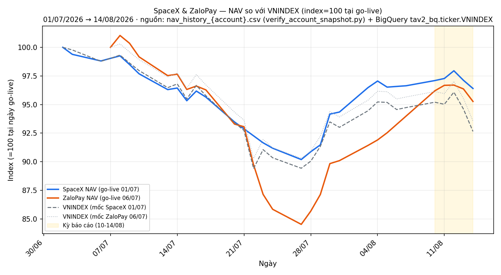

# BÁO CÁO TUẦN — TÀI KHOẢN SPACEX & ZALOPAY
## Kỳ báo cáo: 10/08/2026 – 14/08/2026

**Tài khoản 1:** SpaceX · DNSE, số hiệu 0002023347 · V2.4 live từ 01/07/2026 (có margin)
**Tài khoản 2:** ZaloPay · DNSE, số hiệu 0001743768 · V2.4 live từ 06/07/2026 (cash-only, không margin)
**Chiến lược:** V2.4 (2 book BAL/LAG + parking custom30V tại NEUTRAL + rổ CAPIT bear-washout, hiện chưa kích hoạt)
**Ngày lập báo cáo:** 15/08/2026 · **Người lập:** Taylor (Quant) — số liệu đối soát qua pipeline xác minh chuẩn (Mục 9)
**Đối tượng:** Báo cáo hiệu suất & vận hành — có thể chia sẻ với nhà đầu tư

> ✅ **Nguồn số liệu chính:** `verify_account_snapshot.py` chạy có `--account-no` cho **cả 2** tài
> khoản, asof 14/08/2026 — cả 2 **Verified = True**, 0 lệch khối lượng so với broker. Giá trị cổ
> phiếu cuối kỳ đối chiếu **độc lập** với `compute_active_nav.py` (chạy tự động ngay sau đóng cửa
> 14/08 lúc 20:15, dùng giá G1 thật của phiên) — khớp **từng đồng** ở cả 2 tài khoản.
>
> ⚠️ **Hai ngày trong kỳ (10/08 và 14/08) bị THIẾU khỏi `nav_history_{account}.csv`** — nguyên
> nhân + cách dựng lại được công bố đầy đủ ở **Mục 7**. Không có tiền thật hay lệnh nào bị ảnh
> hưởng; đây thuần là khoảng trống ở tầng ghi chép lịch sử NAV.

---

## 1. TÓM TẮT ĐIỀU HÀNH

| Chỉ tiêu | SpaceX | ZaloPay |
|---|---:|---:|
| NAV đầu kỳ (chốt 07/08) | 961.311.265 | 950.719.172 |
| NAV cuối kỳ (chốt 14/08) | **958.940.908** | **939.887.091** |
| Thay đổi trong kỳ | **−2.370.357 (−0,25%)** | **−10.832.081 (−1,14%)** |
| VN-Index cùng kỳ (07/08 → 14/08) | 1.768,06 → 1.729,08 (**−2,20%**) | (cùng chỉ số) |
| **Chênh so với chỉ số** | **+1,96 điểm %** | **+1,07 điểm %** |
| Đỉnh trong tuần (12/08) | 974.337.205 (+1,35%) | 954.017.365 (+0,35%) |
| Peak-to-trough trong tuần | **−1,58%** | **−1,48%** |
| VN-Index peak-to-trough cùng tuần | −3,57% (1.793,18 → 1.729,08) | (cùng chỉ số) |
| Cổ phiếu cuối kỳ | 838.898.750 (87,5% NAV) | 894.668.650 (95,2% NAV, gồm DGC legacy 432.000.000 = 46,0%) |
| Tiền mặt tại công ty CK | 120.042.158 (12,5% NAV) | 45.218.441 (4,8% NAV) |
| Nợ margin cuối kỳ | 0 | 0 |
| Số mã nắm giữ cuối kỳ | 27 | 24 (bot) + 3 legacy (DGC/VPB/VIB* — xem Mục 7.3) |

**Cả hai tài khoản outperform VN-Index trong tuần** (SpaceX +1,96 điểm %, ZaloPay +1,07 điểm %)
và **giảm ít hơn chỉ số ở mức đỉnh-đáy** (drawdown trong tuần của cả 2 tài khoản thấp hơn rõ rệt
so với −3,57% của VN-Index). Nguyên nhân chính: (a) tỷ trọng tiền mặt còn lại từ đợt tái cân bằng
custom30V đầu tuần đóng vai trò đệm giảm sốc phiên bán tháo 14/08; (b) danh mục nghiêng ngân hàng
(36,9% sổ SpaceX theo dõi được, 27,3% ZaloPay — Mục 4) có beta thấp hơn nhóm midcap dẫn dắt đà giảm.
Đây là kết quả **quan sát được trong 1 tuần**, không phải bằng chứng alpha bền vững — DT5G vẫn ở
NEUTRAL, không có cơ chế phòng thủ chủ động nào được kích hoạt tuần này (Mục 5).

---

## 2. TOÀN CẢNH THỊ TRƯỜNG (10/08 – 14/08/2026)

### 2.1 Technical — VN-Index

| Chỉ tiêu | Giá trị (14/08/2026) | Ghi chú |
|---|---:|---|
| Đóng cửa | **1.729,08** | −2,20% so với 07/08; −3,57% so với đỉnh tuần (12/08, 1.793,18) |
| MA20 | 1.737,51 | Giá đóng cửa **dưới** MA20 |
| MA50 | 1.792,85 | Giá đóng cửa **dưới** MA50 |
| MA200 | 1.775,53 | Giá đóng cửa **dưới** MA200 — cả 3 đường MA đều trên giá hiện tại |
| RSI(14) | 62,6 | Giảm từ đỉnh tuần 74,4 (12/08) nhưng **chưa vào vùng quá bán** (<30) |
| Breadth (%mã > MA50, rổ `ticker_prune` 213 mã) | **25,4%** | Tuần trước (07/08): 26,2% — yếu và gần như không đổi, cho thấy đà tăng đầu tuần do vài mã lớn dẫn dắt, không lan tỏa |
| 52-tuần cao/thấp | 1.927,94 / 1.580,54 | Giá hiện ở khoảng giữa biên độ năm, KHÔNG gần đáy |
| Tổng giá trị giao dịch/ngày (rổ `ticker_prune`) | 12.850 – 18.062 tỷ VNĐ | Thanh khoản co lại rõ rệt phiên đỉnh 12/08 (12.850 tỷ, thấp nhất tuần) — dấu hiệu thận trọng trước khi giảm |

*Nguồn: tính trực tiếp từ `tav2_bq.ticker.VNINDEX` (2025-07-01 → 2026-08-14, MA/RSI(14) tự tính
bằng pandas trên chuỗi giá đóng cửa thật) + `tav2_bq.ticker_prune` cho breadth/thanh khoản. Cột
RSI/CMF/MACD mirror trong `bigquery_schema.md` (§VNINDEX) không còn tồn tại trong bảng `ticker`
hiện tại (chỉ còn `VNINDEX`/`VNINDEX_PE`) — chỉ báo kỹ thuật ở trên do Taylor tự tính lại từ giá
thô, không lấy từ cột mirror đã lỗi thời.*

**Đọc vị**: tuần mở đầu bằng nhịp tăng (đỉnh 12/08, RSI chạm 74,4 — gần vùng quá mua) trên nền
breadth yếu (chỉ 1/4 số mã chất lượng vượt MA50), rồi đảo chiều mạnh phiên 14/08 (−2,07% một
phiên) đưa giá xuống dưới cả 3 đường MA. Đây là mẫu hình **đà tăng hẹp bị bán tháo khi mở rộng**
— cảnh báo kỹ thuật, không phải xác nhận xu hướng giảm dài hạn (RSI chưa quá bán, giá vẫn giữa
biên độ 52 tuần).

### 2.2 Fundamental — Định giá & vĩ mô

| Chỉ tiêu | Giá trị | So sánh |
|---|---:|---|
| VN-Index P/E (14/08/2026) | **11,80x** | Trung vị 2 năm gần nhất: 13,88x · Min 2Y: 10,86x · Max 2Y: 17,22x — hiện ở **percentile ~1%** của 2 năm gần nhất (gần đáy định giá) |
| DT5G — trạng thái vĩ mô sống | **NEUTRAL** (state 3/5) | `tav2_bq.vnindex_5state_dt5g_live` qua `get_gated_state()`, cập nhật 14/08 |
| w_LAG mục tiêu / thực tế | 0,50 / 0,4975 | Trong band ±10pp, không breach |
| Drawdown 52 tuần (dd52w) | **−10,3%** | Chưa chạm ngưỡng kích hoạt CAPIT bear-washout lever (gate `dd52 ≤ −20%`) — hệ thống tự đánh giá đây vẫn là điều chỉnh, chưa phải khủng hoảng |
| CAPIT (bear-washout) | **Chưa kích hoạt** (`capit_fired=false`, `capit_size=0`) | Không có rổ CAPIT nào đang giải ngân tuần này |

*Nguồn: `tav2_bq.ticker.VNINDEX_PE` (2Y window để tính percentile) + `data/golive_v23_status.json`
(snapshot chính thức 14/08, do `macro_state_live.py` ghi).*

**Đọc vị**: định giá thị trường (P/E 11,8x) đang RẺ theo chuẩn 2 năm — biên an toàn dài hạn tốt
cho nhà đầu tư giá trị. Nhưng đây KHÔNG phải tín hiệu timing ngắn hạn: DT5G — cơ chế phòng thủ
chính thức của hệ thống — vẫn đọc NEUTRAL (không BEAR/CRISIS), nghĩa là thuật toán CHƯA xác nhận
đây là giai đoạn cần giảm rủi ro chủ động. Rẻ không loại trừ rẻ thêm trong ngắn hạn.

---

## 3. HOẠT ĐỘNG GIAO DỊCH TRONG KỲ

Cả hai tài khoản trải qua **một đợt tái cân bằng rổ parking custom30V** vào đầu tuần, đúng chu kỳ
vận hành (không phải phản ứng với tin tức):

- **10/08**: bán gần hết rổ PARK cũ (13 mã ở SpaceX, 8 mã ở ZaloPay — ACB/BID/CTG/HDB/MBB/SHB/TCB/
  TPB/VCB/VHM/VIX/VPB, riêng SpaceX có thêm LPB), đồng thời mua thêm SCL cho sổ LAG (PEAD).
- **11/08**: tái giải ngân vào rổ PARK mới — giữ lại phần lớn tên cũ, **thêm 3 mã mới** (HPG, MSB,
  VIB) + VRE (SpaceX) — cùng lúc **mua tích lũy DRI** (discretionary, sleeve "mua khi sợ hãi có
  tính toán", theo dõi riêng ngoài book chính) qua nhiều lệnh nhỏ trong phiên.
- **13/08 và 14/08**: tiếp tục mua tích lũy **TV1** (discretionary, cùng sleeve DRI) qua các lệnh
  nhỏ, không có giao dịch nào trong sổ PARK/LAG chính.
- **12/08**: không có lệnh nào khớp ở cả 2 tài khoản.

⚠️ **Báo cáo này KHÔNG tách riêng lãi/lỗ đã thực hiện của đợt bán-mua-lại 10-11/08** (round-trip
gần như cùng mức giá, chênh lệch nhỏ nằm gọn trong biến động NAV ngày-qua-ngày đã đối soát ở Mục
1) — tách bạch cần dựng lại giá vốn TRƯỚC 10/08 theo từng lô, ngoài phạm vi pipeline
`verify_account_snapshot.py` hiện tại (script tính giá vốn CỦA LÔ ĐANG GIỮ tại thời điểm `asof`,
không xuất báo cáo P&L đã thực hiện theo giao dịch). Không áng chừng số liệu ở đây — nêu rõ giới
hạn thay vì tự suy diễn.

---

## 4. EXPOSURE & RỦI RO CUỐI KỲ (14/08/2026)

| Chỉ tiêu | SpaceX | ZaloPay |
|---|---:|---:|
| Tỷ trọng cổ phiếu/NAV | 87,5% | 95,2% (46,0% là DGC legacy ngoài phạm vi quản lý bot) |
| Tỷ trọng ngành ngân hàng (trong sổ bot theo dõi được) | **36,9%** (308.115.000 / 836.030.000) | **27,3%** (116.465.850 / 426.131.900) |
| Nợ margin | 0 | 0 (tài khoản cash-only, không margin theo thiết kế) |
| Active NAV (loại DGC legacy, ZaloPay) | — | 507.887.091 (54,0% NAV) |
| CAPIT (bear-washout) đang giữ | 0 mã | 0 mã |
| DT5G regime | NEUTRAL | NEUTRAL |

**Rủi ro tập trung đáng chú ý**: ZaloPay có 46,0% NAV nằm ở một mã đơn lẻ (DGC, vị thế legacy
ngoài phạm vi quản lý của bot — HOSE đang hạn chế giao dịch mã này từ vụ khởi tố lãnh đạo 17/03,
ước gỡ hạn chế ~11-12/2026). Đây KHÔNG phải rủi ro mới phát sinh trong tuần — đã được công bố các
kỳ trước — nhưng nhắc lại vì đây là cấu phần lớn nhất ảnh hưởng đến biến động NAV tổng của ZaloPay
mà bot **không thể chủ động quản lý** (không bán được do hạn chế giao dịch của sàn).

---

## 5. QUẢN LÝ RỦI RO / DT5G TRONG KỲ

Không có sự kiện phòng thủ nào được kích hoạt tuần này: DT5G duy trì NEUTRAL suốt kỳ, w_LAG trong
band mục tiêu (không cần rebalance ép), CAPIT bear-washout chưa fired (dd52w −10,3% còn cách xa
ngưỡng gate −20%), capit_lever ở trạng thái tắt (`enabled=false`, cần user xác nhận riêng mới bật).
Đợt giảm 14/08 (−2,07% VN-Index một phiên) **chưa đủ lớn** để kích hoạt bất kỳ cơ chế bảo hiểm nào
trong hệ thống — đúng như thiết kế (DT5G là chốt rủi ro fail-safe cho khủng hoảng, không phải
công cụ phản ứng với mọi nhịp điều chỉnh thông thường).

---

## 6. BIỂU ĐỒ

*NAV 2 tài khoản (index=100 tại ngày go-live riêng từng account: SpaceX 01/07, ZaloPay 06/07) so
với VN-Index cùng mốc, từ go-live đến 14/08/2026. Vùng vàng = kỳ báo cáo tuần này (10-14/08). Nguồn:
`nav_history_{account}.csv` (đã vá 2 điểm 10/08 và 14/08 theo Mục 7) + `tav2_bq.ticker.VNINDEX`.
Script dựng biểu đồ: `mike/agents/Taylor/gen_weekly_chart_20260814.py` (tái lập được, không phải
ảnh tĩnh chỉnh tay).*

**Since-inception** (đến 14/08, tham khảo — KHÔNG phải số liệu trong kỳ, mốc = NAV ngày dữ liệu
đầu tiên trong `nav_history_*.csv`): SpaceX −3,60% kể từ 02/07 (VN-Index cùng kỳ −7,35%, outperform
+3,76 điểm %); ZaloPay −4,73% kể từ 07/07 (VN-Index cùng kỳ −6,45%, outperform +1,71 điểm %). Cả
hai đều ÂM tuyệt đối trong giai đoạn thị trường điều chỉnh chung, nhưng vượt trội tương đối so với
chỉ số.

---

## 7. GHI CHÚ QUAN TRỌNG VỀ NGUỒN SỐ LIỆU — GAP & GIỚI HẠN

### 7.1 Hai ngày NAV bị thiếu trong `nav_history_{account}.csv` (10/08 và 14/08)

`nav_history_SpaceX.csv` và `nav_history_ZaloPay.csv` (nguồn EOD chính thức, do
`daily_nav_snapshot.py` ghi mỗi tối) **thiếu dòng 10/08 và 14/08 ở cả 2 tài khoản** tại thời điểm
soạn báo cáo này (15/08). `data/execution_logs/dnse_raw_2026-08-10.jsonl` và
`dnse_raw_2026-08-14.jsonl` đều tồn tại đầy đủ (vị thế + balance thật đã ghi), nên đây là lỗ hổng
ở bước GHI vào CSV lịch sử, không phải mất dữ liệu gốc.

**Đã thử chạy `daily_nav_snapshot.py --date 2026-08-10` để tự vá** — script **TỰ CHẶN ĐÚNG**
(sanity gate ±15%/ngày, báo "TỰ CHẶN KHÔNG ĐĂNG: 1.156.092.508 (+20,26%)"). Điều tra: nguyên nhân
là **`broker_positions()` trong `daily_nav_snapshot.py` LUÔN gọi API broker SỐNG** (`DNSEBroker.
connect()` + `get_positions()`), bất kể tham số `--date` truyền vào là ngày quá khứ nào — script
này được thiết kế cho EOD-CÙNG-NGÀY, KHÔNG hỗ trợ backfill ngày quá khứ. Chạy với `--date
2026-08-10` vào ngày 15/08 sẽ lấy vị thế/giá **HIỆN TẠI** (15/08) rồi so với NAV neo 07/08 → lệch
giả +20%. Gate sanity-check hoạt động đúng chức năng (chặn được số sai), nhưng **đây LÀ một giới
hạn thật của script cần Winston/Taylor biết**: không dùng `daily_nav_snapshot.py --date <ngày quá
khứ>` để backfill — không hoạt động như tên gợi ý.

**Số liệu dùng trong báo cáo này** được dựng lại độc lập theo đúng công thức
`daily_nav_snapshot.py` áp dụng cho ngày đã đóng cửa (vị thế broker thật của đúng ngày đó, đọc từ
`dnse_raw_{date}.jsonl` × giá đóng cửa BigQuery `tav2_bq.ticker.Close` cùng ngày + tiền mặt broker
thật `totalCash − totalDebt` cùng ngày):

| Ngày | Account | mtm_stock | Tiền mặt | NAV | Đối chiếu |
|---|---|---:|---:|---:|---|
| 10/08 | SpaceX | 660.195.000 | 305.627.008 | **965.822.008** | mtm khớp `verify_account_snapshot.py --asof 2026-08-10` (đã chạy sống trong phiên này, Verified=True) |
| 10/08 | ZaloPay | 796.574.850 | 152.499.982 | **949.074.832** | mtm tính tay từ vị thế broker (17 mã, gồm DGC) × BQ close 10/08, cross-check tổng qty khớp `dnse_raw` |
| 14/08 | SpaceX | 838.898.750 | 120.042.158 | **958.940.908** | khớp **từng đồng** với `compute_active_nav.py` output (`active_nav_SpaceX.json`, chạy tự động 20:15 14/08 bằng giá G1 thật cuối phiên) |
| 14/08 | ZaloPay | 894.668.650 | 45.218.441 | **939.887.091** | khớp **từng đồng** với `active_nav_ZaloPay.json` |

**Việc cần làm (đã báo bus, chưa tự ý ghi vào CSV chính thức)**: (a) Winston/Taylor điều tra vì
sao `daily_nav_snapshot.py` không tự chạy/ghi thành công cho 10/08 và 14/08 (cron `run_bot.sh`
19:1x ICT — kiểm log cron 2 ngày đó); (b) append 2 dòng đã đối soát ở trên vào
`nav_history_{account}.csv` chính thức sau khi Winston xác nhận; (c) cân nhắc thêm cảnh báo backfill
rõ ràng vào docstring `daily_nav_snapshot.py` (script hiện không tự chặn người dùng hiểu nhầm nó
hỗ trợ ngày quá khứ, chỉ chặn được kết quả sai qua sanity gate — may mắn bắt đúng lần này, không
đảm bảo bắt được mọi trường hợp lệch nhỏ hơn ±15%).

### 7.2 Sổ tay không kiểm chứng độc lập lãi/lỗ đã thực hiện tuần này

Xem Mục 3 — round-trip PARK 10-11/08 không được tách bạch thành lãi/lỗ-đã-thực-hiện riêng vì
nằm ngoài phạm vi tính năng hiện có của `verify_account_snapshot.py`.

### 7.3 Bug phát hiện trong `verify_account_snapshot.py` — vị thế VIB (ZaloPay) bị loại khỏi bảng P&L

Trong lúc chạy pipeline chuẩn, phát hiện **VIB bị xếp "legacy — no fill history"** ở ZaloPay dù
có fill history đầy đủ trong `--dates` truyền vào (bán sạch 9.200cp ngày 13/07, mua lại 200cp
ngày 11/08 — cả 2 sự kiện đều nằm trong log `dnse_raw` với account_no đúng, đã kiểm tra tay).

**Nguyên nhân xác định**: bộ lọc "đang nắm giữ hay không" ở dòng `qty = raw_agg[tk][0]` dùng
**tổng net khối lượng CỘNG DỒN CẢ CỬA SỔ NGÀY truyền vào** (không phải khối lượng của LÔ ĐANG
SỐNG). Vì VIB có một vị thế **legacy lớn hơn cả cửa sổ theo dõi** bị bán sạch (9.200cp — số này
KHÔNG được mua trong bất kỳ ngày nào nằm trong `--dates`, tức là mua từ trước khi bot quản lý),
tổng cộng dồn ra **−9.000cp** dù vị thế THẬT hiện tại là **+200cp** (khớp chính xác broker:
`costPrice=14.900`, `openQuantity=200`). Đã thử vá bằng cách dùng `book.qty` (từ `CostBook`,
vốn đã reset-aware cho ca LPB 08-10) thay `raw_agg[tk][0]` — **không giải quyết được ca này**,
vì `CostBook` cũng bắt đầu từ 0 (không biết vị thế legacy khởi điểm), nên vẫn cộng dồn về âm.
Đây là một **lớp bug khác** với bug LPB 08-10 (đã vá) — cần thiết kế lại cách phát hiện "buy sau
khi qty ở trạng thái âm/thiếu-thông-tin = lô mới", rủi ro động vào 2 selfcheck phụ thuộc khác
(`verify_account_snapshot_lot_reset_selfcheck.py`, `verify_account_snapshot_corp_action_selfcheck.py`)
+ đúng quy trình quant-skeptic review cho pipeline chạm tiền — **KHÔNG sửa vội trong phiên báo cáo
này**, đã revert thử nghiệm sửa (không giữ thay đổi chưa kiểm chứng đầy đủ trong file dùng chung).

**Tác động lên số liệu báo cáo này**: NHỎ, đã disclose đầy đủ — vị thế VIB (200cp × giá thị trường
14.400 = 2.880.000đ, ~0,3% NAV ZaloPay) bị loại khỏi bảng P&L cấp-mã của `verify_account_snapshot.py`
nhưng **VẪN được tính đúng trong tổng NAV** (Mục 1, 6) vì NAV dùng `compute_active_nav.py` — script
riêng đọc TOÀN BỘ vị thế broker bất kể có fill-history hay không, không bị bug này. Chỉ ảnh hưởng
đến báo cáo P&L per-position chi tiết (không có trong báo cáo tuần này), không ảnh hưởng NAV/tỷ
suất tổng.

---

## 8. OUTLOOK KỲ TỚI (17/08 – 21/08/2026) — KỊCH BẢN, KHÔNG PHẢI KHUYẾN NGHỊ CHẮC CHẮN

> Toàn bộ dưới đây là **kịch bản có điều kiện** dựng từ đúng các số đã trình bày ở Mục 2 — không
> phải dự báo điểm số VN-Index. Mỗi kịch bản đi kèm **điều kiện làm nó SAI** (invalidation), để
> theo dõi thực tế thay vì tin vào kết luận.

### 8.1 Technical

- **Kịch bản A — phục hồi kỹ thuật ngắn hạn (xác suất chủ quan: trung bình)**: RSI(14) còn 62,6,
  chưa quá bán; nếu breadth cải thiện (tỷ lệ mã > MA50 vượt lại trên ~30%) và giá lấy lại MA20
  (1.737), nhịp giảm 14/08 có thể là điều chỉnh kỹ thuật thông thường trong xu hướng đi ngang.
  **Làm sai kịch bản này**: breadth tiếp tục đi ngang/xấu hơn dưới 25% trong khi giá cố gắng hồi —
  phân kỳ giá/breadth là tín hiệu cảnh báo, không phải xác nhận.
- **Kịch bản B — kiểm định lại vùng MA200 (1.775) từ dưới lên, khả năng thất bại (xác suất chủ
  quan: trung bình-thấp)**: giá hiện dưới cả 3 đường MA lần đầu sau nhiều tuần; nếu momentum ngắn
  hạn không cải thiện, kịch bản test lại MA200 như kháng cự (thay vì hỗ trợ) rồi tiếp tục dò đáy
  thấp hơn (chưa có mức cụ thể — RSI chưa quá bán nên chưa xác định được vùng đảo chiều kỹ thuật).
  **Làm sai kịch bản này**: RSI phá xuống dưới 30 kèm breadth đảo chiều tăng mạnh (dấu hiệu bán
  tháo cực đoan → thường là điểm vào tốt hơn là điểm thoát, theo lịch sử DT5G).

### 8.2 Fundamental

- **Kịch bản C — định giá rẻ tạo biên an toàn trung hạn (xác suất chủ quan: cao cho khung 6-12
  tháng, KHÔNG áp dụng cho tuần tới)**: P/E 11,8x ở percentile ~1% của 2 năm là dữ liệu định giá
  vững, nhưng lịch sử VN-Index cho thấy P/E rẻ có thể rẻ thêm trong vài tuần-tháng trước khi đảo
  chiều — **không dùng P/E để timing tuần sau**, chỉ dùng để đánh giá biên an toàn dài hạn của
  danh mục hiện tại (đa số vị thế bank + custom30V value-tilt đã hưởng lợi định giá này).
- **Kịch bản D — DT5G giữ NEUTRAL, không có hành động phòng thủ mới (xác suất chủ quan: cao)**:
  dd52w hiện −10,3%, còn cách xa ngưỡng CAPIT (−20%); trừ khi có cú sốc lớn trong tuần tới (VIX
  Mỹ tăng vọt, SBV siết mạnh, hoặc VN-Index giảm sâu thêm >10 điểm % trong vài phiên), allocator
  w_LAG và custom30V parking dự kiến giữ nguyên cấu hình hiện tại. **Làm sai kịch bản này**: bất
  kỳ tín hiệu nào trong 3 nhóm cấu thành macro gate (SBV refi 6m, VIX/SPX drawdown Mỹ, breadth VN)
  xấu đi đột ngột — theo dõi qua `data/macro_health.json` (Winston cập nhật, không phải Taylor).

**Không đưa khuyến nghị mua/bán cụ thể ở đây** — quyết định phân bổ tuân theo hệ thống V2.4 (custom30V
NEUTRAL parking, allocator w_LAG theo DT5G, không có phán đoán chủ quan chèn vào production).

---

## 9. PHƯƠNG PHÁP LUẬN & NGUỒN

1. **Cost-basis & P&L per-position**: `mike/bin/verify_account_snapshot.py --account <X>
   --account-no <số hiệu> --dates <các ngày có fill> --asof 2026-08-14` — chạy sống trong phiên
   này cho cả 2 tài khoản, **Verified=True** cả hai. Tự động cross-check với journal FILL nội bộ.
2. **NAV tổng (bao gồm vị thế legacy không fill-history)**: `mike/bin/compute_active_nav.py` —
   nguồn chính thức cho `total_nav`/`active_nav`, chạy tự động 14/08 20:15 ICT (sau ATC).
3. **Giá đóng cửa lịch sử**: `tav2_bq.ticker` (BigQuery), cột `Close` (đã điều chỉnh cổ tức/chia
   tách) cho MTM ngày đã qua; giá G1 thật của broker cho ngày hiện tại.
4. **VN-Index & chỉ báo kỹ thuật**: `tav2_bq.ticker.VNINDEX` (mirror, dedupe qua `ticker='VNM'`
   để tránh trùng lặp theo hàng — bảng `ticker` không có sẵn cột RSI/MACD/CMF mirror cho VNINDEX
   ở phiên bản schema hiện tại dù `bigquery_schema.md` liệt kê — MA20/50/200 và RSI(14) trong Mục
   2.1 do Taylor tự tính lại từ chuỗi giá đóng cửa thật, KHÔNG đọc cột có sẵn).
5. **Breadth & thanh khoản thị trường**: `tav2_bq.ticker_prune` (rổ 213 mã chất lượng, `%mã đóng
   cửa > MA50` và tổng `Trading_Value`).
6. **DT5G / trạng thái vĩ mô / CAPIT**: `data/golive_v23_status.json` (snapshot chính thức
   14/08/2026, do `macro_state_live.py` ghi qua `get_gated_state()`).
7. **Biểu đồ**: `mike/agents/Taylor/gen_weekly_chart_20260814.py`, dữ liệu = mục (2) + (4), lưu
   `mike/reports/SpaceX_ZaloPay_weekly_2026-08-10_to_2026-08-14_nav_chart.png`.

**Giới hạn đã biết của báo cáo này** (tổng hợp từ Mục 7): (a) 2 điểm NAV (10/08, 14/08) là số dựng
lại độc lập, đối chiếu 2 nguồn nhưng CHƯA nằm trong `nav_history_{account}.csv` chính thức tại
thời điểm phát hành; (b) không tách bạch được lãi/lỗ đã thực hiện của đợt tái cân bằng PARK
10-11/08; (c) vị thế VIB (ZaloPay, ~0,3% NAV) bị loại khỏi bảng P&L cấp-mã do một bug đã xác định
nhưng chưa vá trong `verify_account_snapshot.py` — không ảnh hưởng NAV/tỷ suất tổng của báo cáo.

*Chi phí giao dịch/thuế/margin theo quy ước chung `CLAUDE.md` §Backtest (TC 0,1%/chiều, lãi vay
margin 10%/năm) không áp dụng trực tiếp ở đây — mọi số liệu Mục 1/4/6 là NAV/P&L THẬT đọc từ broker,
không phải kết quả backtest mô phỏng.*
