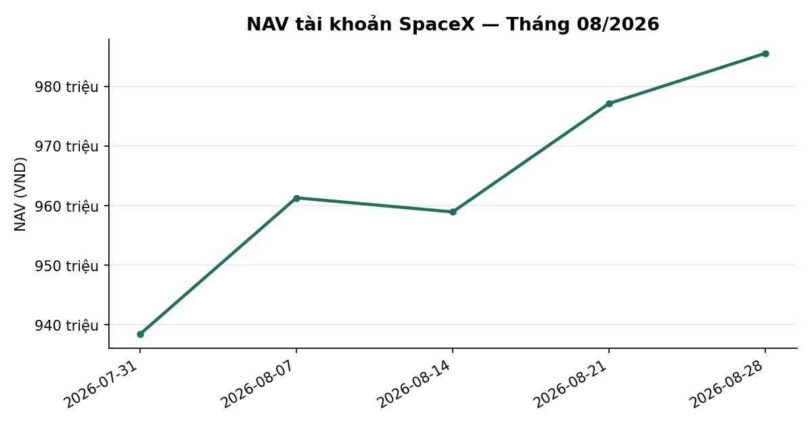
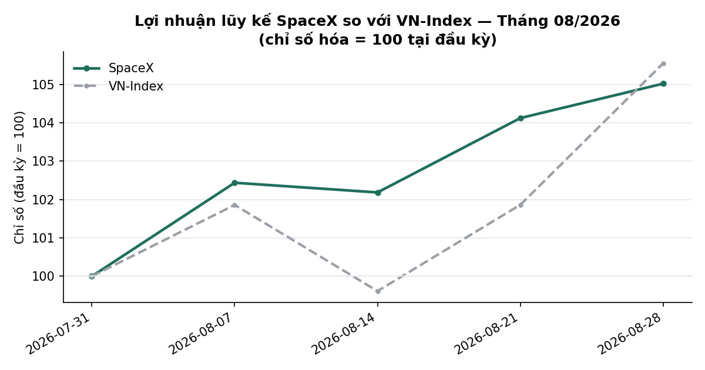
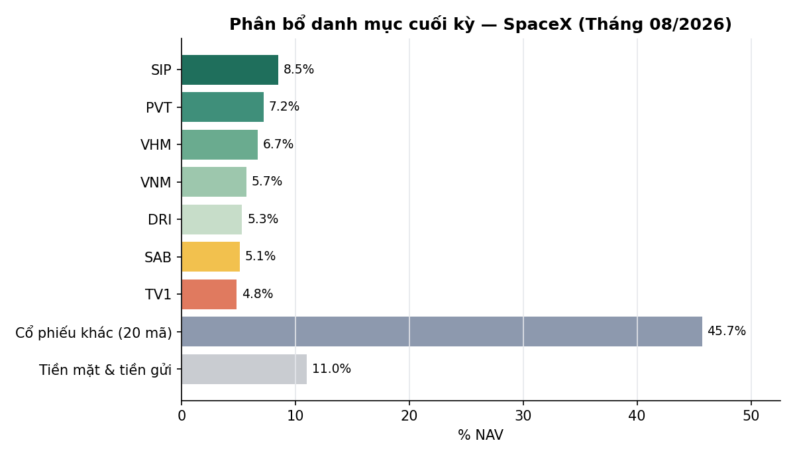

# BÁO CÁO THÁNG — TÀI KHOẢN SPACEX
## Kỳ báo cáo: Tháng 08/2026 (01/08 – 31/08/2026, phiên giao dịch cuối cùng: 28/08/2026)

**Tài khoản:** SpaceX · DNSE, số hiệu 0002023347 · Chiến lược V2.4 (có sử dụng đòn bẩy ký quỹ)
**Ngày lập báo cáo:** 02/09/2026
**Đối tượng:** Báo cáo hiệu suất & quản lý danh mục — dành cho nhà đầu tư

---

## 1. TÓM TẮT ĐIỀU HÀNH

Phiên giao dịch cuối cùng của tháng 8/2026 là Thứ Sáu 28/08/2026 (HOSE nghỉ lễ Quốc khánh từ
31/08 đến 02/09/2026, liền với cuối tuần).

| Chỉ tiêu | SpaceX |
|---|---:|
| Giá trị tài sản ròng (NAV) đầu kỳ (31/07/2026) | 938.435.711đ |
| NAV cuối kỳ (28/08/2026) | 985.617.905đ |
| Lãi/lỗ trong kỳ | **+47.182.194đ** |
| Tỷ suất sinh lời trong tháng (MTD) | **+5,03%** |
| VN-Index cùng kỳ (1.735,78 → 1.832,12) | +5,55% |
| Chênh lệch so với chỉ số | −0,52 điểm phần trăm |
| Biến động năm hoá (annualized) | 12,37% |
| Sụt giảm tối đa trong tháng (Max Drawdown) | −1,67% |
| Số lệnh khớp trong tháng | 80 |
| Tổng chi phí giao dịch ước tính | ~767.500đ |

**Phương pháp tính:** lãi/lỗ và tỷ suất MTD được tính trực tiếp từ chênh lệch NAV đầu kỳ và cuối
kỳ, dựa trên định giá theo thị trường (mark-to-market) hàng ngày, đối chiếu trực tiếp với dữ liệu
tài khoản tại công ty chứng khoán lưu ký.

---

## 2. HIỆU SUẤT MTD / QTD / YTD SO VỚI CHỈ SỐ

### 2.1 Diễn biến trong tháng theo tuần

| Tuần | NAV SpaceX | VN-Index |
|---|---:|---:|
| Đầu kỳ (31/07) | 938.435.711 | 1.735,78 |
| Tuần 1 (→07/08) | 961.311.265 (+2,44%) | 1.768,06 (+1,86%) |
| Tuần 2 (→14/08) | 958.940.908 (+2,19%) | 1.729,08 (−0,39%) |
| Tuần 3 (→21/08) | 977.129.844 (+4,13%) | 1.768,12 (+1,86%) |
| Tuần 4 (→28/08) | 985.547.490 (+5,02%) | 1.832,12 (+5,55%) |

*(Tỷ lệ % trong ngoặc là mức tích lũy tính từ đầu tháng.)*

### 2.2 Lũy kế theo quý (QTD, Quý 3/2026 từ 01/07)

Quý 3/2026 chưa kết thúc (còn tháng 9). Tính lũy kế 2 tháng đã qua trên vốn khởi điểm quy ước
1.000.000.000đ: NAV 28/08 = 985.547.490đ ⇒ **QTD = −1,45%** (tháng 7: −6,16%, tháng 8: +5,03% —
chưa bù hết mức điều chỉnh của tháng 7).

### 2.3 Lũy kế từ đầu năm hoạt động (YTD)

Trùng với số liệu QTD ở trên do tài khoản bắt đầu hoạt động trong Quý 3/2026, chưa có lịch sử giao
dịch trước quý này.

**Nhận định:** danh mục đang trong giai đoạn phục hồi sau mức điều chỉnh của tháng 7; tháng 8 là
tháng có lợi nhuận dương đầu tiên. Danh mục có tỷ trọng lớn hơn ở nhóm ngân hàng (NCT/BID/CTG) —
nhóm chịu áp lực điều chỉnh nhẹ trong giai đoạn cuối tháng, khiến hiệu suất kém hơn chỉ số một
biên độ nhỏ (−0,52 điểm phần trăm).

Tỷ suất per-position trong báo cáo này đã được điều chỉnh cộng cổ tức tiền mặt ròng theo chuẩn nội
bộ — xem Mục 3.

---

## 3. PHÂN RÃ NGUỒN LỢI NHUẬN (ATTRIBUTION)

### 3.1 Phân rã theo cấu phần kế toán

| Cấu phần | VND |
|---|---:|
| Lãi/lỗ chưa hiện thực hóa (vị thế cuối kỳ, đã cộng cổ tức ròng sau thuế) | +17.858.362đ |
| Lãi/lỗ đã hiện thực hóa trong kỳ (từ các giao dịch mua/bán trong tháng) + phí | ≈ +29.323.832đ |
| **Tổng (= Lãi/lỗ NAV trong kỳ)** | **+47.182.194đ** |

### 3.2 Phân rã theo nhóm ngành (đã cộng cổ tức ròng sau thuế 5%)

| Nhóm ngành | Mã tiêu biểu | Lãi/lỗ (VND) | % tỷ trọng chi phí gốc |
|---|---|---:|---:|
| Dầu khí / Vật liệu | PVT, SCL, SIP, HPG, VND | +20.450.000đ | 23,9% |
| Ngân hàng | MBB, ACB, SHB, TCB, VCB, LPB, CTG, BID, TPB, VPB, HDB | −7.448.637đ | 36,3% |
| Bất động sản / Xây dựng | VHM, VRE, NCT | −3.125.000đ | 14,1% |
| Tiêu dùng / Chứng khoán / Khác | DRI, VNM, SAB, TV1, VIB, EVF, MSB, VIX | +7.982.000đ | 25,7% |

### 3.3 Vị thế đóng góp tốt nhất & kém nhất trong kỳ (đã cộng cổ tức, dividend-adjusted)

**Đóng góp tích cực nhất:**
| Mã | Khối lượng | Tỷ suất | Lãi (VND) |
|---|---:|---:|---:|
| PVT | 3.500 | +18,13% | +10.850.000đ |
| SCL | 1.500 | +16,95% | +6.000.000đ |
| SIP | 1.700 | +5,08% | +4.065.000đ |
| VNM | 900 | +6,31% | +3.330.000đ |
| DRI | 3.700 | +6,32% | +3.100.000đ |

**Đóng góp tiêu cực nhất:**
| Mã | Khối lượng | Tỷ suất | Lỗ (VND) |
|---|---:|---:|---:|
| TPB | 500 | −12,80% | −1.075.000đ |
| VIX | 420 | −8,82% | −573.000đ |
| BID | 1.175 | −6,88% | −3.197.554đ |
| VND | 300 | −6,46% | −345.000đ |
| CTG | 1.200 | −5,48% (đã cộng cổ tức 450đ/cp) | −2.253.786đ |

---

## 4. CHỈ SỐ RỦI RO

| Chỉ số | SpaceX | VN-Index |
|---|---:|---:|
| Độ lệch chuẩn lợi suất ngày | 0,779% | 0,997% |
| Biến động năm hoá | 12,37% | 15,83% |
| Sụt giảm tối đa trong tháng | −1,67% | −3,71% |
| Tỷ trọng cổ phiếu cuối tháng / NAV | 89,0% | — |

Danh mục hiện không có mã nào vượt 10% NAV riêng lẻ (mã lớn nhất SIP ~8,5%). Biến động năm hoá của
danh mục thấp hơn VN-Index, phù hợp với hiệu ứng đa dạng hoá của một danh mục nhiều mã so với một
chỉ số tham chiếu.

---

## 5. DIỄN BIẾN VĨ MÔ THÁNG 8/2026 VÀ ĐÁNH GIÁ RỦI RO

> Dữ liệu: Tổng cục Thống kê, Ngân hàng Nhà nước, Cục Dự trữ Liên bang Mỹ (Fed), Tổng cục Thống kê
> Trung Quốc (NBS), Cơ quan Thông tin Năng lượng Mỹ (EIA) · Chốt ngày: 25/08/2026

> **Lưu ý:** Chỉ số giá tiêu dùng (CPI) tháng 8/2026 chưa được Tổng cục Thống kê công bố (lịch
> công bố: 06/09/2026). Số liệu CPI dưới đây là của tháng 7/2026 hoặc lũy kế 7 tháng đầu năm.

### 5.1 Kinh tế trong nước

**Tăng trưởng GDP:** Kinh tế Việt Nam tiếp tục đà tăng trưởng mạnh. GDP Quý 2/2026 đạt **+8,39%**
so với cùng kỳ (Quý 1: +7,94%), nâng lũy kế nửa đầu năm 2026 lên **+8,18%** — thuộc nhóm cao nhất
khu vực ASEAN. Chính phủ đặt mục tiêu tăng trưởng cả năm 2026 ở mức 8% hoặc cao hơn.

**Lạm phát — CPI tháng 7/2026:**
- So với tháng trước: −0,12%
- So với cùng kỳ năm trước: **+4,45%** (tháng 6: +4,69%)
- Lũy kế 7 tháng: **+4,39%** · Lạm phát cơ bản: +4,19%

CPI đang tiệm cận nhưng chưa vượt trần mục tiêu của Quốc hội (khoảng 4,5%). Dự báo bình quân cả
năm 2026 theo khảo sát Bloomberg ở mức 4,8%.

**Sản xuất công nghiệp:** Chỉ số sản xuất công nghiệp (IIP) tháng 7 tăng +14,5% so với cùng kỳ;
lũy kế 7 tháng tăng +11,4% — mức cao trong nhiều năm trở lại đây.

**Bán lẻ:** Tổng mức bán lẻ hàng hóa và doanh thu dịch vụ tiêu dùng tháng 7 đạt 669,1 nghìn tỷ
đồng, tăng +14,5% so với cùng kỳ. Cầu tiêu dùng nội địa duy trì mạnh.

**Xuất nhập khẩu:**

| Chỉ tiêu | Tháng 7/2026 | Lũy kế 7 tháng |
|---|---|---|
| Xuất khẩu | 53,08 tỷ USD (+25,0%) | 319,53 tỷ USD (+21,7%) |
| Nhập khẩu | 56,67 tỷ USD (+41,4%) | 340,05 tỷ USD (+34,8%) |
| Cán cân thương mại | −3,59 tỷ USD | **−20,52 tỷ USD** |

Nhập khẩu tăng mạnh chủ yếu do máy móc thiết bị phục vụ đầu tư FDI và hạ tầng, phản ánh chu kỳ mở
rộng đầu tư hơn là mất cân đối tiêu dùng.

### 5.2 Chính sách tiền tệ

Lãi suất tái cấp vốn của Ngân hàng Nhà nước giữ nguyên ở mức 4,5% (từ tháng 8/2023). Tăng trưởng
tín dụng đến 31/7 đạt +8,98% so với đầu năm, bám sát mục tiêu cả năm khoảng 15%. Tỷ giá VND/USD ổn
định trong biên độ 26.013–26.345. Tỷ lệ nợ xấu toàn hệ thống ngân hàng ở mức 2,01% cuối Quý 2, vẫn
trong tầm kiểm soát.

### 5.3 Bối cảnh quốc tế

Fed giữ nguyên lãi suất điều hành ở mức 3,50–3,75% tại cuộc họp tháng 7, chưa có định hướng rõ cho
tháng 9. Chỉ số PMI sản xuất của Trung Quốc ở mức 49,2 — tháng thứ 5 liên tiếp dưới ngưỡng 50, cho
thấy hoạt động sản xuất suy yếu. Giá dầu Brent biến động mạnh trong 2 tháng qua (dao động 69–105
USD/thùng), hiện ở mức khoảng 85 USD/thùng — phản ánh rủi ro địa chính trị tăng cao.

### 5.4 Đánh giá rủi ro

**Kết luận: Không ghi nhận tín hiệu khủng hoảng.**

| Chỉ báo | Ngưỡng cảnh báo | Mức hiện tại | Đánh giá |
|---|---|---|---|
| CPI (so cùng kỳ) | ≥6% | 4,45% | Trong ngưỡng an toàn |
| Tăng trưởng tín dụng | ≥30%/năm | ~15%/năm | Bình thường |
| Tỷ lệ nợ xấu ngân hàng | ≥5% | 2,01% | Bình thường |
| Cán cân vãng lai | Xu hướng xấu kéo dài | Đang xấu đi (do FDI) | Cần theo dõi |

Các chỉ báo kinh tế vĩ mô cốt lõi trong nước đều trong ngưỡng an toàn. Môi trường vĩ mô hiện tại
thuộc pha tăng trưởng lành mạnh, với rủi ro chủ yếu đến từ các yếu tố bên ngoài (chính sách lãi
suất của Fed, đà giảm tốc của Trung Quốc, biến động giá dầu).

**Các yếu tố cần tiếp tục theo dõi:**
1. CPI đang tiệm cận trần mục tiêu 4,5%; dự báo có thể tăng lên 4,8% vào cuối năm.
2. Thâm hụt thương mại mở rộng đáng kể trong 7 tháng đầu năm — cần theo dõi diễn biến dự trữ ngoại
   hối nếu xu hướng này kéo dài.
3. Hoạt động sản xuất của Trung Quốc suy yếu 5 tháng liên tiếp — có thể ảnh hưởng chuỗi cung ứng
   và nhu cầu nhập khẩu hàng hóa Việt Nam.
4. Cuộc họp Fed tháng 9 chưa có định hướng chính sách rõ ràng — rủi ro biến động tỷ giá nếu Fed
   tăng lãi suất.

---

## 6. CHI PHÍ HOẠT ĐỘNG

| Khoản mục | Giá trị (VND) |
|---|---:|
| Giá trị mua trong tháng | 231.965.000đ |
| Giá trị bán trong tháng | 339.160.000đ |
| Tổng giá trị giao dịch | 571.125.000đ |
| Phí giao dịch (0,075%/lượt, cả hai chiều) | ~428.344đ |
| Thuế chuyển nhượng chứng khoán (0,1% giá trị bán) | ~339.160đ |
| **Tổng chi phí giao dịch** | **~767.504đ** |
| Lãi vay ký quỹ phát sinh trong tháng | 8.284đ |
| Phí quản lý / phí hiệu suất | 0 |

Tổng chi phí giao dịch tương đương khoảng 0,08% NAV bình quân trong tháng — không đáng kể so với
biến động giá trị danh mục. Chi phí lãi vay ký quỹ phát sinh trong tháng ở mức rất thấp do phần
lớn thời gian trong tháng danh mục không sử dụng đòn bẩy đáng kể.

---

## 7. DANH MỤC CUỐI THÁNG (31/08/2026)

| Mã | Khối lượng | Giá vốn | Giá thị trường | Giá trị thị trường | % NAV |
|---|---:|---:|---:|---:|---:|
| PVT | 3.500 | 17.100 | 20.200 | 70.700.000 | 7,2% |
| MBB | 1.675 | 20.657 | 21.050 | 35.258.750 | 3,6% |
| SIP | 1.700 | 47.059 | 49.450 | 84.065.000 | 8,5% |
| VHM | 900 | 74.900 | 73.000 | 65.700.000 | 6,7% |
| BID | 1.175 | 39.571 | 36.850 | 43.298.750 | 4,4% |
| VNM | 900 | 58.600 | 62.300 | 56.070.000 | 5,7% |
| DRI | 3.700 | 13.262 | 14.100 | 52.170.000 | 5,3% |
| SAB | 1.100 | 44.368 | 45.600 | 50.160.000 | 5,1% |
| CTG | 1.200 | 33.806 | 31.950 | 38.340.000 | 3,9% |
| VCB | 700 | 61.464 | 60.100 | 42.070.000 | 4,3% |
| TV1 | 2.300 | 20.148 | 20.600 | 47.380.000 | 4,8% |
| NCT | 500 | 86.360 | 83.600 | 41.800.000 | 4,2% |
| VPB | 1.200 | 27.746 | 27.800 | 33.360.000 | 3,4% |
| TCB | 1.000 | 33.900 | 33.400 | 33.400.000 | 3,4% |
| SCL | 1.500 | 23.600 | 27.600 | 41.400.000 | 4,2% |
| ACB | 900 | 22.656 | 22.650 | 20.385.000 | 2,1% |
| HDB | 800 | 26.709 | 27.800 | 22.240.000 | 2,3% |
| HPG | 1.200 | 22.200 | 22.100 | 26.520.000 | 2,7% |
| VRE | 300 | 25.550 | 26.100 | 7.830.000 | 0,8% |
| SHB | 800 | 12.281 | 12.200 | 9.760.000 | 1,0% |
| LPB | 400 | 52.183 | 49.950 | 19.980.000 | 2,0% |
| TPB | 500 | 16.800 | 14.650 | 7.325.000 | 0,7% |
| MSB | 600 | 13.542 | 13.350 | 8.010.000 | 0,8% |
| VIX | 420 | 15.464 | 14.100 | 5.922.000 | 0,6% |
| VIB | 500 | 14.900 | 14.950 | 7.475.000 | 0,8% |
| VND | 300 | 17.800 | 16.650 | 4.995.000 | 0,5% |
| EVF | 100 | 12.550 | 12.400 | 1.240.000 | 0,1% |
| **Tổng giá trị cổ phiếu** | | | | **876.854.500** | **89,0%** |
| Tiền mặt | | | | 8.195.610 | 0,8% |
| Nợ ký quỹ | | | | −7.763 | 0,0% |
| Tài sản tích lũy khác | | | | 100.505.558 | 10,2% |
| **Tổng giá trị tài sản ròng (NAV)** | | | | **985.617.905** | **100%** |

**Mức độ tập trung:** danh mục hiện đa dạng hoá tốt, không mã nào vượt 10% NAV (mã lớn nhất SIP
8,5%). Tỷ trọng nhóm ngân hàng ở mức 36,3% tính theo chi phí gốc, phản ánh đặc thù cấu trúc thị
trường chứng khoán Việt Nam (nhóm ngân hàng chiếm tỷ trọng lớn trong VN-Index), không phải một
quyết định phân bổ có chủ đích lệch ngành.

---

## 8. TRIỂN VỌNG THÁNG 9/2026

Bối cảnh vĩ mô trong nước tiếp tục thuận lợi cho hoạt động đầu tư (GDP tăng trưởng mạnh, lạm phát
trong tầm kiểm soát, tăng trưởng tín dụng bám sát mục tiêu). Rủi ro chính trong ngắn hạn đến từ
các yếu tố bên ngoài:

1. Số liệu CPI tháng 8 (công bố dự kiến 06/09/2026) — nếu vượt đáng kể so với mức 4,45% của tháng
   7, có thể làm thay đổi đánh giá rủi ro vĩ mô.
2. Cuộc họp Fed tháng 9 chưa có định hướng chính sách rõ ràng — rủi ro biến động tỷ giá nếu Fed
   tăng lãi suất.
3. Đà suy yếu sản xuất tại Trung Quốc kéo dài — có thể ảnh hưởng đến chuỗi cung ứng và một số
   ngành xuất khẩu.

Chiến lược tiếp tục vận hành theo khung quản trị rủi ro hiện hành, điều chỉnh tỷ trọng theo diễn
biến giá và các chỉ báo định lượng đã được kiểm chứng qua backtest.

---

## 9. PHỤ LỤC — PHƯƠNG PHÁP LUẬN

**Định giá:** Giá trị tài sản ròng (NAV) được tính theo phương pháp mark-to-market (định giá theo
giá đóng cửa thị trường) tại cuối mỗi phiên giao dịch, đối chiếu trực tiếp với dữ liệu tài khoản
tại công ty chứng khoán lưu ký.

**Cổ tức:** Tỷ suất sinh lời của từng vị thế (per-position) được điều chỉnh cộng cổ tức tiền mặt
đã nhận trong kỳ nắm giữ, tính trên cơ sở ròng sau thuế thu nhập cá nhân 5%.

**Chi phí:** Phí giao dịch 0,075% mỗi lượt (mua và bán); thuế chuyển nhượng chứng khoán 0,1% trên
giá trị bán; lãi vay ký quỹ tính theo lãi suất thực tế phát sinh trên tài khoản.

**Số liệu cùng ngày** (định giá lệnh, sức mua khả dụng) được lấy trực tiếp từ hệ thống giao dịch
của công ty chứng khoán; số liệu lịch sử được đối chiếu qua cơ sở dữ liệu thị trường.

**Chưa công bố các chỉ số Sharpe/Sortino/Calmar** do lịch sử hoạt động của tài khoản hiện dưới 6
tháng dữ liệu NAV theo ngày — dự kiến bắt đầu công bố từ 01/2027 khi có đủ độ dài dữ liệu để các
chỉ số này có ý nghĩa thống kê.

**Công bố tuân thủ:**
- Đây không phải là khuyến nghị đầu tư. Kết quả hoạt động trong quá khứ không đảm bảo cho kết quả
  trong tương lai.
- Mọi số liệu trong báo cáo này được đối chiếu trực tiếp với dữ liệu giao dịch tại công ty chứng
  khoán lưu ký tài khoản.

---

*Báo cáo tháng 08/2026 — Tổng hợp và đối soát bởi Đội ngũ Quản lý Danh mục & Nghiên cứu Định lượng.*
