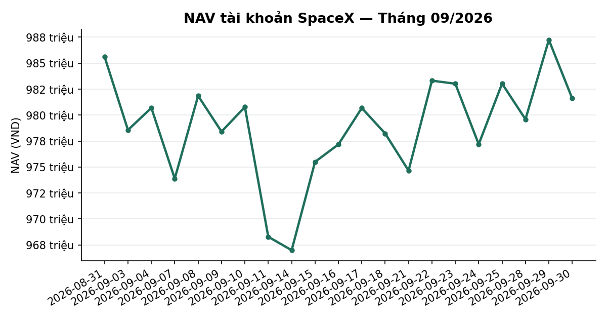
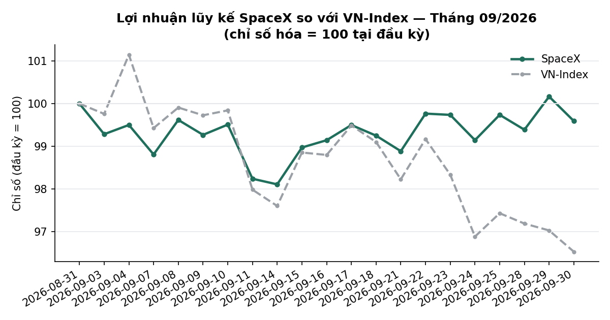
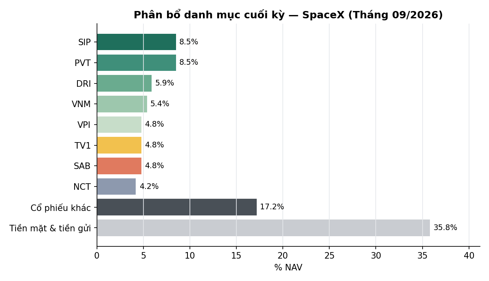

# BÁO CÁO THÁNG — TÀI KHOẢN SPACEX
## Kỳ báo cáo: Tháng 09/2026 (01/09 – 30/09/2026, phiên giao dịch cuối cùng: 30/09/2026)

**Tài khoản:** SpaceX · DNSE, số hiệu 0002023347 · Chiến lược V2.4 (có sử dụng đòn bẩy ký quỹ)
**Ngày lập báo cáo:** 01/10/2026
**Đối tượng:** Báo cáo hiệu suất & quản lý danh mục — dành cho nhà đầu tư

> 📊 Xem biểu đồ minh hoạ đính kèm trong email (NAV, lợi nhuận lũy kế so VN-Index, phân bổ danh
> mục) — bản trên kênh chat chỉ hiển thị văn bản.

---

## 1. TÓM TẮT ĐIỀU HÀNH

Tháng 9/2026 có 20 phiên giao dịch (01–02/09 nghỉ lễ Quốc khánh). Thị trường điều chỉnh: VN-Index
giảm 3,47% trong tháng. Danh mục SpaceX giữ giá trị gần như đi ngang (−0,41%), vượt chỉ số
**3,06 điểm phần trăm**. Tháng 9 cũng là tháng khép lại Quý 3/2026 — quý hoạt động đầu tiên của tài
khoản: cả quý danh mục giảm 1,84% trong khi VN-Index giảm 4,91%.

| Chỉ tiêu | SpaceX |
|---|---:|
| Giá trị tài sản ròng (NAV) đầu kỳ (31/08/2026) | 985.617.905đ |
| NAV cuối kỳ (30/09/2026) | 981.599.301đ |
| Lãi/lỗ trong kỳ | **−4.018.604đ** |
| Tỷ suất sinh lời trong tháng (MTD) | **−0,41%** |
| VN-Index cùng kỳ (1.832,12 → 1.768,62) | −3,47% |
| Chênh lệch so với chỉ số | **+3,06 điểm phần trăm** |
| Tỷ suất Quý 3/2026 (= từ khi bắt đầu hoạt động, 01/07 → 30/09) | −1,84% (VN-Index −4,91%) |
| Biến động năm hoá (annualized) | 9,78% (VN-Index 14,43%) |
| Sụt giảm tối đa trong tháng (Max Drawdown) | −1,89% (VN-Index −4,56%) |
| Số lệnh khớp trong tháng | 69 |
| Tổng chi phí giao dịch (phí + thuế) | 617.260đ |

**Phương pháp tính:** lãi/lỗ và tỷ suất được tính trực tiếp từ chênh lệch NAV đầu kỳ và cuối kỳ,
định giá theo thị trường (mark-to-market) hàng ngày, đối chiếu với dữ liệu tài khoản tại công ty
chứng khoán lưu ký. Không có khoản nạp/rút vốn nào trong kỳ.

---

## 2. HIỆU SUẤT MTD / QTD / YTD SO VỚI CHỈ SỐ

### 2.1 Diễn biến trong tháng theo tuần

| Tuần | NAV SpaceX | VN-Index |
|---|---:|---:|
| Đầu kỳ (31/08) | 985.617.905 | 1.832,12 |
| Tuần 1 (→04/09) | 980.696.423 (−0,50%) | 1.853,08 (+1,14%) |
| Tuần 2 (→11/09) | 968.286.290 (−1,76%) | 1.795,21 (−2,01%) |
| Tuần 3 (→18/09) | 978.228.740 (−0,75%) | 1.815,66 (−0,90%) |
| Tuần 4 (→25/09) | 983.031.669 (−0,26%) | 1.785,11 (−2,57%) |
| Tuần 5 (→30/09) | 981.599.301 (−0,41%) | 1.768,62 (−3,47%) |

*(Tỷ lệ % trong ngoặc là mức tích lũy tính từ đầu tháng.)*

Danh mục kém chỉ số ở tuần đầu tháng (khi VN-Index tăng lên 1.853 điểm ngày 04/09), nhưng giảm ít
hơn đáng kể trong hai nhịp điều chỉnh 11/09 và 24/09. Từ giữa tháng, đường NAV tách dần khỏi chỉ
số và kết thúc tháng cao hơn VN-Index khoảng 3 điểm phần trăm.

### 2.2 Lũy kế Quý 3/2026 (QTD — quý đã kết thúc)

| Kỳ | SpaceX | VN-Index | Chênh lệch |
|---|---:|---:|---:|
| Tháng 7/2026 | −6,16% | −6,68% | +0,52 điểm % |
| Tháng 8/2026 | +5,03% | +5,55% | −0,52 điểm % |
| Tháng 9/2026 | −0,41% | −3,47% | +3,06 điểm % |
| **Quý 3/2026 (01/07 → 30/09)** | **−1,84%** | **−4,91%** | **+3,07 điểm %** |

Mốc tính: vốn khởi điểm 1.000.000.000đ ngày 01/07/2026 → NAV 30/09/2026 981.599.301đ. VN-Index
tính từ giá đóng cửa 30/06/2026 (1.860,01 điểm), tức cùng thời điểm với mốc vốn khởi điểm.

### 2.3 Lũy kế từ đầu năm hoạt động (YTD)

Trùng với số liệu Quý 3 ở trên: tài khoản bắt đầu hoạt động ngày 01/07/2026.

**Nhận định:** sau Quý 3, danh mục giảm 1,84% trong khi thị trường chung giảm 4,91%. Phần vượt
trội chủ yếu đến từ tháng 9, khi tỷ trọng cổ phiếu được hạ dần và các vị thế lớn nhất (PVT, DRI)
đi ngược xu hướng giảm của thị trường.

---

## 3. PHÂN RÃ NGUỒN LỢI NHUẬN (ATTRIBUTION)

### 3.1 Phân rã theo cấu phần

| Cấu phần | VND |
|---|---:|
| Biến động giá trị cổ phiếu (gồm cả lãi/lỗ đã hiện thực hoá khi bán) | −7.398.650 |
| Cổ tức tiền mặt DRI (gộp 3.700.000đ, sau thuế TNCN 5%) | +3.515.000 |
| Phí giao dịch | −328.500 |
| Thuế chuyển nhượng chứng khoán | −288.760 |
| Lãi tiền gửi sinh lời & khoản khác | +482.306 |
| **Tổng (= Lãi/lỗ NAV trong kỳ)** | **−4.018.604** |

### 3.2 Phân rã theo nhóm ngành (đã gồm cổ tức)

| Nhóm ngành | Mã | Lãi/lỗ trong tháng (VND) | Tỷ trọng đầu kỳ → cuối kỳ (% NAV) |
|---|---|---:|---:|
| Vận tải, logistics & năng lượng | PVT, NCT, TV1 | +12.580.000 | 16,2% → 17,5% |
| Tiêu dùng & nông nghiệp | VNM, SAB, DRI | +3.855.000 | 16,1% → 16,2% |
| Hoá chất, vật liệu & công nghiệp | HPG, SCL | −1.550.000 | 6,9% → 1,2% |
| Chứng khoán & tài chính | VIX, VND, EVF | −1.671.000 | 1,2% → 0,3% |
| Bất động sản & khu công nghiệp | VHM, VRE, VPI, SIP | −6.140.000 | 16,0% → 15,9% |
| Ngân hàng | 13 mã (ACB, BID, CTG, HDB, LPB, MBB, MSB, SHB, TCB, TPB, VCB, VIB, VPB) | −10.957.650 | 32,6% → 13,1% |
| **Tổng** | | **−3.883.650** | |

*(Tổng nhóm ngành = biến động giá trị cổ phiếu + cổ tức; chênh lệch so với lãi/lỗ NAV là phí, thuế
và lãi tiền gửi ở Mục 3.1.)*

Nhóm ngân hàng là nguồn kéo giảm lớn nhất, song tỷ trọng nhóm này đã được hạ từ 32,6% xuống 13,1%
NAV trong tháng, chủ yếu trong phiên 29/09 (xem Mục 5). Nhóm vận tải — năng lượng (dẫn dắt bởi PVT)
là nguồn đóng góp dương chính.

### 3.3 Đóng góp tốt nhất & kém nhất trong tháng

**Đóng góp tích cực nhất:**
| Mã | Lãi (VND) | Ghi chú |
|---|---:|---|
| PVT | +12.600.000 | Giá cổ phiếu tăng mạnh trong tháng (20.200đ → 23.800đ) |
| DRI | +9.435.000 | Giá 14.100đ → 15.700đ, cộng cổ tức tiền mặt 1.000đ/cp |
| VPB | +1.382.400 | Đã gồm cổ tức bằng cổ phiếu tỷ lệ 26% |
| SCL | +750.000 | Đã chốt toàn bộ vị thế ngày 30/09 |
| MSB | +505.000 | |

**Đóng góp tiêu cực nhất:**
| Mã | Lỗ (VND) | Ghi chú |
|---|---:|---|
| SAB | −2.970.000 | Giá 45.600đ → 42.900đ |
| VNM | −2.610.000 | Giá 62.300đ → 59.400đ |
| VHM | −2.550.000 | Đã giảm khối lượng nắm giữ 900 → 300 cp |
| VPI | −2.460.000 | Mua mới 17–18/09, giá vốn 62.375đ, đóng cửa 30/09 59.300đ |
| CTG | −2.410.000 | Đã giảm khối lượng nắm giữ 1.200 → 500 cp |

---

## 4. CHỈ SỐ RỦI RO

| Chỉ số | SpaceX | VN-Index |
|---|---:|---:|
| Độ lệch chuẩn lợi suất ngày | 0,616% | 0,909% |
| Biến động năm hoá | 9,78% | 14,43% |
| Sụt giảm tối đa trong tháng | −1,89% | −4,56% |
| Số phiên tăng / tổng số phiên | 9/20 | 7/20 |
| Hệ số beta so với VN-Index (20 phiên) | 0,55 | 1,00 |
| Tỷ trọng cổ phiếu cuối tháng / NAV | 64,2% | — |

Mức biến động và sụt giảm tối đa của danh mục đều thấp hơn chỉ số tham chiếu, phản ánh tỷ trọng
cổ phiếu giảm dần trong tháng và mức độ đa dạng hoá cao. Không có mã nào vượt 10% NAV (lớn nhất
SIP và PVT, mỗi mã 8,5%). Dư nợ ký quỹ gần như bằng 0 trong suốt tháng.

*(Beta tính trên 20 lợi suất ngày, chỉ mang tính tham khảo do mẫu ngắn.)*

---

## 5. HOẠT ĐỘNG ĐẦU TƯ & SỰ KIỆN QUYỀN CỔ ĐÔNG TRONG THÁNG

**Giải ngân mới:** mua 800 cổ phiếu VPI (17–18/09/2026, tổng giá trị 49,9 triệu đồng) theo tín
hiệu động lượng của chiến lược.

**Điều chỉnh chính sách phân bổ phần vốn chờ giải ngân:** từ ngày 27/09/2026, tỷ lệ phần vốn
nhàn rỗi được phân bổ tạm thời vào rổ cổ phiếu cơ bản chất lượng cao (áp dụng khi thị trường ở
trạng thái trung tính) được điều chỉnh từ 80% xuống 30%. Theo đó, phiên 29/09 danh mục giảm tỷ
trọng ở 19 mã — chủ yếu nhóm ngân hàng — với tổng giá trị bán 217,1 triệu đồng; số tiền thu về
được giữ dưới dạng tiền mặt và tiền gửi sinh lời, sẵn sàng cho các cơ hội giải ngân theo tín hiệu
chính của chiến lược. Cả tháng, tổng giá trị bán theo hoạt động tái cân bằng này là 246,3 triệu đồng.

**Chốt vị thế theo kỳ hạn nắm giữ:** ngày 30/09/2026 bán toàn bộ 1.500 cổ phiếu SCL ở giá 28.300đ
(giá vốn 23.600đ) khi vị thế đạt thời hạn nắm giữ tối đa theo quy tắc của chiến lược; lãi ròng sau
phí và thuế khoảng 7,0 triệu đồng.

**Sự kiện quyền lợi cổ đông:**
| Mã | Loại quyền | Ngày GDKHQ | Ảnh hưởng tới tài khoản |
|---|---|---|---|
| VIB | Cổ tức bằng cổ phiếu, tỷ lệ 9,5% | 10/09/2026 | Tăng số lượng cổ phiếu nắm giữ, không phát sinh dòng tiền |
| DRI | Cổ tức tiền mặt 1.000đ/cp | 22/09/2026 | 3.700.000đ (trước thuế TNCN 5%) |
| VPB | Cổ tức bằng cổ phiếu, tỷ lệ 26,04% | 24/09/2026 | Tăng số lượng cổ phiếu nắm giữ, không phát sinh dòng tiền |

---

## 6. BỐI CẢNH THỊ TRƯỜNG, DIỄN BIẾN VĨ MÔ THÁNG 9/2026 VÀ ĐÁNH GIÁ RỦI RO

### 6.1 Thị trường chứng khoán

VN-Index mở đầu tháng ở 1.832 điểm, đạt đỉnh tháng 1.853,08 điểm ngày 04/09, sau đó điều chỉnh qua
hai nhịp giảm mạnh (11/09: −1,86%; 24/09: −1,47%) và đóng cửa tháng ở 1.768,62 điểm (−3,47%).
Đánh giá trạng thái thị trường theo mô hình định lượng nội bộ duy trì mức **trung tính** trong
suốt tháng; cuối tháng xuất hiện tín hiệu suy yếu sớm nhưng chưa đủ điều kiện xác nhận chuyển
trạng thái.

Về định giá, P/E toàn thị trường ở mức 11,34 lần (thuộc nhóm 7% thấp nhất trong 10 năm) và P/B
1,91 lần (phân vị 28%) — thị trường đang ở vùng định giá rẻ so với lịch sử. Chỉ báo định giá chỉ
mang tính tham khảo, không phải tín hiệu mua/bán.

> Nguồn: Tổng cục Thống kê (TCTK), Ngân hàng Nhà nước (NHNN), Cục Dự trữ Liên bang Mỹ (Fed), Tổng
> cục Thống kê Trung Quốc (NBS), dữ liệu giá dầu và chỉ số biến động quốc tế · Chốt dữ liệu: 30/09/2026

> **Lưu ý:** CPI tháng 9 và GDP Quý 3/2026 chưa được công bố tại ngày lập báo cáo (dự kiến đầu
> tháng 10). Số liệu trong nước dưới đây là của tháng 8 hoặc lũy kế 8 tháng.

### 6.2 Kinh tế trong nước

**Lạm phát — CPI tháng 8/2026** (TCTK công bố 03/09): tăng 0,47% so với tháng trước và **4,89%**
so với cùng kỳ (tháng 7: 4,45%); bình quân 8 tháng tăng 4,45%; lạm phát cơ bản tăng 4,55% so với
cùng kỳ. Động lực chính là nhóm giao thông (giá dầu diesel +22,15%, xăng +9,53%). CPI đã vượt nhẹ
mục tiêu khoảng 4,5% của Quốc hội.

**Hoạt động kinh tế 8 tháng:** chỉ số sản xuất công nghiệp tăng 11,9% (cao nhất cùng kỳ kể từ
2019); tổng mức bán lẻ tăng 13,3%. Xuất khẩu đạt 374,8 tỷ USD (+22,4%), nhập khẩu 395,3 tỷ USD
(+35,3%), **thâm hụt thương mại 20,46 tỷ USD**. GDP gần nhất (Quý 2/2026) tăng 8,39%, lũy kế 6
tháng tăng 8,18%.

### 6.3 Chính sách tiền tệ

Lãi suất tái cấp vốn của NHNN giữ nguyên 4,5%. Tăng trưởng tín dụng đến 28/08 đạt 10,24% so với
cuối năm 2025. Tỷ giá trung tâm dao động 25.596–25.610 VND/USD trong nửa đầu tháng 9; lãi suất liên
ngân hàng qua đêm khoảng 5,20% giữa tháng. Tỷ lệ nợ xấu nội bảng toàn hệ thống ở mức 1,51% cuối
tháng 6/2026.

### 6.4 Bối cảnh quốc tế

**Fed tăng lãi suất:** cuộc họp ngày 16/09 nâng lãi suất điều hành thêm 0,25 điểm phần trăm lên
3,75–4,00% — lần tăng đầu tiên kể từ tháng 7/2023 — và dự phóng trung vị hàm ý thêm một lần tăng
trong năm 2026, với lý do chính là cú sốc giá năng lượng.

**Giá dầu tăng mạnh:** giá dầu Brent kỳ hạn tăng từ 90,49 USD/thùng (31/08) lên 103,53 USD/thùng
(30/09), đỉnh 108,75 USD ngày 15/09; giá giao ngay còn cao hơn đáng kể, phản ánh nguồn cung vật
chất căng thẳng gắn với diễn biến địa chính trị Trung Đông.

**Trung Quốc:** PMI sản xuất (NBS) tháng 9 đạt 50,1 — lần đầu trở lại vùng mở rộng sau nhiều tháng
dưới ngưỡng 50 (tháng 8: 49,8). Chỉ số biến động VIX của thị trường Mỹ dao động trong vùng thấp
14–18 điểm.

### 6.5 Đánh giá rủi ro

**Kết luận: không ghi nhận tín hiệu khủng hoảng cấu trúc trong nước; rủi ro chính đến từ cú sốc
bên ngoài (giá năng lượng và chính sách thắt chặt của Fed).**

| Chỉ báo | Ngưỡng cảnh báo | Mức hiện tại | Đánh giá |
|---|---|---|---|
| CPI (so cùng kỳ) | ≥6% | 4,89% (tháng 8) | Dưới ngưỡng, nhưng đã vượt mục tiêu 4,5% |
| Tăng trưởng tín dụng | ≥30%/năm | ~18% so với cùng kỳ | Bình thường |
| Tỷ lệ nợ xấu ngân hàng | ≥5% | 1,51% | Bình thường |
| Cán cân thương mại / vãng lai | Xu hướng xấu kéo dài | Thâm hụt thương mại 20,46 tỷ USD (8 tháng) | Cần theo dõi |

Nền tảng tăng trưởng trong nước vẫn vững (sản xuất, bán lẻ, xuất khẩu tăng hai chữ số), song áp
lực lạm phát nhập khẩu từ giá năng lượng và việc Fed quay lại tăng lãi suất làm tăng rủi ro tỷ giá
và có thể hạn chế dư địa nới lỏng tiền tệ trong nước.

---

## 7. CHI PHÍ HOẠT ĐỘNG

| Khoản mục | Giá trị (VND) |
|---|---:|
| Giá trị mua trong tháng | 49.900.000 |
| Giá trị bán trong tháng | 288.760.000 |
| Tổng giá trị giao dịch | 338.660.000 |
| Phí giao dịch (0,097% mỗi chiều) | 328.500 |
| Thuế chuyển nhượng chứng khoán (0,1% giá trị bán) | 288.760 |
| **Tổng chi phí giao dịch** | **617.260** |
| Lãi vay ký quỹ | Không đáng kể (dư nợ cuối kỳ 7.929đ) |
| Phí quản lý / phí hiệu suất | 0 |

Tổng chi phí giao dịch tương đương khoảng 0,06% NAV bình quân trong tháng.

---

## 8. DANH MỤC CUỐI THÁNG (30/09/2026)

| Mã | Khối lượng | Giá vốn (đ/cp) | Giá đóng cửa 30/09 | Giá trị thị trường (đ) | % NAV | Lãi/lỗ chưa thực hiện (%) |
|---|---:|---:|---:|---:|---:|---:|
| SIP | 1.700 | 47.059 | 49.100 | 83.470.000 | 8,5% | +4,34% |
| PVT | 3.500 | 17.100 | 23.800 | 83.300.000 | 8,5% | +39,18% |
| DRI | 3.700 | 13.262 | 15.700 | 58.090.000 | 5,9% | —¹ |
| VNM | 900 | 58.600 | 59.400 | 53.460.000 | 5,4% | +1,37% |
| VPI | 800 | 62.375 | 59.300 | 47.440.000 | 4,8% | −4,93% |
| TV1 | 2.300 | 20.148 | 20.600 | 47.380.000 | 4,8% | +2,24% |
| SAB | 1.100 | 47.368 | 42.900 | 47.190.000 | 4,8% | −3,42% |
| NCT | 500 | 94.360 | 83.100 | 41.550.000 | 4,2% | −3,88% |
| VHM | 300 | 74.900 | 68.500 | 20.550.000 | 2,1% | −8,54% |
| VCB | 300 | 61.914 | 58.000 | 17.400.000 | 1,8% | −5,63% |
| BID | 475 | 39.571 | 35.950 | 17.076.250 | 1,7% | −9,15% |
| CTG | 500 | 34.256 | 30.000 | 15.000.000 | 1,5% | −11,18% |
| VPB | 586 | 22.021 | 23.400 | 13.712.400 | 1,4% | +6,26% |
| MBB | 675 | 21.657 | 19.650 | 13.263.750 | 1,4% | −4,88% |
| TCB | 400 | 33.900 | 32.550 | 13.020.000 | 1,3% | −3,98% |
| HPG | 600 | 22.200 | 20.150 | 12.090.000 | 1,2% | −9,23% |
| LPB | 200 | 52.183 | 44.000 | 8.800.000 | 0,9% | −15,68% |
| ACB | 400 | 22.656 | 21.100 | 8.440.000 | 0,9% | −6,87% |
| HDB | 300 | 26.709 | 27.500 | 8.250.000 | 0,8% | +2,96% |
| VRE | 200 | 25.550 | 24.350 | 4.870.000 | 0,5% | −4,70% |
| SHB | 400 | 12.281 | 11.450 | 4.580.000 | 0,5% | −6,77% |
| VIB | 247 | 13.620 | 13.350 | 3.297.450 | 0,3% | −1,98% |
| TPB | 200 | 16.800 | 14.450 | 2.890.000 | 0,3% | −13,99% |
| MSB | 200 | 13.542 | 14.200 | 2.840.000 | 0,3% | +4,86% |
| VIX | 220 | 15.464 | 12.300 | 2.706.000 | 0,3% | −20,46% |
| **Tổng cổ phiếu** | | | | **630.665.850** | **64,2%** | |
| Tiền mặt | | | | 265.392.335 | 27,0% | |
| Tiền gửi sinh lời tại CTCK | | | | 85.549.045 | 8,7% | |
| Dư nợ ký quỹ | | | | −7.929 | 0,0% | |
| **NAV** | | | | **981.599.301** | **100%** | |

¹ Tỷ suất của DRI sẽ được công bố sau khi khoản cổ tức tiền mặt 1.000đ/cp (GDKHQ 22/09/2026)
được đối chiếu với sao kê tiền về tài khoản. Giá vốn hiển thị là giá vốn trước khi trừ cổ tức;
tính riêng biến động giá, vị thế đang có lãi.

*Tỷ suất lãi/lỗ chưa thực hiện tính trên giá vốn gốc, đã cộng cổ tức tiền mặt ròng (sau thuế TNCN
5%) nhận được trong thời gian nắm giữ; giá vốn của các mã có cổ tức bằng cổ phiếu đã được điều
chỉnh theo số lượng mới.*

**Mức độ tập trung:** 25 mã, không mã nào vượt 10% NAV (lớn nhất SIP và PVT, mỗi mã 8,5%). Tiền mặt
và tiền gửi sinh lời chiếm 35,8% NAV cuối tháng — mức dự phòng cao nhất kể từ khi tài khoản hoạt
động, hệ quả trực tiếp của việc điều chỉnh chính sách phân bổ ở Mục 5.

---

## 9. TRIỂN VỌNG THÁNG 10/2026

Danh mục bước vào tháng 10 với tỷ trọng cổ phiếu khoảng 64% NAV và hơn 35% NAV ở dạng tiền mặt/tiền
gửi sinh lời — tư thế phòng thủ hơn so với các tháng trước, cho phép chủ động giải ngân khi xuất
hiện tín hiệu phù hợp. Các yếu tố chính cần theo dõi:

1. **Số liệu CPI tháng 9 và GDP Quý 3/2026** (công bố dự kiến đầu tháng 10) — đặc biệt diễn biến
   lạm phát cơ bản so với mục tiêu 4,5%.
2. **Giá dầu và tình hình địa chính trị Trung Đông** — tác động tới lạm phát nhập khẩu và nhóm cổ
   phiếu năng lượng, vận tải.
3. **Cuộc họp Fed ngày 27–28/10** — khả năng tăng lãi suất thêm và áp lực lên tỷ giá USD/VND.
4. **Mùa công bố kết quả kinh doanh Quý 3/2026** — nguồn tín hiệu chính cho chiến lược đầu tư theo
   kết quả kinh doanh của danh mục.

Chiến lược tiếp tục vận hành theo khung quản trị rủi ro hiện hành, điều chỉnh tỷ trọng theo diễn
biến giá và các chỉ báo định lượng đã được kiểm chứng.

---

## 10. PHỤ LỤC — PHƯƠNG PHÁP LUẬN

**Định giá:** NAV được tính theo phương pháp mark-to-market (giá đóng cửa) tại cuối mỗi phiên giao
dịch, gồm giá trị cổ phiếu, tiền mặt, tiền gửi sinh lời tại công ty chứng khoán, trừ dư nợ ký quỹ;
đối chiếu trực tiếp với dữ liệu tài khoản tại công ty chứng khoán lưu ký.

**So sánh chỉ số:** VN-Index tính trên giá đóng cửa cùng ngày với mốc NAV. Mốc khởi điểm của chỉ số
cho số liệu lũy kế là giá đóng cửa 30/06/2026, trùng thời điểm với vốn khởi điểm.

**Cổ tức:** tỷ suất của từng vị thế được điều chỉnh cộng cổ tức tiền mặt đã nhận trong kỳ nắm
giữ, tính trên cơ sở ròng sau thuế TNCN 5%. Khoản cổ tức chưa đối chiếu được với tiền về tài khoản
không được đưa vào tỷ suất công bố.

**Chi phí:** phí giao dịch 0,097% mỗi chiều; thuế chuyển nhượng chứng khoán 0,1% trên giá trị bán;
lãi vay ký quỹ theo lãi suất thực tế phát sinh trên tài khoản.

**Chỉ số Sharpe/Sortino/Calmar** chưa được công bố do lịch sử NAV theo ngày của tài khoản mới đạt
một quý — dự kiến công bố từ 01/2027 khi đủ độ dài dữ liệu để có ý nghĩa thống kê.

**Công bố tuân thủ:**
- Đây không phải là khuyến nghị đầu tư. Kết quả hoạt động trong quá khứ không đảm bảo cho kết quả
  trong tương lai.
- Mọi số liệu trong báo cáo này được đối chiếu với dữ liệu giao dịch tại công ty chứng khoán lưu
  ký tài khoản.

---

*Báo cáo tháng 09/2026 — Tổng hợp và đối soát bởi Đội ngũ Quản lý Danh mục & Nghiên cứu Định lượng.*
