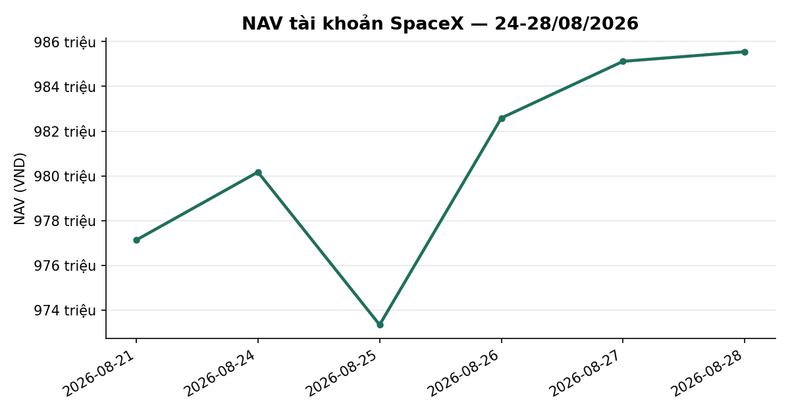
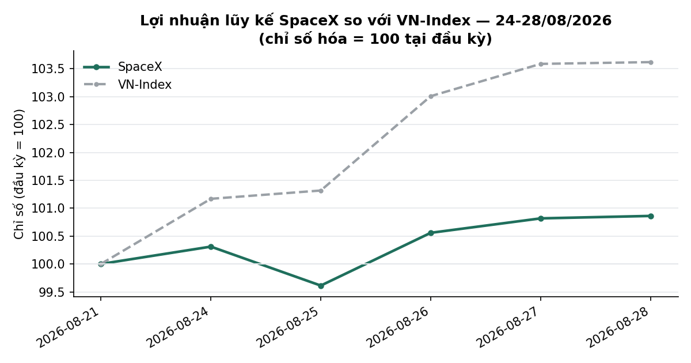
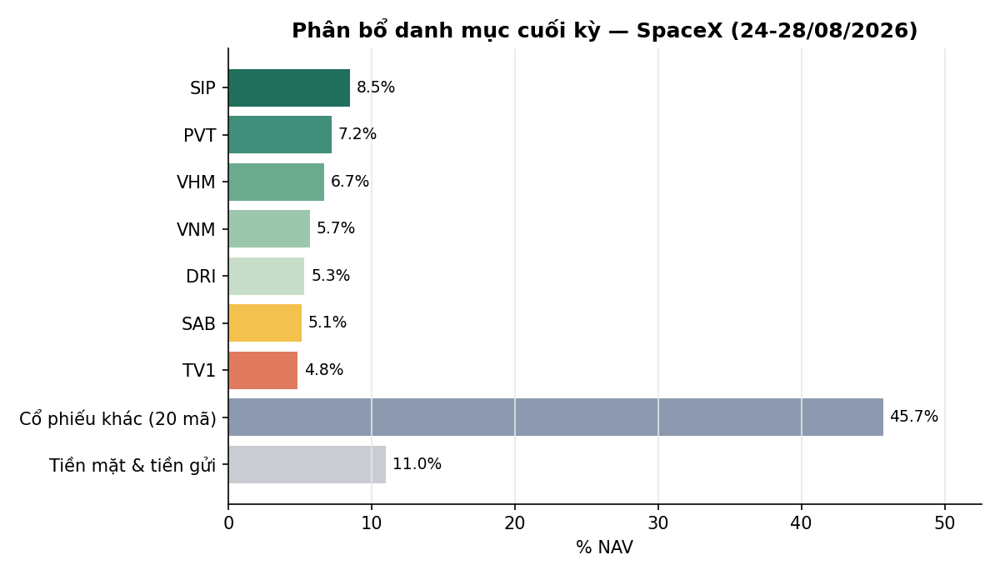

# BÁO CÁO TUẦN — TÀI KHOẢN SPACEX
## Kỳ báo cáo: 24/08/2026 – 28/08/2026

**Tài khoản:** SpaceX · DNSE, số hiệu 0002023347 · Chiến lược V2.4 (có sử dụng đòn bẩy ký quỹ)
**Ngày lập báo cáo:** 02/09/2026
**Đối tượng:** Báo cáo hiệu suất & quản lý danh mục — dành cho nhà đầu tư

> 📊 Báo cáo có kèm biểu đồ minh hoạ (NAV, lợi nhuận lũy kế so VN-Index, phân bổ danh mục) — xem
> bản email để thấy đầy đủ hình ảnh; bản trên kênh chat chỉ hiển thị văn bản.

---

## 1. TÓM TẮT ĐIỀU HÀNH

| Chỉ tiêu | SpaceX |
|---|---:|
| NAV đầu kỳ (chốt 21/08) | 977.129.844 |
| NAV cuối kỳ (28/08) | **985.547.490** |
| Thay đổi trong kỳ | **+8.417.646 (+0,86%)** |
| VN-Index cùng kỳ (21/08 → 28/08) | 1.768,12 → 1.832,12 (**+3,62%**) |
| Giá trị cổ phiếu cuối kỳ | 876.924.500 |
| Tiền mặt tại công ty chứng khoán | 8.195.610 |
| Tài sản tích lũy khác | 100.435.143 |
| Tỷ trọng cổ phiếu / NAV | 89,0% |
| Số mã nắm giữ cuối kỳ | 28 |

**Nhận định tuần:** VN-Index tăng mạnh **+3,62%** trong tuần (1.768,12 → 1.832,12), tăng liên tục
cả 5 phiên. Danh mục SpaceX tăng **+0,86%** — thấp hơn đáng kể so với chỉ số. Nguyên nhân chính:
danh mục hiện là một rổ đa dạng hoá theo ngành (28 mã, không còn tập trung nhóm ngân hàng như giai
đoạn trước), trong đó một phần đáng kể là các cổ phiếu vốn hoá vừa và nhỏ (PVT, SCL, SIP, NCT,
TV1...) không tăng đồng pha với đà tăng của nhóm vốn hoá lớn dẫn dắt thị trường tuần này. Trạng
thái thị trường (mô hình phân loại 5 trạng thái nội bộ) giữ nguyên ở mức TRUNG TÍNH suốt tuần,
không kích hoạt cơ chế phòng thủ nào. Không có giao dịch mua/bán chủ động nào trong tuần; danh mục
ghi nhận 2 sự kiện quyền lợi cổ đông (quyền mua MBB, cổ tức cổ phiếu MSB — xem Mục 4).

---

## 2. BỐI CẢNH THỊ TRƯỜNG TRONG TUẦN

| Ngày | VN-Index | Thay đổi |
|---|---:|---:|
| 21/08 (trước kỳ) | 1.768,12 | — |
| 24/08 | 1.788,78 | +1,17% |
| 25/08 | 1.791,41 | +0,15% |
| 26/08 | 1.821,32 | +1,67% |
| 27/08 | 1.831,56 | +0,56% |
| 28/08 | 1.832,12 | +0,03% |

Tuần tăng liên tục cả 5 phiên, tổng cộng +3,62% — tuần tăng mạnh nhất trong nhiều tuần gần đây,
dẫn dắt chủ yếu bởi nhóm vốn hoá lớn. Độ rộng thị trường (tỷ lệ cổ phiếu đóng cửa trên đường trung
bình 50 phiên) ở mức 36,9% cuối tuần — dưới 50%, cho thấy đà tăng của chỉ số chưa được đa số cổ
phiếu xác nhận, phù hợp với việc danh mục đa dạng ngành của quỹ tăng chậm hơn chỉ số.

---

## 3. DIỄN BIẾN NAV & DANH MỤC TRONG TUẦN

### 3.1 NAV theo ngày

| Ngày | NAV (VND) | Thay đổi | VN-Index |
|---|---:|---:|---:|
| 21/08 (đầu kỳ) | 977.129.844 | — | — |
| 24/08 | 980.169.758 | +0,31% | +1,17% |
| 25/08 | 973.342.760 | −0,70% | +0,15% |
| 26/08 | 982.587.257 | +0,95% | +1,67% |
| 27/08 | 985.119.512 | +0,26% | +0,56% |
| 28/08 (cuối kỳ) | 985.547.490 | +0,04% | +0,03% |

Cả tuần **+0,86%** so với VN-Index **+3,62%** — chênh lệch 2,76 điểm phần trăm.

### 3.2 Hoạt động giao dịch

Không có giao dịch mua/bán chủ động nào trong tuần. Hai sự kiện duy nhất trong kỳ là quyền lợi cổ
đông (không phải lệnh giao dịch chủ động) — xem Mục 4.

### 3.3 Danh mục cuối kỳ (28/08/2026)

| Mã | KL | Giá vốn | Giá 28/08 | Giá trị thị trường | % |
|---|---:|---:|---:|---:|---:|
| PVT | 3.500 | 17.100 | 20.200 | 70.700.000 | 18,13 |
| SCL | 1.500 | 23.600 | 27.600 | 41.400.000 | 16,95 |
| SIP | 1.700 | 47.059 | 49.450 | 84.065.000 | 5,08 |
| VNM | 900 | 58.600 | 62.300 | 56.070.000 | 6,31 |
| DRI | 3.700 | 13.262 | 14.100 | 52.170.000 | 6,32 |
| HDB | 800 | 26.709 | 27.800 | 22.240.000 | 4,08 |
| TV1 | 2.300 | 20.148 | 20.500 | 47.150.000 | 1,75 |
| VRE | 300 | 25.550 | 26.100 | 7.830.000 | 2,15 |
| VPB | 1.200 | 27.746 | 27.800 | 33.360.000 | 0,19 |
| VIB | 500 | 14.900 | 14.950 | 7.475.000 | 0,34 |
| ACB | 900 | 22.656 | 22.650 | 20.385.000 | −0,02 |
| EVF | 100 | 12.550 | 12.400 | 1.240.000 | −1,20 |
| SHB | 800 | 12.281 | 12.200 | 9.760.000 | −0,66 |
| MSB | 600 | 13.542 | 13.350 | 8.010.000 | −1,42 |
| HPG | 1.200 | 22.200 | 22.100 | 26.520.000 | −0,45 |
| VND | 300 | 17.800 | 16.650 | 4.995.000 | −6,46 |
| TCB | 1.000 | 33.900 | 33.400 | 33.400.000 | −1,47 |
| VIX | 420 | 15.464 | 14.100 | 5.922.000 | −8,82 |
| LPB | 400 | 52.183 | 49.950 | 19.980.000 | −4,28 |
| TPB | 500 | 16.800 | 14.650 | 7.325.000 | −12,80 |
| VCB | 700 | 61.786 | 60.100 | 42.070.000 | −2,23 |
| MBB | 1.565 | 22.109 | 21.050 | 32.943.250 | −4,79 |
| VHM | 900 | 74.900 | 73.000 | 65.700.000 | −2,54 |
| SAB | 1.100 | 47.368 | 45.600 | 50.160.000 | 2,28 |
| CTG | 1.200 | 34.181 | 31.950 | 38.340.000 | −5,48 |
| BID | 1.175 | 39.945 | 36.850 | 43.308.932 | −6,84 |
| NCT | 500 | 94.360 | 83.600 | 41.800.000 | −3,35 |
| **Tổng (27 mã)** | | | | **874.319.182** | **+1,78** |

*Tỷ suất % tại cột cuối đã được điều chỉnh cộng cổ tức tiền mặt ròng (sau thuế thu nhập cá nhân
5%) theo chuẩn nội bộ. Tổng giá trị thị trường bảng trên (874,3tr) chênh lệch nhẹ (~2,6tr) so với
giá trị cổ phiếu chính thức trong Mục 1 (876,9tr) do một phần cổ phiếu từ sự kiện quyền mua MBB
(Mục 4) chưa kịp cập nhật vào thời điểm trích xuất bảng này trong ngày 28/08 — không ảnh hưởng đến
số liệu NAV chính thức.*

**Ghi nhận:** danh mục đã chuyển từ tập trung nhóm ngân hàng (58,6% NAV hồi tháng 7) sang đa ngành
hơn đáng kể — hiện không mã nào vượt 10% NAV (lớn nhất PVT ~7,2%). Đây là kết quả tái cân bằng
định kỳ của chiến lược qua các tuần trước đó (không có lệnh nào phát sinh riêng trong tuần này).

---

## 4. SỰ KIỆN QUYỀN LỢI CỔ ĐÔNG TRONG TUẦN

### 4.1 Cổ tức cổ phiếu MSB — phát hành thêm 20% số lượng cổ phiếu

Vị thế MSB tăng từ 500 lên 600 cổ phiếu do sự kiện cổ tức bằng cổ phiếu (tỷ lệ phát hành 20%),
không phải giao dịch mua. Giá vốn bình quân mỗi cổ phiếu giảm tương ứng theo tỷ lệ pha loãng —
tổng giá trị đầu tư ban đầu không đổi. Đây là NGUYÊN NHÂN chính khiến NAV các ngày 25–27/08 có biến
động lớn hơn bình thường trong bảng Mục 3.1 — không phải sai lệch số liệu. Tỷ suất sinh lời thực tế
của vị thế MSB (đã phản ánh đúng số lượng cổ phiếu mới) vẫn là −1,42%.

### 4.2 Quyền mua cổ phiếu MBB, khớp ngày 28/08

MBB thực hiện quyền mua theo tỷ lệ 10:1, giá 10.000đ/cổ phiếu: SpaceX mua thêm 110 cổ phiếu, hoàn
tất ngày 28/08/2026. Đối chiếu giá vốn khớp chính xác tuyệt đối, xác nhận giao dịch quyền mua được
ghi nhận đúng.

---

## 5. KẾ HOẠCH TUẦN TỚI (31/08 – 04/09/2026)

Lịch giao dịch tuần tới rút ngắn còn 4 phiên do HOSE nghỉ lễ Quốc khánh 02/09/2026. Danh mục tiếp
tục duy trì cơ cấu hiện tại theo khung phân bổ đã thiết lập, điều chỉnh theo diễn biến giá và các
chỉ báo định lượng của chiến lược.

---

## 6. PHỤ LỤC — PHƯƠNG PHÁP LUẬN

**Định giá:** Giá trị tài sản ròng (NAV) được tính theo phương pháp mark-to-market tại cuối mỗi
phiên giao dịch, đối chiếu trực tiếp với dữ liệu tài khoản tại công ty chứng khoán lưu ký.

**Cổ tức:** Tỷ suất sinh lời của từng vị thế được điều chỉnh cộng cổ tức tiền mặt đã nhận trong kỳ
nắm giữ, tính trên cơ sở ròng sau thuế thu nhập cá nhân 5%.

**Chi phí:** Phí giao dịch 0,075% mỗi lượt; thuế chuyển nhượng chứng khoán 0,1% trên giá trị bán.
Không có giao dịch mua/bán thị trường nào phát sinh phí trong tuần này.

**Track record:** lịch sử hoạt động của tài khoản còn ngắn (~40 phiên kể từ khi bắt đầu hoạt động)
— so sánh với VN-Index trong giai đoạn này mang tính mô tả, chưa đủ độ dài dữ liệu để có ý nghĩa
thống kê đầy đủ khi đánh giá chiến lược.

**Công bố tuân thủ:**
- Đây không phải là khuyến nghị đầu tư. Kết quả hoạt động trong quá khứ không đảm bảo cho kết quả
  trong tương lai.
- Mọi số liệu trong báo cáo này được đối chiếu trực tiếp với dữ liệu giao dịch tại công ty chứng
  khoán lưu ký tài khoản.

---

*Báo cáo tuần 24-28/08/2026 — Tổng hợp và đối soát bởi Đội ngũ Quản lý Danh mục & Nghiên cứu Định lượng.*
