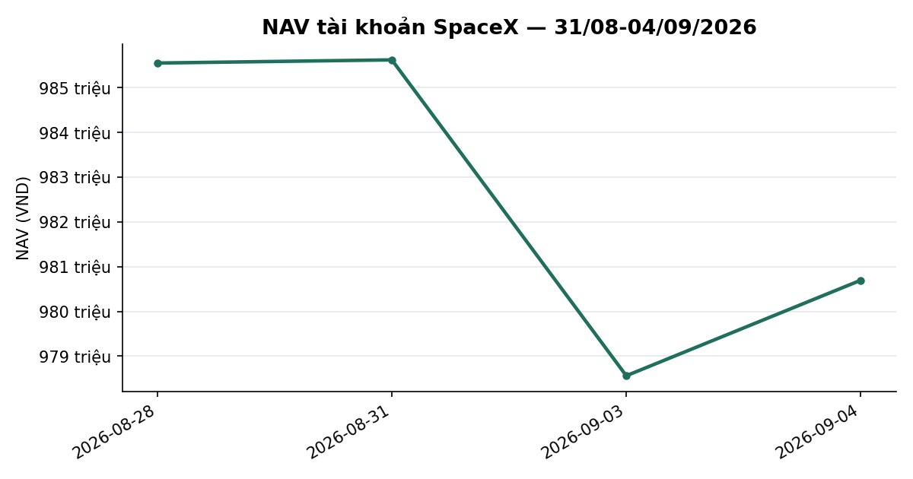
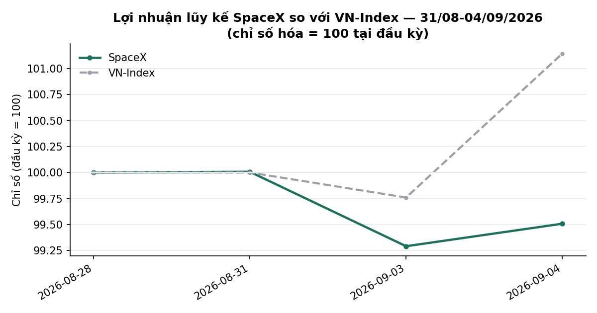
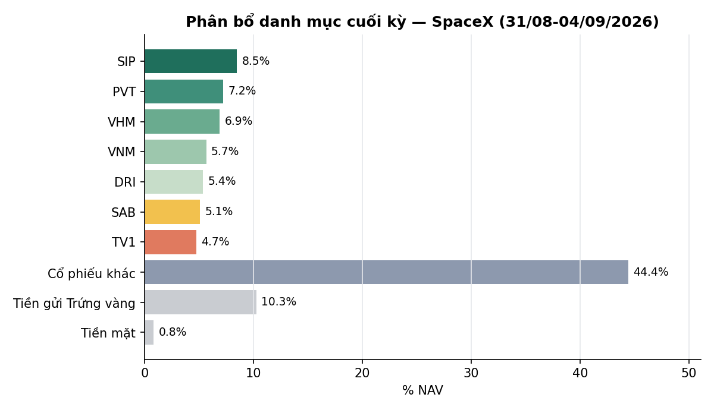

# BÁO CÁO TUẦN — TÀI KHOẢN SPACEX
## Kỳ báo cáo: 31/08/2026 – 04/09/2026

**Tài khoản:** SpaceX · DNSE, số hiệu 0002023347 · Chiến lược V2.4 (có sử dụng đòn bẩy ký quỹ)
**Ngày lập báo cáo:** 05/09/2026
**Đối tượng:** Báo cáo hiệu suất & quản lý danh mục — dành cho nhà đầu tư

> 📊 Báo cáo có kèm biểu đồ minh hoạ (NAV, lợi nhuận lũy kế so VN-Index, phân bổ danh mục) — xem
> bản email để thấy đầy đủ hình ảnh; bản trên kênh chat chỉ hiển thị văn bản.

> **Lưu ý lịch giao dịch:** kỳ này chỉ có **2 phiên giao dịch thực tế** — thứ Năm 03/09 và thứ Sáu
> 04/09. Ba ngày 31/08, 01/09 và 02/09 là nghỉ lễ Quốc khánh (bù lễ + ngày lễ chính thức), sàn HOSE
> đóng cửa hoàn toàn. Mọi so sánh NAV trong báo cáo lấy mốc đầu kỳ là phiên giao dịch gần nhất
> trước kỳ nghỉ (28/08/2026).

---

## 1. TÓM TẮT ĐIỀU HÀNH

| Chỉ tiêu | SpaceX |
|---|---:|
| NAV đầu kỳ (chốt 28/08, phiên trước nghỉ lễ) | 985.547.490 |
| NAV cuối kỳ (04/09) | **980.696.423** |
| Thay đổi trong kỳ | **−4.851.067 (−0,49%)** |
| VN-Index cùng kỳ (28/08 → 04/09) | 1.832,12 → 1.853,08 (**+1,14%**) |
| Giá trị cổ phiếu cuối kỳ | 871.838.750 |
| Tiền mặt tại công ty chứng khoán | 8.258.228 |
| Tài sản tích lũy khác | 100.599.445 |
| Tỷ trọng cổ phiếu / NAV | 88,9% |
| Số mã nắm giữ cuối kỳ | 27 |

**Nhận định tuần:** Chỉ có 2 phiên giao dịch thực tế trong kỳ do nghỉ lễ Quốc khánh kéo dài 3 ngày
(31/08–02/09). VN-Index tăng **+1,14%** qua 2 phiên (1.832,12 → 1.853,08). Danh mục SpaceX giảm nhẹ
**−0,49%** trong cùng giai đoạn — chênh lệch 1,63 điểm phần trăm so với chỉ số. Nguyên nhân chính:
độ rộng thị trường (tỷ lệ cổ phiếu vượt đường trung bình 50 phiên) giảm từ 36,7% xuống 32,7% trong
kỳ — mức tăng của chỉ số tiếp tục do một nhóm hẹp cổ phiếu vốn hóa lớn dẫn dắt, trong khi danh mục
đa dạng hóa theo ngành (27 mã, không tập trung nhóm dẫn dắt) không tăng đồng pha. Trạng thái thị
trường (mô hình phân loại 5 trạng thái nội bộ) giữ nguyên ở mức TRUNG TÍNH suốt kỳ, không kích hoạt
cơ chế phòng thủ nào. Không có giao dịch mua/bán chủ động và không có sự kiện quyền lợi cổ đông mới
phát sinh trong kỳ này.

---

## 2. BỐI CẢNH THỊ TRƯỜNG TRONG KỲ

| Ngày | VN-Index | Thay đổi | Ghi chú |
|---|---:|---:|---|
| 28/08 (trước kỳ) | 1.832,12 | — | Phiên cuối trước nghỉ lễ |
| 31/08 – 02/09 | — | — | HOSE đóng cửa (nghỉ lễ Quốc khánh) |
| 03/09 | 1.827,72 | −0,24% | |
| 04/09 | 1.853,08 | +1,39% | |

Cả kỳ (2 phiên) VN-Index tăng **+1,14%**, toàn bộ mức tăng đến từ phiên cuối 04/09. Độ rộng thị
trường (tỷ lệ cổ phiếu đóng cửa trên đường trung bình 50 phiên, tính trên rổ tham chiếu tại mỗi
ngày) giảm từ **36,7%** (28/08) xuống **32,7%** (04/09) — cho thấy đà tăng của chỉ số ngày càng
tập trung vào một nhóm hẹp cổ phiếu, chưa được đa số cổ phiếu trên thị trường xác nhận. Chỉ báo
định giá tổng hợp (P/E, P/B và chênh lệch lợi suất so với lãi suất tiết kiệm, so với phân vị lịch
sử 10 năm) ở mức **RẺ** tính đến 04/09.

---

## 3. DIỄN BIẾN NAV & DANH MỤC TRONG KỲ

### 3.1 NAV theo ngày

| Ngày | NAV (VND) | Thay đổi | VN-Index |
|---|---:|---:|---:|
| 28/08 (đầu kỳ) | 985.547.490 | — | — |
| 31/08 – 02/09 | — nghỉ lễ, không giao dịch — | | |
| 03/09 | 978.563.615 | −0,72% | −0,24% |
| 04/09 (cuối kỳ) | 980.696.423 | +0,22% | +1,39% |

Cả kỳ **−0,49%** so với VN-Index **+1,14%** — chênh lệch 1,63 điểm phần trăm.

### 3.2 Hoạt động giao dịch

Không có giao dịch mua/bán chủ động nào trong kỳ. Không có sự kiện quyền lợi cổ đông nào phát sinh
mới trong 2 phiên này.

### 3.3 Danh mục cuối kỳ (04/09/2026)

| Mã | KL | Giá trị thị trường (VND) | % NAV |
|---|---:|---:|---:|
| SIP | 1.700 | 83.130.000 | 8,48 |
| PVT | 3.500 | 70.700.000 | 7,21 |
| VHM | 900 | 67.680.000 | 6,90 |
| VNM | 900 | 55.710.000 | 5,68 |
| DRI | 3.700 | 52.540.000 | 5,36 |
| SAB | 1.100 | 49.885.000 | 5,09 |
| TV1 | 2.300 | 46.460.000 | 4,74 |
| BID | 1.175 | 42.897.585 | 4,37 |
| SCL | 1.500 | 42.000.000 | 4,28 |
| NCT | 500 | 41.800.000 | 4,26 |
| VCB | 700 | 41.230.000 | 4,20 |
| CTG | 1.200 | 37.680.000 | 3,84 |
| VPB | 1.200 | 33.360.000 | 3,40 |
| TCB | 1.000 | 32.600.000 | 3,32 |
| MBB | 1.675 | 34.421.250 | 3,51 |
| HPG | 1.200 | 26.040.000 | 2,66 |
| HDB | 800 | 21.760.000 | 2,22 |
| ACB | 900 | 19.980.000 | 2,04 |
| LPB | 400 | 19.600.000 | 2,00 |
| SHB | 800 | 9.640.000 | 0,98 |
| VRE | 300 | 7.950.000 | 0,81 |
| MSB | 600 | 7.890.000 | 0,80 |
| VIB | 500 | 7.525.000 | 0,77 |
| TPB | 500 | 7.350.000 | 0,75 |
| VIX | 420 | 5.880.000 | 0,60 |
| VND | 300 | 4.905.000 | 0,50 |
| EVF | 100 | 1.235.000 | 0,13 |
| **Tổng cổ phiếu (27 mã)** | | **871.848.665*** | **88,90** |
| Tiền mặt | | 8.258.228 | 0,84 |
| Tài sản tích lũy khác | | 100.599.445 | 10,26 |
| **Tổng NAV** | | **980.696.423** | **100,00** |

*Số lượng MBB trong bảng trên (1.675cp) đã cập nhật theo quyền mua thực hiện từ tuần trước
(28/08); giá trị thị trường tổng cổ phiếu bảng trên chênh lệch không đáng kể (~10 nghìn đồng,
<0,001% NAV) so với con số chính thức trong Mục 1 do làm tròn số lượng ở nguồn dữ liệu trung gian —
không ảnh hưởng đến NAV chính thức, vốn đã đối chiếu trực tiếp với số dư tài khoản tại công ty
chứng khoán.

**Ghi nhận:** danh mục tiếp tục cơ cấu đa dạng ngành đã thiết lập từ các kỳ trước — không mã nào
vượt 10% NAV (lớn nhất SIP ~8,5%). Không có tái cân bằng chủ động trong kỳ này (chỉ 2 phiên giao
dịch).

---

## 4. SỰ KIỆN QUYỀN LỢI CỔ ĐÔNG TRONG KỲ

Không có sự kiện quyền lợi cổ đông (cổ tức tiền mặt, cổ tức cổ phiếu, quyền mua) nào phát sinh mới
trong 2 phiên giao dịch của kỳ này.

---

## 5. KẾ HOẠCH KỲ TỚI (07/09 – 11/09/2026)

Lịch giao dịch tuần tới trở lại đầy đủ 5 phiên. Danh mục tiếp tục duy trì cơ cấu hiện tại theo
khung phân bổ đã thiết lập, điều chỉnh theo diễn biến giá và các chỉ báo định lượng của chiến lược.

---

## 6. PHỤ LỤC — PHƯƠNG PHÁP LUẬN

**Định giá:** Giá trị tài sản ròng (NAV) được tính theo phương pháp mark-to-market tại cuối mỗi
phiên giao dịch, đối chiếu trực tiếp với dữ liệu tài khoản tại công ty chứng khoán lưu ký.

**Cổ tức:** Tỷ suất sinh lời của từng vị thế (khi có phát sinh) được điều chỉnh cộng cổ tức tiền
mặt đã nhận trong kỳ nắm giữ, tính trên cơ sở ròng sau thuế thu nhập cá nhân 5%. Kỳ này không phát
sinh sự kiện cổ tức.

**Chi phí:** Phí giao dịch 0,075% mỗi lượt; thuế chuyển nhượng chứng khoán 0,1% trên giá trị bán.
Không có giao dịch mua/bán thị trường nào phát sinh phí trong kỳ này.

**Track record:** lịch sử hoạt động của tài khoản còn ngắn (~42 phiên kể từ khi bắt đầu hoạt động)
— so sánh với VN-Index trong giai đoạn này mang tính mô tả, chưa đủ độ dài dữ liệu để có ý nghĩa
thống kê đầy đủ khi đánh giá chiến lược.

**Công bố tuân thủ:**
- Đây không phải là khuyến nghị đầu tư. Kết quả hoạt động trong quá khứ không đảm bảo cho kết quả
  trong tương lai.
- Mọi số liệu trong báo cáo này được đối chiếu trực tiếp với dữ liệu giao dịch tại công ty chứng
  khoán lưu ký tài khoản.

---

*Báo cáo tuần 31/08–04/09/2026 — Tổng hợp và đối soát bởi Đội ngũ Quản lý Danh mục & Nghiên cứu Định lượng.*
