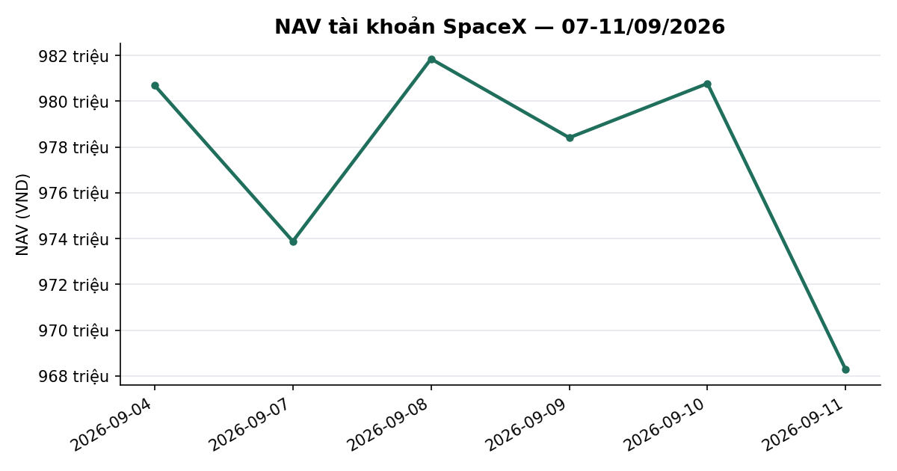
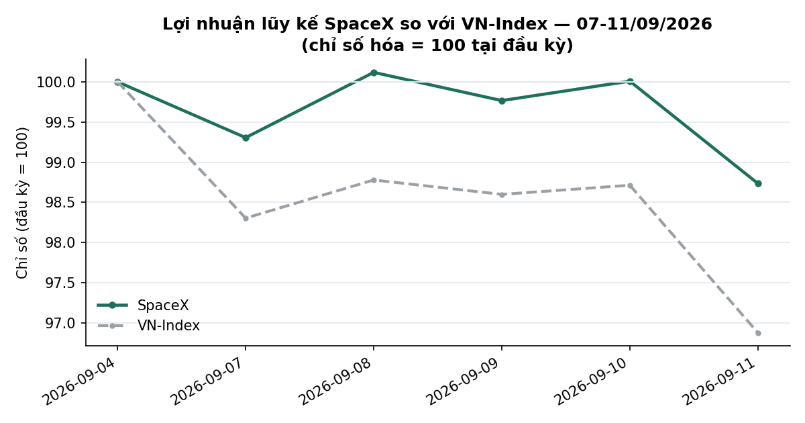
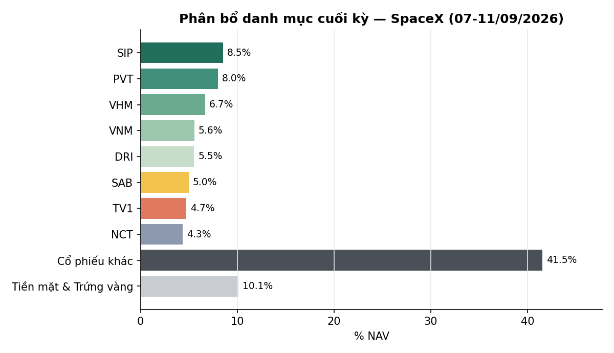

# BÁO CÁO TUẦN — TÀI KHOẢN SPACEX
## Kỳ báo cáo: 07/09/2026 – 11/09/2026

**Tài khoản:** SpaceX · DNSE, số hiệu 0002023347 · Chiến lược V2.4 (có sử dụng đòn bẩy ký quỹ)
**Ngày lập báo cáo:** 12/09/2026
**Đối tượng:** Báo cáo hiệu suất & quản lý danh mục — dành cho nhà đầu tư

> 📊 Báo cáo có kèm biểu đồ minh hoạ (NAV, lợi nhuận lũy kế so VN-Index, phân bổ danh mục) — xem
> bản email để thấy đầy đủ hình ảnh; bản trên kênh chat chỉ hiển thị văn bản.

---

## 1. TÓM TẮT ĐIỀU HÀNH

| Chỉ tiêu | SpaceX |
|---|---:|
| NAV đầu kỳ (chốt 04/09) | 980.696.423 |
| NAV cuối kỳ (11/09) | **968.286.290** |
| Thay đổi trong kỳ | **−12.410.133 (−1,27%)** |
| VN-Index cùng kỳ (04/09 → 11/09) | 1.853,08 → 1.795,21 (**−3,12%**) |
| Giá trị cổ phiếu cuối kỳ | 859.264.000 |
| Tiền mặt tại công ty chứng khoán | 8.258.545 |
| Tài sản tích lũy khác ("Trứng vàng") | 100.763.745 |
| Tỷ trọng cổ phiếu / NAV | 88,7% |
| Số mã nắm giữ cuối kỳ | 27 |

**Nhận định tuần:** VN-Index giảm **−3,12%** trong tuần, chủ yếu do phiên bán tháo diện rộng ngày
11/09 (−1,86% trong một phiên). Danh mục SpaceX giảm **−1,27%** — thấp hơn đáng kể mức giảm của
chỉ số, nhờ cơ cấu đa dạng hoá theo ngành (27 mã, không tập trung một nhóm ngành). Trạng thái thị
trường (mô hình phân loại 5 trạng thái nội bộ) giữ nguyên ở mức TRUNG TÍNH suốt tuần, không có
candidate chuyển trạng thái đang tích luỹ. Không có giao dịch mua/bán chủ động nào trong tuần và
không phát sinh sự kiện quyền lợi cổ đông mới.

---

## 2. BỐI CẢNH THỊ TRƯỜNG TRONG TUẦN

| Ngày | VN-Index | Thay đổi |
|---|---:|---:|
| 04/09 (trước kỳ) | 1.853,08 | — |
| 07/09 | 1.821,64 | −1,70% |
| 08/09 | 1.830,44 | +0,48% |
| 09/09 | 1.827,12 | −0,18% |
| 10/09 | 1.829,23 | +0,12% |
| 11/09 | 1.795,21 | −1,86% |

Tuần giảm điểm, biến động rõ rệt nhất ở hai đầu tuần (phiên 07/09) và cuối tuần (phiên 11/09) —
tổng cộng −3,12% trong 5 phiên. Độ rộng thị trường (tỷ lệ cổ phiếu đóng cửa trên đường trung bình
50 phiên, trên rổ ~846 mã có dữ liệu point-in-time) ở mức **28,5%** cuối tuần (11/09) — dưới 50%,
cho thấy đà giảm lan rộng hơn là chỉ tập trung ở vài mã lớn.

**Trạng thái thị trường (mô hình phân loại nội bộ, phòng vệ rủi ro):** giữ nguyên **TRUNG TÍNH**
suốt tuần, không có xu hướng mới đang hình thành (không có candidate tích luỹ sang trạng thái
khác). **Chỉ báo định giá tổng hợp (P/E, P/B, chênh lệch lợi suất so tiết kiệm, so lịch sử 10 năm):**
ở vùng **RẺ** (phân vị ~21/100 theo lịch sử 10 năm) — chỉ mang tính tham khảo, không phải tín hiệu
mua/bán trực tiếp.

---

## 3. DIỄN BIẾN NAV & DANH MỤC TRONG TUẦN

### 3.1 NAV theo ngày

| Ngày | NAV (VND) | Thay đổi | VN-Index |
|---|---:|---:|---:|
| 04/09 (đầu kỳ) | 980.696.423 | — | — |
| 07/09 | 973.885.133 | −0,69% | −1,70% |
| 08/09 | 981.852.900 | +0,82% | +0,48% |
| 09/09 | 978.410.318 | −0,35% | −0,18% |
| 10/09 | 980.777.333 | +0,24% | +0,12% |
| 11/09 (cuối kỳ) | 968.286.290 | −1,27% | −1,86% |

Cả tuần **−1,27%** so với VN-Index **−3,12%** — chênh lệch tích cực 1,85 điểm phần trăm, chủ yếu
đến từ việc danh mục không có mã nào chiếm tỷ trọng chi phối và ít mã vốn hoá lớn nhóm ngân hàng —
nhóm giảm mạnh nhất trong phiên bán tháo 11/09.

### 3.2 Hoạt động giao dịch

Không có giao dịch mua/bán chủ động nào trong tuần. Không phát sinh sự kiện quyền lợi cổ đông mới
(không có cổ tức/quyền mua nào chốt quyền trong kỳ này).

### 3.3 Danh mục cuối kỳ (11/09/2026)

| Mã | KL | Giá vốn thô*/cp | Giá 11/09 | Giá trị thị trường | % NAV | Tỷ suất %* |
|---|---:|---:|---:|---:|---:|---:|
| SIP | 1.700 | 47.059 | 48.500 | 82.450.000 | 8,52 | +3,06 |
| PVT | 3.500 | 17.100 | 22.100 | 77.350.000 | 7,99 | +29,24 |
| VHM | 900 | 74.900 | 72.000 | 64.800.000 | 6,69 | −3,87 |
| VNM | 900 | 58.600 | 59.900 | 53.910.000 | 5,57 | +2,22 |
| DRI | 3.700 | 13.262 | 14.500 | 53.650.000 | 5,54 | +9,33 |
| SAB | 1.100 | 44.368 | 43.850 | 48.235.000 | 4,98 | −1,41 |
| TV1 | 2.300 | 20.148 | 19.900 | 45.770.000 | 4,73 | −1,23 |
| NCT | 500 | 86.360 | 84.000 | 42.000.000 | 4,34 | −2,92 |
| BID | 1.175 | 39.571 | 35.600 | 41.830.000 | 4,32 | −10,04 |
| VCB | 700 | 61.464 | 58.200 | 40.740.000 | 4,21 | −5,31 |
| SCL | 1.500 | 23.600 | 26.500 | 39.750.000 | 4,10 | +12,29 |
| CTG | 1.200 | 33.806 | 29.950 | 35.940.000 | 3,71 | −11,32 |
| MBB | 1.675 | 20.657 | 19.750 | 33.081.250 | 3,42 | −4,42 |
| VPB | 1.200 | 27.746 | 26.950 | 32.340.000 | 3,34 | −2,87 |
| TCB | 1.000 | 33.900 | 31.600 | 31.600.000 | 3,26 | −6,78 |
| HPG | 1.200 | 22.200 | 21.300 | 25.560.000 | 2,64 | −4,05 |
| HDB | 800 | 26.709 | 26.800 | 21.440.000 | 2,21 | +0,34 |
| ACB | 900 | 22.656 | 22.050 | 19.845.000 | 2,05 | −2,67 |
| LPB | 400 | 52.183 | 46.700 | 18.680.000 | 1,93 | −10,51 |
| SHB | 800 | 12.281 | 11.550 | 9.240.000 | 0,95 | −5,95 |
| MSB | 600 | 13.542 | 12.950 | 7.770.000 | 0,80 | −4,37 |
| VRE | 300 | 25.550 | 25.600 | 7.680.000 | 0,79 | +0,20 |
| VIB | 547 | 13.620 | 13.250 | 7.247.750 | 0,75 | −2,71 |
| TPB | 500 | 16.800 | 14.150 | 7.075.000 | 0,73 | −15,77 |
| VIX | 420 | 15.464 | 13.250 | 5.565.000 | 0,57 | −14,32 |
| VND | 300 | 17.800 | 15.150 | 4.545.000 | 0,47 | −14,89 |
| EVF | 100 | 12.550 | 11.700 | 1.170.000 | 0,12 | −6,77 |
| **Tổng cổ phiếu (27 mã)** | | | | **859.264.000** | **88,74** | |
| Tiền mặt tại CTCK | | | | 8.258.545 | 0,85 | |
| Tài sản tích lũy khác ("Trứng vàng") | | | | 100.763.745 | 10,41 | |
| **Tổng NAV** | | | | **968.286.290** | **100,00** | |

*Cột "Giá vốn thô/cp" và "Tỷ suất %" đã cộng lại cổ tức tiền mặt ròng (sau thuế TNCN 5%) của các
sự kiện đã chốt quyền trong thời gian nắm giữ vị thế (SAB, NCT, VCB, CTG, MBB) — tỷ suất tính từ
khi mở vị thế, không phải trong riêng tuần này. Nguồn: đối chiếu trực tiếp giá vốn/khối lượng của
công ty chứng khoán lưu ký (DNSE) với giá đóng cửa phiên 11/09/2026.

**Ghi nhận:** danh mục tiếp tục đa dạng hoá theo ngành, không mã nào vượt 9% NAV (lớn nhất SIP
~8,5%). Không có lệnh nào phát sinh riêng trong tuần này — biến động tỷ trọng hoàn toàn đến từ
biến động giá thị trường.

---

## 4. SỰ KIỆN QUYỀN LỢI CỔ ĐÔNG TRONG TUẦN

Không có sự kiện quyền lợi cổ đông (cổ tức, quyền mua, chia tách) nào chốt quyền trong tuần này
đối với danh mục SpaceX.

---

## 5. KẾ HOẠCH TUẦN TỚI (14/09 – 18/09/2026)

Danh mục tiếp tục duy trì cơ cấu hiện tại theo khung phân bổ đã thiết lập, điều chỉnh theo diễn
biến giá và các chỉ báo định lượng của chiến lược. Trạng thái thị trường nội bộ vẫn ở mức TRUNG
TÍNH — không có tín hiệu chuyển sang chế độ phòng thủ hay tấn công trong ngắn hạn.

---

## 6. PHỤ LỤC — PHƯƠNG PHÁP LUẬN

**Định giá:** Giá trị tài sản ròng (NAV) được tính theo phương pháp mark-to-market tại cuối mỗi
phiên giao dịch, đối chiếu trực tiếp với dữ liệu tài khoản tại công ty chứng khoán lưu ký.

**Cổ tức:** Tỷ suất sinh lời của từng vị thế được điều chỉnh cộng cổ tức tiền mặt đã nhận trong
thời gian nắm giữ, tính trên cơ sở ròng sau thuế thu nhập cá nhân 5%.

**Chi phí:** Phí giao dịch 0,075% mỗi lượt; thuế chuyển nhượng chứng khoán 0,1% trên giá trị bán.
Không có giao dịch mua/bán thị trường nào phát sinh phí trong tuần này.

**Track record:** lịch sử hoạt động của tài khoản còn ngắn (~2,5 tháng kể từ khi bắt đầu hoạt
động) — so sánh với VN-Index trong giai đoạn này mang tính mô tả, chưa đủ độ dài dữ liệu để có ý
nghĩa thống kê đầy đủ khi đánh giá chiến lược.

**Công bố tuân thủ:**
- Đây không phải là khuyến nghị đầu tư. Kết quả hoạt động trong quá khứ không đảm bảo cho kết quả
  trong tương lai.
- Mọi số liệu trong báo cáo này được đối chiếu trực tiếp với dữ liệu giao dịch tại công ty chứng
  khoán lưu ký tài khoản.

---

*Báo cáo tuần 07-11/09/2026 — Tổng hợp và đối soát bởi Đội ngũ Quản lý Danh mục & Nghiên cứu Định lượng.*
