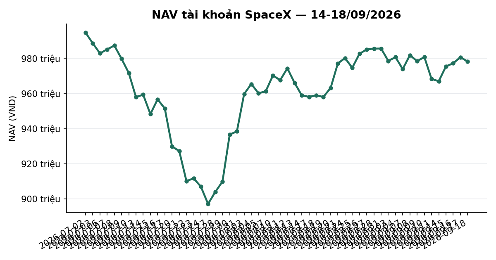
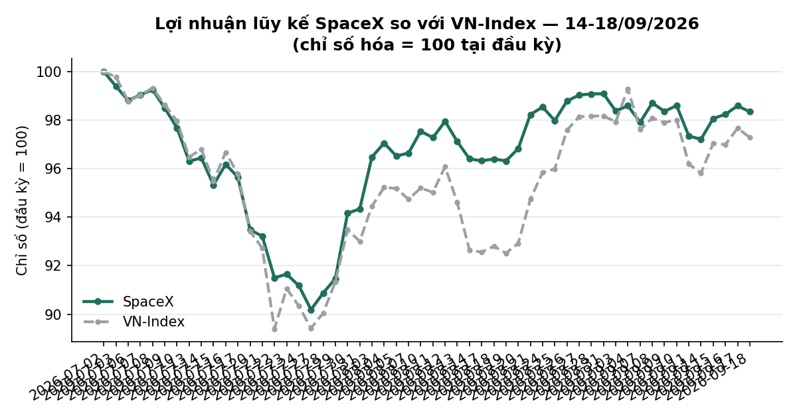
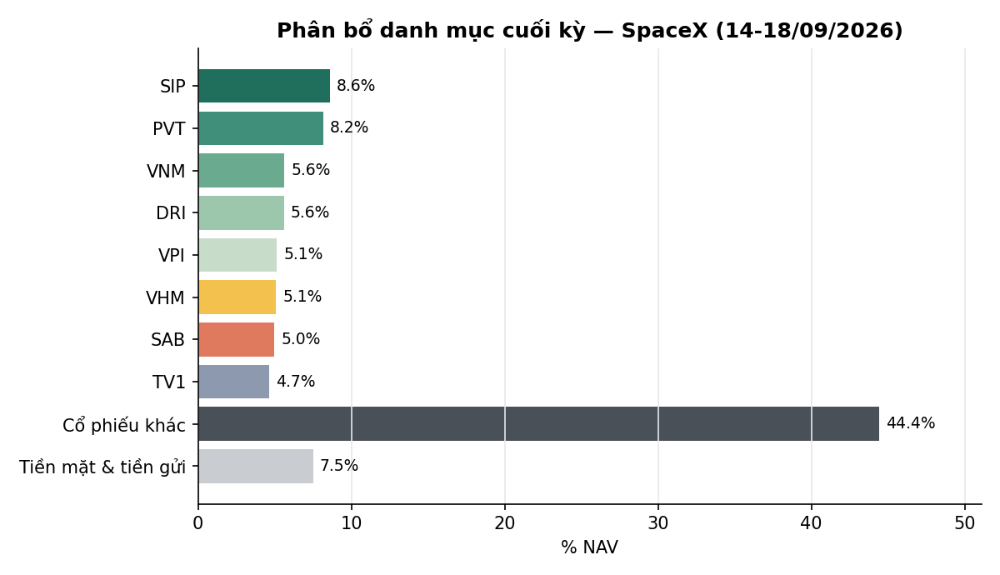

# BÁO CÁO TUẦN — TÀI KHOẢN SPACEX
## Kỳ báo cáo: 14/09/2026 – 18/09/2026

**Tài khoản:** SpaceX · DNSE, số hiệu 0002023347 · Chiến lược V2.4 (có sử dụng đòn bẩy ký quỹ)
**Ngày lập báo cáo:** 19/09/2026
**Đối tượng:** Báo cáo hiệu suất & quản lý danh mục — dành cho nhà đầu tư

> 📊 Báo cáo có kèm biểu đồ minh hoạ (NAV, lợi nhuận lũy kế so VN-Index, phân bổ danh mục) — xem
> bản email để thấy đầy đủ hình ảnh; bản trên kênh chat chỉ hiển thị văn bản.

---

## 1. TÓM TẮT ĐIỀU HÀNH

| Chỉ tiêu | SpaceX |
|---|---:|
| NAV đầu kỳ (chốt 11/09) | 968.286.290 |
| NAV cuối kỳ (18/09) | **978.228.740** |
| Thay đổi trong kỳ | **+9.942.450 (+1,03%)** |
| VN-Index cùng kỳ (11/09 → 18/09) | 1.795,21 → 1.815,66 (**+1,14%**) |
| Giá trị cổ phiếu cuối kỳ | 904.740.950 |
| Tiền mặt & tiền gửi ngắn hạn cuối kỳ | 73.487.790 |
| Tỷ trọng cổ phiếu / NAV | 92,5% |
| Số mã nắm giữ cuối kỳ | 28 |

**Nhận định tuần:** VN-Index tăng **+1,14%** trong tuần (1.795,21 → 1.815,66), diễn biến giằng co —
tăng mạnh phiên 15/09 (+1,28%) rồi đi ngang/giảm nhẹ các phiên còn lại. Danh mục SpaceX tăng
**+1,03%**, bám sát chỉ số (chênh lệch −0,11 điểm phần trăm). Hoạt động nổi bật trong tuần: danh
mục mở vị thế mới **VPI** (800 cổ phiếu, giá vốn bình quân 62.375đ/cp, ~5,1% NAV) theo tín hiệu
định lượng của chiến lược — giao dịch mua đầu tiên của cấu phần momentum (BAL) kể từ khi tài khoản
đi vào hoạt động. Giao dịch được tài trợ một phần bằng cách tất toán một phần khoản tiền gửi ngắn
hạn ("Trứng vàng"). Trạng thái thị trường (mô hình phân loại 5 trạng thái nội bộ) giữ nguyên ở mức
TRUNG TÍNH suốt tuần, không kích hoạt cơ chế phòng thủ nào.

---

## 2. BỐI CẢNH THỊ TRƯỜNG TRONG TUẦN

| Ngày | VN-Index | Thay đổi |
|---|---:|---:|
| 11/09 (trước kỳ) | 1.795,21 | — |
| 14/09 | 1.788,23 | −0,39% |
| 15/09 | 1.811,15 | +1,28% |
| 16/09 | 1.810,11 | −0,06% |
| 17/09 | 1.822,77 | +0,70% |
| 18/09 | 1.815,66 | −0,39% |

Tuần tăng nhẹ **+1,14%**, biến động giằng co quanh vùng 1.810–1.823 sau phiên bật tăng đầu tuần
(15/09). Độ rộng thị trường (tỷ lệ cổ phiếu đóng cửa trên đường trung bình 50 phiên) cải thiện từ
28,6% (11/09) lên **36,0%** (18/09) — xu hướng cải thiện nhưng vẫn dưới ngưỡng 50%, cho thấy đà
tăng của chỉ số chưa được đa số cổ phiếu xác nhận.

---

## 3. DIỄN BIẾN NAV & DANH MỤC TRONG TUẦN

### 3.1 NAV theo ngày

| Ngày | NAV (VND) | Thay đổi | VN-Index |
|---|---:|---:|---:|
| 11/09 (đầu kỳ) | 968.286.290 | — | — |
| 14/09 | 966.991.250 | −0,13% | −0,39% |
| 15/09 | 975.493.767 | +0,88% | +1,28% |
| 16/09 | 977.178.384 | +0,17% | −0,06% |
| 17/09 | 980.680.733 | +0,36% | +0,70% |
| 18/09 (cuối kỳ) | 978.228.740 | −0,25% | −0,39% |

Cả tuần **+1,03%** so với VN-Index **+1,14%** — chênh lệch −0,11 điểm phần trăm, bám sát chỉ số.

### 3.2 Hiệu suất lũy kế

| Giai đoạn | SpaceX | VN-Index | Chênh lệch |
|---|---:|---:|---:|
| Tuần này (11/09 → 18/09) | +1,03% | +1,14% | −0,11pp |
| Từ đầu tháng 9 (MTD, 28/08 → 18/09) | −0,75% | −0,90% | +0,15pp |
| Từ khi bắt đầu hoạt động (01/07 → 18/09) | −1,66% | −2,76% | +1,10pp |

### 3.3 Hoạt động giao dịch

Trong tuần, danh mục thực hiện một giao dịch mua: cổ phiếu **VPI**, tổng khối lượng 800 cổ phiếu,
giá vốn bình quân 62.375đ/cp (~49,9tr VND, tương đương ~5,1% NAV cuối kỳ) — vị thế mới theo tín
hiệu định lượng của cấu phần momentum trong chiến lược. Phần vốn cần thiết được tài trợ một phần từ
việc tất toán khoản tiền gửi ngắn hạn ("Trứng vàng"), phần còn lại từ tiền mặt sẵn có tại công ty
chứng khoán. Không có giao dịch bán nào trong tuần. Phí giao dịch áp dụng 0,097% trên giá trị mua.

### 3.4 Danh mục cuối kỳ (18/09/2026)

| Mã | KL | Giá vốn | Giá 18/09 | Giá trị thị trường | % NAV | Lãi/lỗ |
|---|---:|---:|---:|---:|---:|---:|
| SIP | 1.700 | 47.059 | 49.500 | 84.150.000 | 8,60 | +5,19% |
| PVT | 3.500 | 17.100 | 22.800 | 79.800.000 | 8,16 | +33,33% |
| VNM | 900 | 58.600 | 61.200 | 55.080.000 | 5,63 | +4,44% |
| DRI | 3.700 | 13.262 | 14.800 | 54.760.000 | 5,60 | +11,60% |
| VPI | 800 | 62.375 | 62.900 | 50.320.000 | 5,14 | +0,84% |
| VHM | 700 | 74.900 | 71.000 | 49.700.000 | 5,08 | −5,21% |
| SAB | 1.100 | 47.368 | 44.300 | 48.730.000 | 4,98 | −6,48% |
| TV1 | 2.300 | 20.148 | 19.800 | 45.540.000 | 4,66 | −1,73% |
| NCT | 500 | 94.360 | 84.400 | 42.200.000 | 4,31 | −10,56% |
| BID | 1.175 | 39.945 | 35.750 | 42.016.128 | 4,30 | −10,50% |
| VCB | 700 | 61.786 | 59.900 | 41.930.000 | 4,29 | −3,05% |
| SCL | 1.500 | 23.600 | 26.000 | 39.000.000 | 3,99 | +10,17% |
| CTG | 1.200 | 34.181 | 30.250 | 36.300.000 | 3,71 | −11,50% |
| VPB | 1.200 | 27.746 | 27.450 | 32.940.000 | 3,37 | −1,07% |
| TCB | 1.000 | 33.900 | 31.600 | 31.600.000 | 3,23 | −6,78% |
| MBB | 1.565 | 22.109 | 19.900 | 31.143.500 | 3,18 | −9,99% |
| HPG | 1.200 | 22.200 | 21.550 | 25.860.000 | 2,64 | −2,93% |
| HDB | 800 | 26.709 | 27.500 | 22.000.000 | 2,25 | +2,96% |
| ACB | 900 | 22.656 | 21.900 | 19.710.000 | 2,01 | −3,33% |
| LPB | 400 | 52.183 | 48.000 | 19.200.000 | 1,96 | −8,02% |
| SHB | 800 | 12.281 | 11.800 | 9.440.000 | 0,97 | −3,92% |
| MSB | 600 | 13.542 | 12.900 | 7.740.000 | 0,79 | −4,74% |
| VRE | 300 | 25.550 | 25.500 | 7.650.000 | 0,78 | −0,20% |
| VIB | 548 | 13.607 | 13.600 | 7.446.000 | 0,76 | −0,05% |
| TPB | 500 | 16.800 | 14.100 | 7.050.000 | 0,72 | −16,07% |
| VIX | 420 | 15.464 | 13.150 | 5.523.000 | 0,56 | −14,97% |
| VND | 300 | 17.800 | 15.200 | 4.560.000 | 0,47 | −14,61% |
| EVF | 100 | 12.550 | 11.800 | 1.180.000 | 0,12 | −5,98% |
| Tiền mặt & tiền gửi | | | | 73.487.790 | 7,51 | |
| **Tổng NAV** | | | | **978.228.740** | **100,00** | |

*Cột "Lãi/lỗ" là lãi/lỗ chưa thực hiện trên giá vốn thực tế (chưa gồm cổ tức tiền mặt trong kỳ nắm
giữ — tuần này không phát sinh sự kiện cổ tức cho các mã đang nắm giữ). Tổng lãi/lỗ chưa thực hiện
toàn danh mục: +718.990 VND.*

**Ghi nhận:** danh mục tiếp tục là rổ đa dạng hoá theo ngành (28 mã, không mã nào vượt 10% NAV) —
mã lớn nhất SIP ở mức 8,6%. VPI là vị thế mới duy nhất trong tuần, được thêm theo đúng khung phân
bổ của chiến lược.

---

## 4. KẾ HOẠCH TUẦN TỚI (21/09 – 25/09/2026)

Danh mục tiếp tục duy trì cơ cấu hiện tại theo khung phân bổ đã thiết lập, điều chỉnh theo diễn
biến giá và các chỉ báo định lượng của chiến lược. Không có kế hoạch tái cơ cấu lớn được đặt trước
cho tuần tới.

---

## 5. PHỤ LỤC — PHƯƠNG PHÁP LUẬN

**Định giá:** Giá trị tài sản ròng (NAV) được tính theo phương pháp mark-to-market tại cuối mỗi
phiên giao dịch, đối chiếu trực tiếp với dữ liệu tài khoản tại công ty chứng khoán lưu ký.

**Cổ tức:** Tỷ suất sinh lời của từng vị thế được điều chỉnh cộng cổ tức tiền mặt đã nhận trong kỳ
nắm giữ, tính trên cơ sở ròng sau thuế thu nhập cá nhân 5%.

**Chi phí:** Phí giao dịch 0,097% mỗi lượt (HOSE); thuế chuyển nhượng chứng khoán 0,1% trên giá trị
bán. Tuần này phát sinh phí trên giao dịch mua VPI (~49,9tr VND).

**Track record:** lịch sử hoạt động của tài khoản còn ngắn (~54 phiên kể từ khi bắt đầu hoạt động
01/07/2026) — so sánh với VN-Index trong giai đoạn này mang tính mô tả, chưa đủ độ dài dữ liệu để
có ý nghĩa thống kê đầy đủ khi đánh giá chiến lược.

**Công bố tuân thủ:**
- Đây không phải là khuyến nghị đầu tư. Kết quả hoạt động trong quá khứ không đảm bảo cho kết quả
  trong tương lai.
- Mọi số liệu trong báo cáo này được đối chiếu trực tiếp với dữ liệu giao dịch tại công ty chứng
  khoán lưu ký tài khoản.

---

*Báo cáo tuần 14-18/09/2026 — Tổng hợp và đối soát bởi Đội ngũ Quản lý Danh mục & Nghiên cứu Định lượng.*
