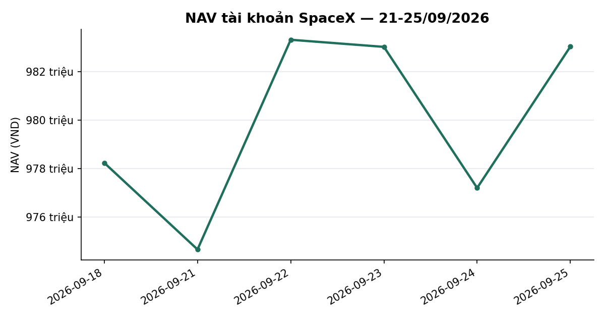
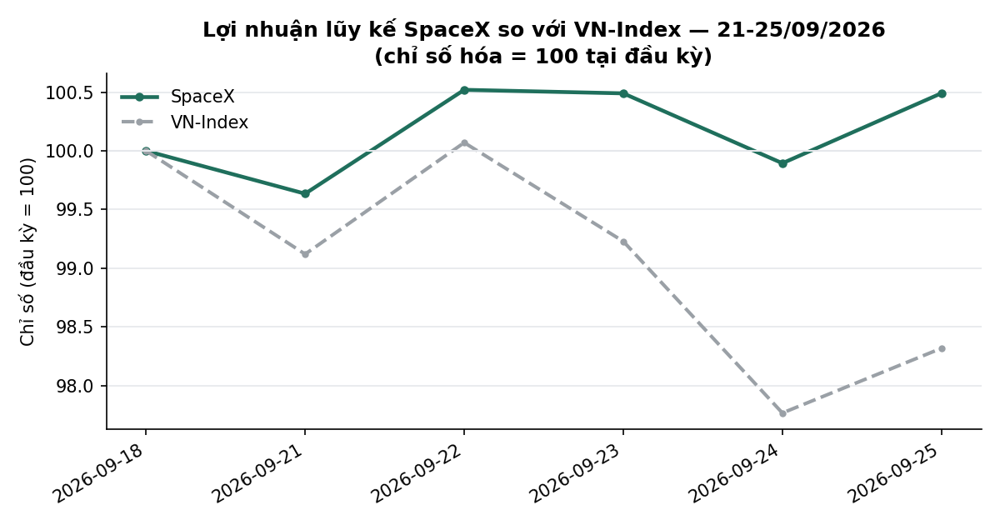
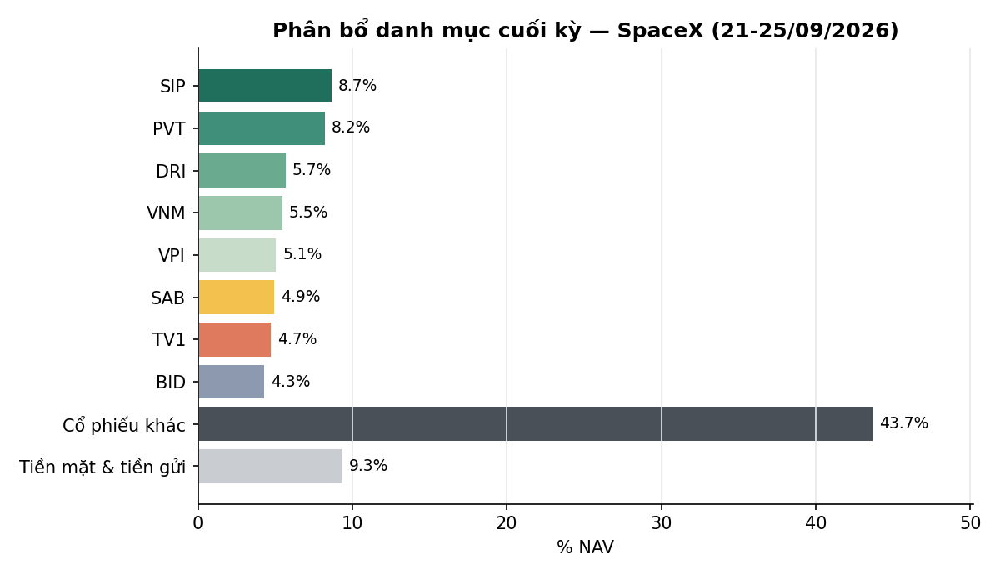

# BÁO CÁO TUẦN — TÀI KHOẢN SPACEX
## Kỳ báo cáo: 21/09/2026 – 25/09/2026

**Tài khoản:** SpaceX · DNSE, số hiệu 0002023347 · Chiến lược V2.4 (có sử dụng đòn bẩy ký quỹ)
**Ngày lập báo cáo:** 26/09/2026
**Đối tượng:** Báo cáo hiệu suất & quản lý danh mục — dành cho nhà đầu tư

> 📊 Báo cáo có kèm biểu đồ minh hoạ (NAV, lợi nhuận lũy kế so VN-Index, phân bổ danh mục) — xem
> bản email để thấy đầy đủ hình ảnh; bản trên kênh chat chỉ hiển thị văn bản.

---

## 1. TÓM TẮT ĐIỀU HÀNH

| Chỉ tiêu | SpaceX |
|---|---:|
| NAV đầu kỳ (chốt 18/09) | 978.228.740 |
| NAV cuối kỳ (25/09) | **983.031.669** |
| Thay đổi trong kỳ | **+4.802.929 (+0,49%)** |
| VN-Index cùng kỳ (18/09 → 25/09) | 1.815,66 → 1.785,11 (**−1,68%**) |
| Giá trị cổ phiếu cuối kỳ | 891.084.550 |
| Tiền mặt & tiền gửi ngắn hạn cuối kỳ | 91.947.119 |
| Tỷ trọng cổ phiếu / NAV | 90,6% |
| Số mã nắm giữ cuối kỳ | 28 |

**Nhận định tuần:** VN-Index giảm **−1,68%** trong tuần (1.815,66 → 1.785,11), diễn biến điều
chỉnh rõ nét — giảm mạnh nhất phiên 24/09 (−1,47%) sau khi đã tăng tốt phiên 22/09 (+0,96%). Danh
mục SpaceX vẫn tăng nhẹ **+0,49%**, vượt chỉ số **+2,17 điểm phần trăm** trong tuần — mức chênh
lệch tích cực rõ rệt, phản ánh danh mục đa dạng hoá có độ nhạy thấp hơn chỉ số trong nhịp điều
chỉnh. Trong tuần, cổ phiếu **VPB** thực hiện chia cổ tức bằng cổ phiếu tỷ lệ 26% (ngày giao dịch
không hưởng quyền 24/09/2026), làm tăng số lượng cổ phiếu nắm giữ tương ứng mà không ảnh hưởng đến
tổng giá trị thị trường tại thời điểm chia. Hoạt động giao dịch trong tuần là các điều chỉnh tỷ
trọng nhỏ theo cơ chế tái cân bằng định kỳ của chiến lược khi thị trường ở trạng thái Trung tính,
không phải phản ứng với biến động ngắn hạn. Trạng thái thị trường (mô hình phân loại 5 trạng thái
nội bộ) giữ nguyên ở mức TRUNG TÍNH suốt tuần, không kích hoạt cơ chế phòng thủ nào.

---

## 2. BỐI CẢNH THỊ TRƯỜNG TRONG TUẦN

| Ngày | VN-Index | Thay đổi |
|---|---:|---:|
| 18/09 (trước kỳ) | 1.815,66 | — |
| 21/09 | 1.799,67 | −0,88% |
| 22/09 | 1.816,93 | +0,96% |
| 23/09 | 1.801,65 | −0,84% |
| 24/09 | 1.775,09 | −1,47% |
| 25/09 | 1.785,11 | +0,56% |

Tuần điều chỉnh **−1,68%**, biến động giằng co mạnh hơn tuần trước — bật tăng đầu tuần rồi giảm
liên tiếp 2 phiên cuối, đáy tuần rơi vào phiên 24/09. Độ rộng thị trường (tỷ lệ cổ phiếu đóng cửa
trên đường trung bình 50 phiên, universe point-in-time) giảm từ 36,1% (18/09) xuống **32,4%**
(25/09) — cùng chiều với nhịp điều chỉnh của chỉ số, cho thấy sức mua chung thị trường yếu đi.

---

## 3. DIỄN BIẾN NAV & DANH MỤC TRONG TUẦN

### 3.1 NAV theo ngày

| Ngày | NAV (VND) | Thay đổi | VN-Index |
|---|---:|---:|---:|
| 18/09 (đầu kỳ) | 978.228.740 | — | — |
| 21/09 | 974.653.192 | −0,37% | −0,88% |
| 22/09 | 983.315.018 | +0,89% | +0,96% |
| 23/09 | 983.020.903 | −0,03% | −0,84% |
| 24/09 | 977.194.265 | −0,59% | −1,47% |
| 25/09 (cuối kỳ) | 983.031.669 | +0,60% | +0,56% |

Cả tuần **+0,49%** so với VN-Index **−1,68%** — chênh lệch **+2,17 điểm phần trăm**, vượt chỉ số
rõ rệt trong nhịp điều chỉnh.

### 3.2 Hiệu suất lũy kế

| Giai đoạn | SpaceX | VN-Index | Chênh lệch |
|---|---:|---:|---:|
| Tuần này (18/09 → 25/09) | +0,49% | −1,68% | +2,17pp |
| Từ đầu tháng 9 (MTD, 28/08 → 25/09) | −0,26% | −2,57% | +2,30pp |
| Từ khi bắt đầu hoạt động (01/07 → 25/09) | −1,70% | −4,40% | +2,70pp |

### 3.3 Hoạt động giao dịch

Trong tuần, danh mục thực hiện các giao dịch điều chỉnh tỷ trọng nhỏ theo cơ chế tái cân bằng định
kỳ: bán một phần vị thế **MBB, VHM và VPB** (mỗi mã 100 cổ phiếu) ngày 21/09, và **HDB** (100 cổ
phiếu) ngày 24/09 — tổng giá trị giao dịch khoảng 14,8 triệu VND, không phải phản ứng với biến động
giá ngắn hạn. Không có giao dịch mua nào trong tuần. Phí giao dịch áp dụng 0,097% trên giá trị bán.
Riêng cổ phiếu **VPB** ghi nhận sự kiện chia cổ tức bằng cổ phiếu tỷ lệ 26% (ngày giao dịch không
hưởng quyền 24/09/2026), làm tăng số lượng cổ phiếu nắm giữ tương ứng — đây là điều chỉnh kỹ thuật
theo quyền lợi cổ đông, không phải giao dịch mua mới.

### 3.4 Danh mục cuối kỳ (25/09/2026)

| Mã | KL | Giá vốn | Giá 25/09 | Giá trị thị trường | % NAV | Lãi/lỗ |
|---|---:|---:|---:|---:|---:|---:|
| SIP | 1.700 | 47.059 | 50.000 | 85.000.000 | 8,65 | +6,25% |
| PVT | 3.500 | 17.100 | 23.100 | 80.850.000 | 8,22 | +35,09% |
| DRI | 3.700 | 13.262 | 15.100 | 55.870.000 | 5,68 | +13,86% |
| VNM | 900 | 58.600 | 59.800 | 53.820.000 | 5,47 | +2,05% |
| VPI | 800 | 62.375 | 62.200 | 49.760.000 | 5,06 | −0,28% |
| SAB | 1.100 | 47.368 | 43.900 | 48.290.000 | 4,91 | −7,32% |
| TV1 | 2.300 | 20.148 | 20.100 | 46.230.000 | 4,70 | −0,24% |
| BID | 1.175 | 39.945 | 35.750 | 42.016.128 | 4,27 | −10,50% |
| NCT | 500 | 94.360 | 83.600 | 41.800.000 | 4,25 | −11,40% |
| VHM | 600 | 74.900 | 69.100 | 41.460.000 | 4,22 | −7,74% |
| VCB | 700 | 61.786 | 58.000 | 40.600.000 | 4,13 | −6,13% |
| SCL | 1.500 | 23.600 | 26.800 | 40.200.000 | 4,09 | +13,56% |
| CTG | 1.200 | 34.181 | 30.150 | 36.180.000 | 3,68 | −11,79% |
| TCB | 1.000 | 33.900 | 33.250 | 33.250.000 | 3,38 | −1,92% |
| VPB | 1.386 | 22.014 | 23.000 | 31.888.383 | 3,24 | +4,48% |
| MBB | 1.575 | 20.657 | 19.900 | 31.342.500 | 3,19 | −3,66% |
| HPG | 1.200 | 22.200 | 20.650 | 24.780.000 | 2,52 | −6,98% |
| HDB | 700 | 26.709 | 27.800 | 19.460.000 | 1,98 | +4,08% |
| ACB | 900 | 22.656 | 21.400 | 19.260.000 | 1,96 | −5,54% |
| LPB | 400 | 52.183 | 46.450 | 18.580.000 | 1,89 | −10,99% |
| SHB | 800 | 12.281 | 11.600 | 9.280.000 | 0,94 | −5,55% |
| MSB | 600 | 13.542 | 14.050 | 8.430.000 | 0,86 | +3,75% |
| VRE | 300 | 25.550 | 24.500 | 7.350.000 | 0,75 | −4,11% |
| VIB | 548 | 13.607 | 13.400 | 7.336.500 | 0,75 | −1,52% |
| TPB | 500 | 16.800 | 14.600 | 7.300.000 | 0,74 | −13,10% |
| VIX | 420 | 15.464 | 12.650 | 5.313.000 | 0,54 | −18,20% |
| VND | 300 | 17.800 | 14.350 | 4.305.000 | 0,44 | −19,38% |
| EVF | 100 | 12.550 | 11.600 | 1.160.000 | 0,12 | −7,57% |
| Tiền mặt & tiền gửi | | | | 91.947.119 | 9,35 | |
| **Tổng NAV** | | | | **983.031.669** | **100,00** | |

*Cột "Lãi/lỗ" là lãi/lỗ chưa thực hiện trên giá vốn thực tế, tính theo giá đóng cửa 25/09/2026;
chưa gồm cổ tức tiền mặt phát sinh trong kỳ nắm giữ (tuần này không có sự kiện cổ tức tiền mặt cho
các mã đang nắm giữ). Tổng lãi/lỗ chưa thực hiện toàn danh mục: khoảng +4.263.000 VND.*

**Ghi nhận:** danh mục tiếp tục là rổ đa dạng hoá theo ngành (28 mã, không mã nào vượt 10% NAV) —
mã lớn nhất SIP ở mức 8,65%. Đây là tuần điều chỉnh của thị trường chung nhưng danh mục thể hiện
khả năng phòng vệ tốt (bám sát/vượt chỉ số) nhờ tính đa dạng hoá và tỷ trọng cổ phiếu giá trị.

---

## 4. KẾ HOẠCH TUẦN TỚI (28/09 – 02/10/2026)

Danh mục tiếp tục duy trì cơ cấu hiện tại theo khung phân bổ đã thiết lập, điều chỉnh theo diễn
biến giá và các chỉ báo định lượng của chiến lược. Không có kế hoạch tái cơ cấu lớn được đặt trước
cho tuần tới.

---

## 5. PHỤ LỤC — PHƯƠNG PHÁP LUẬN

**Định giá:** Giá trị tài sản ròng (NAV) được tính theo phương pháp mark-to-market tại cuối mỗi
phiên giao dịch, đối chiếu trực tiếp với dữ liệu tài khoản tại công ty chứng khoán lưu ký.

**Cổ tức & quyền lợi cổ đông:** Tỷ suất sinh lời của từng vị thế được điều chỉnh cộng cổ tức tiền
mặt đã nhận trong kỳ nắm giữ, tính trên cơ sở ròng sau thuế thu nhập cá nhân 5%. Các sự kiện chia cổ
phiếu (cổ tức bằng cổ phiếu, phát hành thêm) được điều chỉnh trực tiếp vào số lượng cổ phiếu nắm
giữ, không ảnh hưởng đến giá trị thị trường tại thời điểm phát sinh.

**Chi phí:** Phí giao dịch 0,097% mỗi lượt (HOSE); thuế chuyển nhượng chứng khoán 0,1% trên giá trị
bán. Tuần này phát sinh phí trên các giao dịch bán tỷ trọng nhỏ (~14,8tr VND tổng giá trị).

**Track record:** lịch sử hoạt động của tài khoản còn ngắn (~61 phiên kể từ khi bắt đầu hoạt động
01/07/2026) — so sánh với VN-Index trong giai đoạn này mang tính mô tả, chưa đủ độ dài dữ liệu để
có ý nghĩa thống kê đầy đủ khi đánh giá chiến lược.

**Công bố tuân thủ:**
- Đây không phải là khuyến nghị đầu tư. Kết quả hoạt động trong quá khứ không đảm bảo cho kết quả
  trong tương lai.
- Mọi số liệu trong báo cáo này được đối chiếu trực tiếp với dữ liệu giao dịch tại công ty chứng
  khoán lưu ký tài khoản.

---

*Báo cáo tuần 21-25/09/2026 — Tổng hợp và đối soát bởi Đội ngũ Quản lý Danh mục & Nghiên cứu Định lượng.*
