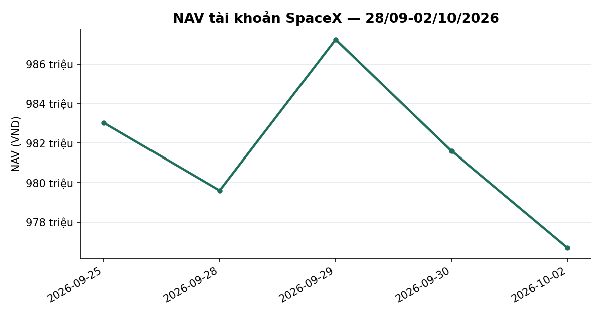
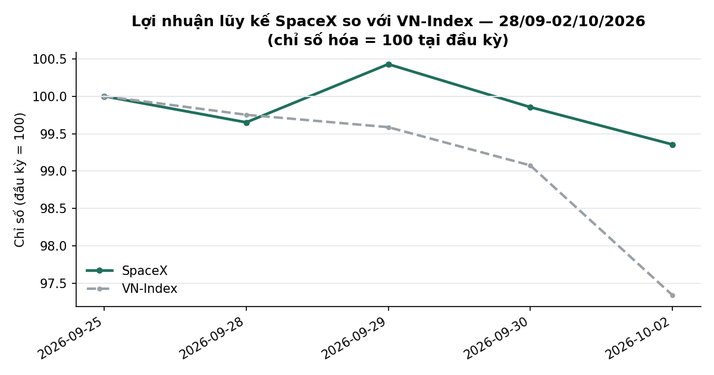
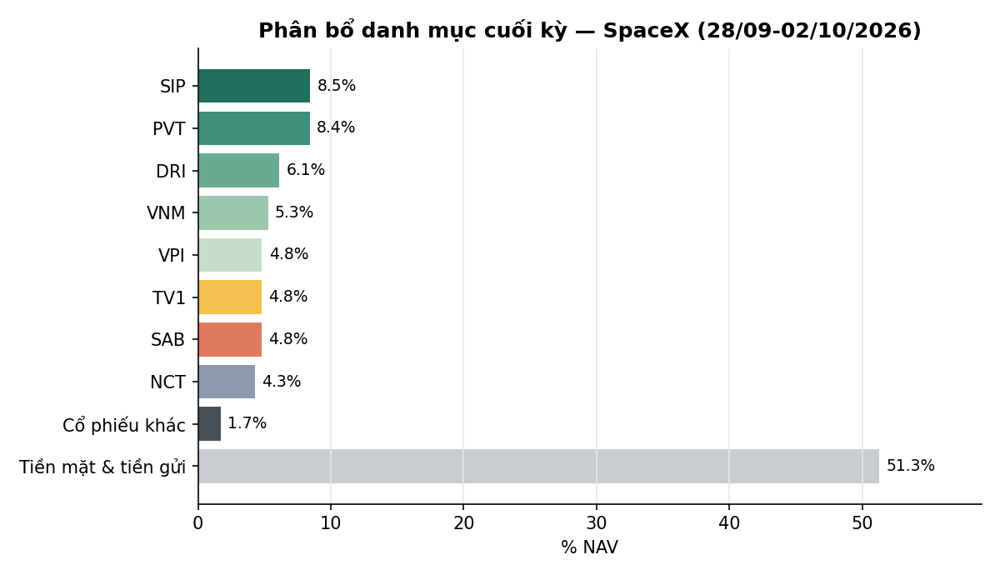

# BÁO CÁO TUẦN — TÀI KHOẢN SPACEX
## Kỳ báo cáo: 28/09/2026 – 02/10/2026

**Tài khoản:** SpaceX · DNSE, số hiệu 0002023347 · Chiến lược V2.4
**Ngày lập báo cáo:** 03/10/2026
**Đối tượng:** Báo cáo hiệu suất & quản lý danh mục — dành cho nhà đầu tư

> 📊 Xem biểu đồ minh hoạ đính kèm trong email (NAV, lợi nhuận lũy kế so VN-Index, phân bổ danh mục);
> bản trên kênh chat chỉ hiển thị văn bản.

---

## 1. TÓM TẮT ĐIỀU HÀNH

| Chỉ tiêu | SpaceX |
|---|---:|
| NAV cuối kỳ trước (25/09) | 983.031.669 |
| NAV cuối kỳ (02/10) | **976.699.776** |
| Thay đổi trong kỳ | **−6.331.893 (−0,64%)** |
| VN-Index cùng kỳ (25/09 → 02/10) | 1.785,11 → 1.737,71 (**−2,65%**) |
| Giá trị cổ phiếu cuối kỳ | 475.822.350 (48,7% NAV) |
| Tiền mặt | 153.553.200 (15,7% NAV) |
| Tiền gửi "Trứng vàng" | 347.324.226 (35,6% NAV) |
| Số mã nắm giữ cuối kỳ | 15 |

**Nhận định tuần:** VN-Index giảm **−2,65%** trong tuần, giảm liên tiếp cả 5 phiên (mạnh nhất phiên
01/10 với −1,09%). Danh mục SpaceX giảm **−0,64%**, tốt hơn chỉ số **+2,01 điểm phần trăm**. Lợi thế
đến chủ yếu từ việc chủ động hạ tỷ trọng cổ phiếu trong tuần: tỷ trọng cổ phiếu giảm từ 90,6% NAV
(25/09) xuống 48,7% NAV (02/10), phần vốn thu về được chuyển sang tiền gửi Trứng vàng và tiền mặt,
nên danh mục ít chịu tác động hơn của nhịp giảm thị trường. Chi tiết lãi/lỗ từng vị thế xem Mục 3.4.

---

## 2. BỐI CẢNH THỊ TRƯỜNG TRONG TUẦN

| Ngày | VN-Index | Thay đổi |
|---|---:|---:|
| 25/09 (cuối kỳ trước) | 1785,11 | — |
| 28/09 | 1780,68 | −0,25% |
| 29/09 | 1777,73 | −0,17% |
| 30/09 | 1768,62 | −0,51% |
| 01/10 | 1749,30 | −1,09% |
| 02/10 | 1737,71 | −0,66% |

Thị trường suy yếu liên tục trong tuần, VN-Index lùi về vùng 1.738 điểm — mức thấp nhất trong ba
tháng gần đây của giai đoạn theo dõi. Độ rộng thị trường (tỷ lệ cổ phiếu đóng cửa trên đường trung
bình 50 phiên, trên rổ cổ phiếu đủ điều kiện tại từng thời điểm — 824 mã ngày 02/10) giảm từ 32,4%
(25/09, 820 mã) xuống **29,0%** (02/10), cùng chiều với chỉ số, cho thấy sức mua chung yếu đi.

Mô hình phân loại trạng thái thị trường của chiến lược giữ nguyên mức **Trung tính** suốt tuần; tín
hiệu nghiêng về thận trọng đang được theo dõi nhưng chưa đủ điều kiện xác nhận chuyển sang trạng thái
phòng thủ. Chỉ báo định giá tổng hợp (P/E, P/B và chênh lệch với lãi suất tiền gửi) ở vùng **RẺ**:
24,4/100, với P/E thị trường 11,18 lần (phân vị 6 trong 10 năm) — đây là thông tin tham khảo, không
phải tín hiệu giao dịch.

---

## 3. DIỄN BIẾN NAV & DANH MỤC TRONG TUẦN

### 3.1 NAV theo ngày

| Ngày | NAV (VND) | Thay đổi NAV | Thay đổi VN-Index |
|---|---:|---:|---:|
| 25/09 (đầu kỳ) | 983.031.669 | — | — |
| 28/09 | 979.597.865 | −0,35% | −0,25% |
| 29/09 | 987.241.710 | +0,78% | −0,17% |
| 30/09 | 981.599.301 | −0,57% | −0,51% |
| 01/10 | n/a | n/a | −1,09% |
| 02/10 (cuối kỳ) | 976.699.776 | −0,50% | −1,75% |

*Bảng trình bày các ngày có số NAV chốt cuối ngày đã đối soát; dòng 01/10 không có số chốt, nên thay
đổi NAV ngày 02/10 được tính so với 30/09 (hai phiên) và đặt cạnh biến động VN-Index cùng khoảng.*

Cả tuần **−0,64%** so với VN-Index **−2,65%** — chênh lệch **+2,01 điểm phần trăm**.

### 3.2 Hiệu suất lũy kế

| Giai đoạn | SpaceX | VN-Index | Chênh lệch |
|---|---:|---:|---:|
| Tuần này (25/09 → 02/10) | −0,64% | −2,65% | +2,01pp |
| Từ đầu tháng 10 (MTD, 30/09 → 02/10) | −0,50% | −1,75% | +1,25pp |
| Từ khi bắt đầu hoạt động (01/07 → 02/10) | −2,33% | −6,94% | +4,61pp |

**Rủi ro (từ khi bắt đầu hoạt động, theo NAV chốt cuối ngày):** mức sụt giảm tối đa từ đỉnh −10,29%;
độ biến động hằng ngày 0,86% (quy năm khoảng 13,6%). Cuối kỳ danh mục giữ khoảng 51% NAV ở tiền mặt
và tiền gửi nên mức độ nhạy với thị trường ở thời điểm hiện tại thấp hơn đáng kể so với các kỳ trước.

### 3.3 Hoạt động giao dịch

Trong tuần danh mục chỉ thực hiện **giao dịch bán**, không có lệnh mua nào:

- **29/09:** hạ tỷ trọng đồng loạt 19 mã (chủ yếu nhóm ngân hàng và một số mã vốn hoá lớn như ACB,
  BID, CTG, HDB, HPG, LPB, MBB, MSB, SHB, TCB, TPB, VCB, VHM, VIB, VIX, VND, VPB, VRE, EVF); tổng giá
  trị khớp khoảng 217,1 triệu VND, khớp đủ 100% khối lượng kế hoạch.
- **30/09:** bán toàn bộ 1.500 cổ phiếu **SCL** giá 28.300 đồng/cp (~42,5 triệu VND) theo quyết định
  của chủ tài khoản.
- **02/10:** tiếp tục hạ tỷ trọng 17 mã trong cùng nhóm, tổng giá trị khớp khoảng 150,1 triệu VND.

Tổng giá trị bán trong tuần khoảng 409,6 triệu VND; phí giao dịch 0,097% và thuế chuyển nhượng 0,1% trên
giá trị bán (ước tính tổng khoảng 0,8 triệu VND). Tiền thu về được chuyển vào tiền gửi Trứng vàng và
tiền mặt.

**Quyền lợi cổ đông:** cổ phiếu **TPB** chia cổ tức bằng cổ phiếu tỷ lệ 15% (ngày giao dịch không hưởng
quyền 02/10/2026): số cổ phiếu nắm giữ tăng tương ứng (200 → 230 cổ phiếu trước khi bán 200 cổ phiếu
cùng ngày, còn 30 cổ phiếu). Đây là điều chỉnh theo quyền lợi cổ đông, không phải giao dịch mua mới và
không làm thay đổi tổng giá trị thị trường tại thời điểm chia.

### 3.4 Danh mục cuối kỳ (02/10/2026)

| Mã | KL | Giá vốn | Giá 02/10 | Giá trị thị trường | % NAV | Lãi/lỗ |
|---|---:|---:|---:|---:|---:|---:|
| SIP | 1.700 | 47.059 | 48.600 | 82.620.000 | 8,46 | +3,28% |
| PVT | 3.500 | 17.100 | 23.500 | 82.250.000 | 8,42 | +37,43% |
| DRI | 3.700 | 12.262 | 16.200 | 59.940.000 | 6,14 | +32,11% |
| VNM | 900 | 58.600 | 57.300 | 51.570.000 | 5,28 | −2,22% |
| VPI | 800 | 62.375 | 58.800 | 47.040.000 | 4,82 | −5,73% |
| TV1 | 2.300 | 20.148 | 20.400 | 46.920.000 | 4,80 | +1,25% |
| SAB | 1.100 | 47.368 | 42.450 | 46.695.000 | 4,78 | −4,37% |
| NCT | 500 | 94.360 | 83.500 | 41.750.000 | 4,27 | −3,45% |
| VPB | 286 | 22.021 | 22.900 | 6.549.400 | 0,67 | +3,99% |
| MBB | 275 | 21.657 | 19.100 | 5.252.500 | 0,54 | −7,42% |
| BID | 75 | 39.571 | 34.800 | 2.610.000 | 0,27 | −12,06% |
| MSB | 100 | 13.542 | 14.050 | 1.405.000 | 0,14 | +3,75% |
| VIB | 47 | 13.620 | 13.350 | 627.450 | 0,06 | −1,98% |
| TPB | 30 | 14.674 | 11.900 | 357.000 | 0,04 | −15,67% |
| VIX | 20 | 15.464 | 11.800 | 236.000 | 0,02 | −23,70% |
| Tiền mặt | | | | 153.553.200 | 15,72 | |
| Tiền gửi Trứng vàng | | | | 347.324.226 | 35,56 | |
| **Tổng NAV** | | | | **976.699.776** | **100,00** | |

*Giá vốn là giá vốn thô thực tế (giá khớp thật); "Lãi/lỗ" là lãi/lỗ theo giá đóng cửa 02/10/2026,
đã cộng cổ tức tiền mặt đã đối soát được với sổ công ty chứng khoán (sau thuế thu nhập cá nhân 5%).
Tổng lãi chưa thực hiện của các vị thế còn nắm giữ khoảng +31,6 triệu VND (+7,00% trên giá vốn thô).*

**Ghi nhận:** danh mục cuối kỳ gồm 15 mã, mã lớn nhất SIP ở mức 8,46% NAV; hơn một nửa NAV nằm ở tiền
gửi và tiền mặt (51,3%).

---

## 4. TRIỂN VỌNG & KẾ HOẠCH TUẦN TỚI (05/10 – 09/10/2026)

Thị trường đang ở nhịp điều chỉnh với độ rộng yếu (29,0% số mã trên MA50) nhưng định giá chung đã về
vùng thấp trong lịch sử 10 năm. Danh mục tiếp tục duy trì cơ cấu hiện tại với tỷ trọng tiền gửi/tiền
mặt cao, giữ khả năng linh hoạt trước diễn biến thị trường; không có kế hoạch tái cơ cấu lớn được đặt
trước ngoài các điều chỉnh theo khung phân bổ đã thiết lập của chiến lược.

---

## 5. PHỤ LỤC — PHƯƠNG PHÁP LUẬN

**Định giá:** Giá trị tài sản ròng (NAV) = giá trị cổ phiếu theo giá đóng cửa cuối ngày + tiền mặt +
tiền gửi Trứng vàng − dư nợ (nếu có), đối chiếu trực tiếp với dữ liệu tài khoản tại công ty chứng khoán
lưu ký.

**Cổ tức & quyền lợi cổ đông:** các sự kiện chia cổ phiếu (cổ tức bằng cổ phiếu, phát hành thêm) được
điều chỉnh trực tiếp vào số lượng cổ phiếu nắm giữ. Cổ tức tiền mặt chỉ được cộng vào tỷ suất khi đã
đối soát được với sổ công ty chứng khoán; thuế thu nhập cá nhân 5% trên cổ tức tiền mặt.

**Chi phí:** phí giao dịch 0,097% mỗi lượt (HOSE); thuế chuyển nhượng chứng khoán 0,1% trên giá trị bán.

**Hiệu suất lũy kế:** vốn khởi điểm 1.000.000.000 VND tại 01/07/2026; VN-Index so sánh tại cùng mốc.

**Track record:** lịch sử hoạt động còn ngắn (~64 phiên kể từ 01/07/2026) — so sánh với VN-Index mang
tính mô tả, chưa đủ độ dài dữ liệu để có ý nghĩa thống kê đầy đủ khi đánh giá chiến lược.

**Công bố tuân thủ:**
- Đây không phải là khuyến nghị đầu tư. Kết quả hoạt động trong quá khứ không đảm bảo cho kết quả
  trong tương lai.
- Số liệu trong báo cáo được đối chiếu với dữ liệu giao dịch tại công ty chứng khoán lưu ký tài khoản.

---

*Báo cáo tuần 28/09–02/10/2026 — Tổng hợp và đối soát bởi Đội ngũ Quản lý Danh mục & Nghiên cứu Định lượng.*
