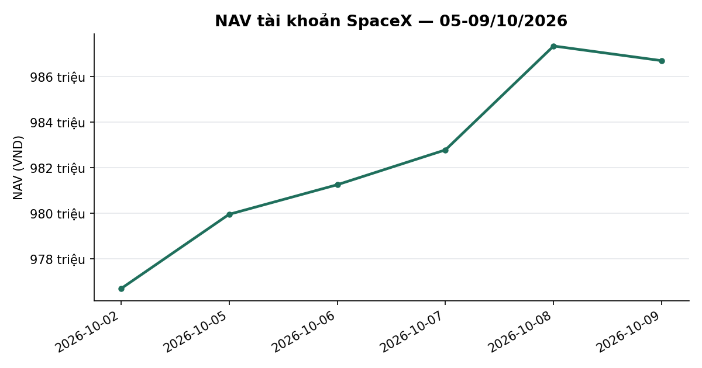
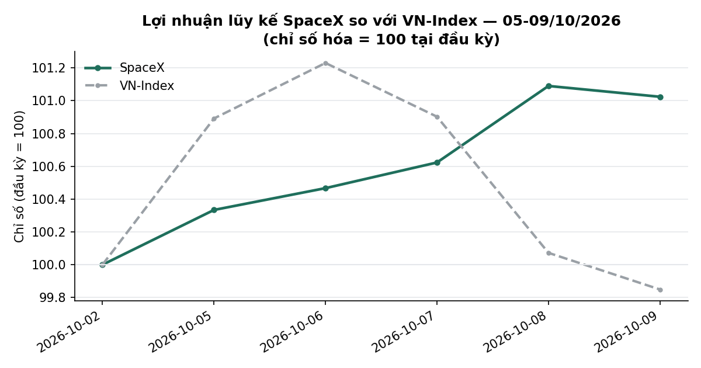
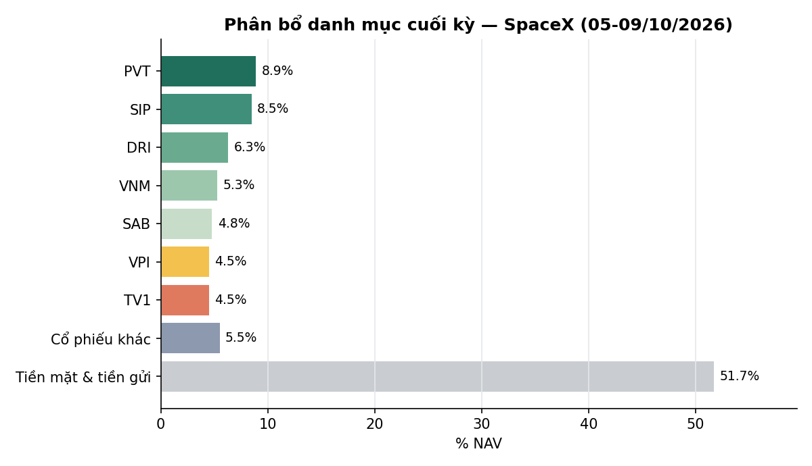

# BÁO CÁO TUẦN — TÀI KHOẢN SPACEX
## Kỳ báo cáo: 05/10/2026 – 09/10/2026

**Tài khoản:** SpaceX · số hiệu 0002023347 tại công ty chứng khoán lưu ký · Chiến lược V2.4
**Ngày lập báo cáo:** 10/10/2026
**Đối tượng:** Báo cáo hiệu suất & quản lý danh mục — dành cho nhà đầu tư
**Bản cập nhật (10/10/2026):** thay thế bản phát hành trước cùng kỳ. Nội dung cập nhật: bổ sung các dòng tổng theo lớp tài sản trong bảng danh mục cuối kỳ; tỷ suất của DRI, TPB, MBB và VIB được tính lại theo chuẩn tỷ suất tổng (đã cộng cổ tức tiền mặt sau thuế, giá vốn phân bổ lại khi có cổ phiếu thưởng); làm rõ các khoản cổ tức tiền mặt đang chờ thanh toán. Giá trị tài sản ròng (NAV) và hiệu suất trong kỳ không thay đổi.

> 📊 Xem biểu đồ minh hoạ đính kèm trong email (NAV, lợi nhuận lũy kế so VN-Index, phân bổ danh mục);
> bản trên kênh chat chỉ hiển thị văn bản.

---

## 1. TÓM TẮT ĐIỀU HÀNH

| Chỉ tiêu | SpaceX |
|---|---:|
| NAV cuối kỳ trước (02/10) | 976.699.776 |
| NAV cuối kỳ (09/10) | **986.698.574** |
| Thay đổi trong kỳ | **+9.998.798 (+1,02%)** |
| VN-Index cùng kỳ (02/10 → 09/10) | 1.737,71 → 1.735,09 (**−0,15%**) |
| Giá trị cổ phiếu cuối kỳ | 477.055.600 (48,4% NAV) |
| Tiền mặt | 9.109.074 (0,9% NAV) |
| Tiền gửi "Trứng vàng" | 500.533.900 (50,7% NAV) |
| Số mã nắm giữ cuối kỳ | 13 |

**Nhận định tuần:** VN-Index gần như đi ngang (−0,15%) sau chuỗi giảm của tuần trước; danh mục SpaceX tăng **+1,02%**, vượt chỉ số **+1,17 điểm phần trăm**. Phần giá tăng đến chủ yếu từ nhóm cổ phiếu chất lượng đang giữ — PVT (+5,95 triệu VND), DRI (+2,59 triệu), SIP (+1,36 triệu) — bù đắp mức giảm của VPI (−2,64 triệu) và TV1 (−2,53 triệu); thêm khoảng 4,0 triệu VND từ thu nhập ngoài biến động giá (chủ yếu cổ tức tiền mặt và lãi tiền gửi). Danh mục giữ tỷ trọng cổ phiếu ở mức 48,4% NAV, hơn một nửa NAV là tiền gửi và tiền mặt nên mức nhạy với biến động thị trường thấp.

*NAV theo ngày, SpaceX. Đơn vị: VND / chỉ số (cơ sở 100). Kỳ dữ liệu: 02/10–09/10/2026 (6 phiên). Nguồn: dữ liệu tài khoản tại công ty chứng khoán lưu ký (NAV chốt cuối ngày), HOSE (VN-Index), tính toán nội bộ.*

---

## 2. TOÀN CẢNH THỊ TRƯỜNG

| Ngày | VN-Index | Thay đổi |
|---|---:|---:|
| 02/10 (cuối kỳ trước) | 1737,71 | — |
| 05/10 | 1753,20 | +0,89% |
| 06/10 | 1759,08 | +0,34% |
| 07/10 | 1753,39 | −0,32% |
| 08/10 | 1738,97 | −0,82% |
| 09/10 | 1735,09 | −0,22% |

*VN-Index đóng cửa hằng ngày; nguồn HOSE, dữ liệu tới 09/10/2026.*

**Kỹ thuật (VN-Index, dữ liệu đóng cửa 09/10/2026):**
- *Xu hướng:* chỉ số đóng cửa 1.735,09 điểm, gần như đi ngang so với cuối tuần trước (−0,15%); biên dao động trong tuần 1.735–1.759. Chỉ số nằm dưới cả MA20 (1.779,0), MA50 (1.779,8) và MA200 (1.797,4) — cấu trúc vẫn là điều chỉnh sau nhịp giảm từ cuối tháng 9.
- *Hỗ trợ/kháng cự:* hỗ trợ gần là đáy tuần 1.735 (vừa được kiểm tra lại) rồi vùng đáy 3 tháng 1.668,5; kháng cự gần là cụm MA20/MA50 quanh 1.779–1.780, xa hơn là đỉnh 3 tháng 1.853,1.
- *Động lượng:* RSI(14) 37,2 (thấp, chưa vào vùng quá bán); MACD−signal −5,74, đã thu hẹp từ −8,68 (02/10) nhưng vẫn âm; dòng tiền CMF −0,10 (âm).
- *Thanh khoản:* khối lượng khớp trung bình tuần đạt khoảng 717 triệu cp, cao hơn khoảng 7,6% so với tuần trước; phiên 09/10 đạt 911 triệu cp trong ngày chỉ số giảm nhẹ.
- *Độ rộng:* tỷ lệ cổ phiếu đóng cửa trên MA50 là **32,4%** (836 mã trong rổ đủ điều kiện ngày 09/10), cải thiện so với 29,0% (824 mã) ngày 02/10 nhưng vẫn thấp.

**Cơ bản / định giá (dữ liệu tới 09/10/2026):**
- *Định giá:* chỉ báo định giá tổng hợp (P/E, P/B và chênh lệch với lãi suất tiền gửi, phân vị 10 năm) ở **22,4/100 — vùng RẺ**; P/E thị trường 11,11 lần (phân vị 6), P/B 1,87 lần (phân vị 23), chênh lệch lợi suất lợi nhuận so với lãi suất tiền gửi 6 tháng +1,60 điểm % (phân vị 38). Chỉ báo này mang tính tham khảo, chưa được kiểm định đủ mạnh để dùng làm tín hiệu giao dịch.
- *Trạng thái thị trường theo mô hình của chiến lược:* giữ trạng thái **Trung tính** trong cả tuần; tín hiệu thận trọng (nền xấu 9 phiên liên tục từ 29/09, VN-Index −2,6% từ đầu đợt) vẫn đang được theo dõi, chưa chạm ngưỡng xác nhận chuyển sang phòng thủ (đã tích luỹ 3/25 phiên cần thiết). Đây là thông tin mô hình nội bộ, không phải khuyến nghị
- *Tăng trưởng lợi nhuận, dòng tiền khối ngoại, diễn biến lãi suất mới trong tuần:* báo cáo này không có số liệu đã đối soát cho các mục này trong kỳ nên không đưa ra nhận định; chỉ sử dụng mặt bằng lãi suất đã phản ánh trong chỉ báo định giá ở trên.

*Lợi nhuận lũy kế so với VN-Index (cơ sở 100 tại 02/10/2026). Đơn vị: VND / chỉ số (cơ sở 100). Kỳ dữ liệu: 02/10–09/10/2026 (6 phiên). Nguồn: dữ liệu tài khoản tại công ty chứng khoán lưu ký (NAV chốt cuối ngày), HOSE (VN-Index), tính toán nội bộ.*

---

## 3. HIỆU QUẢ, ATTRIBUTION & RỦI RO

### 3.1 NAV theo ngày

| Ngày | NAV (VND) | Thay đổi NAV | Thay đổi VN-Index |
|---|---:|---:|---:|
| 02/10 (cuối kỳ trước) | 976.699.776 | — | — |
| 05/10 | 979.961.206 | +0,33% | +0,89% |
| 06/10 | 981.258.688 | +0,13% | +0,34% |
| 07/10 | 982.786.247 | +0,16% | −0,32% |
| 08/10 | 987.341.794 | +0,46% | −0,82% |
| 09/10 | 986.698.574 | −0,07% | −0,22% |

Cả tuần **+1,02%** so với VN-Index **−0,15%** — chênh lệch **+1,17 điểm phần trăm**.

### 3.2 Hiệu suất lũy kế

| Giai đoạn | SpaceX | VN-Index | Chênh lệch |
|---|---:|---:|---:|
| Tuần này (02/10 → 09/10) | +1,02% | −0,15% | +1,17pp |
| Từ đầu tháng 10 (MTD, 30/09 → 09/10) | +0,52% | −1,90% | +2,42pp |
| Từ khi bắt đầu hoạt động (01/07 → 09/10) | −1,33% | −7,08% | +5,75pp |

**Rủi ro (từ khi bắt đầu hoạt động, theo NAV chốt cuối ngày, 69 phiên):** mức sụt giảm tối đa từ đỉnh −10,29%; độ biến động hằng ngày 0.83% (quy năm khoảng 13.1%).

### 3.3 Attribution tuần (đóng góp vào NAV, triệu VND)

| Nguồn | Đóng góp |
|---|---:|
| PVT | +5,95 |
| DRI | +2,59 |
| SIP | +1,36 |
| SAB, VNM, NCT, VPB và các mã khác (cộng) | +1,00 |
| TV1 | −2,53 |
| VPI | −2,64 |
| **Biến động giá (gồm phần đã bán trong kỳ)** | **+5,97** |
| Quyền cổ tức tiền mặt TV1 (1.500 đ/cp × 2.300 cp) | +3,45 |
| Lãi tiền gửi Trứng vàng và lãi tiền mặt | +0,68 |
| Phí giao dịch và thuế | −0,10 |
| **Thu nhập ngoài giá (cộng)** | **+4,03** |
| **Thay đổi NAV** | **+10,00** |

*Đóng góp giá = số lượng × (giá 09/10 − giá 02/10) với phần bán trong kỳ tính theo giá khớp. Thu nhập ngoài giá được đối chiếu từng khoản với sổ tiền của tài khoản và xác nhận khớp lệnh.*

### 3.4 Hoạt động trong tuần

Danh mục chỉ thực hiện **giao dịch bán** các phần nhỏ còn lại của những mã đã được hạ tỷ trọng trước đó, không có lệnh mua:
- **05/10:** bán 20 cổ phiếu VIX (11.800 đ/cp).
- **06/10:** bán 75 cổ phiếu BID (34.550 đ/cp) — thoát hoàn toàn.
- **07/10:** bán 100 cổ phiếu MBB (19.100 đ/cp).

Tổng giá trị bán khoảng 4,7 triệu VND; phí giao dịch 0,097% và thuế chuyển nhượng 0,1% trên giá trị bán, cộng thuế thu nhập cá nhân đối với cổ phiếu nhận từ cổ tức cổ phiếu (5% mệnh giá, 87.500 VND cho 175 cổ phiếu BID và MBB) được khấu trừ khi bán. Ngày 08/10, phần tiền mặt nhàn rỗi (khoảng 152,7 triệu VND) được chuyển sang tiền gửi Trứng vàng; tỷ trọng tiền gửi đạt 50,7% NAV.

**Quyền lợi cổ đông:** trong tuần danh mục được ghi nhận quyền cổ tức tiền mặt của **TV1** (1.500 đ/cp, ngày giao dịch không hưởng quyền 07/10, thanh toán 29/10) trị giá 3,45 triệu VND. Cuối kỳ có 7,25 triệu VND cổ tức tiền mặt đang chờ thanh toán: TV1 3,45 triệu, **DRI** 3,70 triệu (1.000 đ/cp, thanh toán 20/10) và TPB 0,10 triệu (500 đ/cp, thanh toán 14/10). Các khoản này đã đối soát với sổ công ty chứng khoán; cổ tức TV1 và DRI đã được cộng (sau thuế 5%) vào tỷ suất của hai mã này ở bảng dưới.

### 3.5 Danh mục cuối kỳ (09/10/2026)

| Mã | KL | Giá vốn | Giá 09/10 | Giá trị thị trường | % NAV | Lãi/lỗ (%) |
|---|---:|---:|---:|---:|---:|---:|
| PVT | 3.500 | 17.100 | 25.200 | 88.200.000 | 8,94 | +47,37% |
| SIP | 1.700 | 47.059 | 49.400 | 83.980.000 | 8,51 | +4,98% |
| DRI | 3.700 | 13.262 | 16.900 | 62.530.000 | 6,34 | +34,59% |
| VNM | 900 | 58.600 | 57.700 | 51.930.000 | 5,26 | −1,54% |
| SAB | 1.100 | 47.368 | 42.900 | 47.190.000 | 4,78 | −3,42% |
| VPI | 800 | 62.375 | 55.500 | 44.400.000 | 4,50 | −11,02% |
| TV1 | 2.300 | 20.148 | 19.300 | 44.390.000 | 4,50 | +2,86% |
| NCT | 500 | 94.360 | 83.700 | 41.850.000 | 4,24 | −3,24% |
| VPB | 286 | 22.021 | 23.800 | 6.806.800 | 0,69 | +8,08% |
| MBB | 175 | 21.313 | 19.050 | 3.333.750 | 0,34 | −7,69% |
| MSB | 100 | 13.542 | 14.600 | 1.460.000 | 0,15 | +7,82% |
| VIB | 47 | 13.620 | 13.650 | 641.550 | 0,07 | +0,22% |
| TPB | 30 | 14.609 | 11.450 | 343.500 | 0,03 | −18,79% |
| **Cổ phiếu — tổng (13 mã)** | | | | **477.055.600** | **48,35** | **+9,18%** |
| **Tiền mặt** | | | | **9.109.074** | **0,92** | |
| **Tiền gửi Trứng vàng** | | | | **500.533.900** | **50,73** | |
| **Nợ ký quỹ** | | | | **0** | **0,00** | |
| **Tổng NAV** | | | | **986.698.574** | **100,00** | |

*Giá vốn là giá vốn thô thực tế; "Lãi/lỗ (%)" tính theo giá đóng cửa 09/10/2026, đã cộng cổ tức tiền mặt đã đối soát được với sổ công ty chứng khoán (sau thuế thu nhập cá nhân 5%). Tổng lãi chưa thực hiện của các vị thế còn nắm giữ khoảng +41,3 triệu VND (+9,18% trên giá vốn thô 449,6 triệu VND). Với cổ phiếu thưởng, giá vốn được phân bổ lại trên số cổ phiếu sau thưởng.*

*Phân bổ danh mục cuối kỳ 09/10/2026, % NAV. Nguồn: dữ liệu tài khoản tại công ty chứng khoán lưu ký, giá đóng cửa HOSE 09/10/2026, tính toán nội bộ.*

**Ghi nhận:** danh mục gồm 13 mã, mã lớn nhất PVT ở mức 8,94% NAV; 51,6% NAV nằm ở tiền gửi và tiền mặt.

---

## 4. OUTLOOK KỲ TỚI (12/10 – 16/10/2026)

**Kỹ thuật.** Kịch bản cơ sở (khả năng cao nhất): VN-Index đi ngang–hồi nhẹ trong biên 1.735–1.780 khi thị trường kiểm tra lại vùng MA20/MA50. Kịch bản tích cực (khả năng trung bình): đóng cửa vững trên 1.780 cùng độ rộng vượt 40% sẽ xác nhận nhịp hồi, hướng về 1.850. Kịch bản tiêu cực (khả năng trung bình): thủng 1.735 kèm khối lượng tăng sẽ mở đường về đáy 3 tháng 1.668. *Điều kiện làm sai kịch bản cơ sở:* đóng cửa dưới 1.735 hai phiên liên tiếp hoặc độ rộng lùi dưới 29%.

**Cơ bản.** Định giá thị trường ở vùng thấp trong lịch sử 10 năm (P/E 11,1 lần) là nền hỗ trợ trung hạn nhưng không phải tín hiệu thời điểm. Mô hình trạng thái của chiến lược đang ở Trung tính với tín hiệu thận trọng tích luỹ; theo thống kê lịch sử, xác suất tín hiệu này tiến tới xác nhận phòng thủ khoảng 1/3 (khoảng tin cậy rộng, mẫu mỏng). Nếu xác nhận, danh mục sẽ giảm tỷ trọng cổ phiếu theo khung phân bổ đã thiết lập; nếu không, cơ cấu hiện tại (tiền gửi/tiền mặt trên 50% NAV) được giữ. *Điều kiện làm sai:* thị trường bứt phá lên trên 1.850 với độ rộng cải thiện bền vững.

Các nhận định trên là kịch bản có điều kiện, không phải khuyến nghị đầu tư chắc chắn.

---

## 5. PHỤ LỤC — PHƯƠNG PHÁP LUẬN

**Định giá:** NAV = giá trị cổ phiếu theo giá đóng cửa cuối ngày + tiền mặt + tiền gửi Trứng vàng − dư nợ (nếu có), đối chiếu trực tiếp với dữ liệu tài khoản tại công ty chứng khoán lưu ký. Đẳng thức cuối kỳ: 477.055.600 + 9.109.074 + 500.533.900 = 986.698.574 (chênh lệch 0 đồng).

**Độ rộng thị trường:** tỷ lệ cổ phiếu đóng cửa trên đường trung bình 50 phiên, tính trên rổ cổ phiếu đủ điều kiện tại từng thời điểm (không dùng danh sách hiện tại để tránh sai lệch nhìn trước).

**Cổ tức & quyền lợi cổ đông:** cổ tức tiền mặt chỉ được cộng vào tỷ suất khi đã đối soát được với sổ công ty chứng khoán; thuế thu nhập cá nhân 5% trên cổ tức tiền mặt.

**Chi phí:** phí giao dịch 0,097% mỗi lượt (HOSE); thuế chuyển nhượng chứng khoán 0,1% trên giá trị bán.

**Hiệu suất lũy kế:** vốn khởi điểm 1.000.000.000 VND tại 01/07/2026; VN-Index so sánh tại cùng mốc (đóng cửa 01/07/2026: 1.867,21).

**Track record:** lịch sử hoạt động còn ngắn (~69 phiên kể từ 01/07/2026) — so sánh với VN-Index mang tính mô tả, chưa đủ dài để có ý nghĩa thống kê.

**Công bố tuân thủ:**
- Đây không phải là khuyến nghị đầu tư. Kết quả hoạt động trong quá khứ không đảm bảo cho kết quả trong tương lai.
- Số liệu trong báo cáo được đối chiếu với dữ liệu giao dịch tại công ty chứng khoán lưu ký tài khoản.

---

*Báo cáo tuần 05/10–09/10/2026 — Tổng hợp và đối soát bởi Đội ngũ Quản lý Danh mục & Nghiên cứu Định lượng.*
