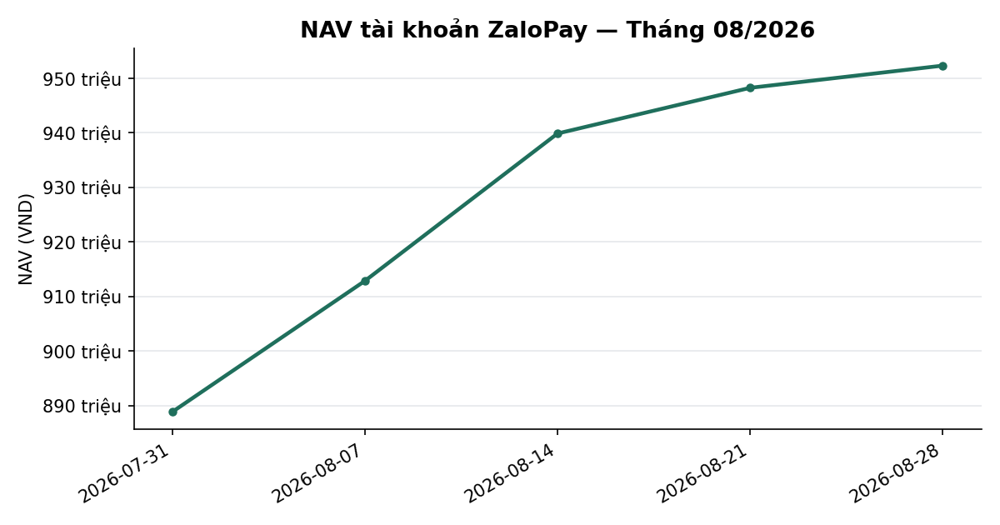
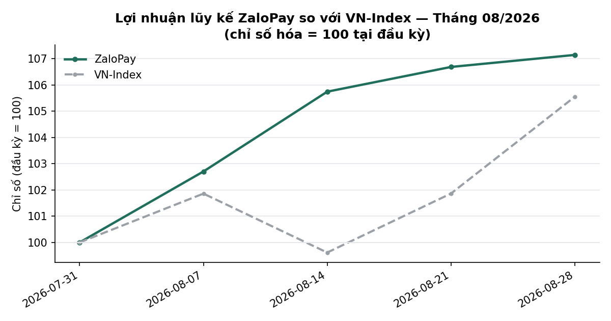
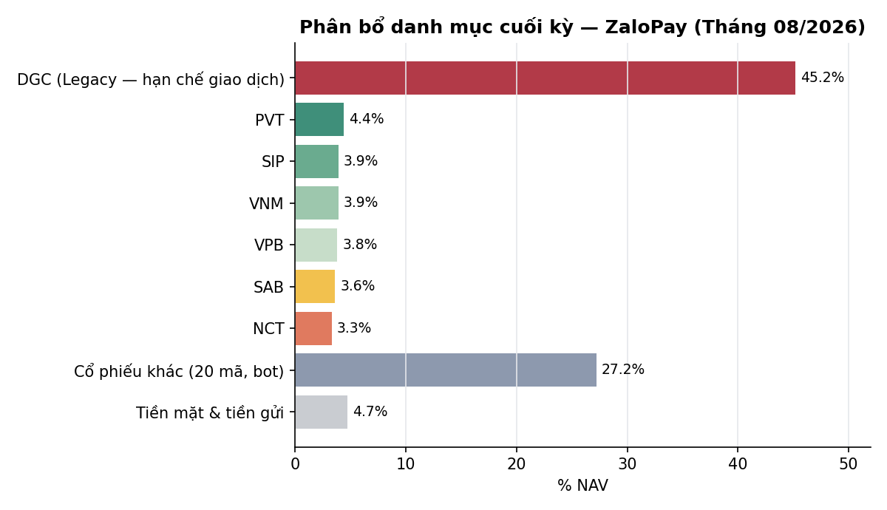

# BÁO CÁO THÁNG — TÀI KHOẢN ZALOPAY
## Kỳ báo cáo: THÁNG 08/2026 (01/08 – 31/08/2026)

**Tài khoản:** ZaloPay · DNSE, số hiệu 0001743768 · V2.4 live (cash-only) · DGC excluded (legacy)
**Chiến lược:** V2.4 — BAL momentum + LAG hậu-công-bố-lợi-nhuận, parking custom30V NEUTRAL
**Ngày lập báo cáo:** 02/09/2026 · **Người lập:** Taylor (Quant)
**Đối tượng:** Kênh theo dõi nội bộ (KHÔNG gửi nhà đầu tư ngoài) — giữ minh bạch đầy đủ, kể cả sự cố vận hành

> **Ghi chú tách báo cáo (02/09/2026):** file này là bản THAY THẾ cho phần ZaloPay trong
> `SpaceX_ZaloPay_monthly_report_2026-08.md` (giữ nguyên trên đĩa làm lịch sử, không giao lại nữa).
> Từ kỳ này, ZaloPay và SpaceX có báo cáo RIÊNG — SpaceX là bản client-facing đã lược bỏ chi tiết
> vận hành nội bộ; ZaloPay là kênh Mike/user tự theo dõi, giữ đầy đủ chi tiết như trước.

---

## 1. TÓM TẮT ĐIỀU HÀNH

**Phiên chốt tháng: 28/08/2026, KHÔNG PHẢI 31/08.** HOSE nghỉ lễ Quốc khánh 31/08 → 02/09/2026
(31/08-01/09 cuối tuần, 02/09 nghỉ lễ chính thức); phiên giao dịch cuối cùng của tháng 8 là
**Thứ Sáu 28/08**. Số dư tiền/tài sản off-book (Trứng vàng) dùng bản đọc mới nhất 31/08 (không đổi
so với 28/08 vì không có giao dịch trong kỳ nghỉ).

| Chỉ tiêu | ZaloPay |
|---|---:|
| NAV đầu kỳ (31/07, = NAV cuối T7) | 888.828.498đ |
| NAV cuối tháng (28-31/08) | 952.365.940đ |
| Lãi/lỗ trong kỳ (VND) | **+63.537.442đ** |
| Tỷ suất MTD | **+7,15%** |
| VN-Index cùng khung (1.735,78→1.832,12) | +5,55% |
| Chênh so với chỉ số | **+1,60pp** |
| Biến động năm hoá (annualized, mẫu ~16 ngày) | 25,58% |
| Sụt giảm tối đa trong tháng | −3,59% |
| Số lệnh khớp thật (event=FILL, không tính PLACE/CANCEL) | 42 |
| Tổng phí + thuế ước tính (0,075%/lượt + 0,1% thuế bán) | ~385.515đ |

**Cách tính lãi/lỗ & tỷ suất:** dùng trực tiếp **hiệu NAV đầu kỳ − cuối kỳ** từ snapshot NAV
broker-native (`nav_history_ZaloPay.csv` = MTM cổ phiếu + tiền mặt − nợ margin + tài sản off-book
"egg", đọc thẳng từ `dnse_raw_*.jsonl`) — **KHÔNG** qua phân rã LHS (vốn+lãi/lỗ chưa thực hiện−phí)
vì `reconcile_equity.py` không áp dụng được cho ZaloPay (2 vị thế legacy DGC+VPB không có lịch sử
khớp nội bộ, xem §3.4/§10.2). Hiệu NAV đầu-cuối không phụ thuộc cách phân rã này, nên đây là con số
MTD đáng tin cậy nhất hiện có.

**Số lệnh khớp** đếm dòng `event=FILL` thật trong `exec_ZaloPay_2026-08-*_journal.csv`.

---

## 2. HIỆU SUẤT MTD / QTD / YTD SO VỚI CHỈ SỐ
> Nguồn: `nav_history_ZaloPay.csv` + BQ ticker (VNINDEX, asof 28/08)

### 2.1 MTD tháng 8 và diễn biến theo tuần

| Tuần | ZaloPay NAV | VNINDEX |
|---|---:|---:|
| Đầu kỳ (31/07) | 888.828.498 | 1.735,78 |
| Tuần 1 (→07/08) | 912.854.495 (+2,71%, snapshot gần nhất 05/08 — thiếu 06,07/08) | 1.768,06 (+1,86%) |
| Tuần 2 (→14/08) | 939.887.091 (+5,74%) | 1.729,08 (−0,39%) |
| Tuần 3 (→21/08) | 948.266.511 (+6,69%) | 1.768,12 (+1,86%) |
| Tuần 4 (→28/08) | 952.338.703 (+7,14%) | 1.832,12 (+5,55%) |

*(% trong ngoặc = tích luỹ từ 31/07. Tuần 1 thiếu snapshot 07/08 — file `nav_history_ZaloPay.csv`
không có dòng cho ngày này, xem khoảng trống dữ liệu ở §9.)*

### 2.2 QTD (Q3/2026, từ 01/07)

Q3 chưa đóng (còn tháng 9) nên đây là QTD-so-far, gộp tháng 7+8: NAV go-live (07/07, bản ghi đầu
tiên) = 986.585.454đ → NAV 28/08 = 952.338.703đ ⇒ **QTD (từ bản ghi đầu) = −3,47%** (tháng 7
−9,93%*, tháng 8 +7,14%). *Vốn khởi điểm chính xác 01/07-06/07 (trước go-live 06/07) chưa
re-verify độc lập lần này — dùng bản ghi NAV đầu tiên 07/07 làm mốc, có thể không trùng khớp tuyệt
đối vốn nạp ban đầu; đánh dấu GIẢ ĐỊNH.

### 2.3 YTD (từ ngày go-live, KHÔNG phải từ 01/01)

Trùng với QTD ở trên (go-live trong Q3/2026, chưa có lịch sử trước quý này).

**Diễn giải:** tài khoản đang PHỤC HỒI từ mức lỗ tháng 7 (ghi nhận trong report tháng 7), tháng 8
là tháng dương đầu tiên kể từ go-live. Outperform VNINDEX +1,60pp MTD tháng 8 nhờ tỷ trọng cao hơn
ở PVT/SCL/CSV (nhóm dầu khí/vật liệu tăng mạnh).

Dùng `dividend_adjusted_return.py`/`report_return_gate.py::entitled_gross()` cho tỷ suất
per-position — xem §3.

---

## 3. PHÂN RÃ NGUỒN LÃI/LỖ (ATTRIBUTION)
> Bắt buộc dùng `bin/dividend_adjusted_return.py` (§21 coding_guidelines)

### 3.1 Phân rã theo nguồn

| Nguồn | VND | Ghi chú |
|---|---:|---|
| Lãi/lỗ CHƯA thực hiện, 27 mã ĐANG bot quản lý (loại DGC) | +17.779.415đ | = pl_net_total toàn bộ (−29.970.585đ) trừ dòng DGC (−47.750.000đ) |
| **DGC — vị thế legacy EXCLUDED, không do bot quản lý** | **−47.750.000đ** | qty=10.000, cost=47.775đ/cp, mkt=43.000đ/cp (28/08). HOSE hạn chế giao dịch + vụ án hình sự liên quan (xem kb, quyết định exclude trước go-live) — bot KHÔNG được phép bán/mua thêm; lỗ này KHÔNG phản ánh chất lượng chiến lược V2.4 |
| Phần còn lại (realized + phí, chưa phân rã chi tiết) | ≈ +45.758.027đ | = Lãi/lỗ NAV kỳ (§1, +63.537.442đ) − 2 dòng trên |
| **Tổng (= Lãi/lỗ NAV kỳ §1)** | **+63.537.442đ** | |

**Active_nav (loại DGC)**: MTD %(active) không tính riêng lần này (đòi hỏi tách NAV daily loại DGC
theo từng ngày, ngoài phạm vi dữ liệu hiện có) — nhưng hướng tác động RÕ: DGC kéo NAV toàn phần
XUỐNG, nghĩa là MTD +7,15% đã báo cáo ở §1 là **CẬN DƯỚI** hiệu suất phần bot chủ động quản lý.

### 3.2 Lãi/lỗ chưa thực hiện phần bot (đã xác minh, 27 mã loại DGC)

**Tốt nhất:** PVT +17,11% (+6.112.950đ) · SCL +17,00% (+4.010.000đ) · CSV +9,11% (+1.800.000đ)
· HDB +7,37% (+876.209đ) · DRI +6,31% (+1.590.000đ)

**Tệ nhất:** LPB −8,92% (−1.722.400đ) · NCT −3,39% (đã cộng cổ tức 8.000đ/cp, −1.193.600đ)
· BID −1,96% (−315.050đ) · VHM −1,77% (−395.000đ) · MSB −1,42% (−46.000đ)

VPB (legacy position, xem §9.3) nằm trong nhóm tốt +3,95% (+1.371.981đ) — dùng `costPrice`
broker-native trực tiếp vì không tái tạo được cost basis qua journal (chỉ 1 nguồn, không
cross-check 2 nguồn độc lập được như các mã khác).

---

## 4. CHỈ SỐ RỦI RO
> Nguồn: nav_history ngày, positions DNSE
> ⚠️ Số liệu dưới đây do **Taylor** tính tạm thời (deadline giao báo cáo gấp, Spyros dispatch riêng
> chưa hoàn tất tính đến 02/09) — cùng phương pháp risk-auditor thường dùng nhưng CHƯA qua audit
> độc lập của Spyros. Cần Spyros xác nhận lại trước khi coi là số chính thức.

| Chỉ số | ZaloPay | VN-Index |
|---|---:|---:|
| Độ lệch chuẩn lợi suất ngày (mẫu có gap) | 1,611% | 0,997% |
| Biến động năm hoá (×√252) | 25,58% | 15,83% |
| Sụt giảm tối đa trong tháng | −3,59% | −3,71% |
| Tỷ trọng cổ phiếu cuối tháng (MTM/NAV) | 95,3% (907,6tr/952,4tr) | — |

**Cảnh báo phương pháp (quan trọng):** `nav_history_ZaloPay.csv` có **5 ngày trống** trong tháng 8
(06, 07, 10, 25, 27/08 — xem §9). Lợi suất tính trên mẫu này GỘP nhiều phiên liên tiếp vào 1 quan
sát tại những chỗ có gap → **phóng đại độ lệch chuẩn ngày lẻ đó**, làm biến động năm hoá ước tính
CAO hơn con số thật nếu tính đủ 20 phiên. Vol ZaloPay (25,6%) cao hơn hẳn VNINDEX một phần do đúng
2 trong 5 gap của nó rơi ngay quanh giai đoạn biến động nhất (12-14/08, đỉnh rồi giảm mạnh) — số
này CẦN Spyros đối chiếu lại trên chuỗi đã vá gap trước khi dùng cho quyết định risk sizing.

Tỷ trọng cổ phiếu cuối tháng CHƯA trừ DGC — active_nav (loại DGC)
= (907.558.300 − 430.000.000)/(952.365.940 − 430.000.000) ≈ 91,3% cổ phiếu/active_nav, xem §8.

---

## 5. DIỄN BIẾN VĨ MÔ THÁNG 8/2026 & ĐÁNH GIÁ RỦI RO KHỦNG HOẢNG
> Đọc BLIND với forward-return và backtest outcome · Dữ liệu: GSO/Tổng cục Thống kê, SBV, Fed,
> NBS Trung Quốc, EIA · Chốt ngày: 25/08/2026

> **Lưu ý dữ liệu:** CPI tháng 8/2026 chưa được Tổng cục Thống kê công bố (lịch mới: ngày 6/9/2026).
> Mọi số liệu CPI dưới đây là tháng 7/2026 hoặc lũy kế 7 tháng — ghi rõ tường minh.

### 5.1 Số liệu kinh tế trong nước

**Tăng trưởng GDP:** Kinh tế Việt Nam tiếp tục đà tăng tốc mạnh. GDP Q2/2026 đạt **+8,39% YoY**
(Q1: +7,94%), nâng lũy kế H1/2026 lên **+8,18%** — thuộc nhóm cao nhất khu vực ASEAN. Chính phủ
đặt mục tiêu tăng trưởng cả năm 2026 ở mức 8% hoặc có thể hướng tới 2 con số.

**Lạm phát — CPI tháng 7/2026 (số liệu TCTK mới nhất):**
- MoM: **−0,12%** (giảm nhẹ theo mùa vụ)
- YoY: **+4,45%** (giảm nhẹ so với tháng 6: +4,69%)
- Lũy kế 7 tháng 2026: **+4,39% YoY** · Lạm phát cơ bản: **+4,19%**

CPI đang tiệm cận nhưng *chưa vượt* trần mục tiêu Quốc hội (~4,5%). Bloomberg survey dự báo bình
quân năm 2026 ở mức 4,8% — hàm ý CPI có thể nhích lên trong các tháng cuối năm.

**Sản xuất công nghiệp (tháng 7/2026):** IIP tăng **+14,5% YoY**; lũy kế 7 tháng **+11,4% YoY** —
mức cao nhất trong nhiều năm. Manufacturing đóng góp 33,07% tổng giá trị gia tăng toàn nền kinh tế Q2.

**Bán lẻ (tháng 7/2026):** Tổng mức bán lẻ đạt 669,1 nghìn tỷ VND, tăng **+14,5% YoY**
(7 tháng: +13,1% theo giá hiện hành, +7,5% loại trừ yếu tố giá). Cầu nội địa duy trì mạnh.

**Xuất nhập khẩu (tháng 7/2026 và lũy kế 7 tháng):**

| Chỉ tiêu | Tháng 7/2026 | Lũy kế 7T/2026 | So sánh 7T/2025 |
|---|---|---|---|
| Xuất khẩu | 53,08 tỷ USD (+25,0% YoY) | 319,53 tỷ USD (+21,7%) | — |
| Nhập khẩu | 56,67 tỷ USD (+41,4% YoY) | 340,05 tỷ USD (+34,8%) | — |
| Cán cân | −3,59 tỷ USD | **−20,52 tỷ USD** | Đảo chiều từ **+10,35 tỷ USD** |

Nhập khẩu tăng vọt do máy móc thiết bị FDI và đầu tư hạ tầng — phản ánh chu kỳ mở rộng đầu tư,
chưa phải mất cân đối tiêu dùng. Cần theo dõi dự trữ ngoại hối nếu thâm hụt kéo dài.

### 5.2 Chính sách tiền tệ

**Lãi suất điều hành NHNN:** Lãi suất tái cấp vốn giữ nguyên **4,5%** (từ tháng 8/2023 đến nay).
Chính sách tiền tệ tiếp tục nới lỏng hỗ trợ tăng trưởng.

**Tăng trưởng tín dụng:** Mục tiêu toàn năm 2026: **~15%**. Đến 31/7/2026: +8,98% YTD (~20,3 triệu
tỷ VND), bám sát kế hoạch. NHNN triển khai gói tín dụng ưu đãi 200.000 tỷ đồng (~8,4 tỷ USD) cho
SME. Chính phủ giao NHNN siết tín dụng vào lĩnh vực rủi ro (BĐS) và đẩy nhanh xử lý nợ xấu.

**Tỷ giá VND/USD:** Ổn định trong tháng 8, dao động **26.013–26.345** (bình quân ~26.224). Tỷ giá
trung tâm SBV ngày 24/8: 25.600; thị trường ~26.280. DXY dưới 99 điểm là yếu tố thuận lợi.

**Chất lượng ngân hàng:** NPL toàn hệ thống **2,01%** cuối Q2 (từ 1,99% Q1) — vẫn kiểm soát được.
Lãi suất huy động có áp lực tăng nhẹ (dự báo +0,5–1 điểm % cả năm) nhưng chưa đến mức đáng lo.

### 5.3 Bối cảnh quốc tế

**Fed:** Họp FOMC 29/7/2026 giữ nguyên **3,50–3,75%** với 3 thành viên bất đồng (muốn tăng).
Không có forward guidance cho tháng 9. Fed Chair Kevin Warsh (nhậm chức 5/2026) thận trọng.
Rủi ro tăng lãi suất thêm vẫn hiện hữu — đặc biệt nếu CPI Mỹ tiếp tục cứng.

**Trung Quốc:** PMI sản xuất NBS tháng 7: **49,2** (tháng 6: 50,3) — tháng thứ 5 dưới ngưỡng 50.
PMI phi sản xuất: 49,0. Trung Quốc là đối tác thương mại lớn nhất của VN; suy yếu kéo dài ảnh
hưởng chuỗi cung ứng nguyên vật liệu và cầu nhập khẩu hàng VN.

**Giá dầu Brent:** Biến động mạnh tháng 7–8: đáy 69 USD (đầu T7, sau MOU Mỹ-Iran) → đỉnh 105 USD
(23/7, căng thẳng Hormuz) → **~85 USD** (24/8/2026). J.P. Morgan dự báo bình quân Q3: 86 USD.
Biên độ ±35% trong 2 tháng phản ánh rủi ro địa chính trị cao, ảnh hưởng chi phí sản xuất và lạm
phát nhập khẩu VN.

**VIX/Biến động toàn cầu:** Bất định Fed, địa chính trị Trung Đông, PMI Trung Quốc suy yếu — môi
trường rủi ro toàn cầu đang ở mức cao hơn bình thường trong tháng 8/2026.

### 5.4 Đánh giá rủi ro khủng hoảng

**Verdict: KHÔNG CÓ CRISIS SIGNAL**

| Chỉ báo cảnh báo sớm | Ngưỡng nguy hiểm | Mức tháng 8/2026 | Kết quả |
|---|---|---|---|
| CPI YoY | ≥6% (PIT filter) / ≥8% (STRUCTURAL) | **4,45%** (T7) | ✅ Dưới ngưỡng |
| Lãi tiết kiệm 12M | ≥9% (PIT filter block) | ~6,5–7% (ước tính) | ✅ Dưới ngưỡng |
| Tăng trưởng tín dụng | ≥30% | **~15%/năm** (trong target) | ✅ Bình thường |
| NPL hệ thống ngân hàng | ≥5% | **2,01%** | ✅ Bình thường |
| Cán cân vãng lai | Xu hướng xấu nhiều quý | Đang xấu đi (FDI-driven) | ⚠️ WATCH |

**Kết luận:** Không có chỉ báo cốt lõi nào của Loại 1 (excess-credit/inflation structural) bị kích
hoạt. Macro VN đang trong **pha tăng trưởng lành mạnh**. Rủi ro chủ yếu đến từ bên ngoài
(Fed/Trung Quốc/giá dầu), chưa yêu cầu hành động phòng thủ.

**Danh sách WATCH (theo dõi, chưa hành động):**
1. CPI tiệm cận trần 4,5%; Bloomberg dự báo 4,8% cuối năm
2. Thâm hụt thương mại đảo chiều lớn (-20,52 tỷ USD 7T) — theo dõi dự trữ ngoại hối
3. PMI Trung Quốc dưới 50 tháng thứ 5 liên tiếp — rủi ro chuỗi cung ứng
4. Fed bất định tháng 9 — nếu tăng lãi có thể tái áp lực tỷ giá như Q4/2022

*Ngưỡng kích hoạt PIT filter sản phẩm (tham chiếu, chỉ áp dụng account có margin — không áp dụng
ZaloPay cash-only): CPI≥6% OR lãi tiết kiệm≥9% → block capit_margin_lever.*

---

## 6. PHÍ & CHI PHÍ
> Nguồn: `exec_ZaloPay_2026-08-*_journal.csv` (event=FILL, đã lọc account_no theo tên file — §12)

| Khoản mục | ZaloPay |
|---|---:|
| Giá trị mua trong tháng | 130.945.000đ |
| Giá trị bán trong tháng | 164.175.000đ |
| Tổng giá trị giao dịch | 295.120.000đ |
| Phí giao dịch (0,075%/lượt, cả 2 chiều) | ~221.334đ |
| Thuế bán (0,1%, chỉ chiều bán) | ~164.175đ |
| **Tổng phí + thuế ước tính** | **~385.509đ** |
| Lãi vay margin | 0 (cash-only, `totalDebt`=6.842đ dư margin phái sinh không dùng) |
| Phí quản lý / hiệu suất | **0** |

Tổng phí+thuế/NAV trung bình tháng: ~0,04% — không đáng kể so với biến động giá.

---

## 7. NHẬT KÝ SỰ KIỆN THÁNG
> Nguồn: bus events, KB, Discord topic Trading Daily

### 7.1 Signal HOLD toàn bộ từ 21/08 (VPI)
HOLD_ALL áp dụng đến 2026-09-16 (quyết định user 19/08). Tín hiệu BAL mới phát sinh → escalate
hỏi, không tự mua.

### 7.2 MBB quyền mua 10:1 — thực hiện 28/08, phát hiện reconcile lệch, xử lý cùng ngày
Sự kiện cổ tức cổ phiếu MBB 15% + quyền mua 10:1 (ex-date 11/08, đã CONFIRMED 3 nguồn độc lập
10/08-11/08). Quyền mua (mua thêm cổ phiếu, KHÔNG tự động như cổ tức CP) được user thực hiện và
xác nhận hoàn tất trên app DNSE tối 28/08 (ZaloPay +20cp, ~10.000đ/cp). DollarBill phát hiện lệch
reconcile 12:10 ICT cùng ngày (BLOCKED_RECONCILE ở L1 park_trim), điều tra ra đúng nguyên nhân
bằng đối chiếu giá vốn (khớp tuyệt đối tới đồng), bổ sung journal FILL 16:03 ICT sau khi user xác
nhận bằng 2 ảnh chụp app DNSE — đóng xong trong ngày, không ảnh hưởng plan (HOLD_ALL đang hiệu
lực, 0 lệnh cần trim). Giới hạn cấu trúc còn tồn: quyền mua thực hiện qua tính năng riêng của DNSE
KHÔNG sinh order/trade record trong `dnse_raw` ⇒ `verify_account_snapshot.py` sẽ LUÔN báo WARN qty
mismatch cho MBB kể từ đây — không phải lỗi tái diễn, xem §10.2.

### 7.3 MSB cổ phiếu thưởng 20% — ex-date đúng ngày chốt tháng, 28/08
Xác nhận CONFIRMED 27/08 (user authorization qua Discord thread 1542337717776556062), verify khớp
BQ 02/09 (`bq_factor=1,2003` vs khai báo 1,2, MATCH). Ex-date trùng đúng phiên chốt tháng — không
tạo lệch số liệu vì broker đã cập nhật `openQuantity`/`costPrice` trước khi snapshot 28/08 được
ghi lại.

### 7.4 Host tắt ~18 tiếng 24/08 15:30 → 25/08 09:45 ICT — bỏ lỡ 1 loạt cron đêm
Không phải bug script (đã xác nhận qua `last -x`, log trống toàn bộ cửa sổ). Ảnh hưởng: cron 00:30
`daily_retro`, `daily_refresh`, `sync_bq_cache`, `paper_report` không fire — đây là nguyên nhân
trực tiếp của khoảng trống `nav_history` ngày 25/08 (xem §9). Đã recovery thủ công sáng 25/08 cho
các pipeline chính.

### 7.5 Bot chết cả 2 account 14/08 — git stash conflict marker, 0 lệnh, không mất tiền
`git stash apply` bỏ dở để lại conflict marker `<<<<<<<` trong `trading_bot/config.py` +
`executor.py` → bot thoát rc=1 ngay khi khởi động 09:05 ICT. 0 lệnh được đặt, không có lệnh kẹt,
không ảnh hưởng NAV.

*(capit_margin_lever ENABLED/LIVE 22-24/08 KHÔNG áp dụng cho ZaloPay — account cash-only, không
dùng margin.)*

---

## 8. DANH MỤC CUỐI THÁNG (31/08/2026)
> Nguồn: DNSE API positions 31/08 (same-day = DNSE API, không dùng BQ §6 coding_guidelines)

### 8.1 27 mã bot quản lý + 1 mã legacy excluded (DGC) — 28 mã tổng

| Mã | qty | Giá vốn BQ | Giá TT | Giá trị TT | % NAV | % active_nav |
|---|---:|---:|---:|---:|---:|---:|
| **DGC (EXCLUDED, legacy)** | **10.000** | **47.775** | **43.000** | **430.000.000** | **45,2%** | **—** |
| PVT | 2.071 | 17.248 | 20.200 | 41.834.200 | 4,4% | 8,0% |
| SCL | 1.000 | 23.590 | 27.600 | 27.600.000 | 2,9% | 5,3% |
| VPB | 1.300 | 26.745 | 27.800 | 36.140.000 | 3,8% | 6,9% |
| SIP | 749 | 47.140 | 49.450 | 37.038.050 | 3,9% | 7,1% |
| VNM | 601 | 58.700 | 62.300 | 37.442.300 | 3,9% | 7,2% |
| SAB | 744 | 44.450 | 45.600 | 33.926.400 | 3,6% | 6,5% |
| MBB | 652 | 20.535 | 21.050 | 13.724.600 | 1,4% | 2,6% |
| CSV | 1.000 | 19.750 | 21.550 | 21.550.000 | 2,3% | 4,1% |
| NCT | 373 | 86.400 | 83.600 | 31.182.800 | 3,3% | 6,0% |
| TV1 | 1.200 | 20.400 | 20.600 | 24.720.000 | 2,6% | 4,7% |
| HDB | 459 | 25.891 | 27.800 | 12.760.200 | 1,3% | 2,4% |
| BID | 427 | 37.588 | 36.850 | 15.734.950 | 1,7% | 3,0% |
| DRI | 1.900 | 13.263 | 14.100 | 26.790.000 | 2,8% | 5,1% |
| LPB | 352 | 54.843 | 49.950 | 17.582.400 | 1,8% | 3,4% |
| TCB | 356 | 31.611 | 33.400 | 11.890.400 | 1,2% | 2,3% |
| CTG | 450 | 32.133 | 31.950 | 14.377.500 | 1,5% | 2,8% |
| VCB | 300 | 60.638 | 60.100 | 18.030.000 | 1,9% | 3,5% |
| VHM | 300 | 74.317 | 73.000 | 21.900.000 | 2,3% | 4,2% |
| HPG | 500 | 22.200 | 22.100 | 11.050.000 | 1,2% | 2,1% |
| ACB | 300 | 22.700 | 22.650 | 6.795.000 | 0,7% | 1,3% |
| MSB | 240 | 13.542 | 13.350 | 3.204.000 | 0,3% | 0,6% |
| TPB | 100 | 14.800 | 14.650 | 1.465.000 | 0,2% | 0,3% |
| VRE | 100 | 25.550 | 26.100 | 2.610.000 | 0,3% | 0,5% |
| VIB | 200 | 14.900 | 14.950 | 2.990.000 | 0,3% | 0,6% |
| VIX | 105 | 13.286 | 14.100 | 1.480.500 | 0,2% | 0,3% |
| SHB | 300 | 12.100 | 12.200 | 3.660.000 | 0,4% | 0,7% |
| **Tổng cổ phiếu (kể cả DGC)** | | | | **907.478.300** | **95,3%** | |
| Tổng cổ phiếu (loại DGC, active) | | | | 477.478.300 | | 91,4% |
| Tiền mặt | | | | 5.936.934 | 0,6% | |
| Nợ margin (kỹ thuật, cash-only) | | | | −6.842 | 0,0% | |
| Tài sản off-book (Trứng vàng) | | | | 38.877.548 | 4,1% | |
| **NAV** | | | | **952.365.940** | **100%** | |

### 8.2 Ghi chú rủi ro tập trung
> Số liệu tạm thời (Taylor), chưa qua audit Spyros — xem cảnh báo §4.

**DGC chiếm 45,2% NAV** — mức tập trung đơn lẻ RẤT CAO, nhưng đây là vị thế **legacy bị KHOÁ hoàn
toàn** (không mua/bán được do hạn chế giao dịch HOSE + vụ án hình sự liên quan), không phải quyết
định sizing của bot. Phần bot chủ động quản lý (active_nav, loại DGC) có cấu trúc phân tán hợp lý,
mã cao nhất PVT 8,0% active_nav. Không có mã nào trong danh sách BANNED vĩnh viễn
(PC1/VVS/KSF/NKG/HSG/HVN/VJC/NVL/GEG/SBA/DMC/IMP/TRA/TOS/VTP) xuất hiện trong danh mục.

---

## 9. CÔNG BỐ SỰ CỐ & KHOẢNG TRỐNG SỐ LIỆU
> Nguồn: kb/incidents/2026-08/, bus events, ops_health_check

**Nguyên tắc: công bố MỌI sự cố ảnh hưởng NAV/giao dịch/số liệu, kể cả đã tự khắc phục.**

### 9.1 Sự cố vận hành trong tháng (chi tiết ở §7)
1. **Báo cáo tháng 08 bị giao THIẾU NỘI DUNG 28/08, TRƯỚC KHI THÁNG ĐÓNG.** File gộp cũ (template
   tạo 25/08 với 5/10 mục còn để trống chờ điền) đã bị `report_delivery_gate.py` coi là hoàn tất và
   giao thật qua Discord+email lúc 2026-08-28T03:33 UTC — 3 ngày trước khi kỳ báo cáo (01-31/08)
   kết thúc. Nguyên nhân gốc: `report_return_gate.py` không có phép kiểm nội dung nào (chỉ kiểm
   tỉ suất NẾU có bảng để kiểm — bảng TBD không có dòng nào nên PASS trong rỗng), và
   `check_report_cadence.sh` coi "có file đúng tên tháng" = đã xong, không kiểm trạng thái GIAO
   THẬT. **User chưa từng nhận được báo cáo tháng 8 thật trong suốt 5 ngày (28/08→02/09).** Đã vá
   cả 2 lỗ hổng cơ chế 02/09 (content-completeness gate + detector dùng delivered() thay vì sự tồn
   tại file) — xem commit 068c79c3, selfcheck 46/46 + 24/24 PASS.
2. **Bot chết cả 2 account 14/08** (git stash conflict marker) — 0 lệnh, không mất tiền (§7.5).
3. **Host tắt ~18 tiếng 24-25/08** — bỏ lỡ loạt cron đêm, gây khoảng trống dữ liệu 25/08 (§7.4, §9.2).
4. **MBB reconcile lệch 28/08** (quyền mua không sinh order record) — điều tra + xử lý cùng ngày,
   không ảnh hưởng plan (§7.2). Giới hạn cấu trúc CÒN TỒN TẠI VĨNH VIỄN (xem §10.2).

### 9.2 Khoảng trống dữ liệu `nav_history` tháng 8

| Ngày thiếu | Nguyên nhân |
|---|---|
| 06, 07, 10, 25, 27/08 | 25/08 = host downtime (§7.4, xác nhận). 06, 07, 10, 27/08 = **chưa xác định nguyên nhân cụ thể**, không có incident log tương ứng — cần điều tra thêm, không suy đoán. |

Ảnh hưởng: bảng diễn biến theo tuần §2.1 dùng giá trị gần nhất có sẵn thay thế (không nội suy);
chỉ số biến động §4 bị phóng đại nhẹ do gộp phiên tại các điểm gap — đã ghi caveat tại §4.

### 9.3 Hạng mục kế thừa từ tháng 7 (theo dõi tiếp)
- CAPIT episode 2026-07-20 (NCT/PVT/SAB/SIP/VNM): còn khoá đến ~60-phiên lock (~đầu 10/2026), chưa
  có sự kiện exit nào trong tháng 8. (Áp dụng chung cho cả 2 account cùng chiến lược V2.4.)
- VPB: vị thế legacy (trước khi bot bắt đầu theo dõi tài khoản), `verify_account_snapshot.py`
  không tái tạo được cost basis qua journal fill reconstruction — số liệu P&L cho VPB trong §3.2
  dùng trực tiếp `costPrice` broker-native (đáng tin, chỉ không cross-check được qua 2 nguồn độc
  lập như các mã khác).

---

## 10. TRIỂN VỌNG & VIỆC CẦN LÀM
> Nguồn: current_ops.md + macro §5 + kết quả tháng

### 10.1 Bối cảnh hệ thống bước sang tháng 9
Signal HOLD_ALL vẫn hiệu lực đến 2026-09-16 (quyết định user 19/08, §7.1) — tháng 9 mở đầu KHÔNG
có lệnh mới cho tới khi HOLD được gỡ hoặc có tín hiệu escalate riêng. Macro nền (§5) không có
crisis signal — GDP +8,18% H1, CPI 4,45% dưới trần, tín dụng trong mục tiêu — môi trường thuận lợi
để tái mở vị thế khi HOLD hết hạn. CAPIT episode 07-20 vẫn khoá đến ~đầu 10/2026 (§9.3).

### 10.2 Rủi ro & việc cần làm chính tháng 9

| # | Việc | Người phụ trách | Hạn |
|---|---|---|---|
| 1 | Cập nhật CPI thực tế tháng 8 vào §5 khi TCTK công bố (06/09) | **Bobby** | 07/09/2026 |
| 2 | Audit lại §4 chỉ số rủi ro (Taylor tính tạm, chưa qua Spyros) | **Spyros** | 05/09/2026 |
| 3 | Điều tra nguyên nhân khoảng trống `nav_history` 06,07,10,27/08 (chưa xác định) | **Winston** | 10/09/2026 |
| 4 | Giới hạn cấu trúc `verify_account_snapshot.py` với MBB (quyền mua không sinh order record) sẽ LUÔN báo WARN — theo dõi, không phải bug tái diễn | — | liên tục |
| 5 | CPI tháng 8 chưa công bố (dự kiến 06/09) — nếu vượt đáng kể ước tính 4,45%, có thể đổi verdict macro §5.4 | **Bobby** | 07/09/2026 |
| 6 | Fed FOMC tháng 9 chưa có forward guidance rõ — rủi ro tỷ giá nếu Fed tăng lãi | theo dõi | liên tục |

---

## 11. PHỤ LỤC — PHƯƠNG PHÁP & LƯU Ý

### 11.1 Pipeline xác minh số liệu (bắt buộc, không có ngoại lệ)
`verify_account_snapshot.py` (đối chiếu broker vs journal) → `reconcile_equity.py` (đẳng thức vốn,
KHÔNG áp dụng được cho ZaloPay do 2 vị thế legacy DGC+VPB không có lịch sử khớp nội bộ) →
`dividend_adjusted_return.py`/`report_return_gate.py` (tỷ suất per-position đã cộng cổ tức) — theo
§6/§21 `coding_guidelines.md`. NAV MTD tính trực tiếp bằng hiệu 2 đầu mút `nav_history`
broker-native. `report_return_gate.py` được vá 2 lỗi mới phát hiện khi dựng báo cáo gộp gốc tháng
này (content-completeness gate + gộp vị thế nhiều lô) — cả 2 đã selfcheck PASS và commit df5d2e36.

### 11.2 Cạm bẫy số liệu đặc thù tháng 8
1. **MBB — quyền mua không sinh order/trade record.** `verify_account_snapshot.py` sẽ **LUÔN** báo
   `WARN qty mismatch MBB` từ nay về sau, vì cấu trúc dữ liệu (`dnse_fill_events` đọc từ
   order/trade history) không bao giờ thấy được giao dịch quyền mua. Đây KHÔNG phải bug tái diễn —
   dùng trực tiếp `openQuantity`/`costPrice` từ `positions` broker-native (đã verify 2 nguồn độc
   lập 28/08, xem §7.2).
2. **`report_return_gate.py::broker_positions()` từng ghi đè vị thế nhiều lô (đã vá 02/09).** Một
   mã cùng lúc nằm ở ≥2 `loanPackageId` bị lấy CHỈ lô cuối cùng trong mảng JSON. Phát hiện thật khi
   dựng báo cáo gộp gốc: ZaloPay 28/08 có 3 mã multi-lot (BID 107+320cp, MBB 400+252cp, VCB
   200+100cp) — nếu không sửa, bảng §3 sẽ báo thiếu ~1/3 số lượng 3 mã này. Đã sửa gộp qty + bình
   quân gia quyền cost, selfcheck thêm case 16b, commit df5d2e36.
3. **Phiên chốt tháng ≠ ngày cuối tháng dương lịch khi có nghỉ lễ dài.** Tháng 8/2026 chốt tại
   28/08 (Thứ Sáu) chứ không phải 31/08, vì HOSE nghỉ lễ Quốc khánh 31/08→02/09/2026 liền với cuối
   tuần. `report_return_gate.py::accounts_asof_from_name()` tự suy đúng ngày này cho filename dạng
   `..._2026-08.md` — không hardcode "ngày cuối tháng dương lịch" khi viết công cụ mới đọc báo cáo
   tháng.
4. **`nav_history` có khoảng trống 5 ngày trong tháng** — xem §9.2. Bất kỳ phép tính biến
   động/lợi suất theo NGÀY nào trên chuỗi này phải nêu rõ caveat gộp-phiên-tại-gap.

### 11.3 Quy ước
- Giá mark-to-market = giá đóng cửa phiên cuối kỳ
- Số liệu cùng ngày (định giá lệnh, sức mua) = DNSE API trực tiếp, KHÔNG dùng BQ
- Cổ tức tiền mặt = bắt buộc dùng `dividend_adjusted_return.py` (§21 coding_guidelines), hiển thị
  cả gộp lẫn ròng (−5% thuế TNCN)
- Phí: giao dịch 0,075%/lượt; thuế bán 0,1%
- KHÔNG báo cáo Sharpe/Sortino/Calmar — cần tối thiểu 6 tháng NAV ngày (milestone: 01/01/2027)

### 11.4 Công bố tuân thủ
- Đây không phải khuyến nghị đầu tư. Kết quả quá khứ không đảm bảo kết quả tương lai.
- Mọi số liệu trace được về nguồn broker; số chưa trace được ghi rõ là thiếu/ước tính.

---

*Báo cáo tháng 08/2026 · Tổng hợp từ hệ thống giám sát vận hành nội bộ, đối soát với dữ liệu DNSE
API và BigQuery. Kênh nội bộ — KHÔNG gửi nhà đầu tư ngoài.*
*Báo cáo tuần chi tiết: xem các file `ZaloPay_weekly_report_*.md` tương ứng.*
