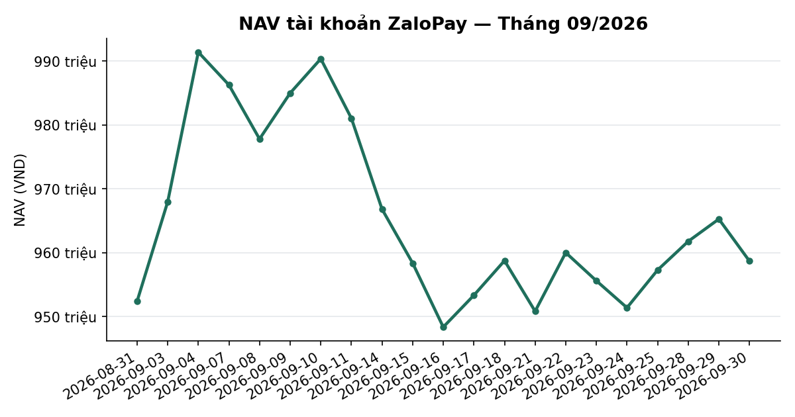
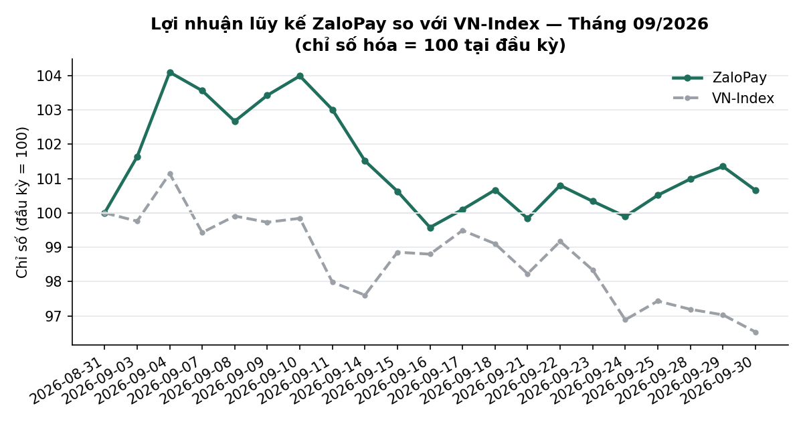
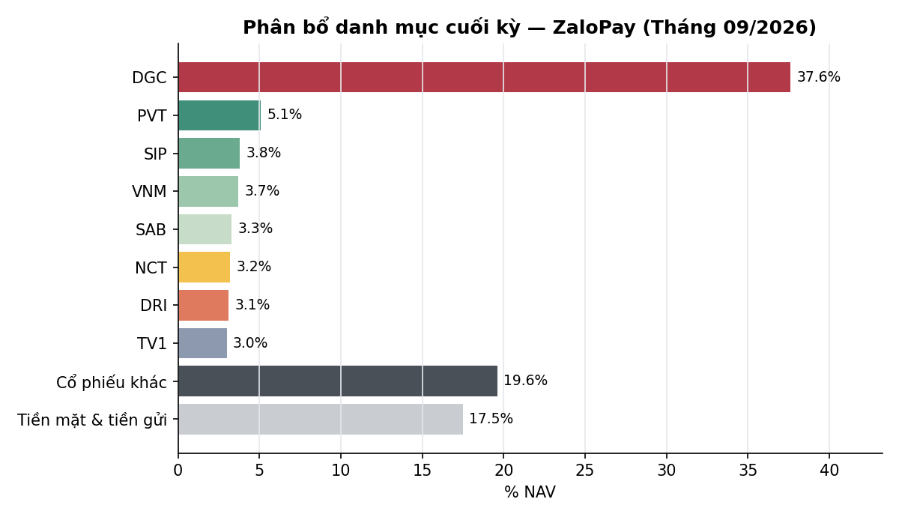

# BÁO CÁO THÁNG — TÀI KHOẢN ZALOPAY
## Kỳ báo cáo: THÁNG 09/2026 (01/09 – 30/09/2026)

**Tài khoản:** ZaloPay · DNSE, số hiệu 0001743768 · V2.4 live (cash-only) · DGC + PNJ excluded
**Chiến lược:** V2.4 — BAL momentum + LAG hậu-công-bố-lợi-nhuận, parking custom30V NEUTRAL
**Ngày lập báo cáo:** 01/10/2026 · **Người lập:** Taylor (Quant) — auto-dispatch từ
`check_report_cadence.sh` (báo cáo tháng bị bỏ sót, job Taylor_20261001_020004)
**Đối tượng:** Kênh theo dõi nội bộ (KHÔNG gửi nhà đầu tư ngoài) — giữ minh bạch đầy đủ, kể cả sự cố vận hành

> 📊 Xem biểu đồ minh hoạ đính kèm trong email (NAV, lợi nhuận lũy kế so VN-Index, phân bổ danh
> mục) — bản Discord chỉ hiển thị văn bản.

---

## 1. TÓM TẮT ĐIỀU HÀNH

Tháng 9 có **20 phiên** (01–02/09 nghỉ Quốc khánh), `nav_history_ZaloPay.csv` đủ **20/20 dòng**
(2 dòng backfill `nav_is_estimate=True`: 21/09, 23/09 — §9.2). Không có nạp/rút vốn ngoài; các
lần chuyển Tiền mặt ↔ Trứng vàng (17/09, 25/09) là chuyển nội bộ trong NAV.

| Chỉ tiêu | ZaloPay |
|---|---:|
| NAV đầu kỳ (31/08, = NAV cuối T8) | 952.365.940đ |
| NAV cuối kỳ (30/09) | 958.666.279đ |
| Lãi/lỗ trong kỳ | **+6.300.339đ** |
| Tỷ suất MTD (`nav_period_returns.py`) | **+0,66%** |
| VN-Index cùng khung (1.832,12 → 1.768,62) | −3,47% |
| Chênh so với chỉ số | **+4,13pp** |
| Tỷ suất Q3 = từ go-live (06/07 → 30/09) | −2,96% (VN-Index −5,02%, +2,06pp) |
| Biến động năm hoá (20 lợi suất ngày, không gap) | 15,88% (VN-Index 14,43%) |
| Sụt giảm tối đa trong tháng | −4,34% (VN-Index −4,56%) |
| Số lệnh khớp thật (broker `fillQuantity>0`, khớp journal FILL) | 32 |
| Phí + thuế (0,097%/lượt + 0,1% thuế bán) | 173.625đ |

**Nguồn số:** MTD/Q3 lấy từ `mike/bin/nav_period_returns.py --account ZaloPay --report-date
2026-09-30` (mốc go-live 987.865.567đ theo `data/account_inception.json`, user duyệt 27/09) — không
tự tính từ dòng đầu `nav_history`. Số lệnh khớp đối soát 2 nguồn: `dnse_raw_2026-09-*.jsonl` (lọc
`accountNo=0001743768`, §12) vs `exec_ZaloPay_2026-09-*_journal.csv` event=FILL — khớp từng ngày
(14/09: 2 · 17/09: 1 · 18/09: 3 · 22/09: 3 · 25/09: 1 · 29/09: 12 · 30/09: 10) và khớp giá trị tới đồng.

**Diễn giải nhanh:** ZaloPay +0,66% trong tháng chỉ số −3,47%. **Hơn 95% lãi tháng đến từ DGC**
(legacy, ngoài phạm vi bot): tổng lợi nhuận DGC +6,0tr = giá −70,0tr + cổ tức tiền mặt ròng +76,0tr
(8.000đ/cp × 10.000cp, GDKHQ 14/09, CASH_CONFIRMED). **Phần bot quản lý (loại DGC) ≈ +0,30tr ≈
+0,06%** trên active_nav đầu kỳ 522,4tr — vẫn vượt chỉ số rõ, nhưng KHÔNG nên đọc +0,66% là hiệu suất
chiến lược. 1 sự cố thực thi đáng kể trong tháng (29/09, §9.1).

---

## 2. HIỆU SUẤT MTD / QTD / YTD SO VỚI CHỈ SỐ
> Nguồn: `nav_history_ZaloPay.csv` + `nav_period_returns.py` + BQ `tav2_bq.ticker` (VNINDEX Close, dữ liệu tới 30/09)

### 2.1 MTD tháng 9 theo tuần

| Tuần | ZaloPay NAV | VNINDEX |
|---|---:|---:|
| Đầu kỳ (31/08) | 952.365.940 | 1.832,12 |
| Tuần 1 (→04/09) | 991.380.088 (+4,10%) | 1.853,08 (+1,14%) |
| Tuần 2 (→11/09) | 981.012.771 (+3,01%) | 1.795,21 (−2,01%) |
| Tuần 3 (→18/09) | 958.732.611 (+0,67%) | 1.815,66 (−0,90%) |
| Tuần 4 (→25/09) | 957.269.620 (+0,51%) | 1.785,11 (−2,57%) |
| Tuần 5 (→30/09) | 958.666.279 (+0,66%) | 1.768,62 (−3,47%) |

*(% trong ngoặc = tích luỹ từ 31/08.)* Đỉnh NAV tháng 04/09 (991,4tr, DGC tăng mạnh đầu tháng) → đáy
16/09 (948,3tr) = MDD −4,34%; DGC chiếm phần lớn biên độ này (§4).

### 2.2 QTD — Q3/2026 ĐÃ ĐÓNG (06/07 → 30/09)

| Kỳ | ZaloPay | VN-Index | Chênh |
|---|---:|---:|---:|
| Tháng 7 (06/07 → 31/07) | −10,03% | −6,78% | −3,25pp |
| Tháng 8 | +7,15% | +5,55% | +1,60pp |
| Tháng 9 | +0,66% | −3,47% | +4,13pp |
| **Q3/2026** | **−2,96%** | **−5,02%** | **+2,06pp** |

⚠️ **Đổi quy ước so với các kỳ trước — đọc kèm:** (1) mốc vốn = 987.865.567đ (NAV đêm trước phiên
go-live 06/07, user duyệt 27/09) thay cho dòng `nav_history` 07/07 (986.585.454đ) ⇒ tháng 7 nay là
−10,03% (báo cáo tháng 8 ghi −9,93%). (2) VN-Index neo **cùng thời điểm** với mốc vốn = đóng cửa
**03/07** (1.862,08), không phải 07/07 như báo cáo tuần 21–25/09 (−3,42% "từ khi bắt đầu"). Cả hai
thay đổi đều làm khớp mốc NAV ↔ mốc chỉ số; Δ do đổi quy ước VN-Index ≈ −0,71pp ở cột chỉ số (neo 07/07 cho −4,31%, neo 03/07 cho −5,02%).

### 2.3 YTD
Trùng Q3 (go-live trong Q3/2026).

---

## 3. PHÂN RÃ NGUỒN LÃI/LỖ (ATTRIBUTION)
> Giá trị cổ phiếu: positions broker 31/08 (bản ghi cuối 20:30:01) và 30/09 (22:00:10) × `Price` (giá thô)
> BQ 28/08 và 30/09; dòng tiền lệnh từ journal FILL. Script: `mike/agents/Taylor/research/monthly_report_202609/attribution.py`, `sectors.py`.

### 3.1 Phân rã theo cấu phần

| Cấu phần | VND | Ghi chú |
|---|---:|---|
| Biến động giá trị cổ phiếu (MV cuối + tiền bán − MV đầu − tiền mua) | −71.619.600 | trong đó DGC −70.000.000 (giá 43.000 → 36.000, phần lớn là điều chỉnh GDKHQ) |
| Cổ tức tiền mặt gộp | +81.900.000 | DGC 80.000.000 (CASH_CONFIRMED, vendor match) · DRI 1.900.000 (**UNVERIFIED** — vendor-only, chưa về tiền) |
| Thuế TNCN 5% trên cổ tức | −4.095.000 | |
| Phí giao dịch (0,097%) | −99.750 | |
| Thuế bán (0,1%) | −73.875 | |
| Phần dư: lãi Trứng vàng + chênh lệch khác | +288.564 | không phân rã tiếp; độ lớn phù hợp lãi tiền gửi ~39–102tr trong tháng |
| **Tổng (= Lãi/lỗ NAV kỳ)** | **+6.300.339** | đóng tuyệt đối với hiệu NAV đầu–cuối |

**Tách phần bot (active, loại DGC):** DGC tổng lợi nhuận tháng = −70.000.000 + 76.000.000 (cổ tức ròng)
= **+6.000.000đ (+1,40% tổng lợi nhuận)**. Phần còn lại ≈ **+300.339đ ≈ +0,06%** trên active_nav đầu
kỳ (952.365.940 − 430.000.000 = 522.365.940đ). Xấp xỉ vì dòng tiền cổ tức DGC chảy vào tiền mặt
chung giữa kỳ.

### 3.2 Phân rã theo nhóm ngành (đã gồm cổ tức ròng)

| Nhóm ngành | Mã | Lãi/lỗ tháng (VND) | % NAV đầu → cuối |
|---|---|---:|---:|
| Vận tải, logistics & năng lượng | PVT, NCT, TV1 | +7.529.100 | 10,2% → 11,4% |
| Hoá chất, vật liệu & công nghiệp | **DGC**, CSV, HPG, SCL | +4.310.000 | 51,5% → 43,3% |
| Tiêu dùng & nông nghiệp | VNM, SAB, DRI | +1.093.300 | 10,3% → 10,2% |
| Chứng khoán & tài chính | VIX | −174.000 | 0,2% → 0,0% |
| Bất động sản & KCN | VHM, VRE, VPI, SIP | −2.942.150 | 6,5% → 7,7% |
| Ngân hàng | 13 mã | −3.630.850 | 16,6% → 10,0% |
| **Tổng** | | **+6.185.400** | |

*(Tổng = biến động giá + cổ tức ròng; chênh với lãi/lỗ NAV = phí/thuế/lãi tiền gửi ở §3.1. Nhóm
Hoá chất loại DGC = −1.690.000.)*

### 3.3 Đóng góp tốt nhất & kém nhất trong tháng

| Mã | Lãi/lỗ (VND) | Ghi chú |
|---|---:|---|
| PVT | +7.455.600 | giá 20.200 → 23.800 |
| DGC | +6.000.000 | legacy excluded; giá −70tr bù bởi cổ tức ròng +76tr |
| DRI | +4.845.000 | giá 14.100 → 15.700 + cổ tức 1.805.000 ròng (UNVERIFIED) |
| VPB | +1.830.800 | đã gồm chia cổ phiếu 26,04% (GDKHQ 24/09) |
| SCL | +800.000 | còn giữ 1.000cp (xem §7.6) |
| SAB | −2.008.800 | giá 45.600 → 42.900 |
| VNM | −1.742.900 | giá 62.300 → 59.400 |
| LPB | −1.619.400 | đã trim 352 → 52cp |
| CSV | −1.550.000 | giá 21.550 → 20.000 |
| VPI | −1.260.000 | mua 17–18/09 @62.450 bq, đóng cửa 59.300 |

---

## 4. CHỈ SỐ RỦI RO
> Nguồn: `nav_history_ZaloPay.csv` (20 lợi suất ngày 31/08→30/09, KHÔNG có gap — khác tháng 8 có 5 ngày trống)
> ⚠️ Số do Taylor tính, CHƯA qua audit độc lập của Spyros.

| Chỉ số | ZaloPay | VN-Index |
|---|---:|---:|
| Độ lệch chuẩn lợi suất ngày | 1,000% | 0,909% |
| Biến động năm hoá (×√252) | 15,88% | 14,43% |
| Sụt giảm tối đa trong tháng | −4,34% (04/09 → 16/09) | −4,56% |
| Ngày tăng / tổng | 10/20 | 7/20 |
| Beta / tương quan với VN-Index (20 phiên) | 0,52 / 0,47 | 1 / 1 |
| Tỷ trọng cổ phiếu / NAV (kể cả DGC) | 82,5% | — |
| Tỷ trọng cổ phiếu / active_nav (loại DGC) | 72,0% (431,0tr / 598,7tr) | — |

Tương quan thấp (0,47) + vol cao hơn chỉ số là chữ ký của **rủi ro riêng DGC** (37,6% NAV): ngày
lợi suất tốt nhất +2,42% và đoạn MDD 04→16/09 đều do DGC dẫn dắt. So với tháng 8 (vol 25,58% trên
chuỗi có 5 gap — phóng đại), số tháng 9 sạch hơn và KHÔNG so sánh trực tiếp được với số tháng 8.

---

## 5. BỐI CẢNH THỊ TRƯỜNG & VĨ MÔ THÁNG 9/2026
> Đọc BLIND với forward-return · số vĩ mô do macro-strategist (Bobby) thu thập có nguồn, chốt 30/09

### 5.0 Trạng thái hệ (regime) — §6b `dna_report`
- **DT5G** (`tav2_bq.vnindex_5state_dt5g_live`): **NEUTRAL (3) cả 21/21 dòng** 28/08 → 30/09.
  `build_dt_gate_line()`: *Gate DT5G: 🟢 BÌNH THƯỜNG · candidate BEAR 2/10 (20%, còn 8 phiên để
  commit, base giữ từ 2026-09-29, committed NEUTRAL) · P(BEAR xác nhận|k=2)≈47% [37–57%, n=86]* —
  **xu hướng BEAR đang tích luỹ từ 29/09**, chưa commit.
- **Value Radar** (DISPLAY-ONLY, 0/17 lăng kính qua đa kiểm định): *🟢 20.6 RẺ · P/E 11.34 (p7) · P/B
  1.91 (p28) · spread EY−tiết kiệm +2.02pp (p26)* [dữ liệu tới 30/09].
- 04/09: `macro_health=FAILED` giả (lịch nghỉ lễ) ⇒ DT5G chạy DT4_only 1 đêm — state không đổi
  (§9.1 mục 3).

### 5.1 Thị trường
VN-Index đỉnh tháng 1.853,08 (04/09) → 2 nhịp giảm mạnh 11/09 (−1,86%) và 24/09 (−1,47%) → đóng
1.768,62 (−3,47%). Phiên giảm sâu nhất −1,86% — tháng **lành tính** theo nghĩa của extreme_regime
(không có phiên nào gần biên sàn, §10.1).

> Nguồn: Tổng cục Thống kê (TCTK), Ngân hàng Nhà nước (NHNN), Cục Dự trữ Liên bang Mỹ (Fed), Tổng
> cục Thống kê Trung Quốc (NBS), dữ liệu giá dầu và chỉ số biến động quốc tế · Chốt dữ liệu: 30/09/2026

> **Lưu ý:** CPI tháng 9 và GDP Quý 3/2026 chưa được công bố tại ngày lập báo cáo (dự kiến đầu
> tháng 10). Số liệu trong nước dưới đây là của tháng 8 hoặc lũy kế 8 tháng.

### 5.2 Kinh tế trong nước

**Lạm phát — CPI tháng 8/2026** (TCTK công bố 03/09): tăng 0,47% so với tháng trước và **4,89%**
so với cùng kỳ (tháng 7: 4,45%); bình quân 8 tháng tăng 4,45%; lạm phát cơ bản tăng 4,55% so với
cùng kỳ. Động lực chính là nhóm giao thông (giá dầu diesel +22,15%, xăng +9,53%). CPI đã vượt nhẹ
mục tiêu khoảng 4,5% của Quốc hội.

**Hoạt động kinh tế 8 tháng:** chỉ số sản xuất công nghiệp tăng 11,9% (cao nhất cùng kỳ kể từ
2019); tổng mức bán lẻ tăng 13,3%. Xuất khẩu đạt 374,8 tỷ USD (+22,4%), nhập khẩu 395,3 tỷ USD
(+35,3%), **thâm hụt thương mại 20,46 tỷ USD**. GDP gần nhất (Quý 2/2026) tăng 8,39%, lũy kế 6
tháng tăng 8,18%.

### 5.3 Chính sách tiền tệ

Lãi suất tái cấp vốn của NHNN giữ nguyên 4,5%. Tăng trưởng tín dụng đến 28/08 đạt 10,24% so với
cuối năm 2025. Tỷ giá trung tâm dao động 25.596–25.610 VND/USD trong nửa đầu tháng 9; lãi suất liên
ngân hàng qua đêm khoảng 5,20% giữa tháng. Tỷ lệ nợ xấu nội bảng toàn hệ thống ở mức 1,51% cuối
tháng 6/2026.

### 5.4 Bối cảnh quốc tế

**Fed tăng lãi suất:** cuộc họp ngày 16/09 nâng lãi suất điều hành thêm 0,25 điểm phần trăm lên
3,75–4,00% — lần tăng đầu tiên kể từ tháng 7/2023 — và dự phóng trung vị hàm ý thêm một lần tăng
trong năm 2026, với lý do chính là cú sốc giá năng lượng.

**Giá dầu tăng mạnh:** giá dầu Brent kỳ hạn tăng từ 90,49 USD/thùng (31/08) lên 103,53 USD/thùng
(30/09), đỉnh 108,75 USD ngày 15/09; giá giao ngay còn cao hơn đáng kể, phản ánh nguồn cung vật
chất căng thẳng gắn với diễn biến địa chính trị Trung Đông.

**Trung Quốc:** PMI sản xuất (NBS) tháng 9 đạt 50,1 — lần đầu trở lại vùng mở rộng sau nhiều tháng
dưới ngưỡng 50 (tháng 8: 49,8). Chỉ số biến động VIX của thị trường Mỹ dao động trong vùng thấp
14–18 điểm.

### 5.5 Đánh giá rủi ro

**Kết luận: không ghi nhận tín hiệu khủng hoảng cấu trúc trong nước; rủi ro chính đến từ cú sốc
bên ngoài (giá năng lượng và chính sách thắt chặt của Fed).**

| Chỉ báo | Ngưỡng cảnh báo | Mức hiện tại | Đánh giá |
|---|---|---|---|
| CPI (so cùng kỳ) | ≥6% | 4,89% (tháng 8) | Dưới ngưỡng, nhưng đã vượt mục tiêu 4,5% |
| Tăng trưởng tín dụng | ≥30%/năm | ~18% so với cùng kỳ | Bình thường |
| Tỷ lệ nợ xấu ngân hàng | ≥5% | 1,51% | Bình thường |
| Cán cân thương mại / vãng lai | Xu hướng xấu kéo dài | Thâm hụt thương mại 20,46 tỷ USD (8 tháng) | Cần theo dõi |

Nền tảng tăng trưởng trong nước vẫn vững (sản xuất, bán lẻ, xuất khẩu tăng hai chữ số), song áp
lực lạm phát nhập khẩu từ giá năng lượng và việc Fed quay lại tăng lãi suất làm tăng rủi ro tỷ giá
và có thể hạn chế dư địa nới lỏng tiền tệ trong nước.

*Ngưỡng PIT filter sản phẩm (tham chiếu, chỉ áp dụng account có margin — KHÔNG áp dụng ZaloPay
cash-only): CPI≥6% OR lãi tiết kiệm≥9% → block capit_margin_lever. CPI 4,89% ⇒ chưa chạm.*
*Regime (Bobby): tăng trưởng trong nước + **sốc bên ngoài** (năng lượng, Fed); KHÔNG phải khủng
hoảng cấu trúc trong nước; độ tin **ambiguous** (lạm phát cơ bản đi lên, tín dụng nhanh hơn huy
động, cán cân thương mại đảo chiều). Bobby báo 2 lỗi dữ liệu cục bộ (không sửa):
`data/macro_daily.csv` có dòng ngày tương lai tới 2026-12-31 (forward-fill tỷ giá 26.355);
`data/macro_usdvnd.csv` dừng 2026-04-29 — chuyển Winston.*

---

## 6. PHÍ & CHI PHÍ
> Nguồn: `exec_ZaloPay_2026-09-*_journal.csv` event=FILL, đối soát `dnse_raw` (§1)

| Khoản mục | ZaloPay |
|---|---:|
| Giá trị mua trong tháng | 28.960.000đ |
| Giá trị bán trong tháng | 73.875.000đ |
| Tổng giá trị giao dịch | 102.835.000đ |
| Phí giao dịch (0,097%/lượt — `bin/dnse_fee_rates.py`) | 99.750đ |
| Thuế bán (0,1%) | 73.875đ |
| **Tổng phí + thuế** | **173.625đ** |
| Lãi vay margin | 0 (cash-only; `totalDebt` 7.027đ cuối kỳ = dư kỹ thuật) |
| Phí quản lý / hiệu suất | 0 |

Phí ước tính theo tỉ lệ (0,097% là mức HOSE; mã UPCOM 0,088% — chênh không đáng kể ở quy mô này),
chưa đối soát từng dòng với email khớp lệnh DNSE.

---

## 7. NHẬT KÝ SỰ KIỆN THÁNG

### 7.1 HOLD_ALL hết hạn 16/09 → mua VPI (BAL, RE_BACKLOG_BUY)
HOLD_ALL (quyết định user 19/08) hết hiệu lực 16/09. VPI 100cp khớp 17/09 @62.000 + 300cp 18/09
(tổng 400cp, 24,98tr). Phiên chiều 17/09 bị FUNDING gate chặn oan (§9.1 mục 2) ⇒ phần còn lại dời
sang 18/09.

### 7.2 TV1 — discretionary special situation 14/09
200cp @19.900 (3,98tr), 2 fill 13:53 / 14:25 (ngoài block hybrid — đúng thiết kế, play type
DISCRETIONARY không đi lịch fill-timing). TV1 nay 1.400cp.

### 7.3 Chính sách parking 0,80 → 0,30 (user chốt 27/09)
`trading_rules.json` neutral_parking `default_park_of_idle_pct` 0,80 → 0,30 (Mike/answer
`custom30v-park-fraction-80-mat-can-cu`, decided_by=user; `compute_park_trim.py` PARK_TARGET_F1=0,30,
merge 95547a9a). Plan 29/09 = 15 lệnh bán PARK_TRIM 52,75tr; 30/09 = 9 lệnh còn lại 18,53tr.
Tổng PARK_TRIM tháng 9: 26 fill, 73,875tr (gồm trim định kỳ 22/09, 25/09).

### 7.4 Quyền lợi cổ đông
| Mã | Sự kiện | GDKHQ | Trạng thái `dividend_adjusted_return` |
|---|---|---|---|
| VIB | cổ tức CP 9,5% (200 → 219cp) | 10/09 | STOCK_CONFIRMED (vendor) |
| DGC | cổ tức tiền 8.000đ/cp = 80.000.000đ gộp | 14/09 | **CASH_CONFIRMED**, vendor match |
| DRI | cổ tức tiền 1.000đ/cp = 1.900.000đ gộp | 22/09 | **UNVERIFIED** (CASH_VENDOR, chưa về tiền; hệ vô định 21/09 vs 22/09) |
| VPB | cổ tức CP 26,04% | 24/09 | STOCK_CONFIRMED (vendor, hệ số 1,2604104) |

DRI không được công bố tỉ suất per-position (§21) — xem chú thích ¹ §8.

### 7.5 PNJ vào `excluded_tickers` cả 2 account (user, 30/09)
Hạ bậc AMBIGUOUS → NON (28/09). ZaloPay không giữ PNJ ⇒ không ảnh hưởng vị thế; chặn mua mới qua
rổ custom30V. Review trigger = BCTC Q3/2026 của PNJ.

### 7.6 SCL — exit LAG chỉ thực hiện ở SpaceX
30/09 SpaceX bán tay 1.500cp @28.300; ZaloPay **vẫn giữ 1.000cp SCL** (đã xác nhận, bus question
`scl-manual-sell-chi-mot-account-khong-phai-hai` đóng). Đã quá T+25. Cron auto-exit 20:40 ICT (wire
30/09, LAG T+25/BAL T+45/CAPIT T+60 + BAL stop-loss −20%) sẽ đề xuất lệnh bán — theo dõi plan 01–02/10.

---

## 8. DANH MỤC CUỐI THÁNG (30/09/2026)
> Nguồn: `dnse_raw_2026-09-30.jsonl` positions (bản ghi cuối 22:00:10, gộp MỌI loanPackage, lọc
> accountNo) × giá đóng cửa BQ 30/09; tỉ suất dựng bằng chính `report_return_gate.expected_pct()`
> (giá vốn thô = costPrice broker + cổ tức gộp đã hưởng; lãi ròng sau thuế 5%).

| Mã | Khối lượng | Giá vốn (đ/cp) | Giá đóng cửa 30/09 | Giá trị thị trường (đ) | % NAV | Lãi/lỗ chưa thực hiện (%) |
|---|---:|---:|---:|---:|---:|---:|
| **DGC** (legacy, excluded) | 10.000 | 47.775 | 36.000 | 360.000.000 | 37,6% | −8,74% |
| PVT | 2.071 | 17.248 | 23.800 | 49.289.800 | 5,1% | +37,98% |
| SIP | 749 | 47.140 | 49.100 | 36.775.900 | 3,8% | +4,16% |
| VNM | 601 | 58.700 | 59.400 | 35.699.400 | 3,7% | +1,19% |
| SAB | 744 | 47.450 | 42.900 | 31.917.600 | 3,3% | −3,58% |
| NCT | 373 | 94.400 | 83.100 | 30.996.300 | 3,2% | −3,92% |
| DRI | 1.900 | 13.263 | 15.700 | 29.830.000 | 3,1% | —¹ |
| TV1 | 1.400 | 20.329 | 20.600 | 28.840.000 | 3,0% | +1,34% |
| SCL | 1.000 | 23.590 | 28.600 | 28.600.000 | 3,0% | +21,24% |
| VPB | 1.212 | 21.226 | 23.400 | 28.360.800 | 3,0% | +10,24% |
| VPI | 400 | 62.450 | 59.300 | 23.720.000 | 2,5% | −5,04% |
| CSV | 1.000 | 19.750 | 20.000 | 20.000.000 | 2,1% | +1,27% |
| VHM | 200 | 74.317 | 68.500 | 13.700.000 | 1,4% | −7,83% |
| BID | 327 | 37.524 | 35.950 | 11.755.650 | 1,2% | −4,19% |
| VCB | 200 | 60.950 | 58.000 | 11.600.000 | 1,2% | −4,14% |
| CTG | 350 | 32.583 | 30.000 | 10.500.000 | 1,1% | −6,62% |
| TCB | 256 | 31.611 | 32.550 | 8.332.800 | 0,9% | +2,97% |
| MBB | 352 | 20.544 | 19.650 | 6.916.800 | 0,7% | −4,35% |
| HPG | 300 | 22.200 | 20.150 | 6.045.000 | 0,6% | −9,23% |
| HDB | 159 | 25.891 | 27.500 | 4.372.500 | 0,5% | +6,21% |
| ACB | 200 | 22.700 | 21.100 | 4.220.000 | 0,4% | −7,05% |
| VIB | 219 | 13.607 | 13.350 | 2.923.650 | 0,3% | −1,89% |
| SHB | 200 | 12.100 | 11.450 | 2.290.000 | 0,2% | −5,37% |
| LPB | 52 | 54.843 | 44.000 | 2.288.000 | 0,2% | −19,77% |
| MSB | 140 | 13.542 | 14.200 | 1.988.000 | 0,2% | +4,86% |
| VIX | 5 | 13.286 | 12.300 | 61.500 | 0,0% | −7,42% |
| **Tổng cổ phiếu** | | | | **791.023.700** | **82,5%** | |
| Tiền mặt | | | | 65.408.101 | 6,8% | |
| Tiền gửi Trứng vàng (`egg.totalValue`, đọc tự động API DNSE) | | | | 102.241.505 | 10,7% | |
| Nợ margin (kỹ thuật, cash-only) | | | | −7.027 | 0,0% | |
| **NAV** | | | | **958.666.279** | **100%** | |

¹ DRI: cổ tức 1.000đ/cp GDKHQ 22/09 còn UNVERIFIED (§7.4) — broker đã trừ 1.000đ khỏi `costPrice`
(13.263 → 12.263), công bố tỉ suất theo `costPrice` broker sẽ phóng đại ~2,5pp; giá vốn hiển thị là
giá vốn TRƯỚC cổ tức. Công bố khi tiền về.
DGC: excluded ⇒ `report_return_gate` không kiểm dòng này; số hiển thị = cùng công thức (giá vốn thô
47.775 = costPrice 39.775 + 8.000 cổ tức gộp).

**Tổng giá trị bảng = `mtm_stock` của `nav_history` 30/09 (791.023.700đ) khớp tới đồng**; NAV bảng =
958.666.279đ = NAV chính thức. Residual 7,9tr của báo cáo tuần 21–25/09 (§4.2 tuần đó) **không tái
hiện** ở cuối tháng — xem §9.3.

**Rủi ro tập trung:** DGC 37,6% NAV (giảm từ 45,2% cuối T8 do giá giảm sau GDKHQ) — vẫn là rủi ro
cơ cấu lớn nhất, ngoài phạm vi bot; nhắc lại khuyến nghị các kỳ trước: user cần xác nhận chủ đích
giữ/giảm. Phần bot: mã lớn nhất PVT 5,1% NAV (8,2% active_nav). Không mã nào thuộc danh sách BANNED.

---

## 9. CÔNG BỐ SỰ CỐ & KHOẢNG TRỐNG SỐ LIỆU
**Nguyên tắc: công bố MỌI sự cố ảnh hưởng NAV/giao dịch/số liệu, kể cả đã tự khắc phục.**

### 9.1 Sự cố vận hành
1. **29/09 — lệnh BÁN `HTTP 400: deal not found` (SEV cao nhất tháng).** 6/15 lệnh PARK_TRIM (HPG,
   MSB, SHB, TPB, VIX, VRE — các mã mua 11/08 với `loanPackageId` 1826) bị DNSE từ chối vì
   `DNSEBroker.place_order` gửi lệnh bán với gói default account (1258). Journal ghi **3.660
   PLACE_FAIL + 264 ATC_FAIL** cả phiên (retry không điểm dừng). 0 lệnh mồ côi/trùng (child_oid
   rỗng, `dnse_raw` chỉ 12 place_order = 12 lệnh thành công). User duyệt sửa 14:34 ICT; 5 vòng
   arch-review (CONFIRMED / APPROVED_WITH_NITS). Commit WC `d51c735e` · `fd882ded` · `82732a05` ·
   `3f939dc8` · `882ac50c`; mike `e6fac527` · `5d8c5d33`: resolve gói theo deal của CHÍNH mã + dừng
   PLACE_FAIL lỗi cấu trúc sau 5 lượt (`PLACE_FAIL_STOPPED`). **30/09: 9 lệnh còn lại khớp đủ (10 fill,
   18,55tr), gồm cả 6 mã từng lỗi** — xác nhận bằng diff positions 29/09 → 30/09. Thiệt hại: chậm 1
   phiên ~9,77tr; không mất tiền. Incident `kb/incidents/2026-09/2026-09-29-zalopay-sell-deal-not-found-loanpackage-1826.md`.
2. **17/09 — FUNDING gate chặn oan phiên chiều** (rc=3): lệnh MỞ VPI 100cp bị tính 2 lần (vừa giữ tiền
   ở broker, vừa nằm trong nhu cầu). Hệ quả: dời phần mua VPI sang 18/09. Incident
   `2026-09-17-funding-gate-double-count-open-order-on-resume.md` — trạng thái vá **chưa được kiểm lại
   trong báo cáo này**.
3. **04/09 — `macro_health=FAILED` giả** do `tdays()` không trừ nghỉ lễ ⇒ DT5G chạy DT4_only 1 đêm;
   state không đổi, không ảnh hưởng plan. Đã có gate cơ học RULE 2 `tz_anchor_gate.py` (05/09).
4. **CANCEL_FAIL VPI 17/09** (1 dòng) — cả 2 account cùng lúc; không để lại lệnh treo (positions
   khớp).

### 9.2 Khoảng trống dữ liệu `nav_history` tháng 9
**0 ngày trống** (20/20 phiên). 2 dòng backfill `nav_is_estimate=True` (21/09, 23/09 — dựng từ
`dnse_raw` positions + balances + BQ Price, đã nêu ở báo cáo tuần). Cải thiện rõ so với tháng 8 (5
ngày trống).

### 9.3 Residual / giới hạn còn tồn
- **Residual 7,9tr tuần 21–25/09:** bảng tuần dùng số lượng replay-fill của
  `verify_account_snapshot.py`; bảng tháng này dùng thẳng positions broker gộp mọi loanPackage và
  khớp `mtm_stock` tới đồng. Nhất quán với giả thuyết lệch nằm ở số replay (BID 427 vs 320, VCB 300 vs
  100 = đọc 1 lô), nhưng **chưa có kiểm chứng riêng cho ngày 25/09** — không kết luận nguyên nhân (§29).
- **MBB:** quyền mua 28/08 không sinh order record ⇒ `verify_account_snapshot.py` tiếp tục WARN qty
  mismatch (giới hạn cấu trúc, không phải lỗi tái diễn); báo cáo dùng positions broker.
- **Đẳng thức `reconcile_equity.py`** vẫn không áp dụng đầy đủ (2 vị thế legacy DGC + VPB).
- **Phí:** ước theo tỉ lệ, chưa đối soát email khớp lệnh từng dòng.

---

## 10. PAPER SIGNALS CHẠY NỀN — KIỂM TRA SUY GIẢM THEO THÁNG
> Nguồn: `kb/paper_programs_registry.json` (cả 2 chương trình `graduated-live`, `reporting=false`),
> `exec_main_*_journal.csv` + `exec_{SpaceX,ZaloPay}_*_journal.csv`, `probe_ticks_main_*.csv`, BQ
> `tav2_bq.ticker` (Open quy về giá thô = Open × Price/Close). Script tái lập:
> `mike/agents/Taylor/research/monthly_report_202609/paper_signals.py` → `paper_signals_202608_202609.json`.
> Config live đọc qua `load_config()` + `load_accounts()` ngày 01/10: SpaceX & ZaloPay
> `extreme_regime_enabled=True`, `fill_timing_live_gate=False`, `fill_timing_hybrid_live_gate=False`
> (= cả 2 đang LIVE, đúng registry).
> ⚠️ Ít quan sát hay 0 trigger KHÔNG phải bằng chứng alpha/hiệu quả.

### 10.1 extreme_regime (gate phòng thủ intraday — LIVE từ 22/08)

| Chỉ tiêu | Tháng 8 | Tháng 9 |
|---|---:|---:|
| Phiên paper main có journal / phiên evidence (≥1 PLACE) | 17 / 17 | 20 / 20 |
| Marker `EXTREME_PAUSE` / `EXTREME_FLOOR_GUARD` / `EXTREME_DOWN sell-to-floor` — paper main | 0 | 0 |
| Probe ticks main (file) | 3.576 (6 file, từ 19/08) | 11.079 (20 file) |
| Ticks `in_band` (sát biên sàn) / `trig_ii_would_fire` | 0 / 0 | 0 / 0 |
| Ticks có `r15` (trigger ii đo được) | 3.114 (87%) | 9.385 (85%) |
| Phiên live có journal SpaceX / ZaloPay | 8 / 6 (gần hết TRƯỚC go-live 22/08) | 5 / 7 |
| Marker EXTREME trên journal live | 0 | 0 |
| Lỗi/reject paper main | 0 | 0 |
| Phiên VN-Index giảm sâu nhất | −2,07% (14/08) | −1,86% (11/09) |

**Kết luận: ỔN ĐỊNH** về đúng câu hỏi gate đã tốt nghiệp — 0 false-trigger trên 20 phiên evidence
mới + 11.079 tick, và **lần đầu có phiên live (12 phiên-account) chạy qua gate đang ARMED** mà không
can thiệp NORMAL-path. Giới hạn: tháng 9 vẫn lành tính (không phiên nào gần biên sàn ⇒ in_band=0) nên
hành vi KHI SẬP vẫn chỉ được bảo chứng bởi stress-injection 40/40, không có bằng chứng mới. Gate
registry: 4/4 pass, không đổi so với tháng 8.

### 10.2 fill_timing (HYBRID block — LIVE từ 26/08)
Quy ước dấu: bps = giá khớp / Open thô − 1. MUA âm = mua rẻ hơn open (tốt); BÁN âm = bán thấp hơn open.
Thống kê = trung bình theo NGÀY (day-mean), se = sd/√n_ngày.

| Chỉ tiêu | Tháng 8 | Tháng 9 |
|---|---:|---:|
| **Paper main** — MUA: fill / trong block hybrid | 67 / 53 (79%; hybrid chỉ từ 11/08) | 124 / 124 (100%) |
| Paper main — BÁN: fill / trong block 09:15–10:15 | 79 / 66 (84%) | 117 / 111 (95%) |
| Paper main — MUA trong block, fill-vs-open | +14,4 bps (n=8 ngày, sd 31,2, se 11,0) | −12,4 bps (n=12, **sd 66,0**, se 19,0) |
| Paper main — BÁN, fill-vs-open | −2,8 bps (n=12, sd 30,1, se 8,7) | −1,8 bps (n=8, sd 14,2, se 5,0) |
| Paper main — FAIL/ERROR | 0 | 0 |
| **Live** — phiên có lệnh MUA trong block (bộ đếm monitoring, mục tiêu 10) | 0 | **2** (17/09, 18/09 — cả 2 account) |
| Live MUA fill-vs-open | — | SpaceX −46,0 bps (6 fill / 2 ngày, se 46,0) · ZaloPay −39,6 bps (4 fill trong block / 2 ngày, se 39,6) |
| Live BÁN trong block | — | SpaceX 60/62 · ZaloPay 26/26 |
| Live BÁN fill-vs-open | — | SpaceX −2,6 bps (4 ngày, se 12,5) · ZaloPay −2,9 bps (4 ngày, se 10,1) |
| Live reject/fail | (tháng 8: 08-10 PLACE_FAIL multipackage — trước go-live) | ZaloPay 29/09: 3.660 PLACE_FAIL + 264 ATC_FAIL — **KHÔNG thuộc fill-timing** (loanPackage, §9.1) |

**Kết luận: CƠ HỌC ỔN ĐỊNH; fill-vs-open live CHƯA ĐỦ DỮ LIỆU; có 1 DẤU HIỆU CẦN ĐIỀU TRA (nhẹ).**
- Adherence tăng (MUA 100%, BÁN 95% trong block), 0 lỗi do fill-timing.
- Live: mới **2/10 phiên** monitoring; mean MUA âm (thuận lợi) ⇒ xa điều kiện rollback (mean > +22 bps
  bền). n=2 ngày — không đọc được gì về edge.
- ⚠️ **Độ phân tán fill-vs-open phía MUA trên paper main tăng gấp đôi: sd ngày 66,0 vs 31,2 bps
  tháng 8**, bền với leave-one-out (T9: 50,5–69,2; T8: 24,9–33,7). Lý do go-live 26/08 là **GIẢM
  PHƯƠNG SAI** (sd 35,2 vs 97,9 trước hybrid), nên đây là đúng thước đo cần giữ. Vẫn dưới mốc trước
  hybrid (97,9) và mean không xấu đi (−12,4; median −8,2), VN-Index vol ngày tháng 9 (0,91%) không cao
  hơn tháng 8 (1,00%) ⇒ không giải thích bằng thị trường. Giả thuyết chưa kiểm: rổ mã probe đổi /
  quy mô lệnh paper tăng (124 vs 53 fill). **Chưa phải bằng chứng suy giảm**; đề xuất đo lại sd theo
  từng mã + quy mô lệnh ở review tháng 10 trước khi kết luận.

---

## 11. TRIỂN VỌNG & VIỆC CẦN LÀM

### 11.1 Bối cảnh bước sang tháng 10
DT5G NEUTRAL nhưng **candidate BEAR 2/10 đang tích luỹ** (P xác nhận ≈47%) — nếu commit BEAR,
allocator w_LAG về 0 và parking custom30V (chỉ áp dụng ở NEUTRAL) ngừng; theo dõi đồng hồ gate hằng ngày. Vĩ mô: sốc ngoài
(Brent ~104 USD, Fed tăng lãi) — CPI 4,89% chưa chạm ngưỡng PIT 6%. Tư thế tài khoản: cổ phiếu
active 72% active_nav, tiền + Trứng vàng 17,5% NAV sau khi hạ parking xuống 0,30.

### 11.2 Việc cần làm

| # | Việc | Người phụ trách | Hạn |
|---|---|---|---|
| 1 | ZaloPay SCL 1.000cp đã quá T+25 — xác nhận lệnh bán do auto-exit 20:40 đề xuất | DollarBill / user | 02/10/2026 |
| 2 | DRI cổ tức 1,9tr: đối soát tiền về để chuyển UNVERIFIED → CASH_CONFIRMED và công bố tỉ suất | Winston | khi tiền về |
| 3 | Kiểm lại trạng thái vá FUNDING double-count open-order (incident 17/09) | Mafee / Taylor | 03/10/2026 |
| 4 | fill_timing: đo sd fill-vs-open MUA paper theo mã + quy mô lệnh (dấu hiệu §10.2) | Taylor | review tháng 10 |
| 5 | Audit §4 chỉ số rủi ro (Taylor tính, chưa qua Spyros) | Spyros | 07/10/2026 |
| 6 | 2 lỗi dữ liệu macro cục bộ (`macro_daily.csv` dòng tương lai; `macro_usdvnd.csv` dừng 29/04) | Winston | 10/10/2026 |
| 7 | DGC 37,6% NAV — user xác nhận chủ đích giữ/giảm (nhắc lại) | user | — |
| 8 | Cập nhật CPI tháng 9 + GDP Q3 (TCTK ~03–06/10) và FOMC 27–28/10 | Bobby | 07/10/2026 |

---

## 12. PHỤ LỤC — PHƯƠNG PHÁP & LƯU Ý

### 12.1 Pipeline số liệu
- NAV: `nav_history_ZaloPay.csv` (MTM cổ phiếu + tiền mặt − nợ margin + Trứng vàng `egg.totalValue`
  tự động qua API) · tỷ suất kỳ: `nav_period_returns.py` (§31).
- Lệnh khớp: `dnse_raw` (broker, lọc accountNo §12) ↔ journal FILL — khớp 2 nguồn.
- Vị thế & tỉ suất per-position: positions broker gộp loanPackage + `report_return_gate` (cổ tức qua
  `dividend_adjusted_return.py`, §21); `verify_account_snapshot.py` replay-fill KHÔNG dùng cho bảng
  này (MBB/legacy — §9.3).
- VNINDEX: BQ `tav2_bq.ticker` Close (không dùng `data/VNINDEX.csv` — dừng từ 05/2026).

### 12.2 Quy ước
- Giá MTM = giá đóng cửa 30/09; phí 0,097%/lượt; thuế bán 0,1%; cổ tức ròng sau thuế 5%.
- KHÔNG báo Sharpe/Sortino/Calmar (cần ≥6 tháng NAV ngày — mốc 01/01/2027).

### 12.3 Công bố tuân thủ
- Đây không phải khuyến nghị đầu tư. Kết quả quá khứ không đảm bảo kết quả tương lai.
- Mọi số liệu trace được về nguồn broker; số chưa trace được ghi rõ là ước tính/UNVERIFIED.

---

*Báo cáo tháng 09/2026 · Tổng hợp từ hệ thống giám sát vận hành nội bộ, đối soát với dữ liệu DNSE
API và BigQuery. Kênh nội bộ — KHÔNG gửi nhà đầu tư ngoài.*
*Báo cáo tuần chi tiết: các file `ZaloPay_weekly_report_2026-09-*.md`.*
