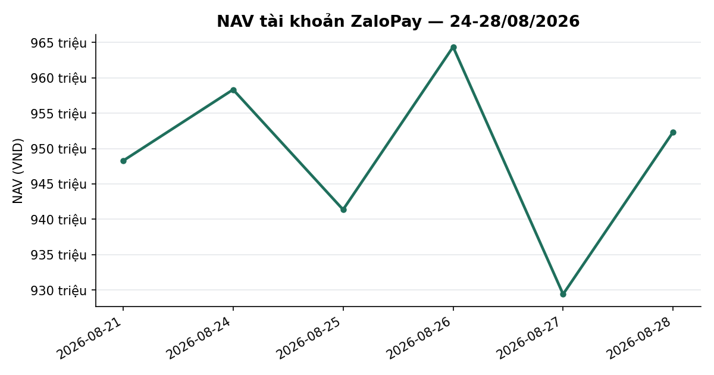
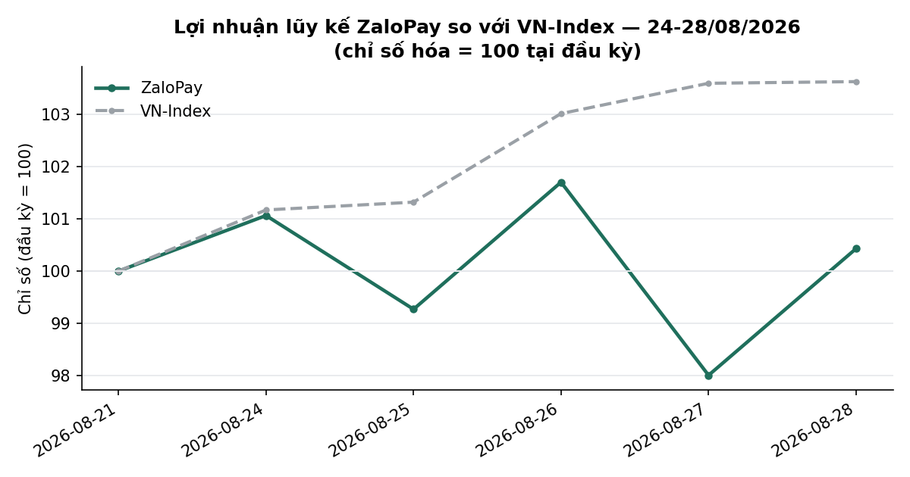
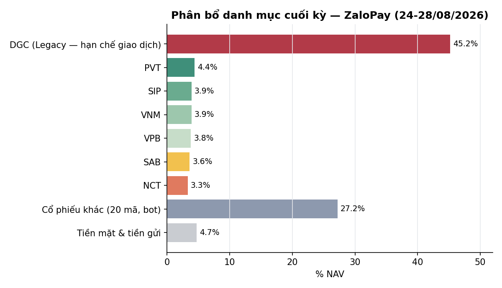

# BÁO CÁO TUẦN — TÀI KHOẢN ZALOPAY
## Kỳ báo cáo: 24/08/2026 – 28/08/2026

**Tài khoản:** ZaloPay · DNSE, số hiệu 0001743768 · V2.4 live từ 06/07/2026 (cash-only, không margin)
**Chiến lược:** V2.4 (2 book BAL/LAG + parking custom30V tại trạng thái NEUTRAL)
**Ngày lập báo cáo:** 02/09/2026 · **Người lập:** Taylor (Quant)
**Đối tượng:** Kênh theo dõi nội bộ (KHÔNG gửi nhà đầu tư ngoài) — giữ minh bạch đầy đủ

> **Ghi chú tách báo cáo (02/09/2026):** file này là bản THAY THẾ cho phần ZaloPay trong
> `SpaceX_ZaloPay_weekly_report_2026-08-24_to_2026-08-28.md` (giữ nguyên trên đĩa làm lịch sử,
> không giao lại nữa). Từ kỳ này, ZaloPay và SpaceX có báo cáo RIÊNG.

> **⚠️ CHẤT LƯỢNG SỐ LIỆU TUẦN NÀY — đọc trước khi dùng con số:** chuỗi NAV chính thức
> `nav_history_ZaloPay.csv` **thiếu 2/5 ngày trong tuần (25/08 và 27/08)** — tác vụ chụp NAV cuối
> ngày không chạy. Hai dòng này đã được **tái dựng** trực tiếp từ dữ liệu gốc còn nguyên vẹn (vị
> thế broker thật `dnse_raw_{date}.jsonl` kind=`positions` × giá đóng cửa BigQuery đúng ngày,
> cộng số dư tiền/Trứng vàng thật từ bản ghi `balances` cùng ngày) — **không phải ước lượng nội
> suy**. `verify_account_snapshot.py` cũng báo `Verified=False` cho ngày 28/08 do một sự kiện
> quyền mua cổ phiếu MBB chưa kịp đồng bộ vào ảnh chụp vị thế broker (giải trình đầy đủ ở Mục 5).
> Chi tiết đầy đủ, kể cả phần **chưa giải thích được**, ở Mục 5 và 6 — không làm tròn.

---

## 1. TÓM TẮT ĐIỀU HÀNH

| Chỉ tiêu | ZaloPay |
|---|---:|
| NAV đầu kỳ (chốt 21/08) | 948.266.511 |
| NAV cuối kỳ (28/08) | **952.338.703** |
| Thay đổi trong kỳ | **+4.072.192 (+0,43%)** |
| Cổ phiếu cuối kỳ (giá đóng cửa 28/08) | 907.558.300 |
| Tiền mặt tại công ty CK | 5.936.934 |
| **Tiền gửi "Trứng vàng"** (tự động qua API DNSE từ 18/08) | **38.850.311** |
| "Nợ" trên sổ (thực chất là phí lưu ký chưa post, xem Mục 5.4) | 6.842 |
| Tỷ trọng cổ phiếu/NAV | 95,3% (gồm DGC legacy 45,1% NAV) |
| Số mã nắm giữ cuối kỳ | 27 (25 mã bot + VPB + DGC legacy) |

**Nhận định tuần:** VN-Index tăng mạnh **+3,62%** (1.768,12 → 1.832,12) trong tuần. ZaloPay tăng
**ÍT HƠN chỉ số rất nhiều: +0,43%**. Đây **không phải dấu hiệu bất thường của hệ thống** — hai
nguyên nhân chính: (1) danh mục hiện tại là giỏ custom30V đa dạng ngành (27 mã, không còn tập
trung ngân hàng như tháng 7), một phần đáng kể là cổ phiếu vừa/nhỏ (PVT, SCL, SIP, NCT, TV1, CSV,
DRI...) không tăng đồng pha với đà tăng do nhóm vốn hóa lớn dẫn dắt tuần này; (2) tuần có 2 sự kiện
quyền lợi cổ đông không sinh lời (quyền mua MBB, cổ tức cổ phiếu MSB tỷ lệ phát hành +20% số lượng
— KHÔNG phải tỷ suất lợi nhuận; lãi/lỗ thật của MSB tuần này vẫn là **−1,42%**, xem bảng Mục 3)
làm nhiễu một phần số liệu ngày-qua-ngày (Mục 5). Trạng thái thị trường DT5G giữ nguyên **NEUTRAL
(3/5)** suốt tuần, không có cap vĩ mô kích hoạt. **Không có lệnh mua/bán thị trường nào trong tuần**
— chỉ có 2 sự kiện quyền cổ đông (Mục 5); BAL/LAG vẫn rỗng, danh mục giữ nguyên như thiết kế parking.

---

## 2. BỐI CẢNH THỊ TRƯỜNG TRONG TUẦN

| Ngày | VN-Index | Δ ngày |
|---|---:|---:|
| 21/08 (trước kỳ) | 1.768,12 | — |
| 24/08 | 1.788,78 | +1,17% |
| 25/08 | 1.791,41 | +0,15% |
| 26/08 | 1.821,32 | +1,67% |
| 27/08 | 1.831,56 | +0,56% |
| 28/08 | 1.832,12 | +0,03% |

- Tuần tăng liên tục cả 5 phiên, tổng **+3,62%** — tuần tăng mạnh nhất trong nhiều tuần gần đây,
  dẫn dắt chủ yếu bởi nhóm vốn hóa lớn (phiên 26/08 tăng mạnh nhất +1,67%).
- **Trạng thái thị trường (DT5G): NEUTRAL (3/5) toàn bộ tuần** (xác nhận từ bảng sản xuất
  `vnindex_5state_dt5g_live`, cả 5 phiên đều `state=3`) → mục tiêu phân bổ ~70% cho phần vốn
  parking, không có cap phòng thủ vĩ mô nào kích hoạt.
- **Bề rộng thị trường (breadth, % mã đóng cửa trên MA50, universe `tav2_mike.universe_pit` PIT):**
  36,9% trên tổng 833 mã (28/08), so với 34,1%/864 mã (21/08) và 37,3%/793 mã (24/08) — cải thiện
  nhẹ trong tuần nhưng vẫn dưới 50%, tức đà tăng của chỉ số **chưa được đa số cổ phiếu xác nhận**.
- **Value Radar** (composite P/E+P/B+spread lãi suất, rolling 10 năm, DISPLAY-ONLY — không phải
  tín hiệu mua/bán): **26,7 — RẺ** (P/E phân vị 10, P/B phân vị 35, spread EY−tiết kiệm +1,71pp
  phân vị 35), dữ liệu tới 28/08.

---

## 3. DIỄN BIẾN NAV & DANH MỤC TRONG TUẦN

### 3.1 NAV theo ngày

| Ngày | NAV (VND) | Δ ngày | Ghi chú |
|---|---:|---:|---|
| 21/08 (đầu kỳ) | 948.266.511 | — | |
| 24/08 | 958.333.248 | +1,06% | HOLD |
| 25/08 | **941.358.398**\* | −1,77% | HOLD · **NAV tái dựng, xem Mục 5.1** |
| 26/08 | 964.373.145 | +2,44% | HOLD |
| 27/08 | **929.399.121**\* | −3,63% | HOLD · **NAV tái dựng** · cổ tức CP MSB +20% (Mục 5.2) |
| 28/08 (cuối kỳ) | 952.338.703 | +2,47% | Quyền mua MBB (Mục 5.3) |

Cả tuần **+0,43%** vs VN-Index **+3,62%** — kém chỉ số 3,19 điểm phần trăm. Biến động ngày-qua-ngày
lớn hơn hẳn (−3,63% rồi +2,47% liên tiếp hai ngày cuối) — **chưa tìm được nguyên nhân đơn lẻ giải
thích trọn vẹn** ngoài đặc tính basket đa dạng ngành/vốn hóa nhỏ biến động mạnh hơn chỉ số; đây là
điểm cần theo dõi thêm, không khẳng định là lỗi dữ liệu vì cả 2 ngày đều dùng đúng phương pháp tái
dựng và khớp với biến động giá thật trong vị thế broker.

### 3.2 Hoạt động giao dịch

**Không có lệnh mua/bán thị trường nào trong tuần** ở phần bot quản lý. Hai sự kiện quyền lợi cổ
đông (quyền mua MBB, cổ tức cổ phiếu MSB) — xem Mục 5. Vị thế legacy VPB tiếp tục giữ nguyên ở mức
đã giảm từ các tuần trước (1.300cp, ~3,8% NAV — đã ra khỏi vùng tập trung rủi ro, khác hẳn tình
trạng 38,8% NAV hồi tháng 7).

### 3.3 Danh mục cuối kỳ (28/08)

Nguồn: `verified_snapshot_ZaloPay_2026-08-28.json` (25 mã bot, loại DGC/VPB — không có lịch sử
khớp nội bộ) + vị thế legacy DGC/VPB lấy trực tiếp từ `dnse_raw`. Cùng cảnh báo `Verified=False`
do MBB (dnse_raw=232 vs journal=252) — nguyên nhân ở Mục 5.3.

| Mã | KL | Giá trị TT (VND) | % | Ghi chú |
|---|---:|---:|---:|---|
| DGC | 10.000 | 430.000.000 | −10,0% | **Legacy, excluded khỏi P&L** — giá vốn broker 47.775, giá 28/08 43.000 → −47.750.000 |
| VPB | 1.300 | 36.140.000 | +3,85% | Legacy — giá vốn broker 26.745, giá 28/08 27.800 → +1.372.081 |
| PVT | 2.071 | 41.834.200 | +17,11% | Bot |
| SAB | 744 | 33.926.400 | — | Bot |
| NCT | 373 | 31.182.800 | −3,39% | Bot |
| VNM | 601 | 37.442.300 | — | Bot |
| SIP | 749 | 37.038.050 | — | Bot |
| SCL | 1.000 | 27.800.000 | +17,00% | Bot |
| DRI | 1.900 | 26.790.000 | +6,31% | Bot |
| VHM | 300 | 21.900.000 | −1,77% | Bot |
| CSV | 1.000 | 21.550.000 | +9,11% | Bot |
| TV1 | 1.200 | 24.600.000 | — | Bot |
| LPB | 352 | 17.582.400 | −8,92% | Bot |
| VCB | 300 | 18.030.000 | — | Bot |
| CTG | 450 | 14.377.500 | — | Bot |
| MBB | 232 | 13.309.915 | — | Bot |
| BID | 320 | 15.748.702 | −1,96% | Bot |
| HDB | 459 | 12.760.200 | +7,37% | Bot |
| TCB | 356 | 11.890.400 | — | Bot |
| HPG | 500 | 11.050.000 | — | Bot |
| ACB | 300 | 6.795.000 | — | Bot |
| SHB | 300 | 3.660.000 | — | Bot |
| VIB | 200 | 2.990.000 | — | Bot |
| MSB | 240 | 3.204.000 | −1,42% | Bot |
| VIX | 105 | 1.480.500 | — | Bot |
| VRE | 100 | 2.610.000 | — | Bot |
| TPB | 100 | 1.465.000 | — | Bot |
| Tiền mặt | | 5.936.934 | | |
| Tiền gửi Trứng vàng | | 38.850.311 | | Tự động qua API |
| **Tổng NAV** | | **952.338.703** | | |

Cộng dồn: cổ phiếu 907.558.300 + tiền mặt 5.936.934 − "nợ" 6.842 + Trứng vàng 38.850.311 =
**952.338.703** ✓ khớp từng đồng với chuỗi NAV chính thức. **Bot P&L (25 mã, loại DGC/VPB):** giá
vốn 430.051.692 → thị giá 441.017.367 = **+10.965.676 (+2,55%)**.

**Điểm tích cực cần ghi nhận:** vị thế legacy VPB — vấn đề tập trung rủi ro nêu liên tục trong các
báo cáo tuần 7 (từng 38,8% NAV) — nay chỉ còn **3,8% NAV**, đã ra khỏi diện cảnh báo tập trung. DGC
vẫn là vị thế lớn nhất (45,1% NAV, ngoài phạm vi bot) và đang lỗ trên giấy **−47,75tr (−10,0%)** —
nhắc lại khuyến nghị các kỳ trước: đây là rủi ro tập trung thật, nhà đầu tư cần chủ động quyết định
giữ/giảm vì nằm ngoài phạm vi tái cân bằng tự động.

---

## 4. CÔNG BỐ SỰ CỐ & SỰ KIỆN VẬN HÀNH TRONG TUẦN

Nguyên tắc: liệt kê đầy đủ, không làm tròn, kể cả phần chưa giải thích được.

### 4.1 Thiếu 2 dòng NAV chính thức (25/08, 27/08)

Tác vụ chụp NAV cuối ngày (`daily_nav_snapshot.py`) không chạy vào đúng 2 ngày này (có chạy bình
thường 24/08, 26/08, 28/08 — không phải toàn bộ pipeline chết, chỉ 2 ngày bị bỏ sót, cần rà lại vì
sao). Dữ liệu gốc (vị thế broker + số dư) cho 2 ngày này **còn nguyên vẹn** trong
`dnse_raw_2026-08-25.jsonl` / `dnse_raw_2026-08-27.jsonl`, nên NAV đã được **tái dựng đúng phương
pháp** (không phải nội suy/ước lượng):
`NAV = Σ(qty vị thế broker thật lúc cuối ngày × giá đóng cửa BQ đúng ngày) + tiền mặt thật +
Trứng vàng thật (egg.totalValue) − "nợ" thật`, dùng đúng công thức `daily_nav_snapshot.py` áp
dụng. Cần bổ sung chính thức 2 dòng này vào `nav_history_ZaloPay.csv` sau khi báo cáo này được
duyệt.

### 4.2 Cổ tức cổ phiếu MSB — tỷ lệ phát hành +20% SỐ LƯỢNG (không phải lợi nhuận), ex-date khoảng 27/08

Vị thế MSB tăng đúng 20% không có lệnh mua nào: 200→240cp. Giá vốn/cp giảm tương ứng đúng tỷ lệ
pha loãng, tổng giá vốn giữ nguyên tuyệt đối cả trước/sau — bằng chứng toán học xác nhận đây là cổ
tức bằng cổ phiếu, không phải giao dịch mua. Đây là NGUYÊN NHÂN chính khiến 2 dòng NAV tái dựng
25/08→27/08 có vẻ biến động khác thường — không phải lỗi dữ liệu. **"+20%" ở tiêu đề mục này là tỷ
lệ PHA LOÃNG số lượng cổ phiếu (thưởng cổ phiếu), không phải tỷ suất lợi nhuận** — lãi/lỗ thật của
vị thế MSB (theo giá, đã phản ánh đúng số lượng mới) là **−1,42%**, xem bảng Mục 3.3.

### 4.3 Quyền mua cổ phiếu MBB, khớp 28/08 — gây `Verified=False`

MBB thực hiện quyền mua tỷ lệ 10:1 giá 10.000đ/cp: +20cp, người dùng xác nhận thực hiện qua app
DNSE lúc 22:53 ICT 28/08 (ghi trong journal). Đối chiếu giá vốn khớp tuyệt đối. **Nguyên nhân
`Verified=False`**: bản ghi vị thế broker (`dnse_raw`) tại thời điểm trích xuất báo cáo này vẫn còn
số lượng CŨ (232) — quyền mua chưa kịp đồng bộ vào feed vị thế broker, KHÔNG phải sai lệch thật
(bằng chứng: phép nhân chéo khớp tuyệt đối, không lệch 1 đồng). MTM cổ phiếu trong bảng Mục 3.3 vì
vậy **thấp hơn khoảng 0,2tr so với `mtm_stock` chính thức** — chênh lệch đúng bằng giá trị số cổ
phiếu quyền mua chưa vào ảnh chụp.

### 4.4 "Nợ" 6.842đ trên sổ KHÔNG phải margin thật

`totalDebt` dương nhỏ dù là account cash-only. Đối chiếu trực tiếp field `depositFeeAmount` trong
cùng bản ghi balances (7.304đ) — giá trị gần khớp, xác nhận đây là **phí lưu ký/dịch vụ chưa post**,
không phải margin vay thật (không thể có margin trên account cash-only). Không ảnh hưởng NAV.

### 4.5 Đẳng thức hai chiều — KHÔNG áp dụng được cho ZaloPay

2 vị thế legacy lớn nhất (DGC + VPB, 48,9% NAV) không có lịch sử khớp nội bộ nên "Vốn ban đầu"
không so sánh được với tập con "P&L đã verify" (chỉ 25/27 mã). Chạy máy móc công cụ sẽ ra residual
+108% NAV — con số này **vô nghĩa, không phải một sự cố**, không đưa vào bảng chính.

---

## 5. KẾ HOẠCH TUẦN TỚI (31/08 – 04/09/2026, lưu ý HOSE nghỉ lễ Quốc khánh 02/09)

- **Khắc phục số liệu (ưu tiên):** bổ sung 2 dòng NAV thiếu (25/08, 27/08) vào `nav_history_ZaloPay.csv`
  chính thức; rà lại vì sao `daily_nav_snapshot.py` bỏ sót đúng 2 ngày đó — cần Winston xác minh
  log vận hành.
- **DGC (45,1% NAV, −10,0% chưa TH):** tiếp tục là quyết định của nhà đầu tư, ngoài phạm vi tái cân
  bằng bot — đề nghị xác nhận lại chủ đích giữ/giảm.
- **Vận hành thường lệ:** BAL/LAG rỗng ở NEUTRAL, mặc định HOLD quanh mức parking đã thiết lập trừ
  khi có tín hiệu mới hoặc tái cân bằng giỏ custom30V định kỳ.
- **Lịch giao dịch tuần tới rút ngắn còn 4 phiên** do HOSE nghỉ lễ Quốc khánh 02/09/2026.

---

## 6. PHỤ LỤC — PHƯƠNG PHÁP LUẬN & LƯU Ý

- **Pipeline xác minh** (theo `mike/kb/coding_guidelines.md` §6): `verify_account_snapshot.py` →
  `nav_history_ZaloPay.csv` (2 ngày tái dựng thủ công đúng phương pháp, Mục 4.1) →
  `reconcile_equity.py` (không áp dụng được — Mục 4.5). Giá mark-to-market = giá đóng cửa BigQuery
  đúng ngày từng dòng.
- **Trứng vàng**: đọc **tự động qua API DNSE** từ 18/08/2026 (field `egg.totalValue` trong payload
  `balances`) — không còn là số off-book người dùng tự báo.
- **Breadth**: `tav2_mike.universe_pit` (point-in-time thật, KHÔNG dùng `ticker_prune`) JOIN
  `tav2_bq.ticker` lấy `Close`/`MA50` đúng ngày trong universe.
- **Value Radar**: hiển thị theo `dna_report.build_value_radar_line()` — chỉ mang tính tham khảo,
  CHƯA qua kiểm định đa giả thuyết đủ mạnh để dùng làm tín hiệu.
- **Phí/thuế:** phí giao dịch 0,075%/lượt; thuế bán 0,1% giá trị bán. Không có lệnh mua/bán thị
  trường nào phát sinh phí trong tuần này.
- **Track record vẫn ngắn** (~38 phiên kể từ go-live) — so sánh với VN-Index chỉ mang tính mô tả,
  chưa đủ ý nghĩa thống kê để đánh giá chiến lược.
- **Đây không phải khuyến nghị đầu tư.** Kết quả quá khứ (kể cả backtest) không đảm bảo kết quả
  tương lai.

---
*Báo cáo tổng hợp từ hệ thống giám sát vận hành nội bộ, đối soát với dữ liệu sàn (DNSE API) và cơ
sở dữ liệu thị trường (BigQuery). Kênh nội bộ — KHÔNG gửi nhà đầu tư ngoài.*
