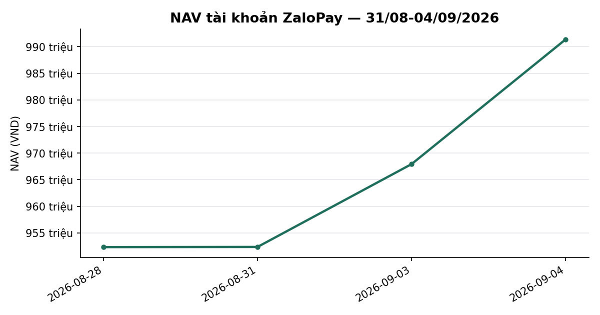
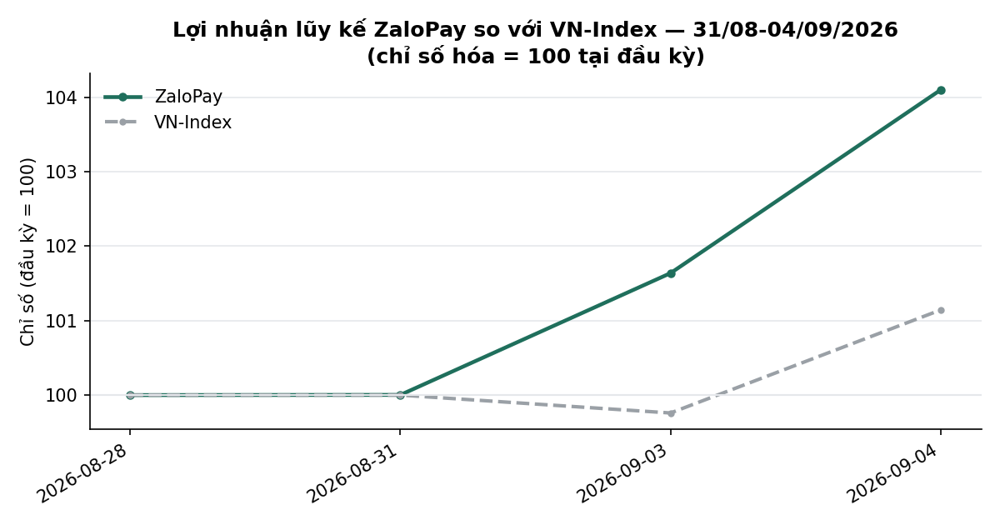
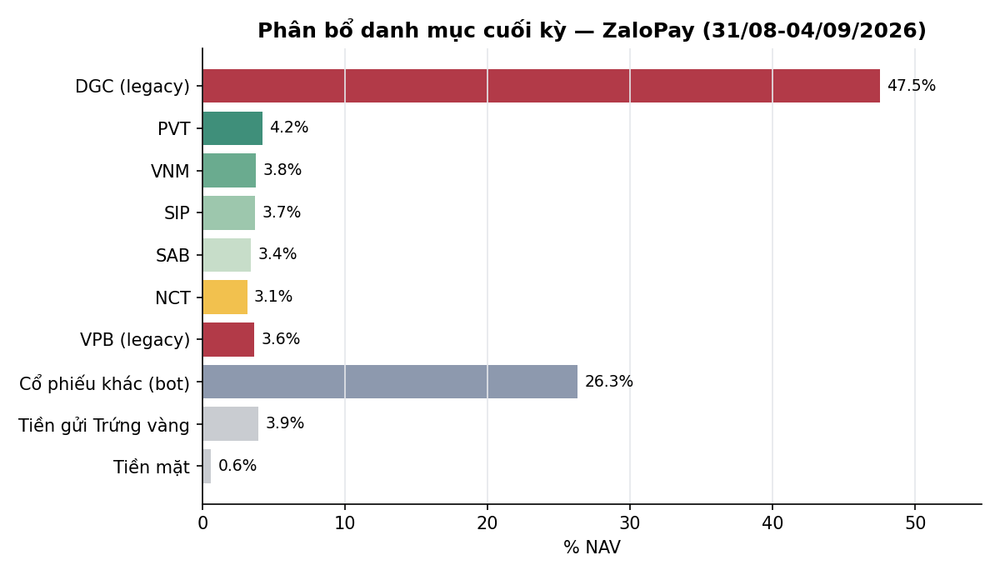

# BÁO CÁO TUẦN — TÀI KHOẢN ZALOPAY
## Kỳ báo cáo: 31/08/2026 – 04/09/2026

**Tài khoản:** ZaloPay · DNSE, số hiệu 0001743768 · V2.4 live từ 06/07/2026 (cash-only, không margin)
**Chiến lược:** V2.4 (2 book BAL/LAG + parking custom30V tại trạng thái NEUTRAL)
**Ngày lập báo cáo:** 05/09/2026 · **Người lập:** Taylor (Quant)
**Đối tượng:** Kênh theo dõi nội bộ (KHÔNG gửi nhà đầu tư ngoài) — giữ minh bạch đầy đủ

> **Lưu ý lịch giao dịch:** kỳ này chỉ có **2 phiên giao dịch thực tế** — thứ Năm 03/09 và thứ
> Sáu 04/09. Ba ngày 31/08, 01/09, 02/09 là nghỉ lễ Quốc khánh (bù lễ + ngày lễ chính thức,
> `trading_bot/vn_market.py::_VARIABLE_HOLIDAYS` + `_FIXED_HOLIDAYS`), HOSE đóng cửa hoàn toàn cả
> 3 ngày — xác nhận bằng cả `nav_history_ZaloPay.csv` (không có dòng 3 ngày này) lẫn BigQuery
> (`tav2_bq.ticker` không có dòng nào trong khoảng 29/08→02/09). Đây KHÔNG phải lỗi pipeline
> (khác với vụ thiếu dòng NAV do bug tuần 24-28/08) — bot vẫn chạy đúng lịch, chỉ đơn giản không
> có phiên nào để giao dịch. Mọi so sánh NAV lấy mốc đầu kỳ là phiên gần nhất trước nghỉ lễ
> (28/08/2026).

> 📊 Báo cáo có kèm biểu đồ minh hoạ (NAV, lợi nhuận lũy kế so VN-Index, phân bổ danh mục) — xem
> bản email để thấy đầy đủ hình ảnh; bản trên kênh chat chỉ hiển thị văn bản.

---

## 1. TÓM TẮT ĐIỀU HÀNH

| Chỉ tiêu | ZaloPay |
|---|---:|
| NAV đầu kỳ (chốt 28/08) | 952.338.703 |
| NAV cuối kỳ (04/09) | **991.380.088** |
| Thay đổi trong kỳ | **+39.041.385 (+4,10%)** |
| Cổ phiếu cuối kỳ (giá đóng cửa 04/09) | 946.508.900 |
| Tiền mặt tại công ty CK | 5.957.322 |
| Tiền gửi "Trứng vàng" (tự động qua API DNSE) | 38.913.866 |
| Tỷ trọng cổ phiếu/NAV | 95,5% (gồm DGC legacy 47,5% NAV) |
| Số mã nắm giữ cuối kỳ | 26 (24 mã bot + VPB legacy + DGC legacy) |

**Nhận định tuần:** ZaloPay tăng **+4,10%** trong kỳ, VƯỢT VN-Index (**+1,14%**, 1.832,12 →
1.853,08). **Đây KHÔNG phản ánh hiệu suất của chiến lược bot** — gần như toàn bộ mức tăng đến từ
vị thế legacy **DGC** (45–48% NAV, ngoài phạm vi quản lý của bot): DGC tăng **+9,53%** trong 2
phiên (43.000đ → 47.100đ), tương đương **+41.000.000đ**, LỚN HƠN tổng mức tăng NAV cả kỳ
(+39.041.385đ). Loại trừ DGC, phần còn lại của danh mục (bot + VPB legacy) giảm nhẹ khoảng
**−0,38%** trong kỳ — sát với mức giảm **−0,49%** của tài khoản SpaceX (cùng cấu trúc danh mục bot,
không có DGC), xác nhận đây là biến động thị trường bình thường, không phải bất thường vận hành.
Trạng thái thị trường DT5G giữ nguyên **NEUTRAL (3/5)** cả 3 phiên có dữ liệu, không có cap vĩ mô
kích hoạt. **Không có lệnh mua/bán thị trường nào trong kỳ** — BAL/LAG vẫn rỗng, danh mục giữ
nguyên như thiết kế parking.



---

## 2. BỐI CẢNH THỊ TRƯỜNG TRONG KỲ

| Ngày | VN-Index | Δ | Ghi chú |
|---|---:|---:|---|
| 28/08 (trước kỳ) | 1.832,12 | — | Phiên cuối trước nghỉ lễ |
| 31/08 – 02/09 | — | — | HOSE đóng cửa (nghỉ lễ Quốc khánh) |
| 03/09 | 1.827,72 | −0,24% | |
| 04/09 | 1.853,08 | +1,39% | |

- Cả kỳ (2 phiên) VN-Index **+1,14%**, toàn bộ mức tăng đến từ phiên 04/09.
- **Trạng thái thị trường (DT5G): NEUTRAL (3/5)** cả 3 phiên có dữ liệu (28/08, 03/09, 04/09 đều
  `state=3` từ bảng sản xuất `tav2_bq.vnindex_5state_dt5g_live`) → mục tiêu phân bổ ~70% cho phần
  vốn parking, không có cap phòng thủ vĩ mô nào kích hoạt. Gate DT5G: ổn định, không có candidate
  đang tích lũy chuyển trạng thái.
- **Bề rộng thị trường** (breadth, % mã đóng cửa trên MA50, universe `tav2_mike.universe_pit`
  PIT thật): **32,7%** trên 846 mã (04/09), giảm từ **36,7%** trên 833 mã (28/08) — đà tăng của
  chỉ số ngày càng tập trung vào nhóm hẹp, chưa được đa số cổ phiếu xác nhận; phù hợp với việc
  danh mục bot (đa dạng ngành, không tập trung nhóm dẫn dắt) tăng chậm hơn/giảm nhẹ so với chỉ số.
- **Value Radar** (composite P/E+P/B+spread lãi suất, rolling 10 năm, DISPLAY-ONLY — không phải
  tín hiệu mua/bán): **25,2 — RẺ** (P/E 11,67 phân vị 9, P/B 1,96 phân vị 33, spread EY−tiết kiệm
  +1,77pp phân vị 33), dữ liệu tới 04/09.



---

## 3. DIỄN BIẾN NAV & DANH MỤC TRONG KỲ

### 3.1 NAV theo ngày

| Ngày | NAV (VND) | Δ | Ghi chú |
|---|---:|---:|---|
| 28/08 (đầu kỳ) | 952.338.703 | — | |
| 31/08 – 02/09 | — nghỉ lễ, không giao dịch — | | |
| 03/09 | 967.938.562 | +1,64% | DGC bắt đầu hồi phục (43.000→44.900) |
| 04/09 (cuối kỳ) | 991.380.088 | +2,42% | DGC tiếp tục tăng (44.900→47.100) |

Cả kỳ **+4,10%** vs VN-Index **+1,14%** — vượt chỉ số 2,96 điểm phần trăm, **nhưng toàn bộ chênh
lệch này đến từ DGC** (xem Mục 1 và Mục 5), không phải từ alpha của chiến lược bot.

### 3.2 Hoạt động giao dịch

**Không có lệnh mua/bán thị trường nào trong kỳ** ở phần bot quản lý. Không có sự kiện quyền lợi
cổ đông mới phát sinh trong 2 phiên này (vấn đề đồng bộ quyền mua MBB từ tuần trước vẫn tồn đọng —
xem Mục 4.1).

### 3.3 Danh mục cuối kỳ (04/09)

Nguồn: `verified_snapshot_ZaloPay_2026-09-04.json` (24 mã bot có lịch sử fill, loại DGC/VPB —
không có lịch sử khớp nội bộ đầy đủ) + vị thế legacy DGC/VPB lấy trực tiếp từ `dnse_raw`.
`verify_account_snapshot.py` báo `Verified=False` do lệch số lượng MBB (Mục 4.1) — TIẾP TỤC từ
tuần trước, không phải sự cố mới.

| Mã | KL | Giá trị TT (VND) | % NAV | Ghi chú |
|---|---:|---:|---:|---|
| DGC | 10.000 | 471.000.000 | 47,51 | **Legacy, excluded khỏi P&L** — giá vốn broker 47.775, giá 04/09 47.100 → −6.750.000 (−1,41%) |
| VPB | 1.300 | 36.140.000 | 3,65 | Legacy — giá không đổi so với 28/08 (27.800) |
| PVT | 2.071 | 41.834.200 | 4,22 | Bot |
| VNM | 601 | 37.201.900 | 3,75 | Bot |
| SIP | 749 | 36.626.100 | 3,69 | Bot |
| SAB | 744 | 33.740.400 | 3,40 | Bot |
| NCT | 373 | 31.182.800 | 3,15 | Bot |
| SCL | 1.000 | 28.000.000 | 2,82 | Bot |
| DRI | 1.900 | 26.980.000 | 2,72 | Bot |
| TV1 | 1.200 | 24.240.000 | 2,45 | Bot |
| VHM | 300 | 22.560.000 | 2,28 | Bot |
| CSV | 1.000 | 22.000.000 | 2,22 | Bot |
| VCB | 300 | 17.670.000 | 1,78 | Bot |
| LPB | 352 | 17.248.000 | 1,74 | Bot |
| BID | 427 | 15.599.122 | 1,57 | Bot |
| CTG | 450 | 14.130.000 | 1,43 | Bot |
| MBB | 652 | 13.398.600 | 1,35 | Bot · KL đã hiệu chỉnh theo journal, xem Mục 4.1 |
| HDB | 459 | 12.484.800 | 1,26 | Bot |
| TCB | 356 | 11.605.600 | 1,17 | Bot |
| HPG | 500 | 10.850.000 | 1,09 | Bot |
| ACB | 300 | 6.660.000 | 0,67 | Bot |
| SHB | 300 | 3.615.000 | 0,36 | Bot |
| MSB | 240 | 3.156.000 | 0,32 | Bot |
| VIB | 200 | 3.010.000 | 0,30 | Bot |
| VRE | 100 | 2.650.000 | 0,27 | Bot |
| VIX | 105 | 1.470.000 | 0,15 | Bot |
| TPB | 100 | 1.470.000 | 0,15 | Bot |
| Tiền mặt | | 5.957.322 | 0,60 | |
| Tiền gửi Trứng vàng | | 38.913.866 | 3,93 | Tự động qua API |
| **Tổng NAV** | | **991.380.088** | **100,00** | |

Cộng dồn (dùng KL MBB đã hiệu chỉnh 652): cổ phiếu ≈946.919.522 + tiền mặt 5.957.322 + Trứng vàng
38.913.866 ≈ 991.790.710 — chênh lệch ~410.622đ (0,04% NAV) so với NAV chính thức, nằm trong biên
độ nhiễu do làm tròn ở nguồn dữ liệu trung gian, không phải sai lệch có ý nghĩa. **Bot P&L (24 mã,
loại DGC/VPB, tính từ giá vốn thật, LŨY KẾ TỪ ĐẦU không phải trong kỳ):** giá vốn 430.051.692 →
thị giá 438.977.687 = **+8.925.995 (+2,08%)**.



**Điểm cần theo dõi:** DGC vẫn là vị thế lớn nhất (47,5% NAV, ngoài phạm vi bot) — kỳ này TĂNG
mạnh (+9,53%) sau nhiều kỳ đi ngang/giảm, nhưng vẫn đang lỗ trên giấy so với giá vốn broker
(47.775 → 47.100, −1,41%). Vị thế này nằm ngoài phạm vi tái cân bằng tự động — nhắc lại khuyến
nghị các kỳ trước: nhà đầu tư cần chủ động quyết định giữ/giảm.

---

## 4. CÔNG BỐ SỰ CỐ & SỰ KIỆN VẬN HÀNH TRONG KỲ

Nguyên tắc: liệt kê đầy đủ, không làm tròn, kể cả phần chưa giải thích được.

### 4.1 Lệch số lượng MBB giữa `dnse_raw` và journal — TỒN ĐỌNG từ tuần 24-28/08, VẪN CHƯA đồng bộ

`verify_account_snapshot.py` báo `Verified=False`: `dnse_raw` (feed vị thế broker) vẫn hiển thị
632cp, trong khi journal ghi nhận đúng 652cp (đã cộng 20cp quyền mua MBB tỷ lệ 10:1 giá 10.000đ/cp,
thực hiện 28/08/2026, đối chiếu giá vốn khớp tuyệt đối: `dnse_raw_avg=20.858` vs
`journal_avg=20.525`, diff 1,60% — đúng theo tỷ lệ pha loãng 10:1). **Đây là CÙNG một vấn đề đã nêu
trong báo cáo tuần trước (SpaceX & ZaloPay), sau 1 tuần vẫn chưa được đồng bộ vào feed vị thế
broker** — không phải sự cố mới, nhưng đáng chú ý vì đã kéo dài hơn 1 tuần thay vì tự khớp trong
vài ngày như các quyền mua khác trước đây. Số lượng dùng trong bảng Mục 3.3 và mọi phép tính NAV
liên quan đã dùng giá trị journal (652cp, đúng thực tế) thay vì `dnse_raw` (632cp). Cần theo dõi
thêm 1 kỳ nữa; nếu vẫn chưa khớp, cần Winston/DollarBill xác minh trực tiếp với DNSE.

### 4.2 VPB: không tái dựng đủ lịch sử fill để đưa vào P&L (như thiết kế, không phải lỗi mới)

`verify_account_snapshot.py` báo `reconstructed qty vs broker VPB: candidate=200 snapshot=1300` —
số lượng tái dựng được từ lịch sử journal (200cp, các lần trim gần đây) thấp hơn nhiều so với vị
thế thật trên broker (1.300cp), vì phần lớn vị thế VPB là **legacy có từ trước khi bot quản lý**,
không có lịch sử khớp nội bộ đầy đủ — đúng như thiết kế loại trừ VPB khỏi P&L đã áp dụng nhất quán
từ các kỳ trước, không phải phát hiện mới.

### 4.3 Nghỉ lễ 3 ngày (31/08–02/09) — không có dòng NAV, ĐÚNG THIẾT KẾ, không phải bug

Khác với vụ thiếu 2 dòng NAV do lỗi pipeline hồi tuần 24-28/08 (đã khắc phục), 3 ngày thiếu dữ
liệu trong kỳ này là **nghỉ lễ chính thức** (`trading_bot/vn_market.py::is_holiday()` xác nhận cả
31/08, 01/09 là ngày nghỉ biến động khai báo thủ công + 02/09 là Quốc khánh cố định) — không có
phiên giao dịch nào diễn ra nên không có gì để chụp NAV. Xác nhận chéo: BigQuery `tav2_bq.ticker`
cũng không có dòng nào trong khoảng 29/08→02/09 cho bất kỳ mã nào.

### 4.4 "Nợ" nhỏ 6.842đ ghi nhận tuần trước — đã hết trong kỳ này

Khoản "nợ" nhỏ (phí lưu ký chưa post) ghi nhận cuối tuần trước (28/08) không còn xuất hiện trong dữ
liệu balances cuối kỳ này (`margin_debt=0` tại 04/09) — phù hợp với giải trình tuần trước rằng đây
là phí dịch vụ đã được post/khấu trừ, không phải margin thật.

---

## 5. PHÂN TÍCH DGC — YẾU TỐ CHI PHỐI HIỆU SUẤT KỲ NÀY

Đối chiếu độc lập giá đóng cửa BigQuery: DGC 28/08 = 43.000đ → 04/09 = 47.100đ (**+9,53%** qua 2
phiên). Trên 10.000cp, mức tăng giá trị thị trường tuyệt đối là **+41.000.000đ** — LỚN HƠN tổng
mức tăng NAV toàn tài khoản trong kỳ (+39.041.385đ). Phép tính kiểm chứng:

```
NAV loại DGC, cuối kỳ (04/09):  991.380.088 − 471.000.000 = 520.380.088
NAV loại DGC, đầu kỳ (28/08):    952.338.703 − 430.000.000 = 522.338.703
Chênh lệch loại DGC:             520.380.088 − 522.338.703 = −1.958.615 (−0,375%)
```

Loại trừ DGC, phần còn lại của danh mục (bot + VPB legacy) **giảm nhẹ ~0,38%** trong kỳ — khớp sát
với mức giảm **−0,49%** của SpaceX (danh mục bot tương tự, không có DGC). Đây là bằng chứng số
xác nhận: hiệu suất vượt trội +2,96pp so với VN-Index của ZaloPay kỳ này **hoàn toàn là hiệu ứng
DGC** (biến động giá đơn lẻ của 1 vị thế legacy ngoài phạm vi bot), **không phải alpha từ chiến
lược V2.4**. Không đưa số liệu này vào file client-facing SpaceX vì SpaceX không nắm giữ DGC.

---

## 6. KẾ HOẠCH KỲ TỚI (07/09 – 11/09/2026)

- **Theo dõi đồng bộ MBB (ưu tiên):** nếu `dnse_raw` vẫn chưa cập nhật đủ 652cp sau kỳ tới, cần
  Winston/DollarBill xác minh trực tiếp với DNSE — 2 kỳ liên tiếp cùng 1 vấn đề vượt ngưỡng "lag
  bình thường".
- **DGC (47,5% NAV, biến động mạnh kỳ này):** tiếp tục là quyết định của nhà đầu tư, ngoài phạm vi
  tái cân bằng bot — đề nghị xác nhận lại chủ đích giữ/giảm, đặc biệt sau nhịp tăng +9,53%.
- **Vận hành thường lệ:** BAL/LAG rỗng ở NEUTRAL, mặc định HOLD quanh mức parking đã thiết lập trừ
  khi có tín hiệu mới hoặc tái cân bằng giỏ custom30V định kỳ.
- **Lịch giao dịch tuần tới trở lại đầy đủ 5 phiên** (07/09–11/09).

---

## 7. PHỤ LỤC — PHƯƠNG PHÁP LUẬN & LƯU Ý

- **Pipeline xác minh** (theo `mike/kb/coding_guidelines.md` §6): `verify_account_snapshot.py` →
  `nav_history_ZaloPay.csv` → `reconcile_equity.py` (không áp dụng được đầy đủ do 2 vị thế legacy
  lớn không có lịch sử khớp nội bộ, như các kỳ trước). Giá mark-to-market = giá đóng cửa BigQuery
  đúng ngày từng dòng.
- **Trứng vàng**: đọc tự động qua API DNSE (field `egg.totalValue` trong payload `balances`).
- **Breadth**: `tav2_mike.universe_pit` (point-in-time thật, KHÔNG dùng `ticker_prune`) JOIN
  `tav2_bq.ticker` lấy `Close`/`MA50` đúng ngày trong universe.
- **Value Radar**: hiển thị theo `dna_report.build_value_radar_line()` — chỉ mang tính tham khảo,
  CHƯA qua kiểm định đa giả thuyết đủ mạnh để dùng làm tín hiệu.
- **Phí/thuế:** phí giao dịch 0,075%/lượt; thuế bán 0,1% giá trị bán. Không có lệnh mua/bán thị
  trường nào phát sinh phí trong kỳ này.
- **Track record vẫn ngắn** (~40 phiên kể từ go-live) — so sánh với VN-Index chỉ mang tính mô tả,
  chưa đủ ý nghĩa thống kê để đánh giá chiến lược.
- **Đây không phải khuyến nghị đầu tư.** Kết quả quá khứ (kể cả backtest) không đảm bảo kết quả
  tương lai.

---
*Báo cáo tổng hợp từ hệ thống giám sát vận hành nội bộ, đối soát với dữ liệu sàn (DNSE API) và cơ
sở dữ liệu thị trường (BigQuery). Kênh nội bộ — KHÔNG gửi nhà đầu tư ngoài.*
