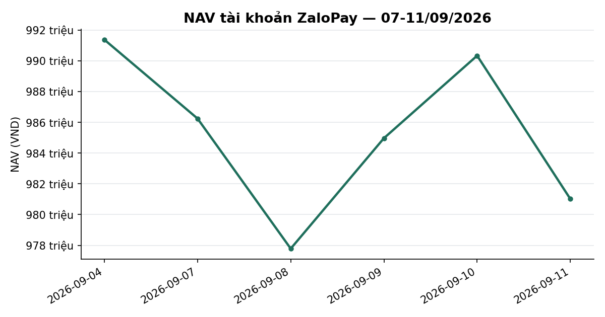
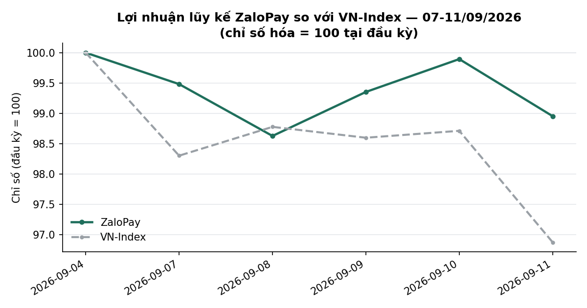
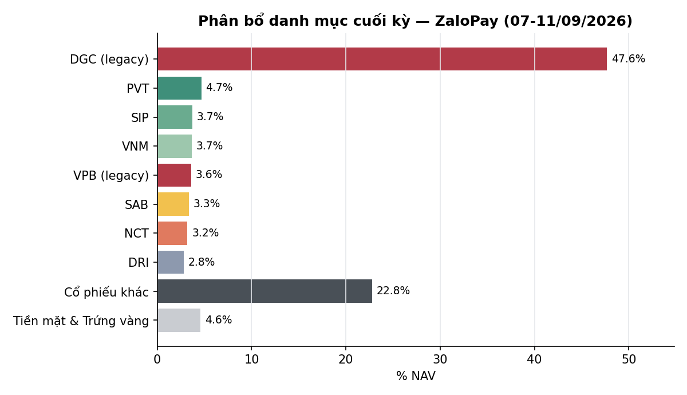

# BÁO CÁO TUẦN — TÀI KHOẢN ZALOPAY
## Kỳ báo cáo: 07/09/2026 – 11/09/2026

**Tài khoản:** ZaloPay · DNSE, số hiệu 0001743768 · V2.4 live từ 06/07/2026 (cash-only, không margin)
**Chiến lược:** V2.4 (2 book BAL/LAG + parking custom30V tại trạng thái NEUTRAL)
**Ngày lập báo cáo:** 12/09/2026 · **Người lập:** Taylor (Quant)
**Đối tượng:** Kênh theo dõi nội bộ (KHÔNG gửi nhà đầu tư ngoài) — giữ minh bạch đầy đủ

> **⚠️ CHẤT LƯỢNG SỐ LIỆU TUẦN NÀY — đọc trước khi dùng con số:** phiên 11/09 có sự cố giá DGC
> đang **CÒN MỞ, CHƯA XÁC MINH XONG** (bus question `nav-price-xcheck-stuck-ZaloPay-2026-09-11`,
> chờ Winston/Mafee trước phiên 14/09) — chi tiết đầy đủ ở Mục 4.1, KHÔNG làm tròn hay giấu bớt.
> Bảng chi tiết danh mục Mục 3.3 vì vậy có 2 phần: số NAV chính thức (Mục 1) và bảng tham khảo
> KHÔNG khớp tuyệt đối tuần này.

> 📊 Báo cáo có kèm biểu đồ minh hoạ (NAV, lợi nhuận lũy kế so VN-Index, phân bổ danh mục) — xem
> bản email để thấy đầy đủ hình ảnh; bản trên kênh chat chỉ hiển thị văn bản.

---

## 1. TÓM TẮT ĐIỀU HÀNH

| Chỉ tiêu | ZaloPay |
|---|---:|
| NAV đầu kỳ (chốt 04/09) | 991.380.088 |
| NAV cuối kỳ (11/09) | **981.012.771** |
| Thay đổi trong kỳ | **−10.367.317 (−1,05%)** |
| VN-Index cùng kỳ (04/09 → 11/09) | 1.853,08 → 1.795,21 (**−3,12%**) |
| Giá trị cổ phiếu cuối kỳ (mtm_stock, chính thức) | 936.077.800 |
| Tiền mặt tại công ty chứng khoán | 5.957.550 |
| Tiền gửi "Trứng vàng" (tự động qua API DNSE) | 38.977.421 |
| Tỷ trọng cổ phiếu/NAV | 95,4% (gồm DGC + VPB legacy) |
| Số mã nắm giữ cuối kỳ | 27 (25 mã bot + VPB + DGC legacy) |

**Nhận định tuần:** VN-Index giảm **−3,12%** trong tuần (bán tháo diện rộng phiên 11/09, −1,86%).
ZaloPay giảm **ÍT HƠN nhiều: −1,05%** — chênh lệch tích cực +2,07 điểm phần trăm so với chỉ số,
tương tự cơ chế bảo vệ đã thấy ở SpaceX (danh mục đa dạng ngành, custom30V parking). Trạng thái
thị trường DT5G giữ nguyên **NEUTRAL (3/5)** suốt tuần. **Không có lệnh mua/bán thị trường nào**
(BAL/LAG rỗng ở NEUTRAL, giữ nguyên parking). **Có 1 sự cố dữ liệu giá đang mở** liên quan vị thế
legacy DGC — xem cảnh báo đầu trang và Mục 4.1; không ảnh hưởng phần 25 mã do bot quản lý (đã
verify=True, không có warning mới).

---

## 2. BỐI CẢNH THỊ TRƯỜNG TRONG TUẦN

| Ngày | VN-Index | Δ ngày |
|---|---:|---:|
| 04/09 (trước kỳ) | 1.853,08 | — |
| 07/09 | 1.821,64 | −1,70% |
| 08/09 | 1.830,44 | +0,48% |
| 09/09 | 1.827,12 | −0,18% |
| 10/09 | 1.829,23 | +0,12% |
| 11/09 | 1.795,21 | −1,86% |

- Tuần giảm điểm, biến động rõ nhất hai đầu tuần (07/09) và cuối tuần (11/09) — tổng **−3,12%**.
- **Trạng thái thị trường (DT5G): NEUTRAL (3/5) toàn bộ tuần** (bảng sản xuất
  `vnindex_5state_dt5g_live`, cả 5 phiên `state=3`), không có candidate tích luỹ sang trạng thái
  khác, không có cap phòng thủ vĩ mô nào kích hoạt.
- **Bề rộng thị trường** (% mã đóng cửa trên MA50, universe `tav2_mike.universe_pit` PIT thật):
  **28,5%** trên rổ **846 mã** có dữ liệu tại 11/09 — dưới 50%, đà giảm lan rộng hơn là chỉ tập
  trung vài mã lớn.
- **Value Radar** (composite P/E+P/B+spread lãi suất, rolling 10 năm, DISPLAY-ONLY — không phải
  tín hiệu mua/bán): **21,0 — RẺ** (P/E phân vị 7, P/B phân vị 28, spread EY−tiết kiệm +1,99pp
  phân vị 27), dữ liệu tới 11/09.

---

## 3. DIỄN BIẾN NAV & DANH MỤC TRONG TUẦN

### 3.1 NAV theo ngày

| Ngày | NAV (VND) | Δ ngày | VN-Index | Ghi chú |
|---|---:|---:|---:|---|
| 04/09 (đầu kỳ) | 991.380.088 | — | — | HOLD |
| 07/09 | 986.247.657 | −0,52% | −1,70% | HOLD |
| 08/09 | 977.782.670 | −0,86% | +0,48% | HOLD |
| 09/09 | 984.968.983 | +0,73% | −0,18% | HOLD |
| 10/09 | 990.336.744 | +0,54% | +0,12% | HOLD |
| 11/09 (cuối kỳ) | **981.012.771** | −0,94% | −1,86% | HOLD · **sự cố giá DGC, xem Mục 4.1** |

Cả tuần **−1,05%** vs VN-Index **−3,12%** — chênh lệch tích cực 2,07 điểm phần trăm, đến từ cơ cấu
đa dạng ngành/vốn hóa (25 mã bot + phần lớn không phải ngân hàng vốn hóa lớn — nhóm giảm mạnh nhất
phiên 11/09).

### 3.2 Hoạt động giao dịch

**Không có lệnh mua/bán thị trường nào trong tuần.** BAL/LAG vẫn rỗng ở trạng thái NEUTRAL, danh
mục giữ nguyên như thiết kế parking. Không phát sinh sự kiện quyền lợi cổ đông nào ĐÃ CHỐT trong
tuần (sự kiện DGC ở Mục 4.1 là ex-date SẮP TỚI 14/09, chưa xảy ra — xem chi tiết).

### 3.3 Danh mục cuối kỳ (11/09/2026)

**Số chính thức (dùng cho báo cáo):**

| Thành phần | Giá trị (VND) | % NAV |
|---|---:|---:|
| Tổng cổ phiếu (27 mã, `mtm_stock` chính thức từ `nav_history_ZaloPay.csv`) | 936.077.800 | 95,4% |
| Tiền mặt tại CTCK | 5.957.550 | 0,6% |
| Tiền gửi "Trứng vàng" (tự động qua API) | 38.977.421 | 4,0% |
| **Tổng NAV** | **981.012.771** | **100,0%** |

**Bảng chi tiết theo mã — THAM KHẢO, KHÔNG khớp tuyệt đối với `mtm_stock` chính thức ở trên tuần
này** (nguyên nhân: sự cố giá DGC đang mở, Mục 4.1 — bảng dưới dùng giá đóng cửa BigQuery cho
DGC/VPB thay vì giá vị thế broker đã bị lệch, để tránh lan truyền số liệu nghi ngờ sai; verify
chưa xong nên KHÔNG khẳng định đây là số đúng tuyệt đối):

| Mã | KL | Giá vốn/cp | Giá 11/09 (nguồn) | Giá trị thị trường | Ghi chú |
|---|---:|---:|---:|---:|---|
| DGC | 10.000 | 47.775* | 46.750 (BQ close) | 467.500.000 | **Legacy, excluded khỏi P&L** — xem Mục 4.1 |
| VPB | 8.200 | 26.745 | 26.950 (BQ close) | 220.990.000 | Legacy — excluded khỏi P&L |
| PVT | 2.071 | 17.248 | 22.100 | 45.769.100 | Bot |
| SIP | 749 | 47.140 | 48.500 | 36.326.500 | Bot |
| VNM | 601 | 58.700 | 59.900 | 35.999.900 | Bot |
| SAB | 744 | 47.450 | 43.850 | 32.624.400 | Bot |
| NCT | 373 | 94.400 | 84.000 | 31.332.000 | Bot |
| DRI | 1.900 | 13.263 | 14.500 | 27.550.000 | Bot |
| SCL | 1.000 | 23.590 | 26.500 | 26.500.000 | Bot |
| TV1 | 1.200 | 20.400 | 19.900 | 23.880.000 | Bot |
| VHM | 300 | 74.317 | 72.000 | 21.600.000 | Bot |
| CSV | 1.000 | 19.750 | 20.850 | 20.850.000 | Bot |
| VCB | 300 | 60.788 | 58.200 | 17.460.000 | Bot |
| LPB | 352 | 54.843 | 46.700 | 16.438.400 | Bot |
| BID | 427,4 | 37.871 | 35.600 | 15.214.486 | Bot |
| CTG | 450 | 32.583 | 29.950 | 13.477.500 | Bot |
| MBB | 632,3 | 20.858 | 19.750 | 12.487.925 | Bot |
| HDB | 459 | 25.891 | 26.800 | 12.301.200 | Bot |
| TCB | 356 | 31.611 | 31.600 | 11.249.600 | Bot |
| HPG | 500 | 22.200 | 21.300 | 10.650.000 | Bot |
| ACB | 300 | 22.700 | 22.050 | 6.615.000 | Bot |
| SHB | 300 | 12.100 | 11.550 | 3.465.000 | Bot |
| MSB | 240 | 13.542 | 12.950 | 3.108.000 | Bot |
| VIB | 219 | 13.607 | 13.250 | 2.901.750 | Bot |
| VRE | 100 | 25.550 | 25.600 | 2.560.000 | Bot |
| TPB | 100 | 14.800 | 14.150 | 1.415.000 | Bot |
| VIX | 105 | 13.286 | 13.250 | 1.391.250 | Bot |
| **Tổng bảng tham khảo** | | | | **1.121.657.011** | |

*Giá vốn DGC niêm yết 47.775đ/cp là giá vốn broker TRƯỚC sự cố 11/09 (Mục 4.1); bản ghi broker
hiện tại tạm thời hiển thị 39.775đ/cp do lỗi đang chờ xác minh — không dùng số này.

**Bot P&L (25 mã, loại DGC/VPB, nguồn `verify_account_snapshot.py`, verified=True):** giá vốn
430.051.692 → thị giá 433.167.011 = **+3.115.319 (+0,72%)**.

**Chênh lệch chưa giải thích được (không làm tròn):** tổng bảng tham khảo (1.121.657.011) CAO HƠN
`mtm_stock` chính thức (936.077.800) đúng **185.579.211đ**. Phần chênh lệch do giá DGC bị lệch
(10.000cp × (46.750−38.750) = 82.500.000) chỉ giải thích được **~44%** con số này — phần còn lại
(~103tr) CHƯA xác định được nguồn gốc cụ thể, có thể liên quan cùng sự cố đồng bộ giá broker
phiên 11/09 (Mục 4.1) lan sang các mã khác, nhưng KHÔNG có bằng chứng cụ thể để khẳng định — đây
là câu hỏi mở, không suy đoán nguyên nhân khi chưa có bằng chứng (coding_guidelines.md §29).

**Ghi nhận:** DGC vẫn là vị thế lớn nhất (theo giá BQ, ~47,7% NAV), ngoài phạm vi bot quản lý —
nhắc lại khuyến nghị các kỳ trước: đây là rủi ro tập trung thật, nhà đầu tư cần chủ động quyết
định giữ/giảm. VPB legacy ổn định quanh 22,5% NAV (theo giá BQ).

---

## 4. CÔNG BỐ SỰ CỐ & SỰ KIỆN VẬN HÀNH TRONG TUẦN

Nguyên tắc: liệt kê đầy đủ, không làm tròn, kể cả phần chưa giải thích được.

### 4.1 Sự cố giá DGC phiên 11/09 — CÒN MỞ, CHƯA XÁC MINH XONG (mức độ: trung bình)

Gate đối chiếu giá tự động (`daily_nav_snapshot.py`, PRICE_XCHECK) chặn tính NAV phiên 11/09 lúc
cutoff 21:15 ICT với thông báo: **"DGC: close_price=46.750 vs vị thế broker marketPrice=38.750
(lệch 20,6%)"** — chỉ 1 mã bị lệch, 26 mã còn lại (kể cả VPB) không có cảnh báo. NAV cuối cùng
VẪN được ghi cho 11/09 (981.012.771) sau khi hệ thống tự retry — nghĩa là ở lần retry thành công,
cả hai nguồn giá (giá đóng cửa tự động + giá vị thế broker) đã CÙNG hiển thị mức giá thấp hơn,
tức khả năng cao giá trị DGC dùng trong NAV chính thức tuần này bị **định giá THẤP hơn thực tế**.

**Đối chiếu độc lập (dữ liệu vị thế broker thô theo giờ, `dnse_raw_2026-09-11.jsonl`):** giá vốn
và giá thị trường của DGC cùng giảm đúng 8.000đ/cp (47.775→39.775 giá vốn, ~47.000→38.750 giá thị
trường) vào lúc 19:07 ICT ngày 11/09 — **trùng khớp về độ lớn** với sự kiện cổ tức tiền mặt DGC
đã biết trước (GDKHQ 80% = 8.000đ/cp), nhưng ngày GDKHQ CHÍNH THỨC là **14/09/2026 (còn 1 phiên
nữa tính từ 11/09)**, ngày ghi nhận 15/09, ngày trả tiền ~25/09. Việc điều chỉnh GIÁ VỐN (không
chỉ giá tham chiếu) sớm 3 phiên so với ex-date thực tế, cho một sự kiện cổ tức TIỀN MẶT (thường
không điều chỉnh giá vốn), là dấu hiệu **lỗi đồng bộ dữ liệu phía broker**, KHÔNG PHẢI sự kiện đã
thực sự xảy ra — nhưng đây là suy luận từ bằng chứng đang có, CHƯA được Winston/Mafee xác nhận
chính thức.

**Trạng thái xử lý:** bus question `nav-price-xcheck-stuck-ZaloPay-2026-09-11` (Mafee, mở
2026-09-11) vẫn **CÒN MỞ** tính đến thời điểm lập báo cáo này (12/09/2026) — chưa có event đóng.
Cần Winston/Mafee xác minh dữ liệu DNSE trước phiên 14/09 (đúng ngày GDKHQ thật) để xác định liệu
đây là lỗi đồng bộ hay có thông tin corp-action khác chưa công bố. Taylor chỉ báo cáo hiện trạng,
không tự sửa số liệu.

**Tác động ước tính (nếu giả thuyết "lỗi đồng bộ" đúng):** NAV 11/09 CÓ THỂ bị định giá thấp hơn
thực tế tới ~82,5 triệu đồng (~8,4% NAV) chỉ riêng từ chênh lệch giá DGC đã xác nhận; phần dư
185,58tr chưa giải thích hết ở Mục 3.3 khiến biên độ khả dĩ còn LỚN hơn con số này — **không nên
coi hai con số NAV tuần này/tuần trước là hoàn toàn so sánh được cho tới khi sự cố được xác minh
xong**.

### 4.2 25 mã do bot quản lý — không có bất thường mới

`verify_account_snapshot.py --account ZaloPay --asof 2026-09-11`: `verified=True`, không có
warning mới ngoài các mục đã biết (MBB qty lệch do quyền mua 28/08, đã khai báo hết hiệu lực
30/11; VIB mở lô mới sau bán legacy — cả hai đã ghi nhận từ báo cáo trước, không phải sự cố mới).

### 4.3 Đẳng thức hai chiều — KHÔNG áp dụng được cho ZaloPay

Tương tự các kỳ trước: 2 vị thế legacy (DGC + VPB) không có lịch sử khớp nội bộ nên không so sánh
được "vốn ban đầu" với tập con "P&L đã verify" (chỉ 25/27 mã). Không đưa vào bảng chính.

---

## 5. KẾ HOẠCH TUẦN TỚI (14/09 – 18/09/2026)

- **Ưu tiên xác minh:** sự cố giá DGC phiên 11/09 (Mục 4.1) cần đóng trước hoặc ngay tại phiên
  14/09 — đúng ngày GDKHQ thật của DGC, thời điểm dữ liệu sẽ tự nhiên hội tụ nếu là lỗi đồng bộ,
  hoặc lộ rõ hơn nếu là nguyên nhân khác.
- **DGC (theo giá BQ ~47,7% NAV):** tiếp tục là quyết định của nhà đầu tư, ngoài phạm vi tái cân
  bằng bot — đề nghị xác nhận lại chủ đích giữ/giảm, đặc biệt trước ngày nhận cổ tức ~25/09.
- **Vận hành thường lệ:** BAL/LAG rỗng ở NEUTRAL, mặc định HOLD quanh mức parking đã thiết lập
  trừ khi có tín hiệu mới.

---

## 6. PHỤ LỤC — PHƯƠNG PHÁP LUẬN & LƯU Ý

- **Pipeline xác minh** (theo `mike/kb/coding_guidelines.md` §6): `verify_account_snapshot.py`
  (25 mã bot, verified=True) + `daily_nav_snapshot.py` (`mtm_stock` chính thức, vị thế broker
  thật × giá đóng cửa verified) → `nav_history_ZaloPay.csv`. `reconcile_equity.py` không áp dụng
  được cho ZaloPay (Mục 4.3).
- **Trứng vàng**: đọc **tự động qua API DNSE** (field `egg.totalValue` trong payload `balances`,
  `daily_nav_snapshot.py`, cột `egg_assets_auto=True`) — không còn là số off-book người dùng tự
  báo.
- **Breadth**: `tav2_mike.universe_pit` (point-in-time thật, KHÔNG dùng `ticker_prune`) JOIN
  `tav2_bq.ticker` lấy `Close`/`MA50` đúng ngày trong universe.
- **Value Radar**: hiển thị theo `dna_report.build_value_radar_line()` — chỉ mang tính tham khảo,
  CHƯA qua kiểm định đa giả thuyết đủ mạnh để dùng làm tín hiệu.
- **Phí/thuế:** phí giao dịch 0,075%/lượt; thuế bán 0,1% giá trị bán. Không có lệnh mua/bán thị
  trường nào phát sinh phí trong tuần này.
- **Track record vẫn ngắn** (~10 tuần kể từ go-live 06/07/2026) — so sánh với VN-Index chỉ mang
  tính mô tả, chưa đủ ý nghĩa thống kê để đánh giá chiến lược.
- **Đây không phải khuyến nghị đầu tư.** Kết quả quá khứ (kể cả backtest) không đảm bảo kết quả
  tương lai.

---
*Báo cáo tổng hợp từ hệ thống giám sát vận hành nội bộ, đối soát với dữ liệu sàn (DNSE API) và cơ
sở dữ liệu thị trường (BigQuery). Kênh nội bộ — KHÔNG gửi nhà đầu tư ngoài.*
