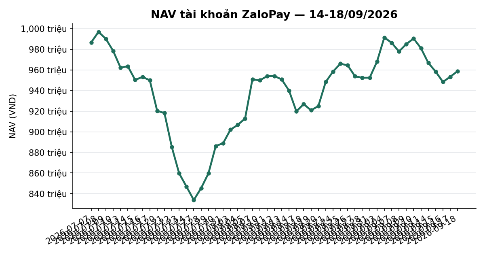
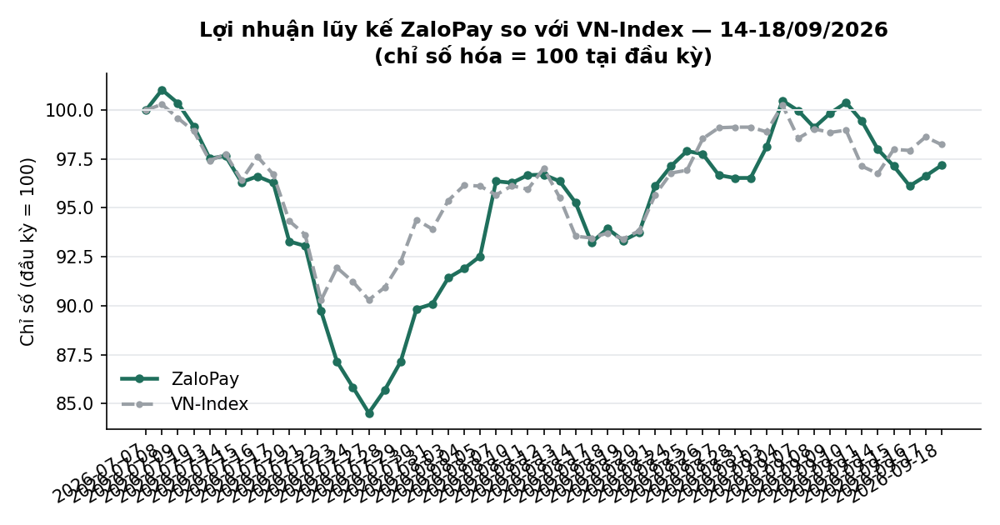
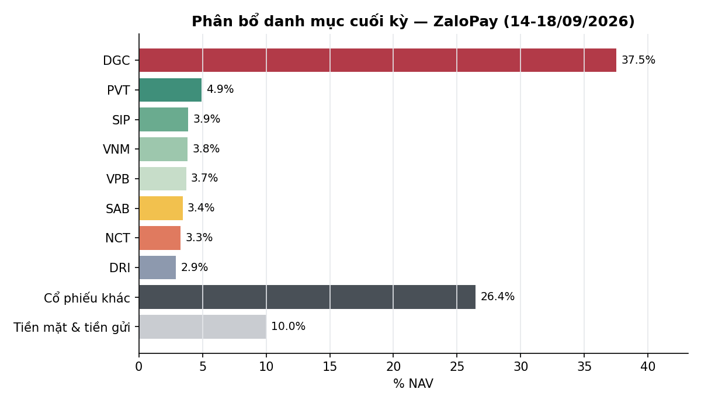

# BÁO CÁO TUẦN — TÀI KHOẢN ZALOPAY
## Kỳ báo cáo: 14/09/2026 – 18/09/2026

**Tài khoản:** ZaloPay · DNSE, số hiệu 0001743768 · V2.4 live từ 06/07/2026 (cash-only, không margin)
**Chiến lược:** V2.4 (2 book BAL/LAG + parking custom30V tại trạng thái NEUTRAL)
**Ngày lập báo cáo:** 19/09/2026 · **Người lập:** Taylor (Quant) — auto-dispatch từ
`check_report_cadence.sh` (báo cáo tuần bị bỏ sót, phát hiện tự động)
**Đối tượng:** Kênh theo dõi nội bộ (KHÔNG gửi nhà đầu tư ngoài) — giữ minh bạch đầy đủ

> 📊 Báo cáo có kèm biểu đồ minh hoạ (NAV, lợi nhuận lũy kế so VN-Index, phân bổ danh mục) — xem
> bản email để thấy đầy đủ hình ảnh; bản trên kênh chat chỉ hiển thị văn bản.

---

## 1. TÓM TẮT ĐIỀU HÀNH

| Chỉ tiêu | ZaloPay |
|---|---:|
| NAV đầu kỳ (chốt 11/09) | 981.012.771 |
| NAV cuối kỳ (18/09) | **958.732.611** |
| Thay đổi trong kỳ | **−22.280.160 (−2,27%)** |
| VN-Index cùng kỳ (11/09 → 18/09) | 1.795,21 → 1.815,66 (**+1,14%**) |
| Giá trị cổ phiếu cuối kỳ | 862.791.700 |
| Tiền mặt tại công ty CK | 88.125.046 |
| Tiền gửi "Trứng vàng" (đọc tự động qua API DNSE) | 7.815.865 |
| Tỷ trọng cổ phiếu/NAV | 90,0% (gồm DGC legacy 37,5% NAV) |
| Số mã nắm giữ cuối kỳ | 29 (27 mã bot + VPB + DGC legacy) |

**Nhận định tuần:** VN-Index tăng **+1,14%** trong tuần (giằng co, tăng mạnh phiên 15/09 rồi đi
ngang/giảm nhẹ). ZaloPay **GIẢM −2,27%**, ngược chiều chỉ số. Nguyên nhân chính đã xác định rõ,
KHÔNG phải sự cố hệ thống: vị thế legacy **DGC** (10.000cp, 37,5% NAV cuối kỳ — vị thế lớn nhất tài
khoản, ngoài phạm vi tái cân bằng tự động của bot) giảm giá từ 38.750đ (11/09) xuống 35.950đ
(18/09), tương đương **−7,23% trong tuần**, tự đóng góp khoảng **−2,7 điểm phần trăm** vào NAV toàn
tài khoản — lớn hơn cả mức giảm NAV thực tế (−2,27%), nghĩa là phần 27 mã do bot quản lý (book
BAL/LAG + parking) thực chất **tăng nhẹ** trong tuần (P&L chưa thực hiện toàn phần bot +8.216.320đ,
+1,91% trên giá vốn, xem Mục 3.4). Hoạt động giao dịch nổi bật: mở vị thế mới **VPI** (400 cổ
phiếu, giá vốn bình quân 62.450đ/cp) — giao dịch mua đầu tiên của cấu phần momentum (BAL) kể từ khi
tài khoản đi vào hoạt động, tài trợ một phần từ tất toán "Trứng vàng". Trạng thái thị trường DT5G
giữ nguyên **NEUTRAL (3/5)** suốt tuần.

---

## 2. BỐI CẢNH THỊ TRƯỜNG TRONG TUẦN

| Ngày | VN-Index | Δ ngày |
|---|---:|---:|
| 11/09 (trước kỳ) | 1.795,21 | — |
| 14/09 | 1.788,23 | −0,39% |
| 15/09 | 1.811,15 | +1,28% |
| 16/09 | 1.810,11 | −0,06% |
| 17/09 | 1.822,77 | +0,70% |
| 18/09 | 1.815,66 | −0,39% |

- Tuần tăng nhẹ **+1,14%**, giằng co quanh 1.810–1.823 sau phiên bật tăng đầu tuần (15/09).
- **Trạng thái thị trường (DT5G): NEUTRAL (3/5) toàn bộ tuần** (xác nhận từ bảng sản xuất
  `vnindex_5state_dt5g_live`, cả 5 phiên đều `state=3`) → mục tiêu phân bổ ~70% cho phần vốn
  parking, không có cap phòng thủ vĩ mô nào kích hoạt.
- **Bề rộng thị trường (breadth, % mã đóng cửa trên MA50, universe `tav2_mike.universe_pit` PIT):**
  36,0% trên tổng 837 mã (18/09), so với 28,6%/846 mã (11/09) — cải thiện đáng kể trong tuần nhưng
  vẫn dưới 50%, đà tăng của chỉ số chưa được đa số cổ phiếu xác nhận.
- **Value Radar** (composite P/E+P/B+spread lãi suất, rolling 10 năm, DISPLAY-ONLY — không phải
  tín hiệu mua/bán): **23,4 — RẺ** (P/E phân vị 8, P/B phân vị 31, spread EY−tiết kiệm +1,87pp
  phân vị 31), dữ liệu tới 18/09.

---

## 3. DIỄN BIẾN NAV & DANH MỤC TRONG TUẦN

### 3.1 NAV theo ngày

| Ngày | NAV (VND) | Δ ngày | Ghi chú |
|---|---:|---:|---|
| 11/09 (đầu kỳ) | 981.012.771 | — | |
| 14/09 | 966.798.467 | −1,45% | HOLD |
| 15/09 | 958.351.658 | −0,87% | HOLD |
| 16/09 | 948.338.649 | −1,04% | HOLD |
| 17/09 | 953.317.076 | +0,52% | BUY VPI 100/500cp khớp (thanh khoản mỏng, xem Mục 4.2) |
| 18/09 (cuối kỳ) | 958.732.611 | +0,57% | BUY VPI +300cp (top-up) |

Cả tuần **−2,27%** vs VN-Index **+1,14%** — kém chỉ số 3,41 điểm phần trăm. Như phân tích ở Mục 1,
phần lớn khoảng lệch này đến từ biến động giá của MỘT vị thế legacy tập trung (DGC), không phải
suy giảm chung của rổ 27 mã do bot quản lý.

### 3.2 Hiệu suất lũy kế

| Giai đoạn | ZaloPay | VN-Index | Chênh lệch |
|---|---:|---:|---:|
| Tuần này (11/09 → 18/09) | −2,27% | +1,14% | −3,41pp |
| Từ đầu tháng 9 (MTD, 28/08 → 18/09) | +0,67% | −0,90% | +1,57pp |
| Từ khi bắt đầu hoạt động (06/07 → 18/09) | −2,82% | −1,76% | −1,06pp |

Ghi nhận: mặc dù tuần này giảm, hiệu suất MTD (từ cuối tháng 8) vẫn **vượt** VN-Index +1,57pp —
tuần này là một sự đảo chiều một phần của đà tăng đầu tháng, chủ yếu do DGC, không phải một xu
hướng suy giảm liên tục.

### 3.3 Hoạt động giao dịch

**VPI — giao dịch BUY đầu tiên của book BAL (momentum) kể từ go-live.** Lệnh đặt 500cp ngày 17/09
(giá trần 62.000đ) chỉ khớp **100/500cp** do thanh khoản VPI mỏng trong phiên (đối chiếu qua
`park_holdings.py`/journal, xác nhận không phải lỗi đặt lệnh — thị trường đơn giản không đủ đối
ứng ở mức giá cho phép, xem skill `dnse-fill-reconciliation`). Lệnh top-up 300cp ngày 18/09 (giá
trần 63.100đ) khớp đủ, đưa vị thế lên 400cp, giá vốn bình quân 62.450đ/cp — cách target ban đầu
(500cp) một khoảng ~6,1tr VND, nằm trong dung sai 1 lô (6,29tr), nên plan 21/09 xác nhận **không
cần đặt thêm** (đã đạt target trong sai số cho phép). Vốn cần thiết tài trợ một phần từ tất toán
"Trứng vàng" (egg 38,98tr 11/09 → 7,82tr 18/09, giảm ~31,16tr — người dùng xác nhận rút qua app
DNSE trước giờ giao dịch 17/09, ghi nhận trên bus `plan-approval-2026-09-17-both`), phần còn lại từ
tiền mặt sẵn có. Không có giao dịch bán thị trường nào trong tuần ở phần bot quản lý; vị thế legacy
DGC/VPB giữ nguyên khối lượng (không có lệnh nào tác động — biến động giá trị hoàn toàn do giá thị
trường).

### 3.4 Danh mục cuối kỳ (18/09/2026)

Nguồn: `verified_snapshot_ZaloPay` (27 mã bot có lịch sử khớp nội bộ, `verify_account_snapshot.py`
`Verified=True`) + vị thế legacy DGC/VPB lấy trực tiếp từ `dnse_raw_2026-09-18.jsonl` (không có
lịch sử khớp nội bộ → loại khỏi tính P&L theo giá vốn thực, giá vốn hiển thị lấy từ trường
`costPrice` broker).

| Mã | KL | Giá vốn | Giá 18/09 | Giá trị thị trường | % NAV | Lãi/lỗ | Ghi chú |
|---|---:|---:|---:|---:|---:|---:|---|
| DGC | 10.000 | 39.775 | 35.950 | 359.500.000 | 37,50 | −9,62% | **Legacy**, ngoài phạm vi bot |
| PVT | 2.071 | 17.248 | 22.800 | 47.218.800 | 4,93 | +32,19% | Bot |
| SIP | 749 | 47.140 | 49.500 | 37.075.500 | 3,87 | +5,01% | Bot |
| VNM | 601 | 58.700 | 61.200 | 36.781.200 | 3,84 | +4,26% | Bot |
| VPB | 1.300 | 26.745 | 27.450 | 35.685.000 | 3,72 | +2,64% | **Legacy** |
| SAB | 744 | 47.450 | 44.300 | 32.959.200 | 3,44 | −6,64% | Bot |
| NCT | 373 | 94.400 | 84.400 | 31.481.200 | 3,28 | −10,59% | Bot |
| DRI | 1.900 | 13.263 | 14.800 | 28.120.000 | 2,93 | +11,59% | Bot |
| TV1 | 1.400 | 20.329 | 19.800 | 27.720.000 | 2,89 | −2,60% | Bot |
| SCL | 1.000 | 23.590 | 26.000 | 26.000.000 | 2,71 | +10,22% | Bot |
| VPI | 400 | 62.450 | 62.900 | 25.160.000 | 2,62 | +0,72% | Bot — mới trong tuần |
| VHM | 300 | 74.317 | 71.000 | 21.300.000 | 2,22 | −4,46% | Bot |
| CSV | 1.000 | 19.750 | 20.900 | 20.900.000 | 2,18 | +5,82% | Bot |
| VCB | 300 | 60.788 | 59.900 | 17.970.000 | 1,87 | −1,46% | Bot |
| LPB | 352 | 54.843 | 48.000 | 16.896.000 | 1,76 | −12,48% | Bot |
| BID | 427 | 37.871 | 35.750 | 15.278.592 | 1,59 | −5,60% | Bot |
| CTG | 450 | 32.583 | 30.250 | 13.612.500 | 1,42 | −7,16% | Bot |
| HDB | 459 | 25.891 | 27.500 | 12.622.500 | 1,32 | +6,21% | Bot |
| MBB | 632 | 20.858 | 19.900 | 12.582.770 | 1,31 | −4,59% | Bot |
| TCB | 356 | 31.611 | 31.600 | 11.249.600 | 1,17 | −0,03% | Bot |
| HPG | 500 | 22.200 | 21.550 | 10.775.000 | 1,12 | −2,93% | Bot |
| ACB | 300 | 22.700 | 21.900 | 6.570.000 | 0,69 | −3,52% | Bot |
| SHB | 300 | 12.100 | 11.800 | 3.540.000 | 0,37 | −2,48% | Bot |
| MSB | 240 | 13.542 | 12.900 | 3.096.000 | 0,32 | −4,74% | Bot |
| VIB | 219 | 13.607 | 13.600 | 2.978.400 | 0,31 | −0,05% | Bot |
| VRE | 100 | 25.550 | 25.500 | 2.550.000 | 0,27 | −0,20% | Bot |
| TPB | 100 | 14.800 | 14.100 | 1.410.000 | 0,15 | −4,73% | Bot |
| VIX | 105 | 13.286 | 13.150 | 1.380.750 | 0,14 | −1,02% | Bot |
| Tiền mặt | | | | 88.125.046 | 9,19 | | |
| Tiền gửi Trứng vàng | | | | 7.815.865 | 0,82 | Tự động qua API | |
| **Tổng NAV** | | | | **958.732.611** | **100,00** | | |

Kiểm tổng: cổ phiếu 862.791.700 + tiền mặt 88.125.046 + Trứng vàng 7.815.865 = **958.732.611** ✓
khớp từng đồng với chuỗi NAV chính thức. **Bot P&L (27 mã, loại DGC/VPB legacy):** giá vốn
459.011.692 → thị giá 467.228.012 = **+8.216.320 (+1,79%)** — dương, phù hợp nhận định Mục 1 rằng
DGC là nguyên nhân chính khiến NAV toàn tài khoản giảm tuần này.

**Rủi ro tập trung DGC — nhắc lại từ các kỳ báo cáo trước:** DGC vẫn là vị thế lớn nhất tài khoản
(37,5% NAV, ngoài phạm vi tái cân bằng tự động), hiện lỗ trên giấy **−9,62%** so với giá vốn broker
và tiếp tục biến động mạnh hơn hẳn phần còn lại của danh mục (−7,23% riêng trong tuần này). Đây là
quyết định của nhà đầu tư, nằm ngoài phạm vi chiến lược bot — nhắc lại khuyến nghị các kỳ trước: cần
chủ động xác nhận chủ đích giữ/giảm vị thế này.

---

## 4. CÔNG BỐ SỰ CỐ & SỰ KIỆN VẬN HÀNH TRONG TUẦN

Nguyên tắc: liệt kê đầy đủ, không làm tròn, kể cả phần chưa giải thích được.

### 4.1 Dữ liệu tuần này — sạch, không có gap

Khác với kỳ báo cáo trước (24-28/08, thiếu 2 dòng NAV do `daily_nav_snapshot.py` không chạy),
tuần 14-18/09 có đủ 5/5 dòng NAV chính thức trong `nav_history_ZaloPay.csv`, không cần tái dựng.
`verify_account_snapshot.py --account ZaloPay` chạy với đầy đủ 23 ngày có fill lịch sử (tính tới
18/09) trả về `Verified=True`, 6 cảnh báo — tất cả đều INFO (giải thích được đầy đủ, không phải sai
lệch), gồm: (a) lệch số lượng MBB đã khai báo trước đó do quyền mua 10:1 08/2026 (hết hiệu lực
30/11/2026); (b) VIB mở lô mới sau chuỗi bán legacy; (c) 2 cảnh báo WARN về DGC/VPB bị loại khỏi
tính P&L (đã biết, do không có lịch sử khớp nội bộ — không phải lỗi mới).

### 4.2 VPI — lệnh 500cp ngày 17/09 chỉ khớp 100cp do thanh khoản mỏng

Xác nhận qua đối soát fill thật (`park_holdings.py` + journal `exec_ZaloPay_2026-09-17_journal.csv`),
KHÔNG phải lỗi đặt lệnh — giá đặt đúng, trần đúng, nhưng thị trường không đủ đối ứng ở mức giá cho
phép trong phiên (VPI thanh khoản thấp). Lệnh top-up 300cp ngày 18/09 bù phần còn thiếu, đưa vị thế
lên 400cp — cách target 500cp ban đầu một khoảng nằm trong dung sai 1 lô, nên không cần đặt thêm
(xác nhận qua plan 21/09, action=HOLD_ALL). Case study điển hình của quy tắc "lệnh đã đặt ≠ lệnh đã
khớp" (`~/.claude/skills/dnse-fill-reconciliation/`).

### 4.3 Đẳng thức hai chiều — KHÔNG áp dụng đầy đủ cho ZaloPay

2 vị thế legacy (DGC + VPB, 41,2% NAV) không có lịch sử khớp nội bộ nên "Vốn ban đầu" không so sánh
được với tập con "P&L đã verify" (chỉ 27/29 mã). Không đưa số residual máy móc vào báo cáo vì vô
nghĩa với cấu trúc dữ liệu này — đây không phải sự cố, tình trạng đã biết từ các kỳ trước.

---

## 5. KẾ HOẠCH TUẦN TỚI (21/09 – 25/09/2026)

- **Vận hành thường lệ:** plan 21/09 đã xác nhận HOLD_ALL (0 lệnh) — VPI đã đạt target trong dung
  sai cho phép, 0 LAG due, park_trim NO_TRIM. Không có kế hoạch tái cơ cấu lớn được đặt trước.
- **DGC (37,5% NAV, −9,62% chưa thực hiện):** tiếp tục là quyết định của nhà đầu tư, ngoài phạm vi
  tái cân bằng bot — đề nghị xác nhận lại chủ đích giữ/giảm, đã nhắc liên tục các kỳ trước.
- **Theo dõi thanh khoản VPI:** nếu book BAL tiếp tục chọn các mã thanh khoản mỏng, cân nhắc kéo
  dài cửa sổ top-up thay vì kỳ vọng khớp đủ trong 1 phiên.

---

## 6. PHỤ LỤC — PHƯƠNG PHÁP LUẬN & LƯU Ý

- **Pipeline xác minh** (theo `mike/kb/coding_guidelines.md` §6): `verify_account_snapshot.py`
  (23 ngày có fill, `Verified=True`) → `nav_history_ZaloPay.csv` (đủ 5/5 dòng tuần này, không cần
  tái dựng) → `reconcile_equity.py` (không áp dụng đầy đủ do 2 vị thế legacy — Mục 4.3).
  Giá mark-to-market = giá đóng cửa BigQuery đúng ngày từng dòng.
- **Trứng vàng**: đọc **tự động qua API DNSE** (field `egg.totalValue` trong payload `balances`,
  `daily_nav_snapshot.py` dòng ~450, cột `egg_assets_auto=True`) — không phải số off-book thủ công.
- **Breadth**: `tav2_mike.universe_pit` (point-in-time thật, KHÔNG dùng `ticker_prune`) JOIN
  `tav2_bq.ticker` lấy `Close`/`MA50` đúng ngày trong universe.
- **Value Radar**: hiển thị theo `dna_report.build_value_radar_line()` — chỉ mang tính tham khảo,
  CHƯA qua kiểm định đa giả thuyết đủ mạnh để dùng làm tín hiệu.
- **Phí/thuế:** phí giao dịch 0,097%/lượt (HOSE); thuế bán 0,1% giá trị bán. Tuần này phát sinh phí
  trên giao dịch mua VPI (~25,0tr VND).
- **Track record vẫn ngắn** (~51 phiên kể từ go-live 06/07/2026) — so sánh với VN-Index chỉ mang
  tính mô tả, chưa đủ ý nghĩa thống kê để đánh giá chiến lược.
- **Đây không phải khuyến nghị đầu tư.** Kết quả quá khứ (kể cả backtest) không đảm bảo kết quả
  tương lai.

---
*Báo cáo tổng hợp từ hệ thống giám sát vận hành nội bộ, đối soát với dữ liệu sàn (DNSE API) và cơ
sở dữ liệu thị trường (BigQuery). Kênh nội bộ — KHÔNG gửi nhà đầu tư ngoài.*
