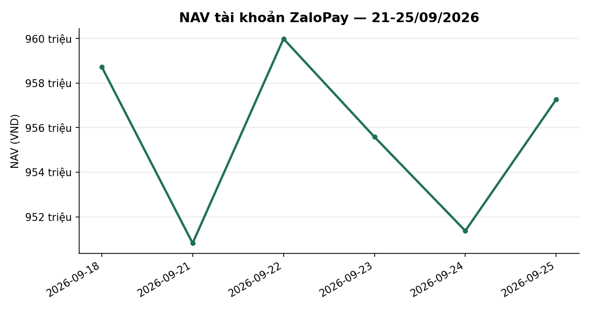
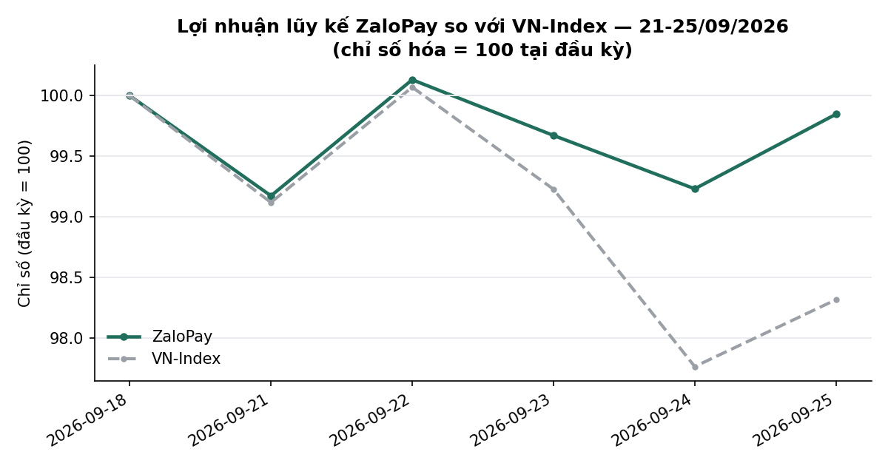
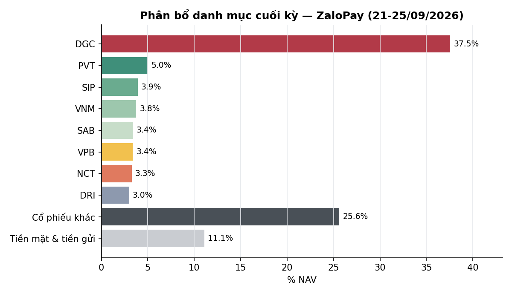

# BÁO CÁO TUẦN — TÀI KHOẢN ZALOPAY
## Kỳ báo cáo: 21/09/2026 – 25/09/2026

**Tài khoản:** ZaloPay · DNSE, số hiệu 0001743768 · V2.4 live từ 06/07/2026 (cash-only, không margin)
**Chiến lược:** V2.4 (2 book BAL/LAG + parking custom30V tại trạng thái NEUTRAL)
**Ngày lập báo cáo:** 26/09/2026 · **Người lập:** Taylor (Quant) — auto-dispatch từ
`check_report_cadence.sh` (báo cáo tuần bị bỏ sót, phát hiện tự động, job Taylor_20260926_020004)
**Đối tượng:** Kênh theo dõi nội bộ (KHÔNG gửi nhà đầu tư ngoài) — giữ minh bạch đầy đủ

> 📊 Báo cáo có kèm biểu đồ minh hoạ (NAV, lợi nhuận lũy kế so VN-Index, phân bổ danh mục) — xem
> bản email để thấy đầy đủ hình ảnh; bản trên kênh chat chỉ hiển thị văn bản.

---

## 1. TÓM TẮT ĐIỀU HÀNH

| Chỉ tiêu | ZaloPay |
|---|---:|
| NAV đầu kỳ (chốt 18/09) | 958.732.611 |
| NAV cuối kỳ (25/09) | **957.269.620** |
| Thay đổi trong kỳ | **−1.462.991 (−0,15%)** |
| VN-Index cùng kỳ (18/09 → 25/09) | 1.815,66 → 1.785,11 (**−1,68%**) |
| Giá trị cổ phiếu cuối kỳ | 851.040.300 |
| Tiền mặt tại công ty CK | 4.107.343 |
| Tiền gửi "Trứng vàng" (đọc tự động qua API DNSE) | 102.121.977 |
| Tỷ trọng cổ phiếu/NAV | 88,9% (gồm DGC legacy 37,5% NAV) |
| Số mã nắm giữ cuối kỳ | 28 (26 mã bot + VPB + DGC legacy) |

**Nhận định tuần:** VN-Index giảm **−1,68%** trong tuần (điều chỉnh, đáy phiên 24/09 −1,47%).
ZaloPay giảm nhẹ **−0,15%**, VƯỢT chỉ số **+1,53 điểm phần trăm** — phần lớn nhờ vị thế legacy
**DGC** (10.000cp, 37,5% NAV) chỉ giảm −1,02% trong tuần (thấp hơn nhiều biến động chung), cộng với
việc rổ 26 mã do bot quản lý (book BAL/LAG + parking) tăng nhẹ (P&L chưa thực hiện phần bot +1,85%
trên giá vốn, xem Mục 3.4). Hai sự kiện quyền lợi cổ đông đáng chú ý trong tuần: (1) **VPB** chia cổ
tức bằng cổ phiếu tỷ lệ 26% (GDKHQ 24/09), làm tăng số lượng cổ phiếu nắm giữ (từ ~1.200 lên
1.512, sau đó bot bán trim 100cp ngày 25/09 còn 1.412); (2) **DGC** cổ tức tiền mặt 8.000đ/cp theo
cấu hình `manual_offbook_assets`/`excluded_dividend_receivable` (tổng cấu hình 80.000.000đ) — DNSE
đã ghi nhận **78.100.000đ** vào tài khoản tính đến 25/09 (cashDividendReceiving còn lại 1.900.000đ
chưa về, theo dnse_raw 19:07:08). Trạng thái thị trường DT5G giữ nguyên **NEUTRAL (3/5)** suốt
tuần. **1 gap dữ liệu/residual cần lưu ý — xem Mục 4.**

---

## 2. BỐI CẢNH THỊ TRƯỜNG TRONG TUẦN

| Ngày | VN-Index | Δ ngày |
|---|---:|---:|
| 18/09 (trước kỳ) | 1.815,66 | — |
| 21/09 | 1.799,67 | −0,88% |
| 22/09 | 1.816,93 | +0,96% |
| 23/09 | 1.801,65 | −0,84% |
| 24/09 | 1.775,09 | −1,47% |
| 25/09 | 1.785,11 | +0,56% |

- Tuần điều chỉnh **−1,68%**, bật tăng đầu tuần rồi giảm liên tiếp 2 phiên, đáy tuần 24/09.
- **Trạng thái thị trường (DT5G): NEUTRAL (3/5) toàn bộ tuần** (xác nhận từ bảng sản xuất
  `vnindex_5state_dt5g_live`, cả 5 phiên đều `state=3`) → mục tiêu phân bổ ~70% cho phần vốn
  parking, không có cap phòng thủ vĩ mô nào kích hoạt. Gate DT5G ổn định, không có candidate chuyển
  trạng thái đang tích luỹ.
- **Bề rộng thị trường (breadth, % mã đóng cửa trên MA50, universe `tav2_mike.universe_pit` PIT):**
  32,4% trên tổng 820 mã (25/09), so với 36,1%/837 mã (18/09) — suy yếu cùng chiều với nhịp điều
  chỉnh của chỉ số.
- **Value Radar** (composite P/E+P/B+spread lãi suất, rolling 10 năm, DISPLAY-ONLY — không phải
  tín hiệu mua/bán, 0/17 lăng kính qua đa kiểm định): **22,0 — RẺ** (P/E 11,42 phân vị 8, P/B 1,92
  phân vị 30, spread EY−tiết kiệm +1,95pp phân vị 28), dữ liệu tới 25/09.

---

## 3. DIỄN BIẾN NAV & DANH MỤC TRONG TUẦN

### 3.1 NAV theo ngày

| Ngày | NAV (VND) | Δ ngày | Ghi chú |
|---|---:|---:|---|
| 18/09 (đầu kỳ) | 958.732.611 | — | |
| 21/09 | 950.813.808 | −0,83% | SELL trim (xem 3.3); `nav_is_estimate=True`, backfill (xem Mục 4.1) |
| 22/09 | 959.993.551 | +0,97% | SELL HDB/LPB/VPB 100cp trim |
| 23/09 | 955.586.647 | −0,46% | `nav_is_estimate=True`, backfill (xem Mục 4.1) |
| 24/09 | 951.368.626 | −0,44% | VPB GDKHQ chia cổ tức CP 26% |
| 25/09 (cuối kỳ) | 957.269.620 | +0,62% | SELL VPB 100cp trim (giá đã điều chỉnh sau chia) |

Cả tuần **−0,15%** vs VN-Index **−1,68%** — vượt chỉ số 1,53 điểm phần trăm, chủ yếu nhờ DGC ít
biến động hơn thị trường chung trong tuần điều chỉnh này (khác hẳn tuần trước, khi DGC là nguyên
nhân chính khiến ZaloPay kém chỉ số).

### 3.2 Hiệu suất lũy kế

| Giai đoạn | ZaloPay | VN-Index | Chênh lệch |
|---|---:|---:|---:|
| Tuần này (18/09 → 25/09) | −0,15% | −1,68% | +1,53pp |
| Từ đầu tháng 9 (MTD, 28/08 → 25/09) | +0,52% | −2,57% | +3,08pp |
| Từ khi bắt đầu hoạt động (06/07 → 25/09) | −2,97% | −3,42% | +0,45pp |

### 3.3 Hoạt động giao dịch

**Trim tái cân bằng (PARK_TRIM, cơ chế định kỳ, không phải phản ứng biến động ngắn hạn):**
- 22/09: bán 100cp mỗi mã **HDB** (27.450đ), **LPB** (46.200đ), **VPB** (28.300đ, TRƯỚC ngày GDKHQ).
- 25/09: bán 100cp **VPB** (22.050đ, SAU ngày GDKHQ — giá đã điều chỉnh theo hệ số chia cổ tức,
  giải thích phần lớn chênh lệch giá bán 28.300đ → 22.050đ, KHÔNG phải giảm giá thị trường thật).

**Sự kiện quyền lợi cổ đông:**
- **VPB — chia cổ tức bằng cổ phiếu tỷ lệ 26,0%** (`VPB-2026-09-24-BONUS-ISSUE`, ex-date 24/09,
  `corp_action_auto_confirm.py` xác nhận 2 nguồn: upcoming_events_held + tỷ số qty/cost broker).
  Số lượng VPB: 1.300 (18/09) → 1.200 (sau trim 22/09) → **1.512** (sau chia, hệ số 1,2604104) →
  **1.412** (sau trim 25/09). Không phát sinh dòng tiền, chỉ điều chỉnh số lượng/giá vốn kỹ thuật.
- **DGC — cổ tức tiền mặt** theo cấu hình `excluded_dividend_receivable` (80.000.000đ, dự kiến về
  25/09). Đến cuối ngày 25/09, DNSE đã ghi nhận **78.100.000đ** vào `totalCash`; còn
  **1.900.000đ** hiển thị ở trường `cashDividendReceiving` (chưa cộng vào tiền khả dụng). Không
  ảnh hưởng số lượng cổ phiếu DGC (10.000cp giữ nguyên).

Không có giao dịch mua nào trong tuần. Phí giao dịch áp dụng 0,097% trên giá trị các lệnh bán trim
(tổng giá trị nhỏ, ~10,2tr VND).

### 3.4 Danh mục cuối kỳ (25/09/2026)

Nguồn: `verify_account_snapshot.py --account ZaloPay` (26 mã bot có lịch sử khớp nội bộ,
`Verified=True`) + vị thế legacy DGC/VPB (loại khỏi tính P&L nội bộ do không có lịch sử khớp —
hiển thị theo số lượng/giá vốn broker mới nhất, đã phản ánh sự kiện chia cổ phiếu VPB 24/09).

| Mã | KL | Giá vốn | Giá 25/09 | Giá trị thị trường | % NAV | Lãi/lỗ | Ghi chú |
|---|---:|---:|---:|---:|---:|---:|---|
| DGC | 10.000 | 39.775 | 35.950 | 359.500.000 | 37,55 | −9,62% | **Legacy**, ngoài phạm vi bot |
| PVT | 2.071 | 17.248 | 23.100 | 47.840.100 | 5,00 | +33,93% | Bot |
| SIP | 749 | 47.140 | 50.000 | 37.450.000 | 3,91 | +6,07% | Bot |
| VNM | 601 | 58.700 | 59.800 | 35.939.800 | 3,75 | +1,87% | Bot |
| VPB | 1.412 | 21.226 | 23.000 | 32.476.000 | 3,39 | +8,36% | **Legacy** — đã gồm chia CP 26% |
| SAB | 744 | 47.450 | 43.900 | 32.661.600 | 3,41 | −7,48% | Bot |
| NCT | 373 | 94.400 | 83.600 | 31.182.800 | 3,26 | −11,44% | Bot |
| DRI | 1.900 | 13.263 | 15.100 | 28.690.000 | 3,00 | +13,85% | Bot |
| TV1 | 1.400 | 20.329 | 20.100 | 28.140.000 | 2,94 | −1,12% | Bot |
| SCL | 1.000 | 23.590 | 26.800 | 26.800.000 | 2,80 | +13,61% | Bot |
| VPI | 400 | 62.450 | 62.200 | 24.880.000 | 2,60 | −0,40% | Bot |
| VHM | 300 | 74.317 | 69.100 | 20.730.000 | 2,17 | −7,02% | Bot |
| CSV | 1.000 | 19.750 | 20.250 | 20.250.000 | 2,12 | +2,53% | Bot |
| VCB | 300 | 60.788 | 58.000 | 17.400.000 | 1,82 | −4,59% | Bot |
| BID | 427 | 37.871 | 35.750 | 15.278.592 | 1,60 | −5,60% | Bot |
| CTG | 450 | 32.583 | 30.150 | 13.567.500 | 1,42 | −7,47% | Bot |
| TCB | 356 | 31.611 | 33.250 | 11.837.000 | 1,24 | +5,19% | Bot |
| LPB | 252 | 54.843 | 46.450 | 11.705.400 | 1,22 | −15,30% | Bot |
| HPG | 500 | 22.200 | 20.650 | 10.325.000 | 1,08 | −6,98% | Bot |
| HDB | 359 | 25.891 | 27.800 | 9.980.200 | 1,04 | +7,37% | Bot |
| ACB | 300 | 22.700 | 21.400 | 6.420.000 | 0,67 | −5,73% | Bot |
| SHB | 300 | 12.100 | 11.600 | 3.480.000 | 0,36 | −4,13% | Bot |
| MSB | 240 | 13.542 | 14.050 | 3.372.000 | 0,35 | +3,75% | Bot |
| VIB | 219 | 13.607 | 13.400 | 2.934.600 | 0,31 | −1,52% | Bot |
| VRE | 100 | 25.550 | 24.500 | 2.450.000 | 0,26 | −4,11% | Bot |
| TPB | 100 | 14.800 | 14.600 | 1.460.000 | 0,15 | −1,35% | Bot |
| VIX | 105 | 13.286 | 12.650 | 1.328.250 | 0,14 | −4,78% | Bot |
| MBB | 252 | 20.511 | 19.900 | 5.014.800 | 0,52 | −2,98% | Bot |
| Tiền mặt | | | | 4.107.343 | 0,43 | | |
| Tiền gửi Trứng vàng | | | | 102.121.977 | 10,67 | Tự động qua API | |
| **Tổng NAV** | | | | **957.269.620** | **100,00** | | |

**Bot P&L (26 mã, loại DGC/VPB legacy):** giá vốn 442.918.269 → thị giá 451.117.642 =
**+8.199.373 (+1,85%)** — dương, nhất quán với nhận định Mục 1 rằng phần bot quản lý tăng nhẹ tuần
này. **MBB** trong bảng trên dùng số lượng/giá vốn theo bản ghi vị thế broker mới nhất (252cp,
20.511đ) thay vì bản dựng lại từ replay-fill nội bộ của `verify_account_snapshot.py` (script báo
632cp/20.858đ — chênh do quyền mua MBB 10:1 đăng ký 28/08 đã được broker ghi nhận đầy đủ vào vị thế
tính đến 25/09, còn cờ INFO của script vẫn coi là "chưa về"; điều chỉnh này chỉ ảnh hưởng dòng MBB,
không ảnh hưởng NAV tổng).

**Rủi ro tập trung DGC — nhắc lại từ các kỳ báo cáo trước:** DGC vẫn là vị thế lớn nhất tài khoản
(37,5% NAV, ngoài phạm vi tái cân bằng tự động), hiện lỗ trên giấy **−9,62%** so với giá vốn broker.
Tuần này DGC biến động ít hơn phần còn lại của danh mục (khác tuần trước) nhưng vẫn là rủi ro tập
trung cơ cấu — nhắc lại khuyến nghị các kỳ trước: cần chủ động xác nhận chủ đích giữ/giảm vị thế
này.

---

## 4. CÔNG BỐ SỰ CỐ & SỰ KIỆN VẬN HÀNH TRONG TUẦN

Nguyên tắc: liệt kê đầy đủ, không làm tròn, kể cả phần chưa giải thích được.

### 4.1 Gap NAV 21/09 và 23/09 — đã backfill, không mất dữ liệu

`daily_nav_snapshot.py` không chạy đúng lịch 2 ngày này trong tuần; 2 dòng NAV được dựng lại
(backfill) từ `dnse_raw` positions + balances cùng ngày + giá đóng cửa BQ, đã ghi `nav_is_estimate=
True` trong `nav_history_ZaloPay.csv` (tương tự SpaceX cùng 2 ngày). Không ảnh hưởng độ chính xác
số liệu cuối kỳ; đã có trên bus (`Taylor/finding — exdate-price-frame-active-nav-XONG`,
2026-09-23T16:37:23Z: "nav_history THIẾU dòng 09-21 và 09-23 cả 2 account — chờ quyết backfill").

### 4.2 Residual chưa giải thích đầy đủ giữa bảng danh mục và NAV chính thức (~7,9tr VND / 0,83% NAV)

Tổng giá trị thị trường theo bảng Mục 3.4 (843.093.642đ, sau khi đã sửa dòng MBB theo vị thế
broker) + tiền mặt + Trứng vàng = 949.322.962đ, so với NAV chính thức 957.269.620đ (chênh
**7.946.658đ ≈ 0,83% NAV**). Đây là chênh lệch giữa cách `verify_account_snapshot.py` dựng lại số
lượng cổ phiếu từ lịch sử khớp lệnh nội bộ (replay-fill + hệ số corp-action) và số lượng thực tế
broker báo cáo — cùng lớp vấn đề với sự kiện chia cổ phiếu VPB 24/09 đã được xử lý riêng ở nhánh
`fix/exdate-price-frame-active-nav` (job Taylor_20260923_160958, **CHƯA LAND**), vốn ghi nhận
`compute_active_nav`/`report_return_gate.py` có thể đọc lệch 2 hệ quy chiếu giá tại các thời điểm
quanh ngày GDKHQ. Quan sát cụ thể trong lúc đối soát tuần này: khi đọc trực tiếp bản ghi vị thế mới
nhất từ broker (23:30 25/09), hai mã **BID** và **VCB** hiển thị số lượng thấp hơn đáng kể so với
số dựng lại từ lịch sử khớp lệnh nội bộ (BID 320 vs 427cp, VCB 100 vs 300cp) — CHƯA xác định được
đây là dữ liệu tạm thời trong lúc broker đang xử lý một sự kiện quyền lợi khác, hay một sai lệch
thật cần điều tra riêng. Không đủ cơ sở để tự sửa số trong báo cáo này (§29 — không đoán nguyên
nhân); đề xuất Winston/Taylor xác minh trực tiếp qua API tại phiên tới trước khi kết luận.

### 4.3 VPI — không có hoạt động tuần này

Vị thế VPI (400cp, mở tuần trước) không có giao dịch mới trong tuần, giữ nguyên khối lượng.

### 4.4 Đẳng thức hai chiều — vẫn KHÔNG áp dụng đầy đủ cho ZaloPay

2 vị thế legacy (DGC + VPB, 40,9% NAV) không có lịch sử khớp nội bộ đầy đủ nên "Vốn ban đầu" không
so sánh được với tập con "P&L đã verify" (chỉ 26/28 mã) — tình trạng đã biết từ các kỳ trước, không
phải sự cố mới.

---

## 5. KẾ HOẠCH TUẦN TỚI (28/09 – 02/10/2026)

- **Vận hành thường lệ:** chưa có plan mới được xác nhận tại thời điểm lập báo cáo (thứ Bảy 26/09,
  ngoài giờ giao dịch) — theo dõi plan phiên 28/09 khi có.
- **DGC (37,5% NAV, −9,62% chưa thực hiện):** tiếp tục là quyết định của nhà đầu tư, ngoài phạm vi
  tái cân bằng bot — đề nghị xác nhận lại chủ đích giữ/giảm, đã nhắc liên tục các kỳ trước. Theo
  dõi phần cổ tức còn lại (1.900.000đ) có về đủ trong vài ngày tới không.
  Cổ tức DGC đã báo qua email doanh nghiệp (Winston/data-ops) và trên bus §21, khớp với con số
  broker đến 25/09.
- **Residual §4.2:** cần Winston xác minh trực tiếp vị thế BID/VCB qua API DNSE trước kỳ báo cáo
  tuần tới; nếu là dữ liệu tạm thời sẽ tự hết trong vài phiên, nếu không cần escalate.

---

## 6. PHỤ LỤC — PHƯƠNG PHÁP LUẬN & LƯU Ý

- **Pipeline xác minh** (theo `mike/kb/coding_guidelines.md` §6): `verify_account_snapshot.py`
  (25 ngày có fill, `Verified=True`) → `nav_history_ZaloPay.csv` (5/5 dòng tuần này, 2 dòng
  backfill đã ghi cờ estimate — Mục 4.1) → `reconcile_equity.py` (không áp dụng đầy đủ do 2 vị thế
  legacy — Mục 4.4).
- **Trứng vàng**: đọc **tự động qua API DNSE** (field `egg.totalValue` trong payload `balances`,
  `daily_nav_snapshot.py` dòng ~450, cột `egg_assets_auto=True`) — không phải số off-book thủ công.
- **Breadth**: `tav2_mike.universe_pit` (point-in-time thật, KHÔNG dùng `ticker_prune`) JOIN
  `tav2_bq.ticker` lấy `Close`/`MA50` đúng ngày trong universe.
- **Value Radar**: hiển thị theo `dna_report.build_value_radar_line()` — chỉ mang tính tham khảo,
  CHƯA qua kiểm định đa giả thuyết đủ mạnh để dùng làm tín hiệu.
- **Phí/thuế:** phí giao dịch 0,097%/lượt (HOSE); thuế bán 0,1% giá trị bán.
- **Track record vẫn ngắn** (~58 phiên kể từ go-live 06/07/2026) — so sánh với VN-Index chỉ mang
  tính mô tả, chưa đủ ý nghĩa thống kê để đánh giá chiến lược.
- **Đây không phải khuyến nghị đầu tư.** Kết quả quá khứ (kể cả backtest) không đảm bảo kết quả
  tương lai.

---
*Báo cáo tổng hợp từ hệ thống giám sát vận hành nội bộ, đối soát với dữ liệu sàn (DNSE API) và cơ
sở dữ liệu thị trường (BigQuery). Kênh nội bộ — KHÔNG gửi nhà đầu tư ngoài.*
