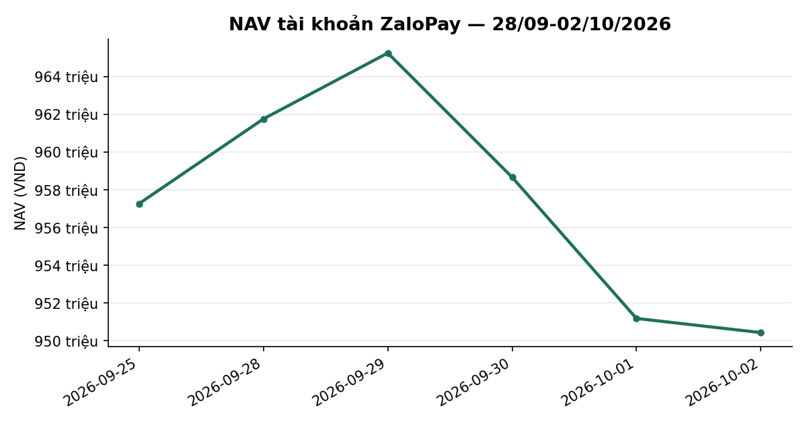
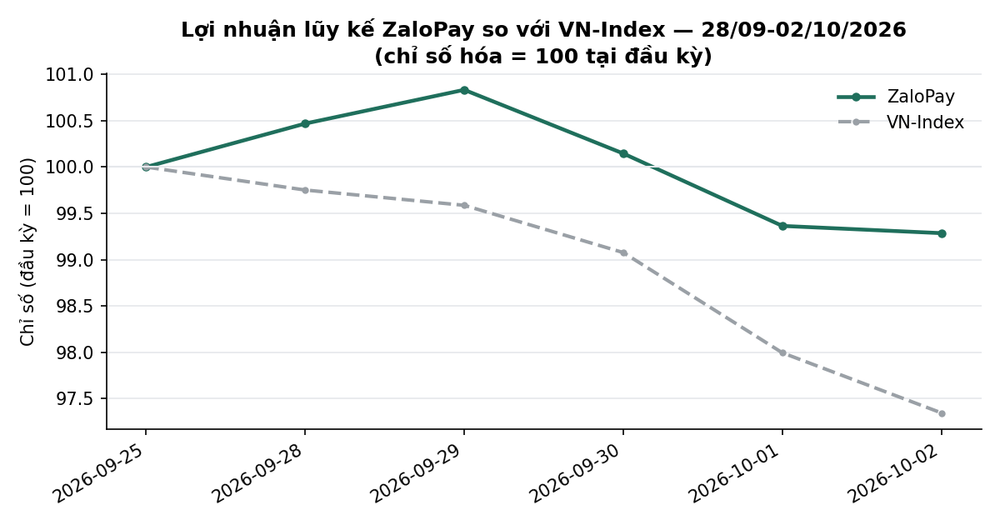
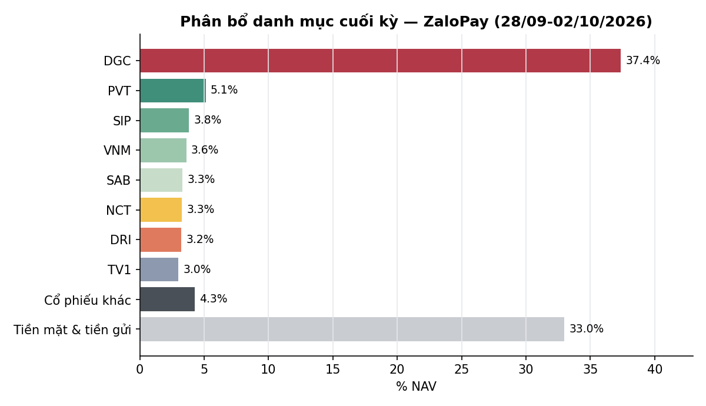

# BÁO CÁO TUẦN — TÀI KHOẢN ZALOPAY
## Kỳ báo cáo: 28/09/2026 – 02/10/2026

**Tài khoản:** ZaloPay · DNSE, số hiệu 0001743768 · V2.4 live từ 06/07/2026 (cash-only, không margin)
**Chiến lược:** V2.4 (2 book BAL/LAG + parking custom30V tại trạng thái NEUTRAL)
**Ngày lập báo cáo:** 03/10/2026 · **Người lập:** Taylor (Quant) — auto-dispatch từ
`check_report_cadence.sh` (báo cáo tuần bị bỏ sót, phát hiện tự động, job Taylor_20261003_020004)
**Đối tượng:** Kênh theo dõi nội bộ (KHÔNG gửi nhà đầu tư ngoài) — giữ minh bạch đầy đủ

> 📊 Xem biểu đồ minh hoạ đính kèm trong email (NAV, lợi nhuận lũy kế so VN-Index, phân bổ danh mục);
> bản trên kênh chat chỉ hiển thị văn bản.

---

## 1. TÓM TẮT ĐIỀU HÀNH

| Chỉ tiêu | ZaloPay |
|---|---:|
| NAV cuối kỳ trước (25/09) | 957.269.620 |
| NAV cuối kỳ (02/10) | **950.434.410** |
| Thay đổi trong kỳ | **−6.835.210 (−0,71%)** |
| VN-Index cùng kỳ (25/09 → 02/10) | 1.785,11 → 1.737,71 (**−2,65%**) |
| Giá trị cổ phiếu cuối kỳ | 637.110.200 (67,0% NAV) |
| Tiền mặt tại công ty CK | 147.523.724 (15,5% NAV) |
| Tiền gửi "Trứng vàng" (đọc tự động qua API DNSE) | 165.800.486 (17,4% NAV) |
| Số mã nắm giữ cuối kỳ | 19 (gồm DGC 37,4% NAV, VPB legacy) |

**Nhận định tuần:** VN-Index giảm **−2,65%**, giảm cả 5 phiên (mạnh nhất 01/10: −1,09%). ZaloPay giảm
**−0,71%**, tốt hơn chỉ số **+1,94 điểm phần trăm**. Hai yếu tố: (1) **DGC** (10.000cp, 37,4% NAV, ngoài
phạm vi bot) giảm giá ít hơn nhịp giảm chung của thị trường trong tuần; (2) bot hạ tỷ trọng cổ phiếu
(PARK_TRIM + thoát LAG/BAL) — tỷ trọng cổ phiếu từ 88,9% (25/09) xuống 67,0% NAV, tiền chuyển sang
tiền mặt + Trứng vàng. **Không có lệnh mua nào trong tuần.** Trạng thái thị trường DT5G giữ **NEUTRAL
(3/5)** cả 5 phiên; tuy nhiên gate DT5G đang tích luỹ **candidate BEAR 4/10** (xem Mục 2 và Mục 5).
**Có 4 điểm chưa xác minh/chưa giải thích được — xem Mục 4.**

---

## 2. BỐI CẢNH THỊ TRƯỜNG TRONG TUẦN

| Ngày | VN-Index | Thay đổi |
|---|---:|---:|
| 25/09 (cuối kỳ trước) | 1785,11 | — |
| 28/09 | 1780,68 | −0,25% |
| 29/09 | 1777,73 | −0,17% |
| 30/09 | 1768,62 | −0,51% |
| 01/10 | 1749,30 | −1,09% |
| 02/10 | 1737,71 | −0,66% |

- **Trạng thái DT5G:** NEUTRAL (state=3) cả 5 phiên (bảng sản xuất `vnindex_5state_dt5g_live`).
  Gate: **candidate BEAR 4/10** (40%, còn 6 phiên để commit, base BEAR giữ từ 29/09, committed NEUTRAL)
  · P(BEAR xác nhận|k=4)≈57% [46–68%, n=70] (dữ liệu tới 02/10).
- **Bề rộng thị trường (breadth, % mã đóng cửa trên MA50, universe `tav2_mike.universe_pit` PIT):**
  **29,0%** trên 824 mã (02/10), so với 32,4%/820 mã (25/09).
- **Value Radar** (composite P/E+P/B+spread lãi suất, rolling 10 năm, DISPLAY-ONLY — không phải tín
  hiệu mua/bán, 0/17 lăng kính qua đa kiểm định): **24,4 — RẺ** (P/E 11,18 phân vị 6, P/B 1,88 phân vị
  25, spread EY−CCTG 6T +1,45pp phân vị 42), dữ liệu tới 02/10.

---

## 3. DIỄN BIẾN NAV & DANH MỤC TRONG TUẦN

### 3.1 NAV theo ngày

| Ngày | NAV (VND) | Δ ngày | Δ VN-Index |
|---|---:|---:|---:|
| 25/09 (đầu kỳ) | 957.269.620 | — | — |
| 28/09 | 961.759.336 | +0,47% | −0,25% |
| 29/09 | 965.250.181 | +0,36% | −0,17% |
| 30/09 | 958.666.279 | −0,68% | −0,51% |
| 01/10 | 951.182.854 | −0,78% | −1,09% |
| 02/10 (cuối kỳ) | 950.434.410 | −0,08% | −0,66% |

Cả 5 dòng NAV tuần này đều `nav_is_estimate=False`, nguồn `live` (không backfill). Cả tuần **−0,71%** vs
VN-Index **−2,65%**: vượt chỉ số 1,94 điểm phần trăm.

### 3.2 Hiệu suất lũy kế (`nav_period_returns.py`, mốc từ `data/account_inception.json`)

| Giai đoạn | ZaloPay | VN-Index | Chênh lệch |
|---|---:|---:|---:|
| Tuần này (25/09 → 02/10) | −0,71% | −2,65% | +1,94pp |
| Từ đầu tháng 10 (MTD, 30/09 → 02/10) | −0,86% | −1,75% | +0,89pp |
| Từ khi bắt đầu hoạt động (06/07 → 02/10) | −3,79% | −6,68% | +2,89pp |

Mốc VN-Index "từ khi bắt đầu" = đóng cửa 03/07 (1.862,08), tức phiên TRƯỚC go-live 06/07, cùng mốc thời
điểm với NAV gốc 987.865.567 (theo duyệt của user 27/09). Các kỳ trước dùng đóng cửa 07/07 (1.848,25) —
số so sánh VN-Index "từ khi bắt đầu" của kỳ này vì vậy không so thẳng được với kỳ trước.
Rủi ro từ go-live (NAV chốt cuối ngày): sụt giảm tối đa −16,35% từ đỉnh, độ biến động ngày 1,38%
(quy năm ~21,9%) — cao hơn SpaceX do DGC chiếm 37% NAV.

### 3.3 Hoạt động giao dịch (toàn bộ là lệnh BÁN, không có lệnh mua)

Nguồn: `orders` trong `dnse_raw_*.jsonl` lọc theo `accountNo=0001743768`.

| Ngày | Giá trị bán | Chi tiết |
|---|---:|---|
| 29/09 | ~42,9 tr | BID 100, CTG 100, HDB 100, LPB 200, MBB 200, TCB 100, VCB 100, VHM 100, VPB 200 |
| 30/09 | ~18,6 tr | ACB 100, HDB 100, HPG 200, MBB 100, MSB 100, SHB 100, TPB 100, VIX 100, VRE 100 |
| 01/10 | ~22,9 tr | SCL 800 @ 28.650 (thoát LAG quá hạn T+25) |
| 02/10 | ~123,1 tr | ACB 200, BID 300, CTG 300, HDB 100, HPG 300, MBB 300, SHB 200, TCB 200, VCB 200, VHM 200, VIB 200, VPB 900 (PARK_TRIM) · CSV 1.000 @ 20.005 (thoát BAL) · SCL 200 @ 28.400 (hết SCL) |

Tổng giá trị bán ~207,5 triệu VND; phí 0,097% + thuế bán 0,1% ≈ 0,41 triệu VND (ước tính theo biểu phí,
không trích từ statement trong báo cáo này). `verify_account_snapshot.py --account ZaloPay` (29 ngày có
fill): **Verified=True**.

**Sự kiện quyền lợi cổ đông:** không có chia tách/cổ phiếu thưởng trên mã ZaloPay đang giữ trong tuần
(SpaceX có TPB — xem 4.1). Cổ tức DRI/SAB/NCT: xem Mục 4.3.

### 3.4 Danh mục cuối kỳ (02/10/2026)

Nguồn số lượng: vị thế OPEN từ `dnse_raw` (positions 20:40 02/10, cộng theo mã) × giá `Price` BQ ngày
02/10; giá vốn thô và % lãi/lỗ: số kỳ vọng của `report_return_gate.py` (giá vốn broker + cổ tức đã xác minh,
ròng thuế 5%). Mã DGC chiếm 37,4% NAV.

| Mã | KL | Giá vốn | Giá 02/10 | Giá trị thị trường | % NAV | Lãi/lỗ |
|---|---:|---:|---:|---:|---:|---:|
| DGC | 10.000 | 47.775 | 35.500 | 355.000.000 | 37,35 | −9,79% |
| PVT | 2.071 | 17.248 | 23.500 | 48.668.500 | 5,12 | +36,25% |
| SIP | 749 | 47.140 | 48.600 | 36.401.400 | 3,83 | +3,10% |
| VNM | 601 | 58.700 | 57.300 | 34.437.300 | 3,62 | −2,38% |
| SAB | 744 | 47.450 | 42.450 | 31.582.800 | 3,32 | −4,53% |
| NCT | 373 | 94.400 | 83.500 | 31.145.500 | 3,28 | −3,50% |
| DRI | 1.900 | 12.263 | 16.200 | 30.780.000 | 3,24 | +32,10% |
| TV1 | 1.400 | 20.329 | 20.400 | 28.560.000 | 3,00 | +0,35% |
| VPI | 400 | 62.450 | 58.800 | 23.520.000 | 2,47 | −5,84% |
| VPB | 312 | 21.226 | 22.900 | 7.144.800 | 0,75 | +7,89% |
| LPB | 52 | 54.843 | 40.200 | 2.090.400 | 0,22 | −26,70% |
| TCB | 56 | 31.611 | 32.250 | 1.806.000 | 0,19 | +2,02% |
| HDB | 59 | 25.891 | 28.450 | 1.678.550 | 0,18 | +9,88% |
| CTG | 50 | 32.133 | 29.750 | 1.487.500 | 0,16 | −7,42% |
| MBB | 52 | 20.511 | 19.100 | 993.200 | 0,10 | −6,88% |
| BID | 27 | 37.581 | 34.800 | 939.600 | 0,10 | −7,40% |
| MSB | 40 | 13.542 | 14.050 | 562.000 | 0,06 | +3,75% |
| VIB | 19 | 13.607 | 13.350 | 253.650 | 0,03 | −1,89% |
| VIX | 5 | 13.286 | 11.800 | 59.000 | 0,01 | −11,18% |
| Tiền mặt | | | | 147.523.724 | 15,52 | |
| Tiền gửi Trứng vàng | | | | 165.800.486 | 17,44 | |
| **Tổng NAV** | | | | **950.434.410** | **100,00** | |

**Đẳng thức NAV:** Σ(số lượng × giá) + tiền mặt + Trứng vàng − nợ = 637.110.200 + 147.523.724 +
165.800.486 − 0 = **950.434.410 = NAV `nav_history_ZaloPay.csv` ngày 02/10 (residual 0 đồng)**.
Lãi/lỗ chưa thực hiện toàn danh mục theo bảng (số của cổng tỉ suất, đã cộng cổ tức ròng): **−30,6 triệu
VND (−4,08% trên giá vốn thô)**, trong đó DGC −46,75 triệu. Lưu ý: cổng tính giá vốn thô DGC = 47.775đ
(giá vốn broker 39.775 + cổ tức 8.000đ/cp) nên % DGC khác các kỳ trước (giá vốn 39.775 → −10,75%); tôi
không tự kiểm chứng cách cổng xử lý khoản 8.000đ này.

**Rủi ro tập trung DGC — nhắc lại từ các kỳ trước:** DGC 37,4% NAV, ngoài phạm vi tái cân bằng tự động,
lỗ trên giấy so với giá vốn (giá 35.500). Khuyến nghị các kỳ trước vẫn còn nguyên: cần
user chủ động xác nhận giữ/giảm.

---

## 4. CÔNG BỐ SỰ CỐ, SỰ KIỆN VẬN HÀNH & ĐIỂM CHƯA XÁC MINH

Nguyên tắc: liệt kê đầy đủ, không làm tròn, kể cả phần chưa giải thích được.

### 4.1 Liên tài khoản — SpaceX thiếu NAV 01/10 (không ảnh hưởng số ZaloPay)

`nav_history_SpaceX.csv` KHÔNG có dòng 01/10: `daily_nav_snapshot.py` bị chặn (`nav_gate_block_SpaceX_
2026-10-01.json`, `gate_verdict=qty_change_block`, rc=5) vì TPB tăng 200→230cp "không giải thích được".
Nguyên nhân thực: cổ tức cổ phiếu TPB 15% (+ tiền mặt 500đ/cp) — sự kiện `TPB-2026-10-02-STOCK-DIVIDEND`
được ghi tay vào `corp_actions.json` và user duyệt qua Discord 01/10 22:49 vì feed corp-action vendor
**đứng từ 26/09** (broker ghi nhận lúc 11:52 01/10, trước ex-date 02/10 ghi trong sổ). Dòng NAV 01/10
SpaceX **chưa được backfill** — báo cáo SpaceX hiển thị n/a cho ngày đó. ZaloPay không bị ảnh hưởng
(không giữ TPB sau 30/09). Hệ quả cần quyết: backfill `daily_nav_snapshot.py --from-raw --date 2026-10-01
--account SpaceX`.

### 4.2 Liên tài khoản — `verify_account_snapshot.py` SpaceX báo Verified=False

Chạy với đủ 24 ngày fill: còn 4 cảnh báo INFO — MBB (dnse_raw=165 vs journal=275; quyền mua 10:1 đã khai
báo, nay broker `positions` đã hiển thị 275cp nên cảnh báo này có vẻ lỗi thời nhưng chưa xoá khai báo),
và **SCL vẫn xuất hiện 1.500cp trong danh sách vị thế "đã verify"** dù đã bán tay 30/09 (journal có
`SCL-MANUAL-SELL-2026-09-30`) — tôi quan sát hiện tượng nhưng chưa xác định nguyên nhân; số báo cáo
SpaceX không dựa vào `total_cost_value` của lần chạy này. ZaloPay: Verified=True (chỉ còn INFO MBB
dnse_raw=32 vs journal=52 đã khai báo).

### 4.3 Giá vốn broker ≠ giá vốn thật cho SAB / NCT / DRI; cổ tức tiền mặt DRI chưa xác minh

- `positions.costPrice` của DNSE thấp hơn giá khớp thật đúng **3.000đ (SAB), 8.000đ (NCT), 1.000đ (DRI)**
  so với tuần trước (ZaloPay SAB 47.450→44.450, NCT 94.400→86.400, DRI 13.263→12.263; SpaceX tương tự).
  Báo cáo này dùng giá vốn thật từ `verify_account_snapshot.py`; **chưa xác định** thời điểm/nguồn của
  các lần điều chỉnh giá vốn trên broker.
- `cashDividendReceiving`: ZaloPay 1.900.000đ (không đổi từ 25/09 đến 02/10), SpaceX 3.700.000đ (đổi
  thành 3.800.000đ đêm 01/10 = +100.000đ ≈ 200cp TPB × 500đ). 1.900.000 = 1.900cp DRI × 1.000đ và
  3.700.000 = 3.700cp DRI × 1.000đ (số học khớp). Báo cáo tuần trước gán 1,9tr này cho DGC — **có khả
  năng gán sai, nhưng tôi chưa xác minh** (không có bản ghi broker phân tách theo mã).
- `dividend_adjusted_return.py --resolve` tuần này: **DRI ex 30/09 = UNVERIFIED** (ước lượng theo tỉ số
  chỉ ~102đ/cp, không khớp 1.000đ/cp ở trên). Vì vậy tỉ suất trong báo cáo này **chưa cộng cổ tức tiền
  mặt chưa xác minh** và không tự suy số.

### 4.4 Mức hạ tỷ trọng cổ phiếu chưa đối chiếu được với mục tiêu NEUTRAL

Journal ghi các lệnh là `PARK_TRIM`/`PARKMERGE-SELL` hoàn tất 100% so với plan; báo cáo ngày ghi
"Park target: 0% idle cash". Nhưng DT5G=NEUTRAL (mục tiêu ~70% vốn parking) trong khi tỷ trọng cổ phiếu
ZaloPay giảm 88,9% → 67,0% và SpaceX 90,6% → 48,7% chỉ trong 3 phiên — tôi **chưa đối chiếu được** quy
tắc nào kích hoạt mức trim này (ngoài phạm vi báo cáo). Đề nghị Mike/Taylor xác nhận trước khi diễn giải
đây là hành vi đúng thiết kế; số liệu NAV/vị thế ở trên là số thực tế đã thực hiện.

### 4.5 Điểm nhỏ

- Nợ ký quỹ 30/09: ZaloPay 7.027đ (SpaceX 7.929đ), về 0 ở 01/10 — số dư tạm trong ngày bán, ZaloPay là
  cash-only; chưa xác minh nguồn.
- Không còn gap NAV trong tuần này cho ZaloPay (5/5 dòng `live`).

---

## 5. KẾ HOẠCH TUẦN TỚI (05/10 – 09/10/2026)

- **Gate DT5G:** candidate BEAR 4/10; nếu giữ đủ 10 phiên liên tục sẽ commit BEAR (mục tiêu phân bổ
  20%) — theo dõi hằng ngày; P(xác nhận)≈57% theo thống kê lịch sử (n=70), không phải dự báo.
- **CAPIT (5 mã PVT/SIP/VNM/SAB/NCT):** còn ~9 phiên tới hạn cố định T+60 (theo báo cáo ngày 02/10).
- **DRI / TV1 (discretionary):** báo cáo ngày ghi 35 phiên từ 11/08, "chờ ý kiến PM về exit" — cần user.
- **DGC (37,4% NAV):** quyết định của user, ngoài phạm vi bot; nhắc lại các kỳ trước.
- **Việc kỹ thuật cần xử lý:** (a) backfill NAV SpaceX 01/10 (4.1); (b) xác minh DRI cổ tức + nguồn điều
  chỉnh giá vốn SAB/NCT/DRI (4.3); (c) xác nhận quy tắc trim (4.4).

---

## 6. PHỤ LỤC — PHƯƠNG PHÁP LUẬN & LƯU Ý

- **Pipeline xác minh** (`mike/kb/coding_guidelines.md` §6): `verify_account_snapshot.py` (cả 2 account,
  `--account-no` tự tra) → `nav_history_ZaloPay.csv` (5/5 dòng live) → `nav_period_returns.py` (WTD/MTD/
  inception) → đẳng thức NAV recompute từ `dnse_raw` positions + BQ `Price` (residual 0). Chưa chạy lại
  `reconcile_equity.py` (không áp dụng đầy đủ do DGC/VPB legacy — đã biết từ các kỳ trước).
- **Trứng vàng:** đọc tự động qua API DNSE (`egg.totalValue` trong payload `balances`,
  `daily_nav_snapshot.py` ~dòng 450, cột `egg_assets_auto=True`).
- **VN-Index:** đóng cửa lấy từ BQ `tav2_bq.ticker` (ticker=VNINDEX), không dùng `data/VNINDEX.csv` cục bộ.
- **Breadth:** `tav2_mike.universe_pit` JOIN `tav2_bq.ticker` (Close vs MA50 cùng ngày), không dùng
  `ticker_prune`.
- **Value Radar / DT5G gate:** `dna_report.build_value_radar_line()` / `build_dt_gate_line()`; Value
  Radar chỉ để tham khảo.
- **Phí/thuế:** 0,097%/lượt (HOSE) + thuế bán 0,1%.
- **Track record ngắn** (~63 phiên từ go-live 06/07/2026) — so sánh với VN-Index chỉ mang tính mô tả.
- **Đây không phải khuyến nghị đầu tư.** Kết quả quá khứ (kể cả backtest) không đảm bảo tương lai;
  CAGR thật ≈ CAGR backtest − 1,5%.

---
*Báo cáo tổng hợp từ hệ thống giám sát vận hành nội bộ, đối soát với dữ liệu sàn (DNSE API) và cơ sở dữ
liệu thị trường (BigQuery). Kênh nội bộ — KHÔNG gửi nhà đầu tư ngoài.*
