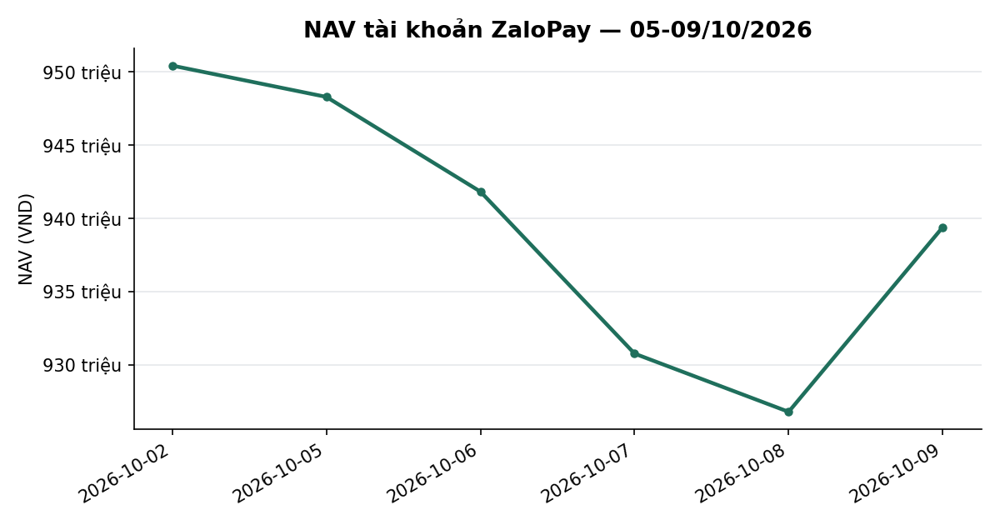
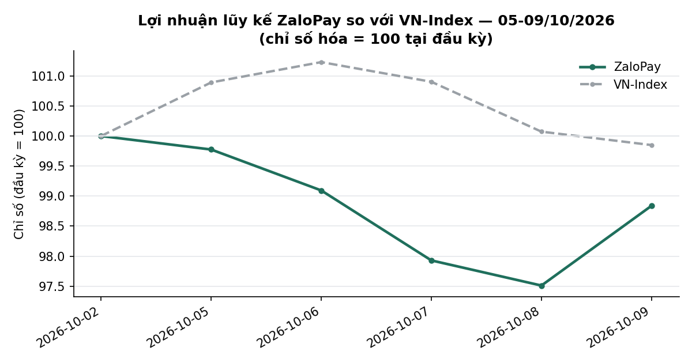
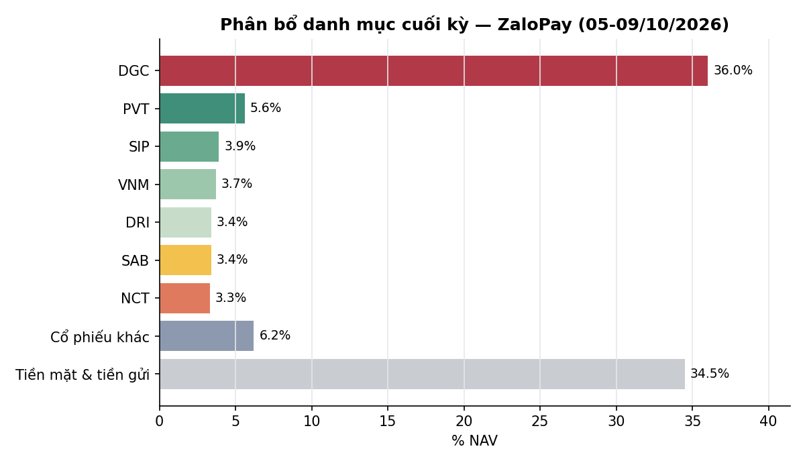

# BÁO CÁO TUẦN — TÀI KHOẢN ZALOPAY
## Kỳ báo cáo: 05/10/2026 – 09/10/2026

**Tài khoản:** ZaloPay · DNSE, số hiệu 0001743768 · V2.4 live từ 06/07/2026 (cash-only, không margin)
**Chiến lược:** V2.4 (2 book BAL/LAG + parking custom30V tại trạng thái NEUTRAL)
**Ngày lập báo cáo:** 10/10/2026 · **Người lập:** Taylor (Quant) — auto-dispatch từ `check_report_cadence.sh` (báo cáo tuần bị bỏ sót, phát hiện tự động, job Taylor_20261010_020005)
**Đối tượng:** Kênh theo dõi nội bộ (KHÔNG gửi nhà đầu tư ngoài) — giữ minh bạch đầy đủ
**Bản sửa đổi 1 (10/10/2026, Mike):** thêm dòng tổng **Cổ phiếu** + dòng **Nợ ký quỹ** vào bảng 3.5; Mục 4 đã điều tra xong cả 5 điểm (không còn điểm nào "chưa xác minh"); sửa tỉ suất DRI (+37,81% → +34,58%) và DGC (−29,25% thuần giá → −13,34% đã cộng cổ tức), phân rã phần NAV ngoài giá tới từng đồng; mọi tỉ suất ở bảng 3.5 đã qua cổng tỉ suất bản mới (lệch 0,00). NAV và mọi số vị thế KHÔNG đổi.

> 📊 Xem biểu đồ minh hoạ đính kèm trong email (NAV, lợi nhuận lũy kế so VN-Index, phân bổ danh mục);
> bản trên kênh chat chỉ hiển thị văn bản.

---

## 1. TÓM TẮT ĐIỀU HÀNH

| Chỉ tiêu | ZaloPay |
|---|---:|
| NAV cuối kỳ trước (02/10) | 950.434.410 |
| NAV cuối kỳ (09/10) | **939.394.841** |
| Thay đổi trong kỳ | **−11.039.569 (−1,16%)** |
| VN-Index cùng kỳ (02/10 → 09/10) | 1.737,71 → 1.735,09 (**−0,15%**) |
| Giá trị cổ phiếu cuối kỳ | 615.594.750 (65,5% NAV) |
| Tiền mặt tại công ty CK | 4.909.765 (0,5% NAV) |
| Tiền gửi "Trứng vàng" (đọc tự động qua API DNSE) | 318.890.326 (33,9% NAV) |
| Số mã nắm giữ cuối kỳ | 13 (gồm DGC 36,0% NAV, VPB legacy) |

**Nhận định tuần:** VN-Index −0,15%, ZaloPay **−1,16%**, **kém chỉ số 1,01 điểm phần trăm**. Nguyên nhân chính là **DGC** (10.000cp, 36,0% NAV, ngoài phạm vi bot) giảm 35.500 → 33.800 đ/cp = **−17,0 triệu VND**, lớn hơn toàn bộ phần đóng góp dương của các mã còn lại (PVT +3,52 triệu, DRI +1,33 triệu, SIP +0,60 triệu). Bot chỉ bán nốt phần nhỏ còn lại của các mã ngân hàng/VIX (5 lệnh, ~8,0 triệu VND); không có lệnh mua. DT5G giữ **NEUTRAL (3/5)**, gate đang tích luỹ **candidate CRISIS 3/25** (Mục 2). **5 điểm bản đầu ghi "chưa xác minh" đã được điều tra xong — kết luận ở Mục 4.**

*NAV theo ngày, ZaloPay. Đơn vị: VND / chỉ số (cơ sở 100). Kỳ dữ liệu: 02/10–09/10/2026 (6 phiên). Nguồn: dữ liệu tài khoản tại công ty chứng khoán lưu ký (NAV chốt cuối ngày), HOSE (VN-Index), tính toán nội bộ.*

---

## 2. TOÀN CẢNH THỊ TRƯỜNG

| Ngày | VN-Index | Thay đổi |
|---|---:|---:|
| 02/10 (cuối kỳ trước) | 1737,71 | — |
| 05/10 | 1753,20 | +0,89% |
| 06/10 | 1759,08 | +0,34% |
| 07/10 | 1753,39 | −0,32% |
| 08/10 | 1738,97 | −0,82% |
| 09/10 | 1735,09 | −0,22% |

*VN-Index đóng cửa hằng ngày; nguồn `tav2_bq.ticker` (ticker=VNINDEX), dữ liệu tới 09/10/2026.*

**Kỹ thuật (VN-Index, dữ liệu đóng cửa 09/10/2026):**
- *Xu hướng:* chỉ số đóng cửa 1.735,09 điểm, gần như đi ngang so với cuối tuần trước (−0,15%); biên dao động trong tuần 1.735–1.759. Chỉ số nằm dưới cả MA20 (1.779,0), MA50 (1.779,8) và MA200 (1.797,4) — cấu trúc vẫn là điều chỉnh sau nhịp giảm từ cuối tháng 9.
- *Hỗ trợ/kháng cự:* hỗ trợ gần là đáy tuần 1.735 (vừa được kiểm tra lại) rồi vùng đáy 3 tháng 1.668,5; kháng cự gần là cụm MA20/MA50 quanh 1.779–1.780, xa hơn là đỉnh 3 tháng 1.853,1.
- *Động lượng:* RSI(14) 37,2 (thấp, chưa vào vùng quá bán); MACD−signal −5,74, đã thu hẹp từ −8,68 (02/10) nhưng vẫn âm; dòng tiền CMF −0,10 (âm).
- *Thanh khoản:* khối lượng khớp trung bình tuần đạt khoảng 717 triệu cp, cao hơn khoảng 7,6% so với tuần trước; phiên 09/10 đạt 911 triệu cp trong ngày chỉ số giảm nhẹ.
- *Độ rộng:* tỷ lệ cổ phiếu đóng cửa trên MA50 là **32,4%** (836 mã trong rổ đủ điều kiện ngày 09/10), cải thiện so với 29,0% (824 mã) ngày 02/10 nhưng vẫn thấp.

**Cơ bản / định giá (dữ liệu tới 09/10/2026):**
- *Định giá:* chỉ báo định giá tổng hợp (P/E, P/B và chênh lệch với lãi suất tiền gửi, phân vị 10 năm) ở **22,4/100 — vùng RẺ**; P/E thị trường 11,11 lần (phân vị 6), P/B 1,87 lần (phân vị 23), chênh lệch lợi suất lợi nhuận so với lãi suất tiền gửi 6 tháng +1,60 điểm % (phân vị 38). Chỉ báo này mang tính tham khảo, chưa được kiểm định đủ mạnh để dùng làm tín hiệu giao dịch.
- *Trạng thái thị trường theo mô hình của chiến lược:* DT5G committed **NEUTRAL (state=3)** cả tuần (`vnindex_5state_dt5g_live` qua `get_gated_state()`); gate **candidate CRISIS 3/25** (12%, còn 22 phiên để commit, base giữ từ 07/10) · P(CRISIS xác nhận|k=3)≈33% [18–50%, n=33] ⚠ mẫu mỏng, tham khảo · nền xấu 9 phiên liền từ 29/09 (6 BEAR + 3 CRISIS, đổi qua lại 1 lần → bộ đếm reset), VNINDEX −2,6% từ đầu đợt, ngưỡng xem lại ≥15 phiên và VNINDEX ≤−5,0% — chưa chạm (`dna_report.build_dt_gate_line()`). Value Radar: DISPLAY-ONLY, 0/17 lăng kính qua đa kiểm định (`build_value_radar_line()`); breadth lấy từ `tav2_mike.universe_pit` JOIN `tav2_bq.ticker` (Close vs MA50)
- *Tăng trưởng lợi nhuận, dòng tiền khối ngoại, diễn biến lãi suất mới trong tuần:* báo cáo này không có số liệu đã đối soát cho các mục này trong kỳ nên không đưa ra nhận định; chỉ sử dụng mặt bằng lãi suất đã phản ánh trong chỉ báo định giá ở trên.

*Lợi nhuận lũy kế so với VN-Index (cơ sở 100 tại 02/10/2026). Đơn vị: VND / chỉ số (cơ sở 100). Kỳ dữ liệu: 02/10–09/10/2026 (6 phiên). Nguồn: dữ liệu tài khoản tại công ty chứng khoán lưu ký (NAV chốt cuối ngày), HOSE (VN-Index), tính toán nội bộ.*

---

## 3. HIỆU QUẢ, ATTRIBUTION & RỦI RO

### 3.1 NAV theo ngày

| Ngày | NAV (VND) | Δ ngày | Thay đổi VN-Index |
|---|---:|---:|---:|
| 02/10 (cuối kỳ trước) | 950.434.410 | — | — |
| 05/10 | 948.296.456 | −0,22% | +0,89% |
| 06/10 | 941.824.936 | −0,68% | +0,34% |
| 07/10 | 930.757.202 | −1,18% | −0,32% |
| 08/10 | 926.780.212 | −0,43% | −0,82% |
| 09/10 | 939.394.841 | +1,36% | −0,22% |

Cả 5 dòng NAV tuần này `nav_is_estimate=False`, nguồn `live`. Cả tuần **−1,16%** vs VN-Index **−0,15%**: kém chỉ số 1,01 điểm phần trăm.

### 3.2 Hiệu suất lũy kế (`nav_period_returns.py`, mốc từ `data/account_inception.json`)

| Giai đoạn | ZaloPay | VN-Index | Chênh lệch |
|---|---:|---:|---:|
| Tuần này (02/10 → 09/10) | −1,16% | −0,15% | −1,01pp |
| Từ đầu tháng 10 (MTD, 30/09 → 09/10) | −2,01% | −1,90% | −0,11pp |
| Từ khi bắt đầu hoạt động (06/07 → 09/10) | −4,91% | −6,82% | +1,91pp |

Mốc VN-Index "từ khi bắt đầu" = đóng cửa 03/07 (1.862,08), cùng mốc thời điểm với NAV gốc 987.865.567 (như kỳ trước). Rủi ro từ go-live (NAV chốt cuối ngày, kể cả mốc vốn gốc): sụt giảm tối đa −16,35% từ đỉnh, độ biến động ngày 1.35% (quy năm ~21.4%) — cao hơn SpaceX do DGC chiếm ~36% NAV.

### 3.3 Attribution tuần (đóng góp vào NAV, triệu VND)

| Nguồn | Đóng góp |
|---|---:|
| **DGC** | **−17,00** |
| TV1 | −1,54 |
| VPI | −1,32 |
| PVT | +3,52 |
| DRI | +1,33 |
| SIP | +0,60 |
| Các mã khác (cộng) | +0,96 |
| **Biến động giá (gồm phần đã bán trong kỳ)** | **−13,47** |
| Quyền cổ tức TV1 1.500đ × 1.400cp (ghi nhận phải thu, ex-date 07/10) | +2,10 |
| Lãi Trứng vàng trong tuần | +0,34 |
| Lãi tiền mặt tại tài khoản chứng khoán | +0,02 |
| Phí giao dịch + thuế bán + thuế TNCN cổ tức cổ phiếu (BID) | −0,03 |
| **Phần ngoài giá (cộng)** | **+2,43** |
| **Thay đổi NAV** | **−11,04** |

*Đóng góp giá = qty × (giá 09/10 − giá 02/10), phần bán theo giá khớp; giá `Price` BQ. Phần ngoài giá đã phân rã theo sổ `balances` của broker + email khớp lệnh, lệch 76 đồng do làm tròn phí — xem 4.3.*

### 3.4 Hoạt động giao dịch (toàn bộ là lệnh BÁN, không có lệnh mua)

Nguồn: `orders` trong `dnse_raw_*.jsonl` lọc `accountNo=0001743768`.

| Ngày | Giá trị bán | Chi tiết |
|---|---:|---|
| 05/10 | ~7,1 tr | CTG 50 @ 29.800, HDB 59 @ 28.400, LPB 52 @ 40.317, TCB 56 @ 32.200, VIX 5 @ 11.800 (thoát hết các mã này) |
| 06/10 | ~0,9 tr | BID 27 @ 34.150 (2 lệnh 20+7, thoát hết BID) |
| 07–09/10 | 0 | Không có lệnh |

Tổng giá trị bán 8.046.350 VND; khấu trừ thực tế theo email khớp lệnh DNSE = **29.352 VND**: phí 7.806 (0,097%) + thuế bán 8.046 (0,1%) + **13.500 thuế TNCN cổ tức cổ phiếu** (27cp BID × 500đ = 5% × mệnh giá, khấu trừ khi bán cổ phiếu nhận từ cổ tức cổ phiếu). `verify_account_snapshot.py --account ZaloPay`: **Verified=True**.

**Chuyển tiền sang Trứng vàng (hạch toán trước 04:55 ngày 08/10):** tiền mặt 157,66 → 4,91 triệu VND (−152.746.819), egg 165,99 → 318,82 triệu, không đổi NAV. Đây là **thao tác tay trên app** (bot không có đường code nào nạp/rút Trứng vàng) — xem 4.4.

**Quyền lợi cổ đông:** không có chia tách/cổ phiếu thưởng. Cổ tức tiền mặt: **TV1 1.500đ/cp** (ex-date 07/10, chốt 08/10, trả 29/10) — broker ghi phải thu 2.100.000đ tối 06/10; **DRI 1.000đ/cp** (ex-date 22/09, trả 20/10) — phải thu 1.900.000đ vẫn đang chờ. Tổng phải thu cuối kỳ 4.000.000đ (gộp; khi trả sẽ khấu trừ 5% = 200.000đ).

### 3.5 Danh mục cuối kỳ (09/10/2026)

Nguồn: vị thế OPEN từ `dnse_raw` (positions 23:30 09/10, cộng theo mã) × giá `Price` BQ 09/10; giá vốn thô và % lãi/lỗ theo `report_return_gate.py` (DRI: xem 4.2; DGC: giá vốn thô 47.775). % lãi/lỗ đã cộng cổ tức tiền mặt ròng (sau thuế 5%).

| Mã | KL | Giá vốn | Giá 09/10 | Giá trị thị trường | % NAV | Lãi/lỗ (%) |
|---|---:|---:|---:|---:|---:|---:|
| DGC | 10.000 | 47.775 | 33.800 | 338.000.000 | 35,98 | −13,34% |
| PVT | 2.071 | 17.248 | 25.200 | 52.189.200 | 5,56 | +46,10% |
| SIP | 749 | 47.140 | 49.400 | 37.000.600 | 3,94 | +4,79% |
| VNM | 601 | 58.700 | 57.700 | 34.677.700 | 3,69 | −1,70% |
| DRI | 1.900 | 13.263 | 16.900 | 32.110.000 | 3,42 | +34,58% |
| SAB | 744 | 47.450 | 42.900 | 31.917.600 | 3,40 | −3,58% |
| NCT | 373 | 94.400 | 83.700 | 31.220.100 | 3,32 | −3,28% |
| TV1 | 1.400 | 20.329 | 19.300 | 27.020.000 | 2,88 | +1,95% |
| VPI | 400 | 62.450 | 55.500 | 22.200.000 | 2,36 | −11,13% |
| VPB | 312 | 21.226 | 23.800 | 7.425.600 | 0,79 | +12,13% |
| MBB | 52 | 20.511 | 19.050 | 990.600 | 0,11 | −7,12% |
| MSB | 40 | 13.542 | 14.600 | 584.000 | 0,06 | +7,82% |
| VIB | 19 | 13.607 | 13.650 | 259.350 | 0,03 | +0,31% |
| **Cổ phiếu — tổng (13 mã)** | | | | **615.594.750** | **65,53** | **−5,58%** |
| *— trong đó DGC (ngoài phạm vi bot)* | | | | *338.000.000* | *35,98* | *−13,34%* |
| *— trong đó 12 mã còn lại* | | | | *277.594.750* | *29,55* | *+8,49%* |
| **Tiền mặt** | | | | **4.909.765** | **0,52** | |
| **Tiền gửi Trứng vàng** | | | | **318.890.326** | **33,95** | |
| **Nợ ký quỹ** | | | | **0** | **0,00** | |
| **Tổng NAV** | | | | **939.394.841** | **100,00** | |

Lãi/lỗ chưa thực hiện (đã cộng cổ tức ròng): 12 mã ngoài DGC **+22,40 triệu VND (+8,49% trên giá vốn thô 263,95 triệu)**; cả 13 mã −41,35 triệu (−5,58% trên giá vốn thô 741,70 triệu). DGC riêng: lỗ do giá −(47.775−33.800)×10.000 = −139,75 triệu, cộng lại cổ tức 8.000đ/cp đã nhận 25/09 (76,0 triệu sau thuế 5%) = **−63,75 triệu (−13,34%)** theo `dividend_adjusted_return.py`. Bản đầu ghi −29,25% là tỉ suất THUẦN GIÁ, chưa cộng cổ tức.

**Đẳng thức NAV:** Σ(qty × giá) + tiền mặt + Trứng vàng − nợ = 615.594.750 + 4.909.765 + 318.890.326 − 0 = **939.394.841 = NAV `nav_history_ZaloPay.csv` ngày 09/10 (residual 0 đồng)**.

*Phân bổ danh mục cuối kỳ 09/10/2026, % NAV. Nguồn: dữ liệu tài khoản tại công ty chứng khoán lưu ký, giá đóng cửa HOSE 09/10/2026, tính toán nội bộ.*

**Rủi ro tập trung DGC — nhắc lại:** DGC 36,0% NAV, ngoài phạm vi tái cân bằng tự động, giá 33.800 (−29,25% thuần giá so với giá vốn thô 47.775 = broker 39.775 + 8.000 cổ tức; **−13,34% sau khi cộng cổ tức ròng đã nhận**). Cần user xác nhận giữ/giảm.

---

## 4. CÔNG BỐ SỰ CỐ, SỰ KIỆN VẬN HÀNH — KẾT QUẢ ĐIỀU TRA

Bản đầu ghi 5 điểm "chưa xác minh". Cả 5 đã được điều tra ngày 10/10/2026 trên sổ `balances`/`positions` của broker, email khớp lệnh DNSE, lịch sử lệnh DNSE và bảng sự kiện doanh nghiệp. **Không còn điểm nào chưa giải thích.**

### 4.1 SCL 1.500cp còn trong `verify_account_snapshot.py` SpaceX — ĐÃ RÕ NGUYÊN NHÂN, đã xử lý
- **Nguyên nhân:** lệnh bán SCL ngày 30/09 là lệnh **bán tay qua app** lúc 14:43. Hôm đó bot SpaceX không có lệnh nào nên không poll sổ lệnh ⇒ `dnse_raw_2026-09-30.jsonl` có **0 bản ghi `orders` của SpaceX**, lệnh bán không bao giờ thành "fill" ⇒ sổ dựng-từ-fill giữ 1.500cp mãi. Journal thì đã ghi tay (`MANUAL_SELL_OUTSIDE_PLAN`), nên hai nguồn lệch nhau 1.500 vs 0.
- **Bằng chứng bán thật (3 nguồn độc lập, khớp tuyệt đối):** lịch sử lệnh DNSE (id `20260930_385961`, NS 1.500cp @ 28.300, Filled) · `positions` broker 30/09 (`closedQuantity=1500`, `averageClosePrice=28300`) · email khớp lệnh 30/09 (1.400 + 100 cp @ 28.300).
- **Xử lý:** nạp bù bản ghi lệnh broker-native lấy từ lịch sử lệnh DNSE vào sổ fill 30/09 (gắn nhãn `backfill`, có bản sao lưu). Sau khi nạp: SCL net = 0 ở cả `dnse_raw` lẫn journal, cả 2 tài khoản.
- **Dòng NAV SpaceX 01/10 `nav_is_estimate=True`:** không phải số tạm. Tối 01/10 broker ghi có sớm 30cp TPB thưởng (200 → 230, tỉ lệ 15%, ex-date 02/10) ⇒ cổng corp-action chặn snapshot live (rc=5, đúng thiết kế); sau khi sự kiện được xác nhận, NAV được dựng lại từ `positions`/`balances` 23:50 + giá `Price` 01/10, quy khối lượng về trước sự kiện và loại 100.000đ cổ tức TPB còn quyền. Đó là số cuối.

### 4.2 Giá vốn broker thấp hơn giá khớp thật (SAB/NCT/TV1/DRI) — ĐÃ RÕ NGUỒN
DNSE **tự trừ cổ tức tiền mặt GỘP khỏi `costPrice` vào tối trước ex-date**. Sổ `positions` cho thấy đúng từng bước:

| Mã | Bước giảm `costPrice` | Thời điểm | Cổ tức công bố (ex-date) |
|---|---:|---|---|
| NCT | 94.400 → 86.400 (−8.000) | 24/07 | 8.000đ |
| SAB | 47.450 → 44.450 (−3.000) | 28/07 | 3.000đ |
| DRI | 13.263 → 12.263 (−1.000) | 21/09 | 1.000đ (22/09, trả 20/10) |
| TV1 | 20.329 → 18.829 (−1.500) | 06/10 20:15 | 1.500đ (07/10, trả 29/10) |

**DRI 1.000đ/cp nay đã xác minh bằng 3 nguồn:** bảng sự kiện doanh nghiệp (cổ tức tiền mặt 2025, 1.000đ, ex-date 22/09/2026) · bước giảm giá vốn broker đúng 1.000đ · khoản phải thu broker 1.900.000đ = 1.900cp × 1.000đ. Bảng 3.5 vì vậy dùng giá vốn thô 13.263 và cộng cổ tức ròng 950đ: **+34,58%** (bản đầu ghi +37,81% là lấy giá vốn đã-trừ-cổ-tức so với giá thị trường, cao hơn thật 3,2 điểm %).

**Nguyên nhân công cụ gắn nhầm `UNVERIFIED` — đã vá (merge `3863fecb`, 10/10):** trên UPCOM, tỉ số `Close/Price` của DRI nhiễu (hai cột là hai loại giá lệch nhau một bước giá), sinh ra 8 "ex-date" giả (90–102đ) quanh sự kiện thật ⇒ hệ phương trình vô định. Công cụ nay đối chiếu bảng sự kiện doanh nghiệp và sổ broker trước khi coi một bước nhảy tỉ số là ex-date; số DRI ở bảng 3.5 là số do cổng tỉ suất cấp (+34,58%), không còn là đối soát tay.

### 4.3 Phần NAV ngoài giá +2,43 triệu — ĐÃ PHÂN RÃ TỚI TỪNG ĐỒNG
Khoản +2.100.000đ tối 06/10 **không phải DRI** mà là quyền cổ tức **TV1: 1.400cp × 1.500đ = 2.100.000đ** — broker ghi vào `cashDividendReceiving` (1.900.000 → 4.000.000) và cộng luôn vào `totalCash` cùng bản ghi 20:15 ngày 06/10, cùng lúc hạ giá vốn TV1 1.500đ. (SpaceX: 2.300cp × 1.500đ = 3.450.000đ, cùng bản ghi.)

| Cấu phần | VND |
|---|---:|
| Quyền cổ tức TV1 (phải thu, gộp) | +2.100.000 |
| Lãi Trứng vàng (318.890.326 − 165.800.486 − 152.746.819 chuyển vào) | +343.021 |
| Lãi tiền mặt tại tài khoản chứng khoán | +15.938 |
| Phí + thuế bán + thuế TNCN cổ tức cổ phiếu (email khớp lệnh) | −29.352 |
| **Cộng** | **+2.429.607** |
| Phần ngoài giá cần giải thích (ΔNAV −11.039.569 − biến động giá −13.469.100) | +2.429.531 |
| Chênh (làm tròn phí từng lệnh) | 76 |

Lưu ý: khoản phải thu cổ tức đang nằm trong NAV ở mức GỘP (4.000.000đ gồm DRI + TV1); khi trả sẽ bị khấu trừ 5% = 200.000đ (0,02% NAV).

### 4.4 Chuyển tiền sang Trứng vàng và tỷ trọng cổ phiếu — ĐÃ RÕ
- **Ai chuyển:** thao tác tay trên app. `dnse_api.py` và `trading_bot/` không có lời gọi nào nạp/rút Trứng vàng (bot chỉ ĐỌC `egg.totalValue`). Số chuyển bằng đúng `withdrawableCash` của từng tài khoản: ZaloPay 152.746.819đ, SpaceX 152.569.733đ. Phù hợp quyết định 01/10: park 0%, tiền nhàn rỗi nằm ở Trứng vàng.
- **Tiền mặt còn lại 4,91 triệu** = 4.000.000 cổ tức phải thu (chưa rút được) + ~0,91 triệu tiền bán BID về tài khoản sau lúc chuyển.
- **Vì sao cổ phiếu chỉ 65,5% NAV (SpaceX 48,4%):** 70% ở NEUTRAL là TRẦN phân bổ, chỉ được lấp khi có tín hiệu. Hiện tại: BAL **0 tín hiệu** (`n_bal=0`), LAG **0 tín hiệu** đủ điều kiện (17 mã bị cổng rating loại), parking custom30V **tắt (0%)** từ 01/10 nên phần trống không còn được lấp bằng rổ parking (đã bán 01–02/10). Cổ phiếu đang giữ = rổ CAPIT 5 mã (phiên 56) + DRI/TV1 (discretionary) + VPI + lẻ ngân hàng + DGC (ngoài bot). Không có lệch so với luật.

### 4.5 Điểm nhỏ
- `verify_account_snapshot.py` không tính P&L cho DGC/VPB (legacy, không có lịch sử fill) — P&L hai mã này lấy giá vốn broker (DGC cộng lại 8.000đ cổ tức vào giá vốn và cộng cổ tức ròng vào tỉ suất). Đã biết, không phải lỗi.
- `reconcile_equity.py` không áp dụng đầy đủ cho ZaloPay vì cùng lý do DGC/VPB legacy; thay vào đó đẳng thức NAV (3.5) và phân rã ngoài giá (4.3) đều khớp.
- Nợ ký quỹ cả tuần = 0.

---

## 5. KẾ HOẠCH TUẦN TỚI (12/10 – 16/10/2026)

**Outlook — Kỹ thuật.** Cơ sở (cao nhất): VN-Index đi ngang–hồi nhẹ 1.735–1.780 (kiểm tra MA20/MA50). Tích cực (trung bình): đóng cửa >1.780 và breadth >40% → hướng 1.850. Tiêu cực (trung bình): thủng 1.735 kèm khối lượng → đáy 3 tháng 1.668. Làm sai cơ sở: 2 phiên đóng dưới 1.735 hoặc breadth <29%.

**Outlook — Cơ bản.** Định giá thấp (P/E 11,1, Value Radar 22,4 RẺ) là nền trung hạn, không phải tín hiệu thời điểm. DT5G candidate CRISIS 3/25: P(xác nhận)≈33% [18–50%] mẫu mỏng; xác nhận → phân bổ mục tiêu CRISIS 0%. Làm sai: thị trường bứt >1.850 với breadth cải thiện.

- **CAPIT (PVT/SIP/VNM/SAB/NCT):** theo dõi mốc T+60 (báo cáo ngày).
- **DRI / TV1 (discretionary):** chờ ý kiến PM về exit — cần user.
- **DGC (36,0% NAV):** quyết định của user, ngoài phạm vi bot.
- **Việc kỹ thuật:** đã xong trong ngày 10/10 — công cụ tỉ suất từng mã theo chuẩn tỉ suất tổng và báo cáo ngày lấy số từ cùng công cụ (4.2). Còn cân nhắc: tự nạp lịch sử lệnh DNSE hằng ngày để lệnh bán tay ngoài giờ bot không còn lọt sổ fill (4.1).
- **Dòng tiền sắp về:** cổ tức DRI 20/10 (1.805.000đ ròng), TV1 29/10 (1.995.000đ ròng).

---

## 6. PHỤ LỤC — PHƯƠNG PHÁP LUẬN & LƯU Ý

- **Pipeline xác minh** (`mike/kb/coding_guidelines.md` §6): `verify_account_snapshot.py` (cả 2 account) → `nav_history_ZaloPay.csv` (5/5 dòng live) → `nav_period_returns.py` → đẳng thức NAV recompute từ `dnse_raw` positions + BQ `Price` (residual 0).
- **Trứng vàng:** đọc tự động qua API DNSE (`egg.totalValue`, cột `egg_assets_auto=True`).
- **VN-Index:** đóng cửa BQ `tav2_bq.ticker` (không dùng `data/VNINDEX.csv` cục bộ). **Breadth:** `tav2_mike.universe_pit` JOIN `tav2_bq.ticker`, không dùng `ticker_prune`.
- **Phí/thuế:** 0,097%/lượt (HOSE) + thuế bán 0,1%.
- **Track record ngắn** (~66 phiên từ go-live 06/07/2026) — so sánh VN-Index chỉ mang tính mô tả.
- **Đây không phải khuyến nghị đầu tư.** Kết quả quá khứ (kể cả backtest) không đảm bảo tương lai; CAGR thật ≈ CAGR backtest − 1,5%.

---
*Báo cáo tổng hợp từ hệ thống giám sát vận hành nội bộ, đối soát với dữ liệu sàn (DNSE API) và cơ sở dữ liệu thị trường (BigQuery). Kênh nội bộ — KHÔNG gửi nhà đầu tư ngoài.*
