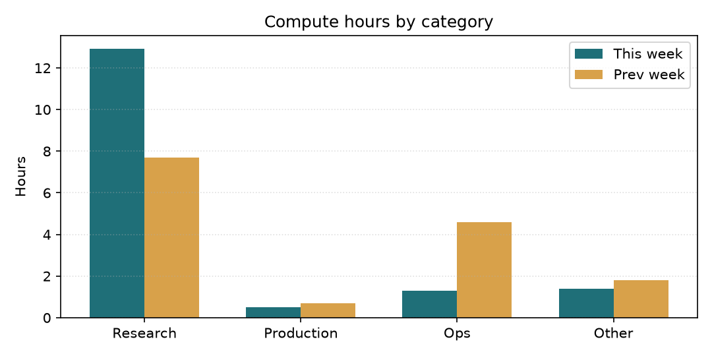
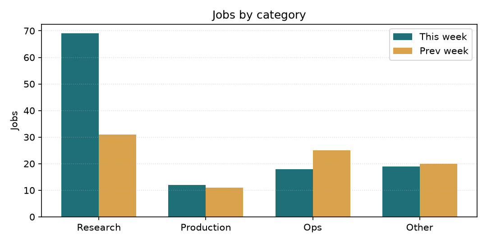
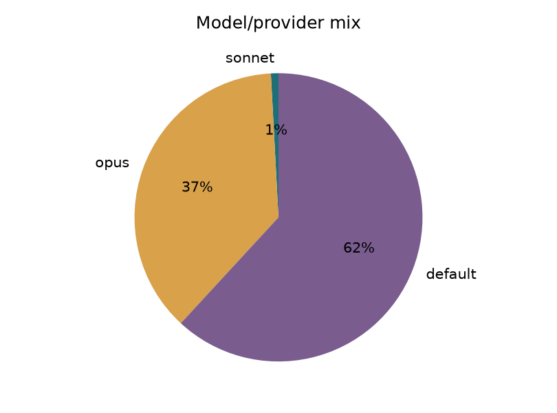
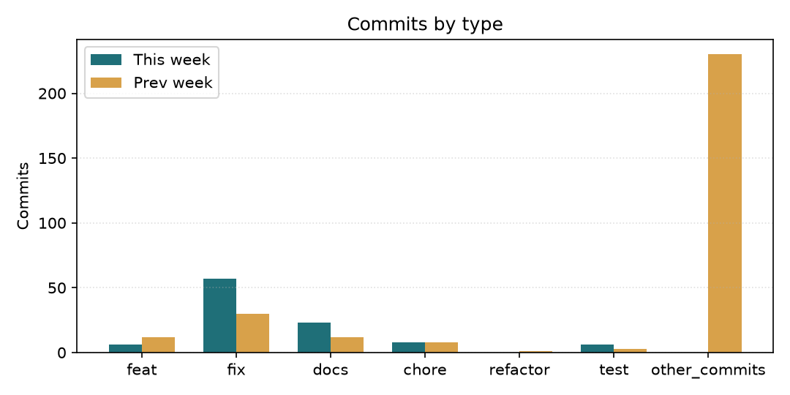

# Tổng kết sử dụng tuần qua (2026-09-27)

Báo cáo cho CEO — quản lý chi phí token/compute của đội. Số liệu được lấy từ `bus/jobs/*.json` và `git log` trong 7 ngày gần nhất; biểu đồ và so sánh tuần trước được tạo tự động.

## Tóm tắt

| Chỉ số | Giá trị |
|---|---|
| Số job headless dispatch | 118 |
| Compute ước tính | 16.1h |
| Log KB | 215 |
| Offload provider khác Claude | 0 job (0%) |
| Retry / compute thêm | 21 attempt |
| Commits | 349 |

## So sánh với tuần trước

| Chỉ số | Tuần này | Tuần trước (2026-09-20) | Thay đổi | % |
|---|---|---|---|---|
| Số job | 118 | 87 | +31 | +36% |
| Compute h | 16.1 | 14.8 | +1.3 | +9% |
| Log KB | 215 | 193 | +22 | +11% |
| Commits | 349 | 296 | +53 | +18% |
| Claude sonnet | 1 | 2 | -1 | -50% |
| Claude opus | 44 | 41 | +3 | +7% |
| Claude fable | 0 | 0 | +0 | N/A |
| Claude default | 73 | 44 | +29 | +66% |

## Phân bổ compute / job theo nhóm

## Chi tiết theo nhóm

| Nhóm | Jobs | Compute h | Log KB | Model mix |
|---|---|---|---|---|
| Research | 69 | 12.9 | 154 | default=54%, opus=45%, sonnet=1% |
| Production | 12 | 0.5 | 7 | default=92%, opus=8% |
| Ops | 18 | 1.3 | 26 | default=44%, opus=56% |
| Other | 19 | 1.4 | 28 | default=89%, opus=11% |

## Model / provider mix

## Commits by type

## Token / retry watch

- Cache hit: **97%** của prompt tokens (1,480,298,092 read / 1,519,141,404 total).
- Retry / duplicate compute: **21 job** chạy attempt >1, **21 attempt** thêm; 0 job có prompt resume/re-dispatch.

## Cảnh báo effort / model / retry

- ⚠ Có 21 job chạy attempt >1, 21 lần compute thêm (18% của tổng job)

## Nhận xét của quản lý

Với góc nhìn quản lý chi phí, tôi đánh giá tuần này như sau:

- **Mức sử dụng**: tổng compute ước tính là **16.1h** trên 118 job, offload provider khác Claude chiếm 0% job.
- **So với tuần trước**: job tăng 31 và compute tăng 1.3h. Cần theo dõi nếu compute tăng nhanh hơn số job.
- **Tiến bộ**: pipeline đo lường đã tách provider offload khỏi quota Claude, báo cáo tuần đã tự động so sánh WoW và có biểu đồ. Việc này giúp CEO nhìn xu hướng thay vì chỉ đọc bảng số.
- **Bất thường cần hành động**: Có 21 job chạy attempt >1, 21 lần compute thêm (18% của tổng job).
- **Đề xuất**: giữ mặc định `effort=medium` cho việc audit/fix thường; chỉ dùng `effort=high` hoặc model cao hơn cho việc thực sự phức tạp. Tuần sau script sẽ tự so tiếp với tuần này để phát hiện drift sớm.

---
Báo cáo tự động bởi `bin/spend_report_weekly.py`. Nếu email miss, kiểm tra `state/spend_report_emailed.json` và `logs/spend_report_weekly.log`.
